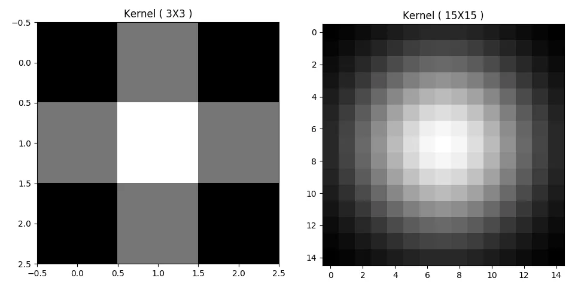

Using Gaussian filter/kernel to smooth/blur an image is a very important tool in Computer Vision. You will find many algorithms using it before actually processing the image. Today we will be Applying Gaussian Smoothing to an image using Python from scratch and not using library like OpenCV.

## High Level Steps:

There are two steps to this process:

- Create a Gaussian Kernel/Filter
- Perform Convolution and Average

## Gaussian Kernel/Filter:

Create a function named `gaussian_kernel()`, which takes mainly two parameters. The size of the kernel and the standard deviation.

```python
def gaussian_kernel(size, sigma=1, verbose=False):
 
    kernel_1D = np.linspace(-(size // 2), size // 2, size)
    for i in range(size):
        kernel_1D[i] = dnorm(kernel_1D[i], 0, sigma)
    kernel_2D = np.outer(kernel_1D.T, kernel_1D.T)
 
    kernel_2D *= 1.0 / kernel_2D.max()
 
    if verbose:
        plt.imshow(kernel_2D, interpolation='none',cmap='gray')
        plt.title("Image")
        plt.show()
 
    return kernel_2D
```

Create a vector of equally spaced number using the size argument passed. When the `size = 5`, the `kernel_1D` will be like the following:

```python
array([-2., -1.,  0.,  1.,  2.])
```

Now we will call the `dnorm()` function which returns the density using the `mean = 0` and standard deviation. We will see the function definition later. The `kernel_1D` vector will look like:

```python
array([0.05399097, 0.24197072, 0.39894228, 0.24197072, 0.05399097])
```

Then we will create the outer product and normalize to make sure the center value is always 1.

## Kernel Output:

In order to set the sigma automatically, we will use following equation: (This will work for our purpose, where filter size is between 3-21):

```python
sigma=math.sqrt(kernel_size)
```

Here is the output of different kernel sizes.



As you are seeing the `sigma` value was automatically set, which worked nicely. This simple trick will save you time to find the sigma for different settings.