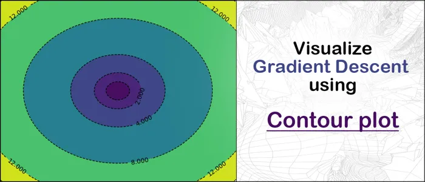
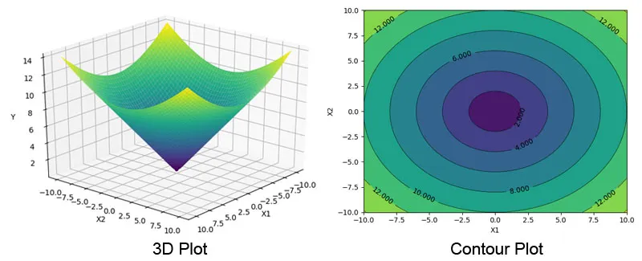
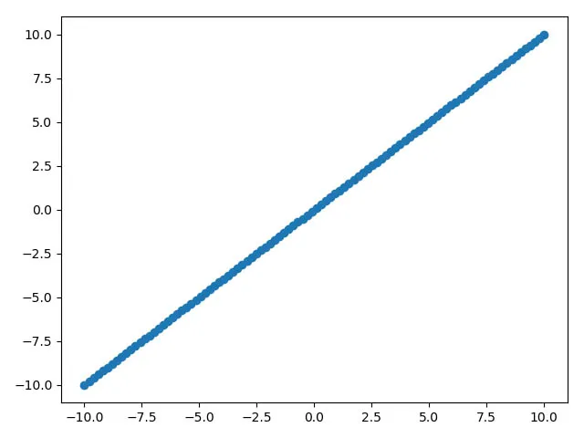
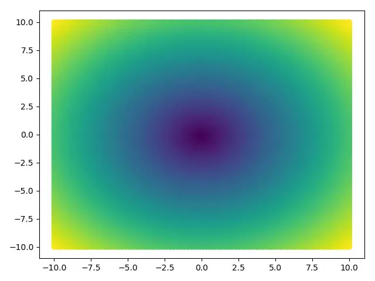
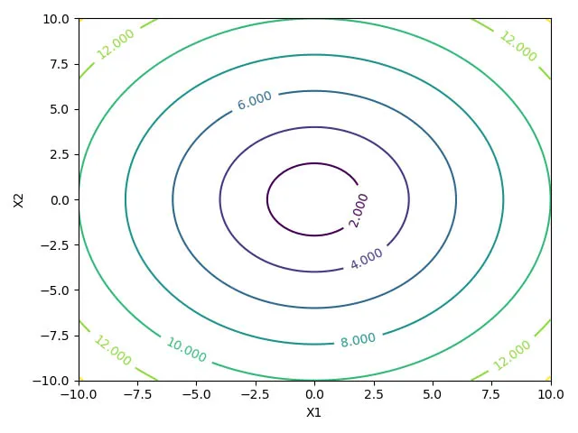
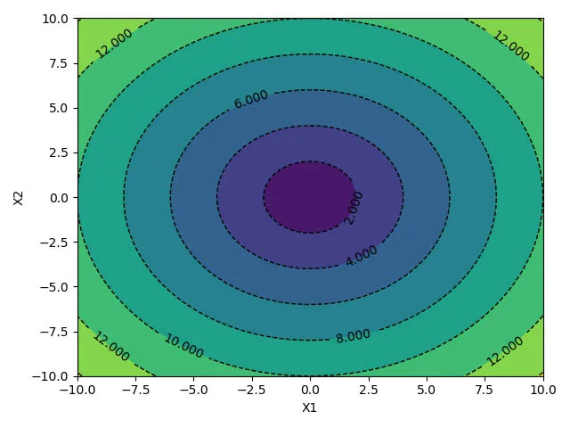
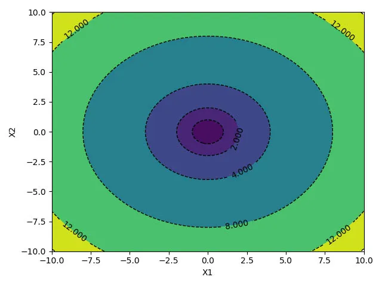
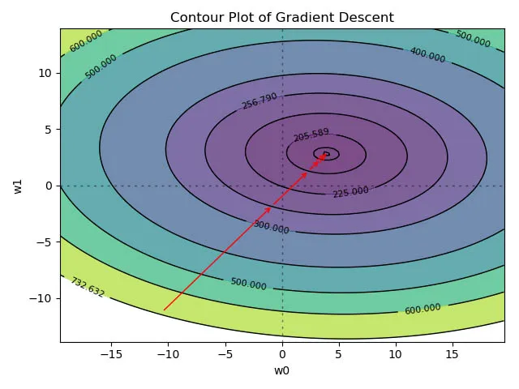

Linear Regression often is the introductory chapter of Machine Leaning and Gradient Descent probably is the first optimization technique anyone learns. Most of the time, the instructor uses a Contour Plot in order to explain the path of the Gradient Descent optimization algorithm. I used to wonder how to create those Contour plot. Today I will try to show how to visualize Gradient Descent using Contour plot in Python.

## Contour Plot

Contour Plot is like a 3D surface plot, where the 3rd dimension (Z) gets plotted as constant slices (contour) on a 2 Dimensional surface. The left plot at the picture below shows a 3D plot and the right one is the Contour plot of the same 3D plot. You can see how the 3rd dimension (Y here) has been converted to contours of colors ( and lines ). The important part is, the value of Y is always same across the contour line for all the values of X1 & X2.



## Contour Plot using Python

Before jumping into gradient descent, lets understand how to actually plot Contour plot using Python. Here we will be using Python’s most popular data visualization library **matplotlib**.

### Data Preparation

I will create two vectors ( numpy array ) using `np.linspace` function. I will spread 100 points between -100 and +100 evenly.

```python
import numpy as np
import matplotlib.pyplot as plt
 
 
x1 = np.linspace(-10.0, 10.0, 100)
x2 = np.linspace(-10.0, 10.0, 100)
```

If we simply make a scatter plot using x1 and x2, it will look like following:

```python
plt.scatter(x1, x2)
plt.show()
```



Now, in order to create a contour plot, we will use `np.meshgrid` to convert x1 and x2 from ( 1 X 100 ) vector to ( 100 X 100 ) matrix.

### np.meshgrid()

Lets looks at what `np.meshgrid()` actually does. It takes 2 parameters, in this case will pass 2 vectors. So lets create a 1X3 vector and invoke the np.meshgrid() function. By the way, it returns 2 matrix back and not just one.

```python
a=np.array((1,2,3))
a1,a2=np.meshgrid(a,a)
```

If you look at a1 and a2, you will see now they both are 3X3 matrix and a1 has repeated rows and a2 has repeated cols. The `np.meshgrid()` function, create a grid of values where each intersection is a combination of 2 values.

In order to understand this visually, if you look at the 3D plot in the first picture, we have now created the bottom plane of that 3D plot, a mesh/grid.

```
a1
Out[11]: 
array([[1, 2, 3],
       [1, 2, 3],
       [1, 2, 3]])
a2
Out[12]: 
array([[1, 1, 1],
       [2, 2, 2],
       [3, 3, 3]])
```

Once the mesh/grid values have been created, we can now create the data for the 3rd (virtual) dimension. Here I am just using an eclipse function. Y will also be a 100 X 100 matrix.
$$
\begin{equation}
y=x_1^2+x_2^2
\end{equation}
$$

```python
X1, X2 = np.meshgrid(x1, x2)
Y = np.sqrt(np.square(X1) + np.square(X2))
```

Before even creating a proper contour plot, if we just plot the values of X1 & X2 and choose the color scale according to the values of Y, we can easily visualize the graph as following:

```python
cm = plt.cm.get_cmap('viridis')
plt.scatter(X1, X2, c=Y, cmap=cm)
plt.show()
```



### plt.contour() and plt.contourf()

We will use matplotlib’s `contour()` and `contourf()` function to create the contour plot. We just need to call the function by passing 3 matrix.

```python
cp = plt.contour(X1, X2, Y)
plt.clabel(cp, inline=1, fontsize=10)
plt.xlabel('X1')
plt.ylabel('X2')
plt.show()
```



You can see the scatter plot and contour plots looks kind of same. However, we get much more control which creating the Contour plot over the scatter plot.

### Fill Contour Plot

The `contourf()` function can be used to fill the contour plot. We can also change the line style and width. Please refer the matplotlib’s developer documentation for other available options.

```python
cp = plt.contour(X1, X2, Y, colors='black', linestyles='dashed', linewidths=1)
plt.clabel(cp, inline=1, fontsize=10)
cp = plt.contourf(X1, X2, Y, )
plt.xlabel('X1')
plt.ylabel('X2')
plt.show()
```



### Choose custom levels: 

We will look at one more important feature of the plotting library. We can define the levels where we want to draw the contour lines using the level or 4th parameter of the both `contour() `and `contourf()` function. The below code sets constant levels at different Y values.

```python
levels = [0.0, 1.0, 2.0, 4.0, 8.0, 12.0, 14.0]
cp = plt.contour(X1, X2, Y, levels, colors='black', linestyles='dashed', linewidths=1)
plt.clabel(cp, inline=1, fontsize=10)
cp = plt.contourf(X1, X2, Y, levels)
plt.xlabel('X1')
plt.ylabel('X2')
plt.show()
```



## Gradient Descent Algorithm

- We will be using the `Advertising` data for our demo here.
- We will load the data first using `pandas` library
- The `sales` will be the response/target variable
- `TV` and `radio` will be the predictors.
- Using `StandardScaler` to normalize the data ( $\mu=0$ and $\sigma =1$)

```python
import pandas as pd
 
data = pd.read_csv('http://www-bcf.usc.edu/~gareth/ISL/Advertising.csv')
y = data['sales']
X = np.column_stack((data['TV'], data['radio']))
 
from sklearn.preprocessing import StandardScaler
 
scaler = StandardScaler()
X_scaled = scaler.fit_transform(X)
```

### Calculate Gradient and MSE

Using the following function to calculate the mse and derivate w.r.t $w$

```python
def gradient_descent(W, x, y):
    y_hat = x.dot(W).flatten()
    error = (y - y_hat)
    mse = (1.0 / len(x)) * np.sum(np.square(error))
    gradient = -(1.0 / len(x)) * error.dot(x)
    return gradient, mse
```

Next, choosing a starting point for `w`, setting the `learning rate` hyper-parameter to `0.1` and convergence tolerance to `1e-3`

Also, creating two more arrays, one for storing all the intermediate `w` and `mse`.

```python
w = np.array((-40, -40))
alpha = .1
tolerance = 1e-3
 
old_w = []
errors = []
```

### Gradient Descent Loop

Below is the loop for Gradient Descent where we update w based on the learning rate. We are also capturing the w and mse values at every 10 iterations.

```python
# Perform Gradient Descent
iterations = 1
for i in range(200):
    gradient, error = gradient_descent(w, X_scaled, y)
    new_w = w - alpha * gradient
 
    # Print error every 10 iterations
    if iterations % 10 == 0:
        print("Iteration: %d - Error: %.4f" % (iterations, error))
        old_w.append(new_w)
        errors.append(error)
 
    # Stopping Condition
    if np.sum(abs(new_w - w)) < tolerance:
        print('Gradient Descent has converged')
        break
 
    iterations += 1
    w = new_w
 
print('w =', w)
```

That’s all, you can see that w is converging at the following values.

```python
w
Out[19]: array([3.91359776, 2.77964408])
```

Before we start writing the code for the Contour plot, we need to take care of few things. Convert the list (`old_w`) to a numpy array.

Then I am adding 5 additional levels manually just to make the Contour plot look better. You can skip them.

Finally, converting the errors list to numpy array, sorting it and saving it as the levels variable. We need to sort the level values from small to larger since that the way the contour() function expects.

```python
all_ws = np.array(old_w)
 
# Just for visualization
errors.append(600)
errors.append(500)
errors.append(400)
errors.append(300)
errors.append(225)
 
levels = np.sort(np.array(errors))
```

### Draw the Contour plot

Its always helpful to see first before going through the code. Here is the plot of our gradient descent algorithm we will be creating next.



### Prepare Axis (w0, w1)

As we have done earlier, we need to create the `w0` and `w1` (X1 and X2) vector ( $1 \times 100$). Last time we used the `np.linspace()` function and randomly choose some values. Here we will use the converged values of `w` to create a space around it.

Our `w0` array will be equally spaced 100 values between `-w[0] * 5` and `+w[0] * 5`. Same for the `w1`.

The `mse_vals` variable is just a placeholder.

```python
w0 = np.linspace(-w[0] * 5, w[0] * 5, 100)
w1 = np.linspace(-w[1] * 5, w[1] * 5, 100)
mse_vals = np.zeros(shape=(w0.size, w1.size))
```

Last time use have used the eclipse formula to create the 3rd dimension, however here need to manually calculate the mse for each combination of `w0` and `w1`.

**Note:** There is shortcut available for the below code, however wanted to keep it like this way since its easy to see whats going on.

### Prepare the 3rd Dimension

We will loop through each values of `w0` and `w1`, then calculate the msg for each combination. This way will be populating our $100 \times 100$ `mse_vals` matrix.

This time we are not using the meshgrid, however the concept is the same.

```python
for i, value1 in enumerate(w0):
    for j, value2 in enumerate(w1):
        w_temp = np.array((value1,value2))        
        mse_vals[i, j] = gradient_descent(w_temp, X_scaled, y)[1]
```

### Final Plot

We have w0, w1 and mse_vals (the 3rd dimension), now its pretty easy to create the contour plot like we saw earlier.

- Use the `contourf()` function first. Pass the levels we created earlier.
- Plot two axis line at `w0=0` and `w1=1`
- Call the `plt.annotate()` function in loops to create the arrow which shows the convergence path of the gradient descent. We will use the stored `w` values for this. The mse for those $w$ values have already been calculated.
- Invoke the contour() function for the contour line plot.

```python
plt.contourf(w0, w1, mse_vals, levels,alpha=.7)
plt.axhline(0, color='black', alpha=.5, dashes=[2, 4],linewidth=1)
plt.axvline(0, color='black', alpha=0.5, dashes=[2, 4],linewidth=1)
for i in range(len(old_w) - 1):
    plt.annotate('', xy=all_ws[i + 1, :], xytext=all_ws[i, :],
                 arrowprops={'arrowstyle': '->', 'color': 'r', 'lw': 1},
                 va='center', ha='center')
 
CS = plt.contour(w0, w1, mse_vals, levels, linewidths=1,colors='black')
plt.clabel(CS, inline=1, fontsize=8)
plt.title("Contour Plot of Gradient Descent")
plt.xlabel("w0")
plt.ylabel("w1")
plt.show()
```

## Conclusion

Notice the mse values are getting reduced from `732 -> 256 -> 205 -> ...` etc. Gradient Descent has converged easily here.

Contour plot is very useful to visualize complex structure in an easy way. Later we will use this same methodology for Ridge and Lasso regression.

I hope this How to visualize Gradient Descent using Contour plot in Python tutorial will help you build much more complex visualization.

