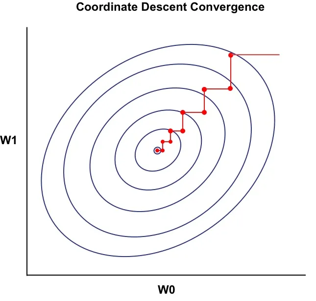
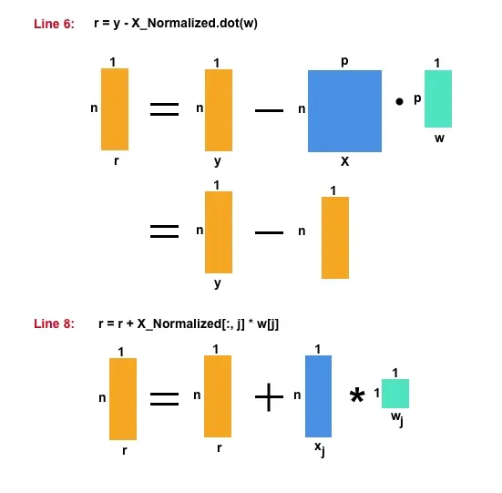

Coordinate Descent is another type of optimization algorithm used mainly for `strongly convex` and Lasso Regression function. You are probably aware of Gradient Descent, for solving Least Square Regression. In this Introduction to Coordinate Descent using Least Squares Regression tutorial we will learn more about Coordinate Descent and then use this to solve Least Square Regression. 

# Coordinate Descent

Coordinate Descent is another type of optimization process which has gained lot of momentum lately. There are also different variations of the same algorithm available. The objective of Coordinate Descent is to minimize a function $$\frac{min}{w} f(w)$$ where,

$$
f(w) = f(w_0 , w_1 , ... , w_p)
$$

for all the values of $$w_j$$, which is same as the objective of the Gradient Descent.

In Coordinate Descent we minimize one coordinate of the `w` vector at a time while keeping all others fixed. For example, in case we are using 2 predictors $$ X = (x_0,x_1)$$ , then we will minimize $$w_0$$ by keeping $$w_1$$ fixed and then vice-versa.

If we visualize the contour plot of the Coordinate Descent, we can see the stair-case path since we are only updating one coordinate if w at a time.



## Basic Algorithm
- Initialize `w` with zeros (or randomly)
	- LOOP :Until Convergence
		- LOOP : Select one dimension/coordinate (see below) `j`
			- Minimize $$w_j $$


## How to choose next coordinate/dimension:
- Cyclic - Cyclic Coordinate Descent
- Random - Stochastic Coordinate Descent

# Coordinate Descent vs Gradient Descent

| Coordinate Descent | Gradient Descent |
|---|---|
| Minimizes one coordinate of `w` (i.e $$w_0$$) at once, <br>while keeping others fixed. Hence the solution <br>becomes much easier. | Minimize for all the values (coordinates) <br>of `w` at once. |
| Can be used (most of the time) even when there is no <br>close form solution available for the objective/cost <br>function. (e.g Lasso Regression) Used for <br> `strongly convex` function minimization. | Needed Closed form solution of the objective/cost <br>function (e.g Least Square, Ridge Regression etc) |
| There is no step size hyper-parameter to tune | Needs step size hyper-parameter |

# Feature Normalization
We will be using following Feature Normalization for the derivation of the Coordinate Descent. This trick makes the derivation and coding very easy. Remember, for the test set ( we wont be using here though ) you need you use the same denominator as used in training set .

$$
x^{normalized}_{ij}=\frac{x_{ij}}{\sqrt{ \sum{x_{ij}^2}}}
$$

Also, when you take the sum of square of the normalized values, it becomes 1. This will be useful during our derivation.

$$
\sum(x^{normalized}_{ij})^2=\sum \left(  \frac{x_{ij}}{\sqrt{ \sum{x_{ij}^2}}} \right)^2 = 1 
$$

# Least Square Solution using Coordinate Descent
## Mathematical Derivation:
Let's start with the RSS ( Residual Sum of Squares ) of least square, which is our cost/objective function. 

$$
RSS = \sum^N_{i=1}{\left ( y_i - \sum^p_{j=1}{x_{ij}w_j} \right )^2}
$$

Now, in order to minimize the cost/objective function, we need to take a derivative and set to 0. We have done the exact same below, however here we have taken the derivative of RSS w.r.t the $$ w_j $$ coordinate and not $$ w $$ vector. Hence only the $$ x_j$$ predictor has come out of the bracket ( and not the $$ X $$ matrix with all the predictors)

$$
\frac{\partial (RSS)}{\partial w_j} = -2 \sum^N_{i=1}x_{ij} \left ( y_i - \sum^p_{j=1}x_{ij}w_j \right )=0
$$

Next, we separate the $$ w_j $$ component from the $$ \sum^N_{i=1}x_{ij}$$. 

$$
-2 \sum^N_{i=1}x_{ij} \left ( y_i - \sum^p_{k\neq j}x_{ik}w_k  - x_{ij}w_j \right )=0
$$

Take $$ x_{ij}w_j $$ out of the bracket. We can denote $$ ( y_i - \sum^p_{k\neq j}x_{ik}w_k ) $$ also as $$ r_{-j}$$ to indicate that its the residual without the effect of jth component.

$$
-2 \sum^N_{i=1}x_{ij} \left ( y_i - \sum^p_{k\neq j}x_{ik}w_k  \right ) + 2 \sum^N_{i=1}x_{ij} x_{ij}w_j =0
$$

Move $$ w_j $$ outside of the $$ \sum $$.

$$
-2 \sum^N_{i=1}x_{ij} \left ( y_i - \sum^p_{k\neq j}x_{ik}w_k  \right ) + 2w_j \sum^N_{i=1}x_{ij}^2 =0
$$

As we have normalized our predictors, we already know that,
$$
\sum^N_{i=1}x_{ij}^2 = 1
$$

Hence we can write the equation as following,
$$
-2 \sum^N_{i=1}x_{ij} \left ( y_i - \sum^p_{k\neq j}x_{ik}w_k  \right ) + 2w_j =0
$$

By keeping only $$w_j$$ at the left side, we get the following :

$$
w_j =\sum^N_{i=1}x_{ij} \left ( y_i - \sum^p_{k\neq j}x_{ik}w_k  \right )
$$

### Final Equation

$$
w_j =\sum^N_{i=1}x_{ij} r_{-j}
$$

$$ where, r_{-j} = \left ( y_i - \sum^p_{k\neq j}x_{ik}w_k  \right )$$


Using the above equation, we need to iteratively solve for one coordinate at at time by keeping other fixed. 

# Algorithm
Below is the algorithm for the Least Square Solution using Coordinate Descent. Notice, $$ r + x_j w_j$$ is nothing but $$ ( y_i - \sum^p_{k\neq j}x_{ik}w_k ) $$.

- Normalize `X`
	- Initialize `w` with zeros (or randomly)
	- LOOP O: Until Convergence
		- $r :=  \sum^N_{i=1}{\left ( y_i - \sum^p_{j=1}{x_{ij}w_j} \right )} $
		- LOOP P: For j = 1, 2, .... p
			- $ r_{-j} = r + x_j w_j$
			- $ w_j = \sum^N_{i=1} x_{ij} r_{-j} $
			- $r = r -  x_j w_j$

# Python Code

## Data
We will be using the Advertising data from the ISL book. The dataset is available publicly.

In order to add an intercept, we will be creating an additional columns (initialized with 1). 

```python

import numpy as np
import pandas as pd

data = pd.read_csv('http://www.bcf.usc.edu/~gareth/ISL/Advertising.csv')
y = data['sales']
X = np.column_stack((data['TV'], data['radio'],data['newspaper']))

inter = np.ones(X.shape[0])
X_new = np.column_stack((inter, X))

```

## Coordinate Descent Code

We follow the above algorithm and write our python code for the same. We are adding $$ x_j w_j $$ to `r` at line number 8 in order to create $$ r_{-j}$$, and later subtracting it.

```python
X_Normalized = X_new / np.sqrt(np.sum(np.square(X_new), axis=0))

w = np.zeros(X_Normalized.shape[1])

for iteration in range(100):
    r = y - X_Normalized.dot(w)
    for j in range(len(w)):
        r = r + X_Normalized[:, j] * w[j]
        w[j] = X_Normalized[:, j].dot(r)
        r = r - X_Normalized[:, j] * w[j]

print(w)

```

Line number 8, 9 ,10 are very important to understand Coordinate Descent. Basically at first we are removing the effect of $$ w_j$$ from the residual, then estimating it and adding it back to the residual. In this way we are independently determining the effect of $$ w_j$$. The method to calculate the estimation of $$ w_j$$ is sometimes called as `one dimensional optimization` problem.

## Output 

Here is our output:

```python
print(w)
[ 41.56217205 110.13144155  73.52860638  -0.55006384]</pre> 
```

In case you are wondering, below is the sklearn LinearRegression code to compare. The results are exactly the same.

```python
from sklearn.linear_model import LinearRegression

regr = LinearRegression(fit_intercept=False)
regr.fit(X_Normalized, y)

print(regr.coef_)
```

```python
print(regr.coef_)
[ 41.56217205 110.13144155  73.52860638  -0.55006384]
```


## Matrix Calculation
Sometimes, its beneficial to visualize the Matrix Calculation. We can easily correlate between the equation and the code.

Here is my attempt to explain the matrix calculation of two important steps. 



# Conclusion

I hope this tutorial helps to get a better understanding of Coordinate Descent optimization process. We will use the same knowledge to solve the Lasso Regression.
