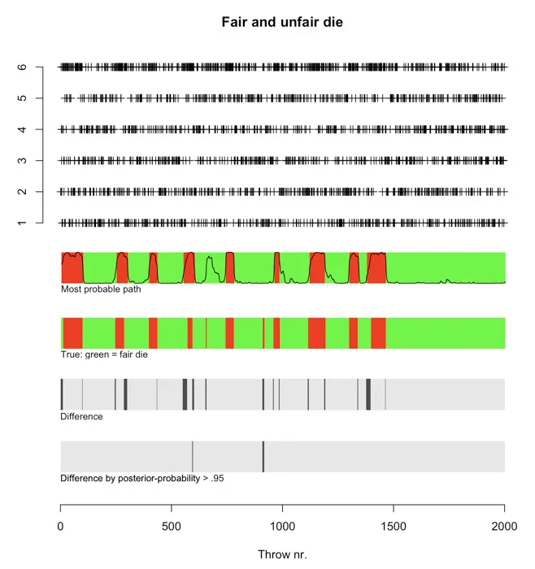
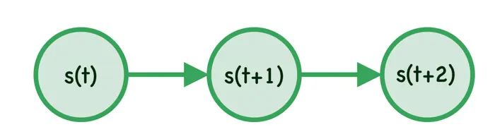
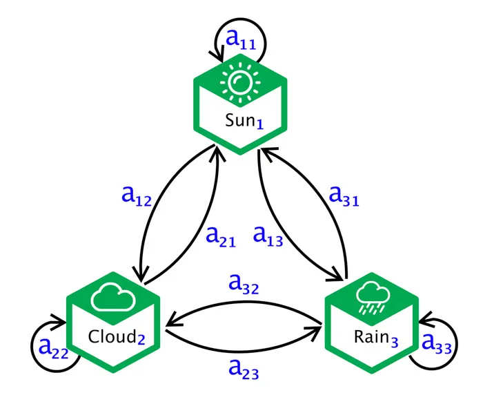
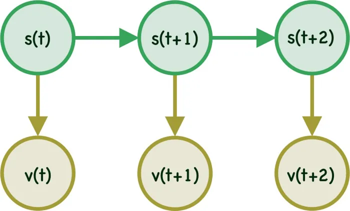
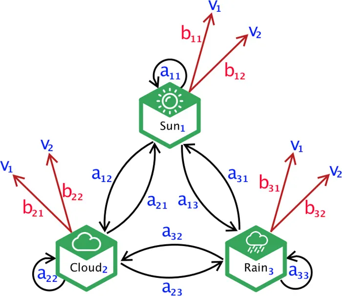

Hidden Markov Model is an Unsupervised Machine Learning Algorithm which is part of the Graphical Models. However Hidden Markov Model (HMM) often trained using supervised learning method in case training data is available. In this introduction to Hidden Markov Model we will learn about the foundational concept, usability, intuition of the algorithmic part and some basic examples. Only little bit of knowledge on probability will be sufficient for anyone to understand this article fully.

# What kind of problem Hidden Markov Model helps to solve?

It’s important to understand where Hidden Markov Model algorithm actually fits in or used. In short, HMM is a graphical model, which is generally used in predicting states (hidden) using sequential data like weather, text, speech etc.

Let’s take an example. Say, a dishonest casino uses two dice (assume each die has 6 sides), one of them is fair the other one is unfair. Unfair means one of the die does not have the probabilities defined as `(1/6, 1/6, 1/6, 1/6, 1/6,/ 1/6)`.The casino randomly rolls any one of the die at any given time.Now, assume we do not know which die was used at what time (the state is hidden). However we know the outcome of the dice (1 to 6), that is, the sequence of throws (observations). Hidden Markov Model can use these observations and predict when the unfair die was used (hidden state).

In the picture below,

1. First plot shows the sequence of throws for each side (1 to 6) of the die (Assume each die has 6 sides).
2. 2nd plot is the prediction of Hidden Markov Model. Red = Use of Unfair Die.
3. 3rd plot is the true (actual) data. Red = Use of Unfair Die.
4. 4th plot shows the difference between predicted and true data. You can see how well HMM performs.
5. Ignoring the 5th plot for now, however it shows the prediction confidence.

# Basic Understanding of Markov Model

Before even going through Hidden Markov Model, let's try to get an intuition of Markov Model. Later using this concept it will be easier to understand HMM. Markov Model has been used to model randomly changing systems such as weather patterns. In Markov Model all the states are visible or observable. 

The most important point Markov Model establishes is that **the future state/event depends only on current state/event** and not on any other older states (This is known as `Markov Property`). For an example, if we consider weather pattern ( sunny, rainy & cloudy ) then we can say tomorrow's weather will only depends on today's weather and not on y'days weather. 

Mathematically we can say, the probability of the `state` at time `t` will only depend on time step `t-1`. In other words, probability of `s(t)` given `s(t-1)`,that is $$p(s(t) \mid s(t-1))$$ . This is known as `First Order Markov Model`.

In case, the probability of the `state` `s` at time `t` depends on time step `t-1` and `t-2`, it's known as `2nd Order Markov Model`. As you increase the dependency of past time events the order increases. The 2nd Order Markov Model can be written as $$p(s(t) \mid s(t-1), s(t-2))$$.

Eventually, the idea is to model the joint probability, such as the probability of $$ s^T = \{ s_1, s_2, s_3 \} $$ where `s1`, `s2` and `s3` happens sequentially. We can use the joint &amp; conditional probability rule and write it as:

$$
\begin{align}
    p(s_3,s_2,s_1) &= p(s_3 \mid s_2,s_1)p(s_2,s_1) \\        
          &= p(s_3 \mid s_2,s_1)p(s_2 \mid s_1)p(s_1) \\
          &= p(s_3 \mid s_2)p(s_2 \mid s_1)p(s_1)
\end{align}
$$

Below is the diagram of a simple Markov Model as we have defined in above equation.

 

## Transition Probabilities

The probability of one state changing to another state is defined as Transition Probability. So in case there are 3 states `(Sun, Cloud, Rain)` there will be total 9 Transition Probabilities.As you see in the diagram, we have defined all the Transition Probabilities. Transition Probability generally are denoted by $ a_{ij} $ which can be interpreted as the Probability of the system to transition from state `i` to state `j` at time step `t+1`.

Mathematically,

$$
a_{ij} = p(\text{ } s(t+1) = j  \text{     }   \mid  \text{     }s(t) = i \text{ })
$$

For an example, in the above state diagram, the Transition Probability from Sun to Cloud is defined as $$a_{12}$$. Note that, the transition might happen to the same state also. This is also valid scenario. If we have sun in two consecutive days then the Transition Probability from sun to sun at time step `t+1` will be $ a_{11} $.

Generally, the Transition Probabilities are define using a `(M x M)` matrix, known as **Transition Probability Matrix**. We can define the Transition Probability Matrix for our above example model as:

$$
A =  \begin{bmatrix}a_{11} & a_{12} & a_{13} \\ a_{21} & a_{22} & a_{23} \\ a_{31} & a_{32} & a_{33} \end{bmatrix} 
$$

Once important property to notice, when the machine transitions to another state, the sum of all transition probabilities given the current state should be 1. In our example $ a_{11}+a_{12}+a_{13} $ should be equal to 1.

Mathematically,

$$
\sum_{j=1}^{M} a_{ij} = 1 \; \; \;   \forall i
$$

## Initial Probability Distribution
The machine/system has to start from one state. The initial state of Markov Model ( when time step `t = 0`) is denoted as $ \pi $, it’s a M dimensional row vector. All the probabilities must sum to 1, that is $  \sum_{i=1}^{M} \pi_i = 1 \; \; \;   \forall i  $. During implementation, we can just assign the same probability to all the states. In our weather example, we can define the initial state as $  \pi = [ \frac{1}{3} \frac{1}{3} \frac{1}{3}]  $

Note, in some cases we may have $ \pi_i = 0 $, since they can not be the initial state.

## Markov Chain
There are basic 4 types of Markov Models. When the system is fully observable and autonomous it’s called as `Markov Chain`. What we have learned so far is an example of Markov Chain. Hence we can conclude that Markov Chain consists of following parameters:
- A set of `M states`
- A `transition probability` matrix A
- An `initial probability` distribution $\pi $

## Final/Absorbing State
When the transition probabilities of any step to other steps are zero except for itself then its knows an Final/Absorbing State.So when the system enters into the Final/Absorbing State, it never leaves. 

# Hidden Markov Model
In Hidden Markov Model the state of the system will be hidden (unknown), however at every time step `t` the system in state `s(t)` will emit an observable/visible symbol `v(t)`.You can see an example of Hidden Markov Model in the below diagram.

In our initial example of dishonest casino, the die rolled (fair or unfair) is unknown or hidden. However every time a die is rolled, we know the outcome (which is between 1-6), this is the observing symbol.

### Notes:	
- We can define a particular sequence of visible/observable state/symbols as $$ V^T = \{ v(1), v(2) … v(T) \} $$
- We will define our model as $ \theta $, so in any state `s(t)` we have a probability of emitting a particular visible state $ v_k(t) $
- Since we have access to only the visible states, while `s(t)`’s are unobservable, such a model is called as `Hidden Markov Model`
- Network like this are called as `Finite-State Machine`
- When they are associated with transition probabilities, they are called as `Markov Network`

## Emission Probability

Now, let’s redefine our previous example. Assume based on the weather of any day the mood of a person changes from happy to sad. Also assume the person is at a remote place and we do not know how is the weather there. We can only know the mood of the person. So in this case, weather is the `hidden state` in the model and mood (happy or sad) is the visible/observable symbol. So we should be able to predict the weather by just knowing the mood of the person using HMM. If we redraw the states it would look like this:

The observable symbols are $ \{ v_1 , v_2 \} $, one of which must be emitted from each state. The probability of emitting any symbol is known as **Emission Probability**, which are generally defined as $b_{jk}$. Mathematically, the probability of emitting symbol `k` given state `j`. 

$$
b_{jk} = p(v_k(t)  \mid  s_j(t) )
$$

Emission probabilities are also defined using `MxC` matrix, named as `Emission Probability Matrix`. 

$$
B = \begin{bmatrix}
b_{11} &  b_{12} \\ 
b_{21} &  b_{22} \\ 
b_{31} &  b_{32}
\end{bmatrix}
$$

Again, just like the Transition Probabilities, the Emission Probabilities also sum to 1. 

$$
\sum_{k=1}^{C} b_{jk} = 1 \; \; \;   \forall j
$$

So far we have defined different attributes/properties of Hidden Markov Model. Prediction is the ultimate goal for any model/algorithm. However before jumping into prediction we need to solve two main problem in HMM. 

## Central Issues with Hidden Markov Model

### 1. Evaluation Problem
Let’s first define the model ( $ \theta $  ) as following:

$$
\theta \rightarrow s, v, a_{ij},b_{jk}
$$

Given the model ( $ \theta $  ) and Sequence of visible/observable symbol ( $ V^T$ ), we need to determine the probability that a particular sequence of visible states/symbol ( $ V^T$ ) that was generated from the model ( $ \theta $  ).

There could be many models $ \{ \theta_1, \theta_2 ... \theta_n \} $. We need to find $ p(V^T  \mid  \theta_i) $, then use Bayes Rule to correctly classify the sequence $ V^T $. 

$$
p(\theta  \mid  V^T  ) = \frac{p(V^T  \mid  \theta) p(\theta)}{p(V^T)}
$$

### 2. Learning Problem

In general HMM is unsupervised learning process, where number of different visible symbol types are known (happy, sad etc), however the number of hidden states are not known. The idea is to try out different options, however this may lead to more computation and processing time. 

Hence we often use training data and specific number of hidden states (sun, rain, cloud etc) to train the model for faster and better prediction. 

Once the high-level structure (Number of Hidden & Visible States) of the model is defined, we need to estimate the Transition ($ a_{ij}$) & Emission ($ b_{jk}$) Probabilities using the training sequences. This is known as the `Learning Problem`.

We will also be using the evaluation problem to solve the Learning Problem. So it's important to understand how the Evaluation Problem really works. Another important note, `Expectation Maximization` (EM) algorithm will be used to estimate the Transition ($ a_{ij}$) & Emission ($ b_{jk}$) Probabilities. The Learning Problem is knows as `Forward-Backward Algorithm` or `Baum-Welch Algorithm`.

### 3. Decoding Problem
Finally, once we have the estimates for Transition ($ a_{ij}$) & Emission ($ b_{jk}$) Probabilities, we can then use the model ( $ \theta $  ) to predict the Hidden States $ W^T$ which generated the Visible Sequence $ V^T $. The Decoding Problem is also known as `Viterbi Algorithm`.

# Conclusion
In this Introduction to Hidden Markov Model article we went through some of the intuition behind HMM. Next we will go through each of the three problem defined above and will try to build the algorithm from scratch and also use both Python and R to develop them by ourself without using any library. 

Here are the list of all the articles in this series:

1. Introduction to Hidden Markov Model
2. [Forward and Backward Algorithm in Hidden Markov Model](https://www.adeveloperdiary.com/data-science/machine-learning/forward-and-backward-algorithm-in-hidden-markov-model/)
3. [Derivation and implementation of Baum Welch Algorithm for Hidden Markov Model](https://www.adeveloperdiary.com/data-science/machine-learning/derivation-and-implementation-of-baum-welch-algorithm-for-hidden-markov-model/)
4. [Implement Viterbi Algorithm in Hidden Markov Model using Python and R](https://www.adeveloperdiary.com/data-science/machine-learning/implement-viterbi-algorithm-in-hidden-markov-model-using-python-and-r/)

