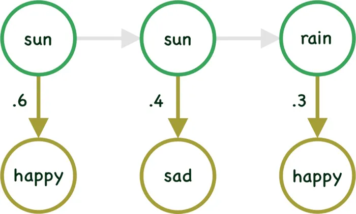
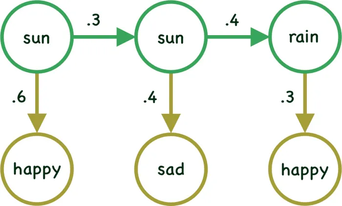
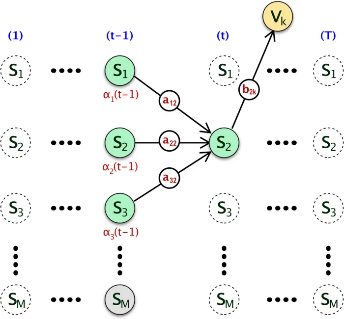
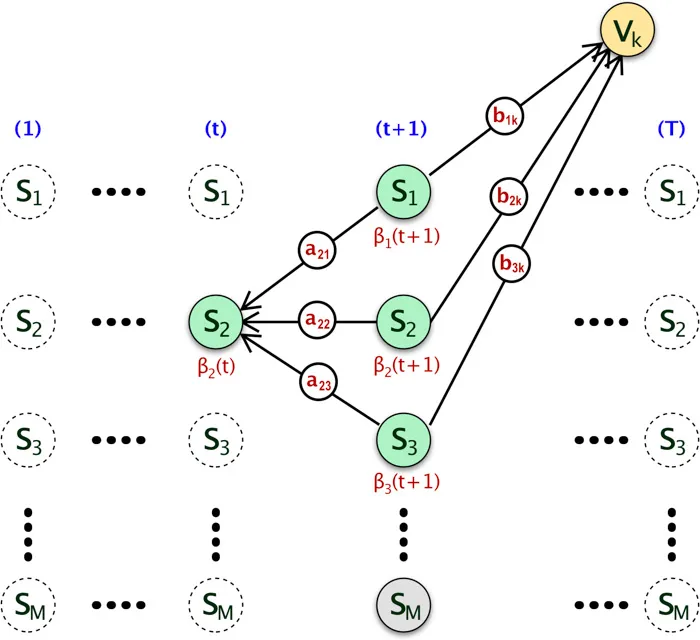

Introduction to Hidden Markov Model article provided basic understanding of the Hidden Markov Model. We also went through the introduction of the three main problems of HMM (`Evaluation`, `Learning` and `Decoding`). In this **Understanding Forward and Backward Algorithm in Hidden Markov Model** article we will dive deep into the **Evaluation Problem**. We will go through the mathematical understanding & then will use Python and R to build the algorithms by ourself.

# Quick Recap

Hidden Markov Model is a **Markov Chain** which is mainly used in problems with **temporal sequence** of data. Markov Model explains that the next step depends only on the previous step in a temporal sequence. In Hidden Markov Model the state of the system is `hidden` (invisible), however each state emits a symbol at every time step. HMM works with both discrete and continuous sequences of data. (Here we will only see the example of discrete data)

# Basic Structure of HMM
As we have discussed earlier, Hidden Markov Model ($\theta$) has with following parameters.

- Set of M Hidden States ($$ S^M$$)
- A Transaction Probability Matrix (A)
- A sequence of T observations ($$ V^T$$)
- A Emission Probability Matrix (Also known as Observation Likelihood) (B)
- An Initial Probability Distribution ($$ \pi $$)

In case you are not sure of any of above terminology, please refer my previous article on Introduction to Hidden Markov Model: [Introduction to Hidden Markov Model](https://adeveloperdiary.github.io/posts/machine%20learning/algorithm/introduction-to-hidden-markov-model/)

# Evaluation Problem

As we have seen earlier, the Evaluation Problem can be stated as following,

$$
\begin{align}
\text{Given }  \theta, V_T   \rightarrow \text{Estimate } p(V_T|\theta) \\

\text{Where }  \theta \rightarrow s, v, a_{ij},b_{jk}
\end{align}
$$

## Solution
- First we need to find all possible sequences of the state $$ S^M$$ where `M` is the number of Hidden States.
- Then from all those sequences of $$ S^M$$, find the probability of which sequence generated the visible sequence of symbols $$ V^T$$.
- Mathematically, $$ p(V_T \mid \theta) $$ can be estimated as,

$$
\begin{align}
p(V^T|\theta)= \sum_{r=1}^{R} p(V^T \mid S_r^T)p(S_r^T) \\
\text{where }S_r^T = \{ s_1(1), s_2(2)... s_r(T)\}		
\end{align}
$$

and **R**=Maximum Number of possible sequences of the hidden state

So, if there are `M` number of hidden state, then we can define `R` as :

$$
R=M^T
$$

In order to compute the probability of the model generated by the **particular** sequence of `T` visible symbols $$ V^T$$, we should take each conceivable sequence of hidden state, calculate the probability that they have produced $$V^T$$ and then `add` up these probabilities.

## Question
Question you might be having is how to proof that the above equation is valid? Let’s try to understand this in a different way. 

Remember our example? So here is the diagram of a specific sequence of 3 states. The transition between the Hidden Layers have been grayed out intentionally, we will come back to that in a moment.  



In case in the above example we already know the sequence of the Hidden states (i.e sun, sun, cloud) which generated the 3 visible symbols happy, sad & happy, then it will be very easy to calculate the probability of the visible symbols/states given the hidden state. So we can write probability of $$ V^T$$ given $$S^T$$ as:

$$p(happy, sad, happy | sun, sun, rain ) = p(happy|sun) x p(sad|sun) x p(happy|rain)$$

Mathematically, 

$$
p(V^T|S_r^T)=\prod_{t=1}^{T} p(v(t) | s(t)) 
$$

Unfortunately we really **do not know the specific sequence of hidden states** which generated the visible symbols happy, sad & happy.Hence we need to compute the probability of mood changes happy, sad & happy by **summing over all possible weather sequences**, weighted by their probability (transition probability).

We now have the same state diagram, however now the transition probabilities have been given here. 



We can calculate the **joint probability** of the sequence of visible symbol $$V^T$$ generated by a specific sequences of hidden state $$S^T$$ as:

$$p(happy,sad,happy,sun,sun,rain)$$ = $$p(sun \mid initial state)$$ x $$p(sun \mid sun)$$ x $$p(rain \mid sun)$$ x $$p(happy \mid sun)$$ x $$p(sad \mid sun)$$ x $$p(happy \mid rain)$$

Mathematically, 

$$
p(V^T,S^T)=p(V^T | S^T)p(S^T)
$$

Since we are using **First-Order Markov model**, we can say that the probability of a sequence of `T` hidden states is the multiplication of the probability of each transition. 

$$
p(S^T)=\prod_{t=1}^{T} p(s(t) | s(t-1)) 
$$

Write the joint probability as following, 

$$
\begin{align}
p(V^T,S^T) &=p(V^T | S^T)p(S^T) \\
           &=\prod_{t=1}^{T} p(v(t) | s(t)) \prod_{t=1}^{T} p(s(t) | s(t-1))
\end{align}
$$

As you can see, we are slowly getting close to our original equation. Just one more step is left now. The above equation is for a **specific sequence** of hidden state that we thought might have generated the visible sequence of symbols/states. We can now compute the probably of **all** the different possible sequences of hidden states by **summing over all the joint probabilities** of $$V^T$$ and $$S^T$$.

In our example, we have a sequence of 3 visible symbols/states, we also have 2 different states to represent. So there can be $$2^3 = 8$$ possible sequences. We can write them as:

$$p(happy,sad,happy \mid model)$$ = $$p(happy,sad,happy,sun,sun,sun)$$ + $$p(happy,sad,happy,sun,sun,rain)$$ + $$p(happy,sad,happy,sun,rain,rain)$$+ . . . 

We can write the generalized equation as:

$$
\begin{align}
p(V^T|\theta) &=\sum_{\text{All Seq of S}} p(V^T, S^T) \\
                        &=\sum_{\text{All Seq of S}} p(V^T | S^T)p(S^T) \\
                       &=\sum_{r=1}^R \prod_{t=1}^{T} p(v(t) | s(t)) \prod_{t=1}^{T} p(s(t) | s(t-1)) \\
                       &=\sum_{r=1}^R \prod_{t=1}^{T} p(v(t) | s(t)) p(s(t) | s(t-1))
\end{align}
$$

Again, `R`=Maximum Number of possible sequences of the hidden state.

The above solution is simple, however the **computation complexity** is $$ O(N^T.T) $$, which is very high for practical scenarios. So even if we have derived the solution to the Evaluation Problem, we need to find an alternative which should be easy to compute.

We will a **recursive dynamic programming** approach to overcome the **exponential computation** we had with the solution above. There are two such algorithms, `Forward Algorithm` and `Backward Algorithm`. 

# Forward Algorithm
In Forward Algorithm (as the name suggested), we will use the computed probability on **current time step** to derive the probability of the **next time step**. Hence the it is computationally more efficient $$O(N^2.T)$$. 

We need to find the answer of the following question to make the algorithm recursive: 

Given a a sequence of Visible state $$V^T$$ , what will be the probability that the Hidden Markov Model will be in a particular hidden state s at a particular time step `t`.

If we write the above question mathematically it might be more easier to understand. 

$$
\alpha_j(t) = p(v(1)...v(t),s(t)= j)
$$

First, we will derive the equation using just probability & then will solve again using `trellis diagram`. So don’t worry if you are not able to fully understand the next section, just read along and come back after going through the trellis diagram.

## Solution using Probabilities

### When `t = 1` 

Rewrite the above equation when `t=1`

$$
\begin{align}
\alpha_j(1) &= p(v_k(1),s(1)= j) \\
                   &= p(v_k(1)|s(1)=j)p(s(1)=j) \\
                   &= \pi_j p(v_k(1)|s(1)=j) \\
                   &= \pi_j b_{jk} \\
\text{where } \pi &= \text{ initial distribution, } \\
b_{jkv(1)} &= \text{ Emission Probability at } t = 1
\end{align}
$$

### When `t = 2` 

So we have the solution when `t=1`. Now lets rewrite the same when `t=2`. Our objective here will be to come up with an equation where $$\alpha_j(1)$$ is part of it, so that we can use `recursion`.

<div id='mathjax_small' style='font-size:80%'>
$$
\begin{align}
\alpha_j(2) &= p \Big( v_k(1),v_k(2),s(2)= j \Big) \\
                   &= \color{Blue}{\sum_{i=1}^M} p \Big( v_k(1),v_k(2),\color{Blue}{s(1)= i}, s(2)= j \Big) \\
                   &=  \sum_{i=1}^M  p \Big( v_k(2) | s(2)= j, v_k(1),s(1)= i \Big) p \Big( v_k(1),s(2),s(1)= i \Big)\\
                   &=  \sum_{i=1}^M  p \Big( v_k(2) | s(2)= j, \color{Red}{v_k(1), s(1)= i} \Big) p \Big( s(2) | \color{Red}{v_k(1),}s(1)= i \Big) p \Big(v_k(1),s(1)= i \Big) \\
                   &=  \sum_{i=1}^M  p \Big( v_k(2) | s(2)= j  \Big) p \Big(s(2) | s(1)= i \Big) p \Big(v_k(1),s(1)= i \Big)\\
                   &=  \color{DarkRed}{p \Big( v_k(2) | s(2)= j \Big) }\sum_{i=1}^M p  \Big( s(2) | s(1)= i \Big) \color{Blue}{p  \Big( v_k(1),s(1)= i \Big)} \\
                   &=  \color{DarkRed}{b_{jk v(2)}}  \sum_{i=1}^M a_{i2} \color{Blue} {\alpha_i(1)}\\
\text{where } a_{i2} &= \text{ Transition Probability } \\
b_{jk v(2)} &= \text{ Emission Probability at } t=2 \\
\alpha_i(1) &= \text{ Forward probability at } t=1
\end{align}
$$
</div>

Let me try to explain some part of it. We have just used the **Joint Probability** Rule and have broken the equation in different parts. 

In `Line 2` we have added $$s(1)=i$$ for which we have added the summation since there are `M` different hidden states. The red highlighted section in `Line 4` can be removed. Finally `line 6` has 3 parts which are highlighted in colors. Since $$ p ( v_k(2) \mid s(2)= j ) $$ does not depend on `i`, we can move it outside of the summation. The final equation consists of $$ \alpha_i(1) $$ which we have already calculated when `t=1`. 

### Generalized Equation

Let’s generalize the equation now for any time step `t+1`:

<div id='mathjax_small' style='font-size:80%'>
$$
\begin{align}
\alpha_j(t+1) &= p \Big( v_k(1) ... v_k(t+1),s(t+1)= j \Big)  \\
                   &= \color{Blue}{\sum_{i=1}^M} p\Big(v_k(1) ... v_k(t+1),\color{Blue}{s(t)= i}, s(t+1)= j \Big) \\
                   &=  \sum_{i=1}^M  p\Big(v_k(t+1) | s(t+1)= j, v_k(1) ... v_k(t),s(t)= i\Big) \\
	               & p\Big(v_k(1)...v_k(t),s(t+1),s(t)= i \Big) \\
                   &=  \sum_{i=1}^M  p\Big(v_k(t+1) | s(t+1)= j, \color{Red}{v_k(1)...v_k(t), s(t)= i}\Big) \\ 
	               & p\Big(s(t+1) | \color{Red}{v_k(1)...v_k(t),}s(t)= i\Big) p\Big(v_k(t),s(t)= i\Big)\\
                   &=  \sum_{i=1}^M  p\Big(v_k(t+1) | s(t+1)= j\Big) p\Big(s(t+1) | s(t)= i\Big) p\Big(v_k(t),s(t)= i\Big)\\
                   &=  \color{DarkRed}{p\Big(v_k(t+1) | s(t+1)= j\Big) }\sum_{i=1}^M p\Big(s(t+1) | s(t)= i\Big) \color{Blue}{p\Big(v_k(t),s(t)= i\Big)} \\
                   &=  \color{DarkRed}{b_{jk v(t+1)}} \sum_{i=1}^M a_{ij} \color{Blue}{\alpha_i(t)}
\end{align}
$$
</div>

The above equation follows the same derivation as we did for `t=2`. This equation will be really easy to implement using any programming language. We won’t use recursion function, just use the pre-calculated values in a loop (More on this later).

## Intuition using Trellis
We will use `Trellis Diagram` to get the intuition behind the Forward Algorithm. I case you have not understood the derivation using joint probability rule, this section will definitely help you to understand the equation.

I am repeating the same  question again here:
Given a a sequence of Visible state $$V^T$$ , what will be the probability that the Hidden Markov Model will be in a particular hidden state s at a particular time step t.

### Step by Step Derivation

Please refer the below Trellis diagram and assume the probability that the system/machine is at hidden state $$s_1$$ at time $$ (t-1) $$ is $$ \alpha_1(t-1) $$. The probability of transition to hidden state $$ s_2 $$ at time step t can be now written as,

$$
\alpha_1(t-1) a_{12}
$$



Likewise, if we `sum` all the probabilities where the machine transition to state $$ s_2 $$ at time `t` from any state at time $$(t-1)$$, it gives the total probability that `there will a transition from any hidden state` at $$(t-1)$$ to $$ s_2 $$ at time step `t`.

Mathematically, 

$$
\sum_{i=1}^M \alpha_i(t-1) a_{i2}
$$

Finally, we can say the probability that the machine is at hidden state $$ s_2 $$ at time `t`, after emitting first `t` number of visible symbol from sequence $$V^T$$ is given but the following, (We simply multiply the emission probability to the above equation)

$$
b_{2k} \sum_{i=1}^M \alpha_i(t-1) a_{i2}
$$

Now we can extend this to a `recursive algorithm` to find the probability that sequence  $$V^T$$ was generated by `HMM` $$\theta$$. Here is the generalized version of the equation.

$$
\alpha_j(t)= \begin{cases}
\pi_jb_{jk} & \text{ when }t = 1 \\
b_{jk} \sum_{i=1}^M \alpha_i(t-1) a_{ij} & \text{ when } t \text{ greater than } 1
\end{cases}
$$

Here $$\alpha_j(t)$$ is the probability that the machine will be at hidden state $$s_j$$ at time step `t`, after emitting first `t` visible sequence of symbols.	

## Implementation of Forward Algorithm
Now lets work on the implementation. We will use both Python and R for this. 

### Data
In our example we have 2 Hidden States `(A,B)` and 3 Visible States `(0,1,2)` ( in R file, it will be `(1,2,3)` ). Assume that we already know our `a` and `b`.

$$
A= 
\begin{bmatrix}
0.54 & 0.46\\ 
0.49 & 0.51
\end{bmatrix}
$$

$$
B= \begin{bmatrix}
0.16 & 0.26 & 0.58\\ 
0.25 & 0.28 & 0.47
\end{bmatrix}
$$

The `data_python.csv` & `data_r.csv` has two columns named, `Hidden` and `Visible`. The only difference between the Python and R is only the starting index of the Visible column. Python file has 0,1,2 where as R has 1,2,3.

### Python
First Load the data. 

```python
import pandas as pd
import numpy as np

data = pd.read_csv('data_python.csv')

V = data['Visible'].values
```

Then set the values for transition probability, emission probabilities and initial distribution.

```python
# Transition Probabilities
a = np.array(((0.54, 0.46), (0.49, 0.51)))

# Emission Probabilities
b = np.array(((0.16, 0.26, 0.58), (0.25, 0.28, 0.47)))

# Equal Probabilities for the initial distribution
initial_distribution = np.array((0.5, 0.5))
```

In python the index starts from 0, hence our `t` will start from `0` to `T-1`.

Next, we will have the `forward function`. Here we will store and return all the $$\alpha_0(0), \alpha_1(0) … \alpha_0(T-1),\alpha_1(T-1)$$

```python
def forward(V, a, b, initial_distribution):
    alpha = np.zeros((V.shape[0], a.shape[0]))
    alpha[0, :] = initial_distribution * b[:, V[0]]

    for t in range(1, V.shape[0]):
        for j in range(a.shape[0]):
            # Matrix Computation Steps
            #                  ((1x2) . (1x2))      *     (1)
            #                        (1)            *     (1)
            alpha[t, j] = alpha[t - 1].dot(a[:, j]) * b[j, V[t]]
    
    return alpha

alpha = forward(V, a, b, initial_distribution)
print(alpha)

```

First we will create the alpha matrix with `2 Columns` and `T Rows`.
As per our equation multiply `initial_distribution` with the $$ b_{jkv(0)} $$ to calculate $$\alpha_0(0) , \alpha_1(0) $$. This will be a simple vector multiplication since both `initial_distribution` and $$ b_{kv(0)} $$ are of same size.

- We will loop through the time steps now, starting from 1 ( remember python index starts from 0 ).
- Another loop for each hidden step `j`.
- Use the same formula for calculating the $$ \alpha $$ values.
- Return all of the alpha values.

### Output:

```
[[8.00000000e-002 1.25000000e-001]
[[8.00000000e-002 1.25000000e-001]
 [2.71570000e-002 2.81540000e-002]
 [1.65069392e-002 1.26198572e-002]
 [8.75653677e-003 6.59378003e-003]
…
…
 [8.25847348e-221 6.30684489e-221]
 [4.37895921e-221 3.29723269e-221]
 [1.03487332e-221 1.03485477e-221]
 [6.18228050e-222 4.71794300e-222]]
```

### R Code
Here is the same Forward Algorithm implemented in R. If you notice, we have removed the 2nd for loop in R code. You can do the same in python too.

```R
data = read.csv("data_r.csv")

a = matrix(c(0.54, 0.49, 0.46, 0.51),nrow = 2,ncol = 2)
b = matrix(c(0.16, 0.25, 0.26, 0.28, 0.58, 0.47),nrow = 2,ncol = 3)
initial_distribution = c(1/2, 1/2)

forward = function(v, a, b, initial_distribution){

  T = length(v)
  m = nrow(a)
  alpha = matrix(0, T, m)

  alpha[1, ] = initial_distribution*b[, v[1]]

  for(t in 2:T){
    tmp = alpha[t-1, ] %*% a
    alpha[t, ] = tmp * b[, v[t]]
  }
  return(alpha)
}

forward(data$Visible,a,b,initial_distribution)

```

# Backward Algorithm
Backward Algorithm is the `time-reversed` version of the Forward Algorithm. In Backward Algorithm we need to find the probability that the machine will be in hidden state $$ s_i $$ at time step `t` and will generate the `remaining part of the sequence` of the visible symbol $$V^T$$.

## Derivation of Backward Algorithm
Please find the Derivation of the Backward Algorithm using Probability Theory. The concepts are same as the forward algorithm.

<div id='mathjax_small' style='font-size:80%'>
$$
\begin{align}
\beta_i(t) &= p \Big( v_k(t+1) .... v_k(T) | s(t) = i \Big) \\
&= \sum_{j=0}^M p\Big(  v_k(t+1) .... v_k(T), s(t+1) = j | s(t) = i  \Big)        \\
&= \sum_{j=0}^M p\Big(  v_k(t+2) .... v_k(T) |  v_k(t+1) , s(t+1) = j , s(t) = i  \Big) \\
& p \Big( v_k(t+1) , s(t+1) = j | s(t) = i  \Big) \\
&= \sum_{j=0}^M p\Big(  v_k(t+2) .... v_k(T) |  v_k(t+1) , s(t+1) = j , s(t) = i  \Big) 
	\\ &	p \Big( v_k(t+1) |  s(t+1) = j , s(t) = i  \Big) p \Big( s(t+1) = j | s(t) = i  \Big) \\
&= \sum_{j=0}^M  p\Big(  v_k(t+2) .... v_k(T) |  s(t+1) = j  \Big) p \Big( v_k(t+1) |  s(t+1) = j \Big)  \\ & p \Big( s(t+1) = j | s(t) = i  \Big) \\
&= \sum_{j=0}^M \beta_j(t+1) b_{jkv(t+1)} a_{ij} \\
\text{where } a_{i2} &= \text{ Transition Probability } \\
b_{jk v(t+1)} &= \text{ Emission Probability at } t=t+1 \\
\beta_i(t+1) &= \text{ Backward probability at } t=t+1 
\end{align}
$$
</div>

## Intuition using Trellis
Here is the Trellis diagram of the Backward Algorithm.  Mathematically, the algorithm can be written in following way:

$$
\beta_i(t)= \begin{cases}
1 & \text{ when }t = T \\
\sum_{j=0}^M  a_{ij} b_{jkv(t+1)}\beta_j(t+1) & \text{ when } t \text{ less than } T
\end{cases}
$$


																   

## Implementation of Backward Algorithm
We will use the same data file and parameters as defined for Forward Algorithm.

### Python Code

```python
import pandas as pd
import numpy as np

data = pd.read_csv('data_python.csv')

V = data['Visible'].values

# Transition Probabilities
a = np.array(((0.54, 0.46), (0.49, 0.51)))

# Emission Probabilities
b = np.array(((0.16, 0.26, 0.58), (0.25, 0.28, 0.47)))


def backward(V, a, b):
    beta = np.zeros((V.shape[0], a.shape[0]))

    # setting beta(T) = 1
    beta[V.shape[0] - 1] = np.ones((a.shape[0]))
    
    # Loop in backward way from T-1 to
    # Due to python indexing the actual loop will be T-2 to 0
    for t in range(V.shape[0] - 2, -1, -1):
        for j in range(a.shape[0]):
            beta[t, j] = (beta[t + 1] * b[:, V[t + 1]]).dot(a[j, :])
    
    return beta


beta = backward(V, a, b)
print(beta)
```

### R Code

```R
data = read.csv("data_r.csv")

a = matrix(c(0.54, 0.49, 0.46, 0.51),nrow = 2,ncol = 2)
b = matrix(c(0.16, 0.25, 0.26, 0.28, 0.58, 0.47),nrow = 2,ncol = 3)

backward = function(V, A, B){
  T = length(V)
  m = nrow(A)
  beta = matrix(1, T, m)

  for(t in (T-1):1){
    tmp = as.matrix(beta[t+1, ] * B[, V[t+1]])
    beta[t, ] = t(A %*% tmp)
  }
  return(beta)
}

backward(data$Visible,a,b)
```


### Output

```
[[5.30694627e-221 5.32373319e-221]
 [1.98173335e-220 1.96008747e-220]
 [3.76013005e-220 3.71905927e-220]
 [7.13445025e-220 7.05652279e-220]
...
...
 [7.51699476e-002 7.44006456e-002]
 [1.41806080e-001 1.42258480e-001]
 [5.29400000e-001 5.23900000e-001]
 [1.00000000e+000 1.00000000e+000]]

```

# Conclusion
In our next article we will use both the forward and backward algorithm to solve the `learning problem`. Here I have provided a very detailed overview of the Forward and Backward Algorithm. The output of the program may not make lot of sense now, however next article will provide more insight. 

Here is the link to the code and data file in github.

<div style='text-align:center;margin-bottom:30px;'>
	<input type='button' value="Code" onclick="javascript:window.open('https://github.com/adeveloperdiary/HiddenMarkovModel/tree/master/part2','_blank')"/></div>

Also, here are the list of all the articles in this series:


1. [Introduction to Hidden Markov Model](https://adeveloperdiary.github.io/posts/machine%20learning/algorithm/introduction-to-hidden-markov-model/)
2. Forward and Backward Algorithm in Hidden Markov Model
3. [Derivation and implementation of Baum Welch Algorithm for Hidden Markov Model](https://www.adeveloperdiary.com/data-science/machine-learning/derivation-and-implementation-of-baum-welch-algorithm-for-hidden-markov-model/)
4. [Implement Viterbi Algorithm in Hidden Markov Model using Python and R](https://www.adeveloperdiary.com/data-science/machine-learning/implement-viterbi-algorithm-in-hidden-markov-model-using-python-and-r/)


