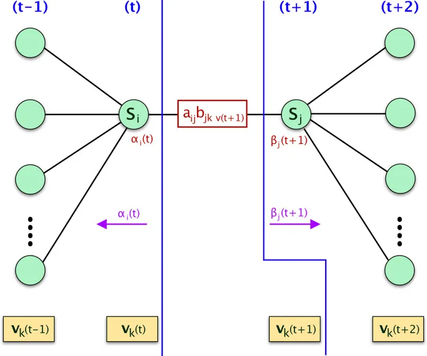
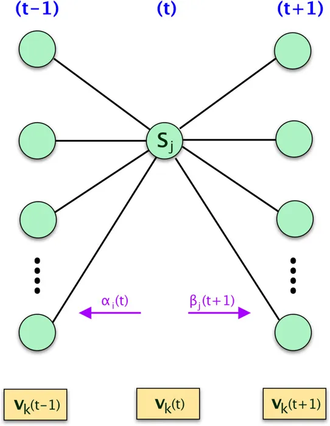

The most important and complex part of Hidden Markov Model is the `Learning Problem`. Even though it can be used as Unsupervised way, the more common approach is to use Supervised learning just for defining number of hidden states. In this Derivation and implementation of Baum Welch Algorithm for Hidden Markov Model article we will go through step by step derivation process of the `Baum Welch Algorithm` (a.k.a `Forward-Backward` Algorithm) and then implement is using both Python and R.

# Quick Recap

This is the 3rd part of the **Introduction to Hidden Markov Model Tutorial**. So far we have gone through the intuition of HMM, derivation and implementation of the Forward and Backward Algorithm. In case you need a refresher please refer the part 2 of the tutorial series.

# Learning Problem : HMM Training

- The objective of the `Learning Problem` is to estimate for $$ a_{ij}$$ and $$ b_{jk}$$ using the training data.
- The standard algorithm for Hidden Markov Model training is the `Forward-Backward` or `Baum-Welch` Algorithm.
- This algorithm uses a special case of the `Expectation Maximization` (EM) Algorithm.

### Example using Maximum Likelihood Estimate:

Now let’s try to get an intuition using an example of `Maximum Likelihood Estimate`.Consider training a `Simple Markov Model` where the hidden state is visible.

We we use our example used in the programming section (You should already have it if you have followed part 2) where we had 2 hidden states `[A,B]` and 3 visible states `[1,2,3]`. (Assume in this example the hidden states are also known)

As you see here we have 4 different sets of sequences (each in alternative colors).


Now we will compute the HMM parameters by `Maximum Likelihood Estimation` using the sample data above.

### Estimate Initial Probability Distribution
We will initialize $$ \pi $$ using the probability derived from the above sequences. In the example above, one of the sequence started with `A` and rest all 3 with `B`. We can define,

$$
\pi_A=1/3 , \pi_B=2/3
$$

### Estimate Transition Probabilities
Lets define our `Transition Probability Matrix` first as:

$$
\hat{A} = \begin{bmatrix}
p(A|A) & p(B|A) \\ 
p(A|B) & p(B|B)
\end{bmatrix}
$$

We can calculate the probabilities from the example as (Ignore the final hidden state since there is to state to transition to):

$$
\hat{A} = \begin{bmatrix}
2/4 & 2/4 \\ 
3/4 & 1/4
\end{bmatrix}
$$

### Estimate Emission Probabilities
Same way, following should be our `Emission Probability Matrix`.

$$
\hat{B} =\begin{bmatrix}
p(1|A) & p(2|A) & p(3|A) \\ 
p(1|B) & p(2|B) & p(3|B)
\end{bmatrix}
$$

Here are the calculated probabilities:

$$
\hat{B} =\begin{bmatrix}
4/6 & 2/6 & 0/6 \\ 
1/6 & 2/6 & 3/6 
\end{bmatrix}
$$

# Baum-Welch Algorithm
The above maximum likelihood estimate will work only when the sequence of hidden states are known. However thats not the case for us. Hence we need to find another way to estimate the Transition and Emission Matrix.

This algorithm is also known as Forward-Backward or Baum-Welch Algorithm, it’s a special case of the Expectation Maximization (EM) algorithm.

## High Level Steps of the Algorithm (EM)
Lets first understand what we need in order to get an estimate for the parameters of the HMM. Here are the high level steps:

- Start with initial probability estimates `[A,B]`. Initially set equal probabilities or define them randomly.
- Compute expectation of how often each transition/emission has been used. We will estimate latent variables [ $$ \xi , \gamma $$ ] (This is common approach for EM Algorithm)
- Re-estimate the probabilities `[A,B]` based on those estimates (latent variable).
- Repeat until convergence.


## How to solve Baum-Welch Algorithm?
There are two main ways we can solve the Baum-Welch Algorithm. 

- **Probabilistic Approach :** HMM is a Generative model, hence we can solve Baum-Welch using Probabilistic Approach.
- **Lagrange Multipliers :** The Learning problem can be defined as a constrained optimization problem, hence it can also be solved using `Lagrange Multipliers`.

The final equation for both A, B will look the same irrespective of any of the above approach since both A,B can be defined using joint and marginal probabilities. Let’s look at the formal definition of them :

### Estimate for $$ a_{ij}$$:

$$
 \hat{a_{ij}} = \frac{\text{expected number of transitions from hidden state i to state j}}{\text{expected number of transition from hidden state i}}
$$


### Estimate for $$ b_{jk}$$:

$$
\hat{b_{jk}} = \frac{\text{expected number of times in hidden state j and observing v(k) }}{\text{expected number of times in hidden state j}}
$$


The above definition is just the generalized view of the Maximum Likelihood Example we went through. Let’s use the Probabilistic Approach and find out how we can estimate the parameters `A,B`

## Probabilistic Approach

### Derivation of $$ \hat{a_{ij}}$$

If we know the probability of a given transition from `i` to `j` at time step `t`, then we can sum over all the `T` times to estimate for the numerator in our equation for $$ \hat{A}$$.

By the way $$ \hat{A}$$ is just the matrix representation of $$ \hat{a_{ij}}$$, so don't be confused.

We can define this as the probability of being in state `i` at time `t` and in state `j` at time `t+1`, given the observation sequence and the model.

Mathematically, 

$$
p(s(t) = i,s(t+1)=j | V^T, \theta )
$$

We already know from the basic probability theory that,

$$
\begin{align}
p(X, Y | Z) &= p(X | Y, Z) p( Y | Z ) \\
p(X | Y, Z) &= \frac{p(X, Y | Z) }{p( Y | Z )}
\end{align}
$$

We can now say, 

$$
\begin{align}
p(s(t) = i,s(t+1)=j | V^T, \theta ) &=\frac{ p(s(t) = i,s(t+1)=j , V^T | \theta )}{p(V^T| \theta )}
\end{align}
$$

The numerator of the equation can be expressed using `Forward` and `Backward` Probabilities (Refer the diagram below):

$$
\begin{align}
p(s(t) = i,s(t+1)=j , V^T | \theta ) = \alpha_i(t) a_{ij} b_{jk \text{ } v(t+1) }\beta_j(t+1)
\end{align} \\ \\ \\
$$




The denominator $$ p(V^T \mid \theta)$$ is the probability of the observation sequence $$ V^T$$ by any path given the model $$ \theta $$. It can be expressed as the marginal probability:

$$
\begin{align}
p(V^T | \theta ) = \sum_{i=1}^{M} \sum_{j=1}^{M} \alpha_i(t) a_{ij} b_{jk \text{ } v(t+1) }\beta_j(t+1)
\end{align}
$$

We will define $$\xi $$ as the `latent variable` representing $$ p(s(t) = i,s(t+1)=j \mid V^T, \theta ) $$. We can now define $$\xi_{ij} (t) $$ as: 

$$
\xi_{ij} (t) = \frac{\alpha_i(t) a_{ij} b_{jk \text{ } v(t+1) }\beta_j(t+1)}{\sum_{i=1}^{M} \sum_{j=1}^{M} \alpha_i(t) a_{ij} b_{jk \text{ } v(t+1) }\beta_j(t+1)}
$$

The $$\xi_{ij} (t) $$ defined above is only for `one time step`, we need to sum over all `T` to get the total `joint probability` for all the transitions from hidden state `i` to hidden state `j`. This will be our numerator of the equation of $$ \hat{a_{ij}} $$.

For the denominator, we need to get the marginal probability which can be expressed as following, 

$$
\sum_{t=1}^{T-1} \sum_{j=1}^{M} \xi_{ij} (t)
$$

Now we can define $$ \hat{a_{ij}} $$ as,

$$
\hat{a_{ij}} = \frac{\sum_{t=1}^{T-1} \xi_{ij} (t)}{\sum_{t=1}^{T-1} \sum_{j=1}^{M} \xi_{ij} (t)} . . . . . . . . . (1)
$$

### Probabilistic view of the Denominator
Before we move on estimating `B`, let’s understand more on the denominator of $$ \hat{a_{ij}} $$. The denominator is the probability of a state `i` at time `t`, which can be expressed as :

$$
\begin{align}
p(s(t)=i | V^T , \theta) & = \frac{p(s(t)=i, V^T | \theta)}{p(V^T| \theta)} \\
&= \frac{ p(v(1)... v(t), s(t)=i | \theta) p(v(t+1) ... v(T)| s(t)=i , \theta) }{ p(V^T| \theta) } \\
&=\frac{\alpha_i(t) \beta_i(t)}{p(V^T| \theta)} \\
&= \frac{\alpha_i(t) \beta_i(t)}{ \sum_{i=1}^M \alpha_i(t) \beta_i(t)}  = \gamma_i(t)
\end{align}
$$



if we use the above equation to define our estimate for A, it will be,

$$
\hat{a_{ij}} = \frac{\sum_{t=1}^{T-1} \xi_{ij} (t)}{\sum_{t=1}^{T-1} \gamma(t)} . . . . . . . . . (2)
$$

This is the same equation as $$ (1) $$ we derived earlier.

However, since
$$
\gamma_i(t) = \sum_{j=1}^M \xi_{ij}(t)
$$

we can just use $$\xi_{ij}(t)$$ to define the $$\hat{a_{ij}}$$. This will same some computation.

In summary, in case you see the estimate of $$a_{ij}$$ with this equation, don’t be confused, since both $$(1) $$ and $$ (2)$$ are identical, even through the representations are different.


### Derivation of $$ \hat{b_{jk}}$$
$$ b_{jk}$$ is the probability of a given symbol $$v_k$$ from the observations `V` given a hidden state `j`. 

We already know the probability of being in state `j` at time `t`.

$$
\gamma_j(t) = \frac{\alpha_j(t) \beta_j(t)}{ \sum_{j=1}^M \alpha_j(t) \beta_j(t)} 
$$

We can compute $$ \hat{b_{jk}}$$ using $$\gamma_j(t)$$,

$$
\hat{b_{jk}} = \frac{\sum_{t=1}^T \gamma_j(t) 1(v(t)=k)}{\sum_{t=1}^T \gamma_j(t) }
$$

where $$1(v(t)=k)$$ is the `indicator function`. 

## Final EM Algorithm

- **initialize** A and B
- **iterate** until convergence
	- **E-Step**
		- $$\xi_{ij} (t) = \frac{\alpha_i(t) a_{ij} b_{jk \text{ } v(t+1) }\beta_j(t+1)}{\sum_{i=1}^{M} \sum_{j=1}^{M} \alpha_i(t) a_{ij} b_{jk \text{ } v(t+1) }\beta_j(t+1)} $$
			-$$ \gamma_i(t) = \sum_{j=1}^M \xi_{ij}(t)$$
	- **M-Step**
		- $\hat{a_{ij}} = \frac{\sum_{t=1}^{T-1} \xi_{ij} (t)}{\sum_{t=1}^{T-1} \sum_{j=1}^{M} \xi_{ij} (t)} $
		- $\hat{b_{jk}} = \frac{\sum_{t=1}^T \gamma_j(t) 1(v(t)=k)}{\sum_{t=1}^T \gamma_j(t) } $

- **return** A,B

## Lagrange Multipliers
We can represent the Learning problem as a `constrained optimization` problem and define it as,

$$
\begin{align} 
\text{Optimize } & p(V^T| \theta) \\ 
\text{ where } \theta &= \{\pi, A , B \} \\
\text{Subject to } & 
\begin{cases} \sum_{i=1}^M \pi_i=1\\
\sum_{j=1}^M a_{ij}=1, \forall i \in \{ 1,...,M\} \\ 
\sum_{k=1}^M b_{jk}=1, \forall j \in \{ 1,...,M\}
\end{cases} 
\end{align}
$$

We can then solve this using `Lagrange Multipliers` and by taking the derivatives. We are not going to through the details of that derivation here, however if you are interested let me know I can expand this section if needed.


## Code
### R-Script
Here is the implementation of the algorithm. 

- In line# 23-24, we are appending the `T`'th data into the $$\gamma$$ since  $$ \xi $$'s length is `T-1`
- We are using $$ \xi $$ to derive $$\gamma$$.
- The `indicator` function has been implemented using which in line# 26.

```R
BaumWelch = function(v, a, b, initial_distribution, n.iter = 100){

  for(i in 1:n.iter){
    T = length(v)
    M = nrow(a)
    K=ncol(b)
    alpha = forward(v, a, b, initial_distribution)
    beta = backward(v, a, b)
    xi = array(0, dim=c(M, M, T-1))
    
    for(t in 1:T-1){
      denominator = ((alpha[t,] %*% a) * b[,v[t+1]]) %*% matrix(beta[t+1,]) 
      for(s in 1:M){
        numerator = alpha[t,s] * a[s,] * b[,v[t+1]] * beta[t+1,]
        xi[s,,t]=numerator/as.vector(denominator)
      }
    }

    xi.all.t = rowSums(xi, dims = 2)
    a = xi.all.t/rowSums(xi.all.t)
    
    gamma = apply(xi, c(1, 3), sum)  
    gamma = cbind(gamma, colSums(xi[, , T-1]))
    for(l in 1:K){
      b[, l] = rowSums(gamma[, which(v==l)])
    }
    b = b/rowSums(b)

  }
  return(list(a = a, b = b, initial_distribution = initial_distribution))
}
```

Here is the full code.

```R
forward = function(v, a, b, initial_distribution){

  T = length(v)
  M = nrow(a)
  alpha = matrix(0, T, M)

  alpha[1, ] = initial_distribution*b[, v[1]]

  for(t in 2:T){
    tmp = alpha[t-1, ] %*% a
    alpha[t, ] = tmp * b[, v[t]]
  }
  return(alpha)
}

backward = function(v, a, b){
  T = length(v)
  M = nrow(a)
  beta = matrix(1, T, M)

  for(t in (T-1):1){
    tmp = as.matrix(beta[t+1, ] * b[, v[t+1]])
    beta[t, ] = t(a %*% tmp)
  }
  return(beta)
}

BaumWelch = function(v, a, b, initial_distribution, n.iter = 100){

  for(i in 1:n.iter){
    T = length(v)
    M = nrow(a)
    K=ncol(b)
    alpha = forward(v, a, b, initial_distribution)
    beta = backward(v, a, b)
    xi = array(0, dim=c(M, M, T-1))
    
    for(t in 1:T-1){
      denominator = ((alpha[t,] %*% a) * b[,v[t+1]]) %*% matrix(beta[t+1,]) 
      for(s in 1:M){
        numerator = alpha[t,s] * a[s,] * b[,v[t+1]] * beta[t+1,]
        xi[s,,t]=numerator/as.vector(denominator)
      }
    }

    xi.all.t = rowSums(xi, dims = 2)
    a = xi.all.t/rowSums(xi.all.t)
    
    gamma = apply(xi, c(1, 3), sum)  
    gamma = cbind(gamma, colSums(xi[, , T-1]))
    for(l in 1:K){
      b[, l] = rowSums(gamma[, which(v==l)])
    }
    b = b/rowSums(b)

  }
  return(list(a = a, b = b, initial_distribution = initial_distribution))
}

data = read.csv("data_r.csv")

M=2; K=3
A = matrix(1, M, M)
A = A/rowSums(A)
B = matrix(1:6, M, K)
B = B/rowSums(B)
initial_distribution = c(1/2, 1/2)

(myout = BaumWelch(data$Visible, A, B, initial_distribution, n.iter = 100))

```


## Output

```
$a
          [,1]      [,2]
[1,] 0.5381634 0.4618366
[2,] 0.4866444 0.5133556

$b
          [,1]      [,2]      [,3]
[1,] 0.1627751 0.2625807 0.5746441
[2,] 0.2514996 0.2778097 0.4706907

$initial_distribution
[1] 0.5 0.5
```
## Validate Result
Let's validate our result with the HMM R package.

```R
library(HMM)
hmm =initHMM(c("A", "B"), c(1, 2, 3), 
              startProbs = initial_distribution,
              transProbs = A, emissionProbs = B)

true.out = baumWelch(hmm, data$Visible, maxIterations=100, pseudoCount=0)
true.out$hmm
```

Here is the output, which is exactly same as our output.

```
$States
[1] "A" "B"

$Symbols
[1] 1 2 3

$startProbs
  A   B 
0.5 0.5 

$transProbs
    to
from         A         B
   A 0.5381634 0.4618366
   B 0.4866444 0.5133556

$emissionProbs
      symbols
states         1         2         3
     A 0.1627751 0.2625807 0.5746441
     B 0.2514996 0.2778097 0.4706907
```

## Python
Here is the python code for the Baum Welch algorithm, the logic is same as we have used in R.

```python
def baum_welch(V, a, b, initial_distribution, n_iter=100):
    M = a.shape[0]
    T = len(V)

    for n in range(n_iter):
        alpha = forward(V, a, b, initial_distribution)
        beta = backward(V, a, b)
    
        xi = np.zeros((M, M, T - 1))
        for t in range(T - 1):
            denominator = np.dot(np.dot(alpha[t, :].T, a) * b[:, V[t + 1]].T, beta[t + 1, :])
            for i in range(M):
                numerator = alpha[t, i] * a[i, :] * b[:, V[t + 1]].T * beta[t + 1, :].T
                xi[i, :, t] = numerator / denominator
    
        gamma = np.sum(xi, axis=1)
        a = np.sum(xi, 2) / np.sum(gamma, axis=1).reshape((-1, 1))
    
        # Add additional T'th element in gamma
        gamma = np.hstack((gamma, np.sum(xi[:, :, T - 2], axis=0).reshape((-1, 1))))
    
        K = b.shape[1]
        denominator = np.sum(gamma, axis=1)
        for l in range(K):
            b[:, l] = np.sum(gamma[:, V == l], axis=1)
    
        b = np.divide(b, denominator.reshape((-1, 1)))
    
    return {"a":a, "b":b}
```

Here is the full code:

```python
import pandas as pd
import numpy as np


def forward(V, a, b, initial_distribution):
    alpha = np.zeros((V.shape[0], a.shape[0]))
    alpha[0, :] = initial_distribution * b[:, V[0]]

    for t in range(1, V.shape[0]):
        for j in range(a.shape[0]):
            # Matrix Computation Steps
            #                  ((1x2) . (1x2))      *     (1)
            #                        (1)            *     (1)
            alpha[t, j] = alpha[t - 1].dot(a[:, j]) * b[j, V[t]]
    
    return alpha


def backward(V, a, b):
    beta = np.zeros((V.shape[0], a.shape[0]))

    # setting beta(T) = 1
    beta[V.shape[0] - 1] = np.ones((a.shape[0]))
    
    # Loop in backward way from T-1 to
    # Due to python indexing the actual loop will be T-2 to 0
    for t in range(V.shape[0] - 2, -1, -1):
        for j in range(a.shape[0]):
            beta[t, j] = (beta[t + 1] * b[:, V[t + 1]]).dot(a[j, :])
    
    return beta


def baum_welch(V, a, b, initial_distribution, n_iter=100):
    M = a.shape[0]
    T = len(V)

    for n in range(n_iter):
        alpha = forward(V, a, b, initial_distribution)
        beta = backward(V, a, b)
    
        xi = np.zeros((M, M, T - 1))
        for t in range(T - 1):
            denominator = np.dot(np.dot(alpha[t, :].T, a) * b[:, V[t + 1]].T, beta[t + 1, :])
            for i in range(M):
                numerator = alpha[t, i] * a[i, :] * b[:, V[t + 1]].T * beta[t + 1, :].T
                xi[i, :, t] = numerator / denominator
    
        gamma = np.sum(xi, axis=1)
        a = np.sum(xi, 2) / np.sum(gamma, axis=1).reshape((-1, 1))
    
        # Add additional T'th element in gamma
        gamma = np.hstack((gamma, np.sum(xi[:, :, T - 2], axis=0).reshape((-1, 1))))
    
        K = b.shape[1]
        denominator = np.sum(gamma, axis=1)
        for l in range(K):
            b[:, l] = np.sum(gamma[:, V == l], axis=1)
    
        b = np.divide(b, denominator.reshape((-1, 1)))
    
    return {"a":a, "b":b}


data = pd.read_csv('data_python.csv')

V = data['Visible'].values

# Transition Probabilities
a = np.ones((2, 2))
a = a / np.sum(a, axis=1)

# Emission Probabilities
b = np.array(((1, 3, 5), (2, 4, 6)))
b = b / np.sum(b, axis=1).reshape((-1, 1))

# Equal Probabilities for the initial distribution
initial_distribution = np.array((0.5, 0.5))

print(baum_welch(V, a, b, initial_distribution, n_iter=100))
```

## Output
Here is the output of our code. Its the same as previous one, however the precision is different.

```
{
'a': array([[0.53816345, 0.46183655],
       [0.48664443, 0.51335557]]), 

'b': array([[0.16277513, 0.26258073, 0.57464414],
       [0.2514996 , 0.27780971, 0.47069069]])
}
```

# Conclusion
We went through the details of the Learning Algorithm of HMM here. I hope that this article helped you to understand the concept.

Click on the link to get the code:

<div style='text-align:center;margin-bottom:30px;'>
    <input type='button' value="Code" onclick="javascript:window.open('https://github.com/adeveloperdiary/HiddenMarkovModel/tree/master/part3','_blank')"/></div>


Also, here are the list of all the articles in this series:


1. [Introduction to Hidden Markov Model](https://adeveloperdiary.github.io/posts/machine%20learning/algorithm/introduction-to-hidden-markov-model/)
2. [Forward and Backward Algorithm in Hidden Markov Model]()
3. Derivation and implementation of Baum Welch Algorithm for Hidden Markov Model
4. [Implement Viterbi Algorithm in Hidden Markov Model using Python and R](https://www.adeveloperdiary.com/data-science/machine-learning/implement-viterbi-algorithm-in-hidden-markov-model-using-python-and-r/)


