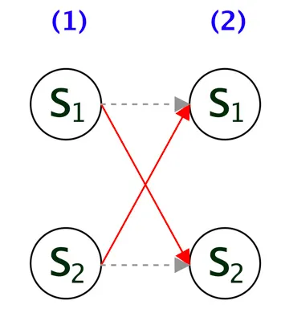
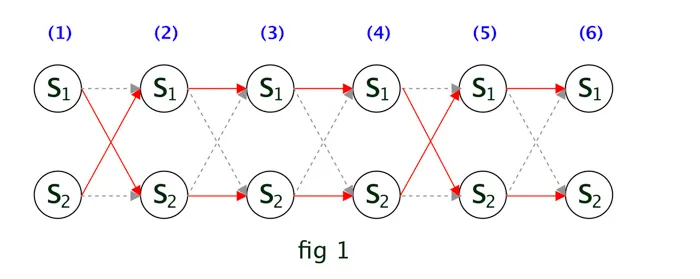
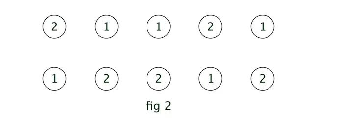
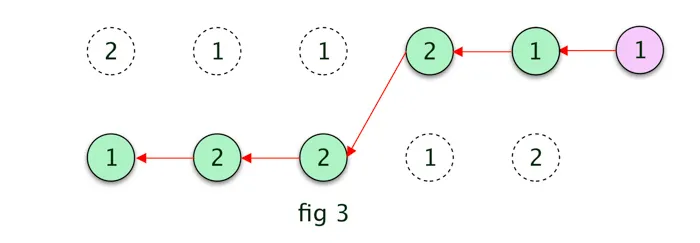
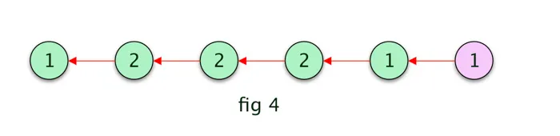

The 3rd and final problem in Hidden Markov Model is the **Decoding Problem**. In this article we will implement Viterbi Algorithm in Hidden Markov Model using Python and R. Viterbi Algorithm is dynamic programming and computationally very efficient. We will start with the formal definition of the Decoding Problem, then go through the solution and finally implement it. This is the 4th part of the Introduction to Hidden Markov Model tutorial series. This one might be the easier one to follow along.

# Quick Recap

We have learned about the three problems of HMM. We went through the **Evaluation** and **Learning** Problem in detail including implementation using Python and R in my previous article. In case you want a refresh your memories, please refer my previous articles.

# Decoding Problem

Given a sequence of visible symbol $$V^T$$ and the model ( $$ \theta \rightarrow \{ A, B \} $$ ) find the most probable sequence of hidden states $$S^T$$. 

In general we could try to find all the different scenarios of hidden states for the given sequence of visible symbols and then identify the most probable one. However, just like we have seen earlier, it will be an exponentially complex problem $$ O(N^T . T) $$ to solve.

# Viterbi Algorithm
We will be using a much more efficient algorithm named `Viterbi Algorithm `to solve the decoding problem. So far in HMM we went deep into deriving equations for all the algorithms in order to understand them clearly. However Viterbi Algorithm is best understood using an analytical example rather than equations. I will provide the mathematical definition of the algorithm first, then will work on a specific example. 

## Probabilistic View

The decoding problem is similar to the `Forward Algorithm`. In Forward Algorithm we compute the likelihood of the observation sequence, given the hidden sequences by summing over all the probabilities, however in decoding problem we need to find the `most probable` hidden state in every iteration of `t`.

The following equation represents the highest probability along a single path for first `t` observations which ends at state `i`. 

$$
\omega _i(t)= \max_{s_1,...,s_{T-1}} p(s_1,s_2....s_T=i, v_1,v_2 ... v_T | \theta)
$$

We can use the same approach as the Forward Algorithm to calculate $$ \omega _i(+1) $$

$$
\omega _i(t+1)= \max_i \Big( \omega _i(t) a_{ij} b_{jk v(t+1)} \Big)
$$

Now to find the sequence of hidden states we need to identify the state that maximizes $$ \omega _i(t) $$ at each time step `t`.

$$
\arg \max_t  \omega(t)
$$

Once we complete the above steps for all the observations, we will first find the **last hidden** state by maximum likelihood, then using `backpointer` to `backtrack` the **most likely hidden path**.

Everything what I said above may not make a lot of sense now. Go through the example below and then come back to read this part. I hope it will definitely be more easy to understand once you have the intuition.

## Example
Our example will be same one used in during programming, where we have two hidden states `A,B` and three visible symbols `1,2,3`. Assume we have a sequence of `6` visible symbols and the model $$ \theta $$. We need to predict the sequence of the hidden states for the visible symbols.

If we draw the **trellis diagram**, it will look like the `fig 1`. Note, here $$ S_1 = A$$ and  $$ S_2 = B$$.

As stated earlier, we need to find out for every time step `t` and each hidden state what will be the most probable next hidden state. 

Assume when `t = 2`, the probability of transitioning to $$ S_2(2) $$ from $$ S_1(1) $$ is higher than transitioning to $$ S_1(2) $$, so we keep track of this. This is highlighted by the red arrow from $$ S_1(1) $$ to $$ S_2(2) $$ in the below diagram. The other path is in **gray dashed line**, which is not required now.

Like wise, we repeat the same for each hidden state. In other words, assuming that at `t=1` if $$ S_2(1) $$ was the hidden state and at `t=2` the probability of transitioning to $$ S_1(2) $$ from $$ S_2(1) $$ is higher, hence its highlighted in red.



We can **repeat** the same process for all the remaining observations. The trellis diagram will look like following. 



The output of the above process is to have the **sequences of the most probable states** (1) [below diagram] and the **corresponding probabilities** (2). So as we go through finding most probable state (1) for each time step, we will have an `2x5` matrix ( in general `M x (T-1)` ) as below:



The first number `2` in above diagram indicates that current hidden step `1` (since it's in **1st row**) transitioned from previous hidden step `2`. 

Let's take one more example, the `2` in the **2nd row 2nd col** indicates that the current step `2` ( since it's in **2nd row**) transitioned from previous hidden step `2`. If you refer `fig 1`, you can see its true since at time `3`, the hidden state $$S_2$$ transisitoned from $$S_2$$ [ as per the red arrow line]

Similar to the most probable state ( at each time step ), we will have another matrix of size `2 x 6` ( in general `M x T` ) for the corresponding probabilities (2). Next we find the last step by comparing the probabilities(2) of the `T`’th step in this matrix.

Assume, in this example, the last step is `1 ( A )`, we add that to our empty path array. then we find the previous most probable hidden state by `backtracking` in the most probable states (1) matrix. Refer the below `fig 3` for the **derived most probable path**.The path could have been different if the last hidden step was `2 ( B )`.



The **final most probable path** in this case is given in the below diagram, which is similar as defined in `fig 1`.



# Code
Now lets look at the code. We will start with Python first.

## Python

The code has comments and its following same intuition from the example. One implementation trick is to use the `log scale` so that we dont get the underflow error.

```python
def viterbi(V, a, b, initial_distribution):
    T = V.shape[0]
    M = a.shape[0]

    omega = np.zeros((T, M))
    omega[0, :] = np.log(initial_distribution * b[:, V[0]])

    prev = np.zeros((T - 1, M))

    for t in range(1, T):
        for j in range(M):
            # Same as Forward Probability
            probability = omega[t - 1] + np.log(a[:, j]) + np.log(b[j, V[t]])

            # This is our most probable state given previous state at time t (1)
            prev[t - 1, j] = np.argmax(probability)

            # This is the probability of the most probable state (2)
            omega[t, j] = np.max(probability)

    # Path Array
    S = np.zeros(T)

    # Find the most probable last hidden state
    last_state = np.argmax(omega[T - 1, :])

    S[0] = last_state

    backtrack_index = 1
    for i in range(T - 2, -1, -1):
        S[backtrack_index] = prev[i, int(last_state)]
        last_state = prev[i, int(last_state)]
        backtrack_index += 1

    # Flip the path array since we were backtracking
    S = np.flip(S, axis=0)

    # Convert numeric values to actual hidden states
    result = []
    for s in S:
        if s == 0:
            result.append("A")
        else:
            result.append("B")

    return result
```
Here is the full Python Code:

```python
import pandas as pd
import numpy as np


def forward(V, a, b, initial_distribution):
    alpha = np.zeros((V.shape[0], a.shape[0]))
    alpha[0, :] = initial_distribution * b[:, V[0]]

    for t in range(1, V.shape[0]):
        for j in range(a.shape[0]):
            # Matrix Computation Steps
            #                  ((1x2) . (1x2))      *     (1)
            #                        (1)            *     (1)
            alpha[t, j] = alpha[t - 1].dot(a[:, j]) * b[j, V[t]]

    return alpha


def backward(V, a, b):
    beta = np.zeros((V.shape[0], a.shape[0]))

    # setting beta(T) = 1
    beta[V.shape[0] - 1] = np.ones((a.shape[0]))

    # Loop in backward way from T-1 to
    # Due to python indexing the actual loop will be T-2 to 0
    for t in range(V.shape[0] - 2, -1, -1):
        for j in range(a.shape[0]):
            beta[t, j] = (beta[t + 1] * b[:, V[t + 1]]).dot(a[j, :])

    return beta


def baum_welch(V, a, b, initial_distribution, n_iter=100):
    M = a.shape[0]
    T = len(V)

    for n in range(n_iter):
        alpha = forward(V, a, b, initial_distribution)
        beta = backward(V, a, b)

        xi = np.zeros((M, M, T - 1))
        for t in range(T - 1):
            denominator = np.dot(np.dot(alpha[t, :].T, a) * b[:, V[t + 1]].T, beta[t + 1, :])
            for i in range(M):
                numerator = alpha[t, i] * a[i, :] * b[:, V[t + 1]].T * beta[t + 1, :].T
                xi[i, :, t] = numerator / denominator

        gamma = np.sum(xi, axis=1)
        a = np.sum(xi, 2) / np.sum(gamma, axis=1).reshape((-1, 1))

        # Add additional T'th element in gamma
        gamma = np.hstack((gamma, np.sum(xi[:, :, T - 2], axis=0).reshape((-1, 1))))

        K = b.shape[1]
        denominator = np.sum(gamma, axis=1)
        for l in range(K):
            b[:, l] = np.sum(gamma[:, V == l], axis=1)

        b = np.divide(b, denominator.reshape((-1, 1)))

    return (a, b)


def viterbi(V, a, b, initial_distribution):
    T = V.shape[0]
    M = a.shape[0]

    omega = np.zeros((T, M))
    omega[0, :] = np.log(initial_distribution * b[:, V[0]])

    prev = np.zeros((T - 1, M))

    for t in range(1, T):
        for j in range(M):
            # Same as Forward Probability
            probability = omega[t - 1] + np.log(a[:, j]) + np.log(b[j, V[t]])

            # This is our most probable state given previous state at time t (1)
            prev[t - 1, j] = np.argmax(probability)

            # This is the probability of the most probable state (2)
            omega[t, j] = np.max(probability)

    # Path Array
    S = np.zeros(T)

    # Find the most probable last hidden state
    last_state = np.argmax(omega[T - 1, :])

    S[0] = last_state

    backtrack_index = 1
    for i in range(T - 2, -1, -1):
        S[backtrack_index] = prev[i, int(last_state)]
        last_state = prev[i, int(last_state)]
        backtrack_index += 1

    # Flip the path array since we were backtracking
    S = np.flip(S, axis=0)

    # Convert numeric values to actual hidden states
    result = []
    for s in S:
        if s == 0:
            result.append("A")
        else:
            result.append("B")

    return result


data = pd.read_csv('data_python.csv')

V = data['Visible'].values

# Transition Probabilities
a = np.ones((2, 2))
a = a / np.sum(a, axis=1)

# Emission Probabilities
b = np.array(((1, 3, 5), (2, 4, 6)))
b = b / np.sum(b, axis=1).reshape((-1, 1))

# Equal Probabilities for the initial distribution
initial_distribution = np.array((0.5, 0.5))

a, b = baum_welch(V, a, b, initial_distribution, n_iter=100)

print(viterbi(V, a, b, initial_distribution))

```

### Output
I am only having partial result here. Later we will compare this with the HMM library.

```
['B', 'B', 'A', 'A', 
... 
'A', 'A', 
'A', 'A', 'B', 'B', 'B', 'A', 
'A', 'A', 'A', 'A', 'A', 'A']
```


## R Script
The R code below does not have any comments. You can find them in the python code ( they are structurally the same )

```R
Viterbi=function(v,a,b,initial_distribution) {
  
  T = length(v)
  M = nrow(a)
  prev = matrix(0, T-1, M)
  omega = matrix(0, M, T)
  
  omega[, 1] = log(initial_distribution * b[, v[1]])
  for(t in 2:T){
    for(s in 1:M) {
      probs = omega[, t - 1] + log(a[, s]) + log(b[s, v[t]])
      prev[t - 1, s] = which.max(probs)
      omega[s, t] = max(probs)
    }
  }
  
  S = rep(0, T)
  last_state=which.max(omega[,ncol(omega)])
  S[1]=last_state
  
  j=2
  for(i in (T-1):1){
    S[j]=prev[i,last_state] 
    last_state=prev[i,last_state] 
    j=j+1
  }
  
  S[which(S==1)]='A'
  S[which(S==2)]='B'
  
  S=rev(S)
  
  return(S)
  
}
```

Full R Code:

```R
forward = function(v, a, b, initial_distribution){
  
  T = length(v)
  M = nrow(a)
  alpha = matrix(0, T, M)
  
  alpha[1, ] = initial_distribution*b[, v[1]]
  
  for(t in 2:T){
    tmp = alpha[t-1, ] %*% a
    alpha[t, ] = tmp * b[, v[t]]
  }
  return(alpha)
}

backward = function(v, a, b){
  T = length(v)
  M = nrow(a)
  beta = matrix(1, T, M)
  
  for(t in (T-1):1){
    tmp = as.matrix(beta[t+1, ] * b[, v[t+1]])
    beta[t, ] = t(a %*% tmp)
  }
  return(beta)
}


BaumWelch = function(v, a, b, initial_distribution, n.iter = 100){

  for(i in 1:n.iter){
    T = length(v)
    M = nrow(a)
    K=ncol(b)
    alpha = forward(v, a, b, initial_distribution)
    beta = backward(v, a, b)
    xi = array(0, dim=c(M, M, T-1))
    
    for(t in 1:T-1){
      denominator = ((alpha[t,] %*% a) * b[,v[t+1]]) %*% matrix(beta[t+1,]) 
      for(s in 1:M){
        numerator = alpha[t,s] * a[s,] * b[,v[t+1]] * beta[t+1,]
        xi[s,,t]=numerator/as.vector(denominator)
      }
    }
    
    
    xi.all.t = rowSums(xi, dims = 2)
    a = xi.all.t/rowSums(xi.all.t)
    
    gamma = apply(xi, c(1, 3), sum)  
    gamma = cbind(gamma, colSums(xi[, , T-1]))
    for(l in 1:K){
      b[, l] = rowSums(gamma[, which(v==l)])
    }
    b = b/rowSums(b)
    
  }
  return(list(a = a, b = b, initial_distribution = initial_distribution))
}


Viterbi=function(v,a,b,initial_distribution) {
  
  T = length(v)
  M = nrow(a)
  prev = matrix(0, T-1, M)
  omega = matrix(0, M, T)
  
  omega[, 1] = log(initial_distribution * b[, v[1]])
  for(t in 2:T){
    for(s in 1:M) {
      probs = omega[, t - 1] + log(a[, s]) + log(b[s, v[t]])
      prev[t - 1, s] = which.max(probs)
      omega[s, t] = max(probs)
    }
  }
  
  S = rep(0, T)
  last_state=which.max(omega[,ncol(omega)])
  S[1]=last_state
  
  j=2
  for(i in (T-1):1){
    S[j]=prev[i,last_state] 
    last_state=prev[i,last_state] 
    j=j+1
  }
  
  S[which(S==1)]='A'
  S[which(S==2)]='B'
  
  S=rev(S)
  
  return(S)
  
}

data = read.csv("data_r.csv")

M=2; K=3
A = matrix(1, M, M)
A = A/rowSums(A)
B = matrix(1:6, M, K)
B = B/rowSums(B)
initial_distribution = c(1/2, 1/2)

myout = BaumWelch(data$Visible, A, B, initial_distribution, n.iter = 100)
myout.hidden=Viterbi(data$Visible,myout$a,myout$b,initial_distribution)</pre> 

We can compare our output with the HMM library. Here is the result.

 
<pre class="lang:r decode:true " >library(HMM)
hmm =initHMM(c("A", "B"), c(1, 2, 3), 
              startProbs = initial_distribution,
              transProbs = A, emissionProbs = B)

true.out = baumWelch(hmm, data$Visible, maxIterations=100, pseudoCount=0)

true.viterbi = viterbi(true.out$hmm, data$Visible)
sum(true.viterbi != myout.hidden)
```

### Output

```
> sum(true.viterbi != myout.hidden)
[1] 0
>
```

# Conclusion
This "Implement Viterbi Algorithm in Hidden Markov Model using Python and R" article was the last part of the Introduction to the Hidden Markov Model tutorial series. I believe these articles will help anyone to understand HMM. Here we went through the algorithm for the sequence discrete visible symbols, the equations are little bit different for continuous visible symbols. Please post comment in case you need more clarification to any of the section. 

Do share this article if you find it useful. The full code can be found at:

<div style='text-align:center;margin-bottom:30px;'>
	<input type='button' value="Code" onclick="javascript:window.open('https://github.com/adeveloperdiary/HiddenMarkovModel/tree/master/part4','_blank')"/>
</div>

Also, here are the list of all the articles in this series:

1. [Introduction to Hidden Markov Model](https://adeveloperdiary.github.io/posts/machine%20learning/algorithm/introduction-to-hidden-markov-model/)
2. [Forward and Backward Algorithm in Hidden Markov Model](#)
3. [Derivation and implementation of Baum Welch Algorithm for Hidden Markov Model](#)
4. Implement Viterbi Algorithm in Hidden Markov Model using Python and R

