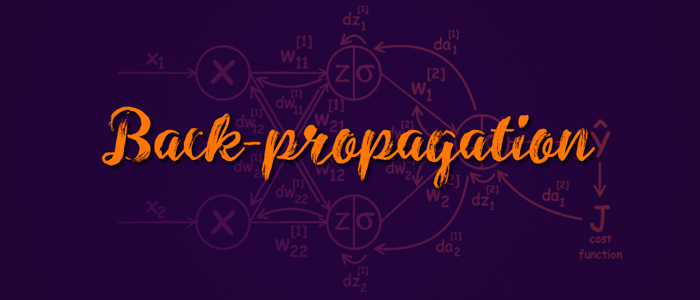
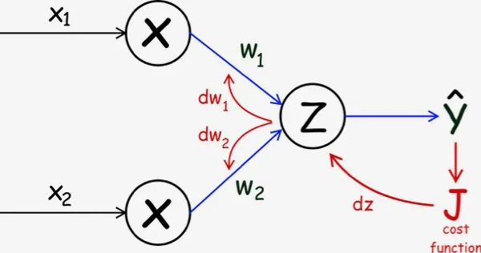
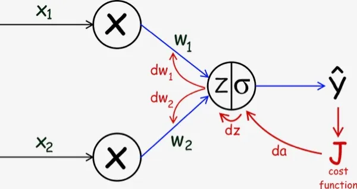
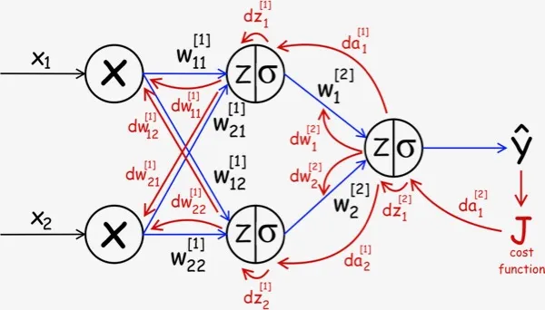
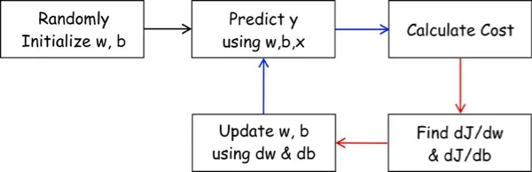
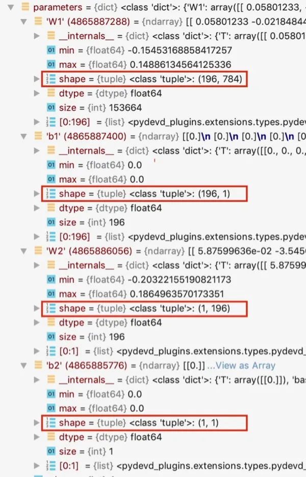
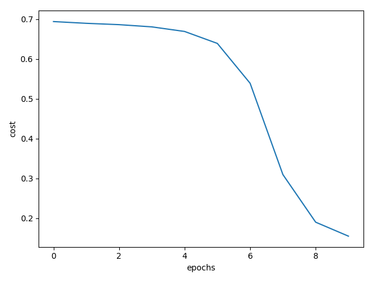

It’s very important have clear understanding on how to implement a simple Neural Network from scratch. In this Understand and Implement the Backpropagation Algorithm From Scratch In Python tutorial we go through step by step process of understanding and implementing a Neural Network. We will start from Linear Regression and use the same concept to build a 2-Layer Neural Network.Then we will code a N-Layer Neural Network using python from scratch.As prerequisite, you need to have basic understanding of Linear/Logistic Regression with Gradient Descent.

Let’s see how we can slowly move towards building our first neural network.

# Linear Regression

Here we have represented Linear Regression using graphical format (Bias `b` is not shown). As you see in the below diagram, we have two input features ( $$ x_1, x_2$$ ). `Z` represents the linear combination of the vectors `w`. The node with `Z` can also be named as hidden unit, since `X` &amp; `Y` are visible ( for training ) and `Z` is something defined inside the model.



We can write the equation for predicting values using above linear regression as (this is shown using blue arrow),
$$
\hat{y}= z = b+x_1w_1+x_2w_2
$$

So in order to find the best `w`, we need to first define the cost function `J`.To use gradient descent, take derivative of the cost function `J` w.r.t `w` and `b`, then update `w` and `b` by a fraction (learning rate) of `dw` and `db` until convergence (this is shown using red arrow).
We can write `dw` and `db` as follows ( using chain rule ). 

$$
\begin{align}
\frac{dJ}{dW}=\frac{dJ}{dZ}\frac{dZ}{dW} \\
\frac{dJ}{db}=\frac{dJ}{dZ}\frac{dZ}{db}
\end{align}
$$

And the gradient descent equation for updating `w` and `b` are,

$$
\begin{align}
W=: W-\alpha \frac{dJ}{dW} \\
b=: b-\alpha \frac{dJ}{db} 
\end{align}
$$

In summary, first we predict the $$ \hat{y}$$, then using this we calculate the cost, after that using gradient descent we adjust the parameters of the model. This happens in a loop and eventually we learn the best parameters (`w` and `b` ) to be used in prediction. The above picture depicts the same.

# Logistic Regression 
Here we will try to represent Logistic Regression in the same way. Mathematically Logistic regression is different than Linear Regression in two following ways:

- Logistic Regression has a different Cost Function `J`
- Apply a non-linear transformation (Sigmoid) on `Z` to predict probability of class label ( Binary Classification )

As you see in the below diagram the blue arrow indicates the Forward Propagation. 



Here are the steps of Forward Propagation in Logistic Regression. ( Matrix Format )

$$
\begin{align}
Z=W^TX+b \\
\hat{y}= A = \sigma(Z)
\end{align}
$$

The Gradient Descent ( a.k.a Backpropagation ) in Logistic Regression has an additional derivative to calculate. 

$$
\begin{align}
\frac{dJ}{dW}=\frac{dJ}{dA}\frac{dA}{dZ}\frac{dZ}{dW} \\
\frac{dJ}{db}=\frac{dJ}{dA}\frac{dA}{dZ}\frac{dZ}{db}
\end{align}
$$

The gradient descent equation for updating `w` and `b` will be exactly same as Linear Regression (They are same for Neural Network too),

$$
\begin{align}
W=: W-\alpha \frac{dJ}{dW} \\
b=: b-\alpha \frac{dJ}{db} 
\end{align}
$$

The process flow diagram is exactly the same for Logistic Regression too.

We can say that Logistic Regression is a 1-Layer Neural Network. Now we will extend the idea to a 2-Layer Neural Network.

# 2-Layer Neural Network
Extend the same concept to a 2-Layer Neural Network. Refer the below diagram ( bias term is not displayed ). There are some minor notation changes, such as, the super-script now denotes the layer number. We have added two more hidden units to our model. The vector `W` will have different dimension for each hidden layer. 

In case you are new to Neural Network, imagine that the output of the first layer used as input to the next layer. Earlier in case of Logistic Regression we didn’t have multiple layers. These intermediate hidden layers provides a way to solve complex tasks (a.k.a non-linearity).



We can write the forward propagation in two steps as (Consider uppercase letters as Matrix).

$$
\begin{align}
Z^{[1]}=& W^{[1]}X+b^{[1]} \\
A^{[1]}=& \sigma(Z^{[1]}) \\
Z^{[2]}=& W^{[2]}A^{[1]}+b^{[2]} \\
\hat{y}=& A^{[2]}=\sigma(Z^{[2]})
\end{align}
$$

Again, just like Linear and Logistic Regression gradient descent can be used to find the best `W` and `b`. The approach is basically same :

## Define a cost function
Take derivative `(dw, db)` of the cost function `J` w.r.t `w` and `b`. 
Update `w` and `b` using `dw`, `db`.

The back propagation has been shown in the above diagram using the red arrows. Let’s find the `dw` and `db` using chain rule. This might look complicated, however if you just follow the arrows can you can then easily correlate them with the equation.

$$
\begin{align}
dW^{[2]}=&\frac{dJ}{dW^{[2]}}=\frac{dJ}{dA^{[2]}}\frac{dA^{[2]}}{dZ^{[2]}}\frac{dZ^{[2]}}{dW^{[2]}}\\
db^{[2]}=&\frac{dJ}{db^{[2]}}=\frac{dJ}{dA^{[2]}}\frac{dA^{[2]}}{dZ^{[2]}}\frac{dZ^{[2]}}{db^{[2]}}\\
dW^{[1]}=&\frac{dJ}{dW^{[2]}}=\frac{dJ}{dA^{[2]}}\frac{dA^{[2]}}{dZ^{[2]}}\frac{dZ^{[2]}}{dA^{[1]}}\frac{dA^{[1]}}{dZ^{[1]}}\frac{dZ^{[1]}}{dW^{[1]}}\\
db^{[1]}=&\frac{dJ}{dW^{[2]}}=\frac{dJ}{dA^{[2]}}\frac{dA^{[2]}}{dZ^{[2]}}\frac{dZ^{[2]}}{dA^{[1]}}\frac{dA^{[1]}}{dZ^{[1]}}\frac{dZ^{[1]}}{db^{[1]}}
\end{align}
$$

Finally, we will update `w` and as following, ( same as other algorithms)

$$
\begin{align}
W^{[1]}=: W^{[1]}-\alpha \frac{dJ}{dW^{[1]}} \\
b^{[1]}=: b^{[1]}-\alpha \frac{dJ}{db^{[1]}} \\
W^{[2]}=: W^{[2]}-\alpha \frac{dJ}{dW^{[2]}} \\
b^{[2]}=: b^{[2]}-\alpha \frac{dJ}{db^{[2]}} 
\end{align}
$$

As you see, technically the steps are same for Linear Regression, Logistic Regression and Neural Network.



In Artificial Neural Network the steps towards the direction of blue arrows is named as Forward Propagation and the steps towards the red arrows as Back-Propagation. 

## Backpropagation
One major disadvantage of Backpropagation is computation complexity. Just for 2 layer Neural Network with 2 hidden unit in layer one, we already have pretty complex equation to solve. Imagine the computation complexity for a network having 100's of layers and 1000’s of hidden units in each layer. In order to solve this problem we can use  **dynamic programming**. 

The high level idea is to express the derivation of $$dw^{[l]}$$ ( where `l` is the current layer) using the already calculated values ( $$dA^{[l+1]} , dZ^{[l+1]} etc $$ ) of layer `l+1`. In nutshell, this is named as Backpropagation Algorithm.

We will derive the Backpropagation algorithm for a 2-Layer Network and then will generalize for N-Layer Network.

### Derivation of 2-Layer Neural Network
For simplicity propose, let's assume our 2-Layer Network only does binary classification. So the final Hidden Layer will be using a `Sigmoid Activation` function and our Cost function will be simply the `Binary Cross Entropy Error Function` used in Logistic Regression. The Activation function of the remaining hidden layer can be anything.

### Why the above assumptions are important
Since the Backpropagation starts from taking derivative of the cost/error function, the derivation will be different if we are using a different activation function such as `Softmax` (at the final hidden layer only). Softmax can be used for MultiClass Classification, I will have a separate post for that. 

I will be referring the diagram above, which I drew to show the Forward and Backpropagation of the 2-Layer Network. So that you don’t have to scroll up and down, I am having the same diagram here again.


Our first objective is to find $$ \frac{dJ}{dW^{[2]}}  $$ where `J` is the cost function and $$ W^{[2]} $$ is a matrix of all the weights in the final layer. Using partial derivates we can define the following ( follow the path (red color) of the Backpropagation in the picture above if you are confused )

$$
\frac{dJ}{dW^{[2]}} = \frac{dJ}{dA^{[2]}}\frac{dA^{[2]}}{dZ^{[2]}}\frac{dZ^{[2]}}{dW^{[2]}}
$$

Our `Cross Entropy Error Function` for binary classification is :

$$
J= - \frac{1}{n} \bigg(  Ylog \left ( A^{[2]} \right ) - \left ( 1-Y  \right )log \left  ( 1 - A^{[2]} \right ) \bigg)
$$

Remember, in the above equation $$ a^{[2]} $$ is nothing but $$ \hat{y} $$

Now we can define our $$ \frac{dJ}{dW^{[2]}}  $$ as,

$$
\frac{dJ}{dW^{[2]}} = \Bigg[  -\frac{Y}{A^{[2]}}  + \frac{1-Y}{1- A^{[2]}} \Bigg] \Bigg[  A^{[2]} (1- A^{[2]})\Bigg] \Bigg[ A^{[2]}\Bigg]
$$

Let’s take a minute and understand what just happened here. The 1st part is the derivative of the Cost Function. As long as you know the derivate of log, you can see how this makes sense. ( I have omitted the `1/n` factor here, we will ignore that for now, however during coding we will make sure to divide the result by `n` )

The 2nd part is the derivative of the `Sigmoid activation` function. Again, you can derive it by yourself just by knowing the derivate of $$ e^x $$ w.r.t `x`.

We already know  $$ Z^{[2]}$$ from our forward propagation, 
$$
 Z^{[2]} =  W^{[2]} A^{[1]} + b^{[2]}
$$

The derivative of the above  $$ Z^{[2]}$$ w.r.t $$ W^{[2]} $$ will simply be $$ A^{[1]} $$.

Simplifying the equation, we get

$$
\require{cancel}
\begin{align}
\frac{dJ}{dW^{[2]}} &= \Bigg[  -Y + \cancel{YA^{[2]}} +  A^{[2]} - \cancel{YA^{[2]}} \Bigg] \Bigg[ A^{[1]}\Bigg] \\
&=\Bigg[ A^{[2]} - Y\Bigg] \Bigg[ A^{[1]}\Bigg] \\
&= dZ^{[2]} A^{[1]} 
\end{align}
$$

Just note that, (we will use this later)
$$
dZ^{[2]} = \frac{dJ}{dZ^{[2]}} =  \frac{dJ}{dA^{[2]}}\frac{dA^{[2]}}{dZ^{[2]}} = \Bigg[ A^{[2]} - Y\Bigg]
$$

Similarly we can define $$ \frac{dJ}{db^{[2]}}  $$ as,

$$
\begin{align}
\frac{dJ}{db^{[2]}} &= \frac{dJ}{dA^{[2]}}\frac{dA^{[2]}}{dZ^{[2]}}\frac{dZ^{[2]}}{db^{[2]}} \\
&=\Bigg[ A^{[2]} - Y\Bigg] \Bigg[ 1 \Bigg] \\
&=\Bigg[ A^{[2]} - Y\Bigg] \\
&=dZ^{[2]}
\end{align}
$$

We will now move to the first layer, (following the red arrows in the picture)

$$
\begin{align}
\frac{dJ}{dW^{[1]}} &= \frac{dJ}{dA^{[2]}}\frac{dA^{[2]}}{dZ^{[2]}}\frac{dZ^{[2]}}{dA^{[1]}} \frac{dA^{[1]}}{dZ^{[1]}}\frac{dZ^{[1]}}{dW^{[1]}}\\
&= \frac{dJ}{dZ^{[2]}}\frac{dZ^{[2]}}{dA^{[1]}} \frac{dA^{[1]}}{dZ^{[1]}}\frac{dZ^{[1]}}{dW^{[1]}}\\
&= \Bigg[ A^{[2]} - Y\Bigg] \Bigg[ W^{[2]} \Bigg] \Bigg[ g'{\left ( Z^{[1]} \right )} \Bigg] \Bigg[ A^{[0]}\Bigg]  \\
&= dZ^{[2]} W^{[2]} g'{\left ( Z^{[1]} \right )} A^{[0]} \\
& = dZ^{[1]} A^{[0]}
\end{align}
$$

There are few points to note. 
- First is reusability, the whole objective of dynamic programming is how to reuse already computed values in future computation. Thats the reason we are reusing $$ dZ^{[2]} $$.
- $$A^{[0]}$$ here is nothing but our input X, however if you have more than 2 hidden layer, it will just be the activation output of the previous later.
- We can generalize this by equation for any layer except for the final hidden layer (The final layer equation depends on the Activaition of that layer).

Also need the following,
$$
\begin{align}
\frac{dJ}{dA^{[1]}} &= \frac{dJ}{dA^{[2]}}\frac{dA^{[2]}}{dZ^{[2]}}\frac{dZ^{[2]}}{dA^{[1]}} \\
&= \frac{dJ}{dZ^{[2]}}W^{[2]} \\
&= dZ^{[2]}W^{[2]}
\end{align}
$$

Same for $$ db^{[1]} $$

$$
\begin{align}
\frac{dJ}{db^{[1]}} &= \frac{dJ}{dA^{[2]}}\frac{dA^{[2]}}{dZ^{[2]}}\frac{dZ^{[2]}}{dA^{[1]}} \frac{dA^{[1]}}{dZ^{[1]}}\frac{dZ^{[1]}}{db^{[1]}}\\
&= \frac{dJ}{dZ^{[2]}}\frac{dZ^{[2]}}{dA^{[1]}} \frac{dA^{[1]}}{dZ^{[1]}}\frac{dZ^{[1]}}{db^{[1]}}\\
&= \Bigg[ A^{[2]} - Y\Bigg] \Bigg[ W^{[2]} \Bigg] \Bigg[ g'{\left ( Z^{[1]} \right )} \Bigg] \Bigg[ 1\Bigg]  \\
&= dZ^{[2]} W^{[2]} g'{\left ( Z^{[1]} \right )} \\
& = dZ^{[1]}
\end{align}
$$

Since we have the required derivatives, $$ dW^{[2]}, db^{[2]}, dW^{[1]}, db^{[1]}$$, it's time that we define the full algorithm.

### N-Layer Neural Network Algorithm
We will now define the full algorithm of a N-Layer Neural Network Algorithm by generalizing the equations we have derived for our 2-Layer Network.

$$
\begin{align}
& \bullet \text{Initialize } W^{[1]} .. W^{[L]}, b^{[1]} ... b^{[L]} \\
& \bullet \text{Set } A^{[0]} = X \text{ ( Input ) }, L = \text{Total Layers}  \\
& \bullet \text{Loop } \text{epoch} = 1 \text{ to } \text{ max iteration } \\
& \rule{1cm}{0pt} \bullet \text{Forward Propagation} \\
& \rule{2cm}{0pt} \bullet \text{Loop } l=1 \text{ to } L-1 \\
& \rule{3cm}{0pt} \bullet Z^{[l]} = W^{[l]}A^{[l-1]}+b^{[l]} \\
& \rule{3cm}{0pt} \bullet A^{[l]} = g \left (  b^{[l]} \right )  \\
& \rule{3cm}{0pt} \bullet \text{Save }  A^{[l]},W^{[l]} \text{ in memory for later use } \\
& \rule{2cm}{0pt} \bullet Z^{[L]} = W^{[L]}A^{[L-1]}+b^{[L]} \\
& \rule{2cm}{0pt} \bullet A^{[L]} = \sigma \left (  Z^{[L]} \right )  \\
& \rule{1cm}{0pt} \bullet \text{Cost } J= - \frac{1}{n} \bigg(  Ylog \left ( A^{[2]} \right ) - \left ( 1-Y  \right )log \left  ( 1 - A^{[2]} \right ) \bigg)\\
& \rule{1cm}{0pt} \bullet \text{Backward Propagation} \\
& \rule{2cm}{0pt} \bullet dA^{[L]} = -\frac{Y}{A^{[L]}}  + \frac{1-Y}{1- A^{[L]}} \\
& \rule{2cm}{0pt} \bullet dZ^{[L]} = dA^{[L]} \sigma'\left ( dA^{[L]} \right )  \\
& \rule{2cm}{0pt} \bullet dW^{[L]} = dZ^{[L]} dA^{[L-1]} \\
& \rule{2cm}{0pt} \bullet db^{[L]} = dZ^{[L]} \\
& \rule{2cm}{0pt} \bullet dA^{[L-1]} = dZ^{[L]} W^{[L]} \\
& \rule{2cm}{0pt} \bullet \text{Loop } l=L-1 \text{ to } 1 \\
& \rule{3cm}{0pt} \bullet dZ^{[l]} = dA^{[l]} g'\left ( dA^{[l]} \right )  \\
& \rule{3cm}{0pt} \bullet dW^{[l]} = dZ^{[l]} dA^{[l-1]} \\
& \rule{3cm}{0pt} \bullet db^{[l]} = dZ^{[l]} \\
& \rule{3cm}{0pt} \bullet dA^{[l-1]} = dZ^{[l]} W^{[l]} \\
& \rule{1cm}{0pt} \bullet \text{Update W and b}  \\
& \rule{2cm}{0pt} \bullet \text{Loop } l=1 \text{ to } L \\ 
& \rule{3cm}{0pt} \bullet W^{[l]} =W^{[l]} -\alpha . dW^{[l]} \\
& \rule{3cm}{0pt} \bullet b^{[l]} =b^{[l]} -\alpha . db^{[l]}
\end{align}
$$

The algorithm above is easy to understand. Just the generalized version of our previous derivation. Feel fee to ask me question in the comments section in case you have any doubt.

### Python Implementation
At this point technically we can directly jump into the code, however you will surely have issues with matrix dimension. Hence, let’s make sure that we fully understand the matrix dimensions before coding. Once you do this coding should be very simple.

We will use MNIST dataset for our implementation.( You can google in case you are hearing about this dataset to know more about it. )  
 MNIST has `6000` `28x28` dimension gray scale image as training and total 10 different class, however since we will be focusing on binary classification here, we will choose all images with label 5 and 8 (Total `11272`). We will write a function which will return the data we need.

Each pixel will be a feature for us, so we will first flatten each image to `28x28 = 784` vector. The input dimension will be `11272 X 784`.

In our Neural Network we will have total 2 layers, so it will be like `784 (input Layer)->196->1`.

### Forward Propagation - Layer 1
$$
\begin{align}
X &= \left ( 11272,784 \right ) \\
W^{[1]} &=\left ( 196, 784 \right ) \\
b^{[1]} &=\left ( 196, 1 \right ) \\
A^{[0]} &= X^T\\
&=\left ( 784,11272 \right ) \\
Z^{[1]} &=W^{[1]}A^{[0]}+b^{[1]} \\
&= \left ( 196,784 \right ) * \left ( 784,11272  \right ) + \left ( 196, 1 \right ) \\
&= \left ( 196,11272  \right ) + \left ( 196, 1 \right ) \\
&= \left ( 196,11272  \right ) \\
A^{[1]} &=g\left ( Z^{[1]} \right ) \\
&=\left ( 196,11272  \right ) \\
\end{align}
$$

### Forward Propagation - Layer 2
$$
\begin{align}
W^{[2]} &=\left ( 1, 196 \right ) \\
b^{[2]} &=\left ( 1, 1 \right ) \\
Z^{[2]} &=W^{[2]}A^{[1]}+b^{[2]} \\
&= \left ( 1, 196 \right ) * \left ( 196,11272  \right ) + \left ( 1, 1 \right ) \\
&= \left ( 1,11272  \right ) + \left ( 1, 1 \right ) \\
&= \left ( 1,11272  \right ) \\
A^{[2]} &=g\left ( Z^{[2]} \right ) \\
&=\left ( 1,11272  \right ) \\
\end{align}
$$

### Backward Propagation - Layer 2
$$
\begin{align}
Y^T &= \left ( 1, 11272 \right ) \\
dA^{[2]} &=-\frac{Y^T}{A^{[2]}}  + \frac{1-Y^T}{1- A^{[2]}} \\
&=\left ( 1, 11272 \right ) \\
dZ^{[2]} &=dA^{[2]} g'(Z^{[2]}) \\
&= \left ( 1, 11272 \right ) * \left ( 1, 11272 \right )\\
&= \left ( 1, 11272 \right )\\
dW^{[2]} &=dZ^{[2]} \left (  A^{[1]} \right )^T  \\
&=\left ( 1, 11272 \right ) * \left ( 11272,196  \right ) \\
&= \left ( 1, 196 \right )\\ 
db^{[2]} &=dZ^{[2]}  \\
&= \left ( 1, 1 \right )\\ 
dA^{[1]} &= \left (  W^{[2]} \right )^T   dZ^{[2]} \\
&=\left ( 196,1  \right ) * \left ( 1, 11272 \right )\\  
&=\left ( 196, 11272 \right )\\  
\end{align}
$$

### Backward Propagation - Layer 1
$$
\begin{align}
dZ^{[1]} &=dA^{[1]} g'(Z^{[1]}) \\
&= \left ( 196, 11272 \right ) * \left ( 196,11272  \right )\\
&= \left ( 196, 11272 \right )\\
dW^{[1]} &=dZ^{[1]} \left (  A^{[0]} \right )^T  \\
&=\left ( 196, 11272 \right ) * \left ( 11272, 784  \right ) \\
&= \left ( 196, 784\right )\\ 
db^{[1]} &=dZ^{[1]}  \\
&= \left ( 196, 1 \right )\\ 
\end{align}
$$

Two important points:
- I haven’t fully explained the calculation for `b` above. We need need to sum over all the rows to make sure the dimension of $$b^{[l]}$$ and $$db^{[l]}$$ matches. We will use numpy’s `axis=1` and `keepdims=True` option for this.
- We have completely ignore the divide by `n` calculation (It was part of our cost function). So as a practice, whenever we are calculating the derivative of `W` and `b`, we will divide the result by `n`.

We will be using a python library to load the MNIST data. It just helps us to focus on the algorithm. You can install it by running following command.

```python
pip install python-mnist
```

We will create a class named ANN and have the following methods defined there.

```python
ann = ANN(layers_dims)
ann.fit(train_x, train_y, learning_rate=0.1, n_iterations=1000)
ann.predict(train_x, train_y)
ann.predict(test_x, test_y)
ann.plot_cost()
	
```

We will get the data then preprocess it and invoke our ANN class.Our main will look like this. Also we should be able to pass the number of layers we need in our model. We dont want to fix the number of layers, rather want to pass that as an array to our ANN class.

```python
if __name__ == '__main__':
    train_x, train_y, test_x, test_y = get_binary_dataset()

    train_x, test_x = pre_process_data(train_x, test_x)

    print("train_x's shape: " + str(train_x.shape))
    print("test_x's shape: " + str(test_x.shape))

    layers_dims = [196, 1]

    ann = ANN(layers_dims)
    ann.fit(train_x, train_y, learning_rate=0.1, n_iterations=1000)
    ann.predict(train_x, train_y)
    ann.predict(test_x, test_y)
    ann.plot_cost()
```

The `get_binary_dataset()` function above will provide the Train and Test data. The dimension of the data will be as we have seen above. In the `pre_process_data()` function we will just normalize the data.

```python
def pre_process_data(train_x, test_x):
    # Normalize
    train_x = train_x / 255.
    test_x = test_x / 255.

    return train_x, test_x
```

Below is the constructor of the ANN class. Here the layer size will be passed as an array.The `self.parameters` will be a dictonary object where we keep all the `W` and `b`. 

```python    
def __init__(self, layers_size):
	self.layers_size = layers_size
	self.parameters = {}
	self.L = len(self.layers_size)
	self.n = 0
	self.costs = []
```

The `fit()` function will first call initialize_parameters() to create all the necessary `W` and `b` for each layer.Then we will have the training running in `n_iterations` times. Inside the loop first call the `forward()` function. Then calculate the cost and call the `backward()` function. Afterwards, we will update the `W` and `b` for all the layers. 

```python   
def fit(self, X, Y, learning_rate=0.01, n_iterations=2500):
	np.random.seed(1)

	self.n = X.shape[0]

	self.layers_size.insert(0, X.shape[1])

	self.initialize_parameters()
	for loop in range(n_iterations):
		A, store = self.forward(X)
		cost = np.squeeze(-(Y.dot(np.log(A.T)) + (1 - Y).dot(np.log(1 - A.T))) / self.n)
		derivatives = self.backward(X, Y, store)

		for l in range(1, self.L + 1):
			self.parameters["W" + str(l)] = self.parameters["W" + str(l)] - learning_rate * derivatives[
				"dW" + str(l)]
			self.parameters["b" + str(l)] = self.parameters["b" + str(l)] - learning_rate * derivatives[
				"db" + str(l)]

		if loop % 100 == 0:
			print(cost)
			self.costs.append(cost)
```

Since the `W1` parameter needs the number of features present in the training data, we will insert that in the `layers_size` array before invoking `initialize_parameters()`

In the `initialize_parameters()` function we loop through the `layers_size` array and store the parameters in the `self.parameters` dictionary.

```python    
def initialize_parameters(self):
	np.random.seed(1)

	for l in range(1, len(self.layers_size)):
		self.parameters["W" + str(l)] = np.random.randn(self.layers_size[l], self.layers_size[l - 1]) / np.sqrt(
			self.layers_size[l - 1])
		self.parameters["b" + str(l)] = np.zeros((self.layers_size[l], 1))
```

Once you run the code the `self.parameters` variable will look like this:



The `forward()` function is very easy to understand. Even though we are using `Sigmoid Activation` function in all the layers, we will have the calculation for the final layer outside of the loop so that we can easily plugin a `Softmax` function there (Softmax is not covered in this tutorial).  

We will also create a new `store` dictionary object and keep the `A`,`W` and `Z` for each layer so that we can use them during backpropagation.

```python    
def forward(self, X):
	store = {}

	A = X.T
	for l in range(self.L - 1):
		Z = self.parameters["W" + str(l + 1)].dot(A) + self.parameters["b" + str(l + 1)]
		A = self.sigmoid(Z)
		store["A" + str(l + 1)] = A
		store["W" + str(l + 1)] = self.parameters["W" + str(l + 1)]
		store["Z" + str(l + 1)] = Z

	Z = self.parameters["W" + str(self.L)].dot(A) + self.parameters["b" + str(self.L)]
	A = self.sigmoid(Z)
	store["A" + str(self.L)] = A
	store["W" + str(self.L)] = self.parameters["W" + str(self.L)]
	store["Z" + str(self.L)] = Z

	return A, store
```

Above in line 18, returned value `A` is basically the $$ \hat{y}$$. 

In the `backward()` function like we have in the derivation, first calculate the `dA`,`dW`,`db` for the `L'th` layer and then in the loop find all the derivatives for remaining layers.

The below code is the same as the derivations we went through earlier. We keep all the derivatives in the `derivatives` dictionary and return that to the `fit()` function.

```python    
def backward(self, X, Y, store):

	derivatives = {}

	store["A0"] = X.T

	A = store["A" + str(self.L)]
	dA = -np.divide(Y, A) + np.divide(1 - Y, 1 - A)

	dZ = dA * self.sigmoid_derivative(store["Z" + str(self.L)])
	dW = dZ.dot(store["A" + str(self.L - 1)].T) / self.n
	db = np.sum(dZ, axis=1, keepdims=True) / self.n
	dAPrev = store["W" + str(self.L)].T.dot(dZ)

	derivatives["dW" + str(self.L)] = dW
	derivatives["db" + str(self.L)] = db

	for l in range(self.L - 1, 0, -1):
		dZ = dAPrev * self.sigmoid_derivative(store["Z" + str(l)])
		dW = 1. / self.n * dZ.dot(store["A" + str(l - 1)].T)
		db = 1. / self.n * np.sum(dZ, axis=1, keepdims=True)
		if l &gt; 1:
			dAPrev = store["W" + str(l)].T.dot(dZ)

		derivatives["dW" + str(l)] = dW
		derivatives["db" + str(l)] = db

	return derivatives
```

Here is the code for the `sigmoid()` and `sigmoid_derivative()` function. In a later tutorial we will see how to use `ReLu` and `Softmax`.

```python 
def sigmoid(self, Z):
    return 1 / (1 + np.exp(-Z))

def sigmoid_derivative(self, Z):
    s = 1 / (1 + np.exp(-Z))
    return s * (1 - s)
```

In the `predict()` function we wil just use the current `W` and `b` and compute the probability usimng `forward()` function. Then we will convert the probability to a predicted class 0 or 1. 

```python    
def predict(self, X, Y):
	A, cache = self.forward(X)
	n = X.shape[0]
	p = np.zeros((1, n))

	for i in range(0, A.shape[1]):
		if A[0, i] &gt; 0.5:
			p[0, i] = 1
		else:
			p[0, i] = 0

	print("Accuracy: " + str(np.sum((p == Y) / n)))
```

Let's look at the outout. You will get around 96% Train and Test Accuracy.

```
train_x's shape: (11272, 784)
test_x's shape: (1866, 784)
0.7043777294167167
0.3094035971595143
0.19106252272122817
0.15772416612846746
0.14255528419489316
0.1336554279807337
0.12762011948747812
0.12313725638495653
0.11959735842488138
0.11667822494436252
Accuracy: 0.9599893541518808
Accuracy: 0.9598070739549842
```

The cost gradually does down as we run multiple iteration.


The best part of writing the code in a generic way is we can easily try using different layer size. Let's try the following:

```python
layers_dims = [392,196,98,1]
```

Here is the result.

```
train_x's shape: (11272, 784)
test_x's shape: (1866, 784)
0.6941917096801075
0.689779337934555
0.6864347273157968
0.680851445965145
0.6693297859482221
0.6392888056143693
0.5391389182596976
0.30972952941407295
0.1900953225522053
0.15499153620779857
Accuracy: 0.9491660752306601
Accuracy: 0.9555198285101825
```



Naturally, with the same data, iteration and learning rate the larger Network is performing poorly than the smaller one. If you were expecting a different result then let me know in the comment section and we can discuss about it.

Below is the full code of the ANN class:


```python
import numpy as np
import datasets.mnist.loader as mnist
import matplotlib.pylab as plt

class ANN:
    def __init__(self, layers_size):
        self.layers_size = layers_size
        self.parameters = {}
        self.L = len(self.layers_size)
        self.n = 0
        self.costs = []

    def sigmoid(self, Z):
        return 1 / (1 + np.exp(-Z))

    def initialize_parameters(self):
        np.random.seed(1)

        for l in range(1, len(self.layers_size)):
            self.parameters["W" + str(l)] = np.random.randn(self.layers_size[l], self.layers_size[l - 1]) / np.sqrt(
                self.layers_size[l - 1])
            self.parameters["b" + str(l)] = np.zeros((self.layers_size[l], 1))

    def forward(self, X):
        store = {}

        A = X.T
        for l in range(self.L - 1):
            Z = self.parameters["W" + str(l + 1)].dot(A) + self.parameters["b" + str(l + 1)]
            A = self.sigmoid(Z)
            store["A" + str(l + 1)] = A
            store["W" + str(l + 1)] = self.parameters["W" + str(l + 1)]
            store["Z" + str(l + 1)] = Z

        Z = self.parameters["W" + str(self.L)].dot(A) + self.parameters["b" + str(self.L)]
        A = self.sigmoid(Z)
        store["A" + str(self.L)] = A
        store["W" + str(self.L)] = self.parameters["W" + str(self.L)]
        store["Z" + str(self.L)] = Z

        return A, store

    def sigmoid_derivative(self, Z):
        s = 1 / (1 + np.exp(-Z))
        return s * (1 - s)

    def backward(self, X, Y, store):

        derivatives = {}

        store["A0"] = X.T

        A = store["A" + str(self.L)]
        dA = -np.divide(Y, A) + np.divide(1 - Y, 1 - A)

        dZ = dA * self.sigmoid_derivative(store["Z" + str(self.L)])
        dW = dZ.dot(store["A" + str(self.L - 1)].T) / self.n
        db = np.sum(dZ, axis=1, keepdims=True) / self.n
        dAPrev = store["W" + str(self.L)].T.dot(dZ)

        derivatives["dW" + str(self.L)] = dW
        derivatives["db" + str(self.L)] = db

        for l in range(self.L - 1, 0, -1):
            dZ = dAPrev * self.sigmoid_derivative(store["Z" + str(l)])
            dW = 1. / self.n * dZ.dot(store["A" + str(l - 1)].T)
            db = 1. / self.n * np.sum(dZ, axis=1, keepdims=True)
            if l &gt; 1:
                dAPrev = store["W" + str(l)].T.dot(dZ)

            derivatives["dW" + str(l)] = dW
            derivatives["db" + str(l)] = db

        return derivatives

    def fit(self, X, Y, learning_rate=0.01, n_iterations=2500):
        np.random.seed(1)

        self.n = X.shape[0]

        self.layers_size.insert(0, X.shape[1])

        self.initialize_parameters()
        for loop in range(n_iterations):
            A, store = self.forward(X)
            cost = np.squeeze(-(Y.dot(np.log(A.T)) + (1 - Y).dot(np.log(1 - A.T))) / self.n)
            derivatives = self.backward(X, Y, store)

            for l in range(1, self.L + 1):
                self.parameters["W" + str(l)] = self.parameters["W" + str(l)] - learning_rate * derivatives[
                    "dW" + str(l)]
                self.parameters["b" + str(l)] = self.parameters["b" + str(l)] - learning_rate * derivatives[
                    "db" + str(l)]

            if loop % 100 == 0:
                print(cost)
                self.costs.append(cost)

    def predict(self, X, Y):
        A, cache = self.forward(X)
        n = X.shape[0]
        p = np.zeros((1, n))

        for i in range(0, A.shape[1]):
            if A[0, i] &gt; 0.5:
                p[0, i] = 1
            else:
                p[0, i] = 0

        print("Accuracy: " + str(np.sum((p == Y) / n)))

    def plot_cost(self):
        plt.figure()
        plt.plot(np.arange(len(self.costs)), self.costs)
        plt.xlabel("epochs")
        plt.ylabel("cost")
        plt.show()


def get_binary_dataset():
    train_x_orig, train_y_orig, test_x_orig, test_y_orig = mnist.get_data()

    index_5 = np.where(train_y_orig == 5)
    index_8 = np.where(train_y_orig == 8)

    index = np.concatenate([index_5[0], index_8[0]])
    np.random.seed(1)
    np.random.shuffle(index)

    train_y = train_y_orig[index]
    train_x = train_x_orig[index]

    train_y[np.where(train_y == 5)] = 0
    train_y[np.where(train_y == 8)] = 1

    index_5 = np.where(test_y_orig == 5)
    index_8 = np.where(test_y_orig == 8)

    index = np.concatenate([index_5[0], index_8[0]])
    np.random.shuffle(index)

    test_y = test_y_orig[index]
    test_x = test_x_orig[index]

    test_y[np.where(test_y == 5)] = 0
    test_y[np.where(test_y == 8)] = 1

    return train_x, train_y, test_x, test_y

def pre_process_data(train_x, test_x):
    # Normalize
    train_x = train_x / 255.
    test_x = test_x / 255.

    return train_x, test_x


if __name__ == '__main__':
    train_x, train_y, test_x, test_y = get_binary_dataset()

    train_x, test_x = pre_process_data(train_x, test_x)

    print("train_x's shape: " + str(train_x.shape))
    print("test_x's shape: " + str(test_x.shape))

    layers_dims = [196, 1]

    ann = ANN(layers_dims)
    ann.fit(train_x, train_y, learning_rate=0.1, n_iterations=1000)
    ann.predict(train_x, train_y)
    ann.predict(test_x, test_y)
    ann.plot_cost()
```


You can access the full project here:

<div style='text-align:center;margin-bottom:30px;'>
<input type='button' value="Github Project" onclick="javascript:window.open('https://github.com/adeveloperdiary/blog/tree/master/Backpropagation_Algorithm','_blank')"/>
</div>

# Conclusion
I hope that this tutorial provides a detail view on backpropagation algorithm. Since backpropagation is the backbone of any Neural Network, it's important to understand in depth. We can make many optimization from this point onwards for improving the accuracy, faster computation etc. Next we will see how to implement the same using both Tensorflow and PyTorch.

Below are the articles on implementing the Neural Network using TensorFlow and PyTorch.

<ol>
	<li><a href="https://www.adeveloperdiary.com/data-science/deep-learning/neural-network-with-softmax-in-python/">Understanding and implementing Neural Network with SoftMax in Python from scratch</a></li>
	<li><a href="https://www.adeveloperdiary.com/data-science/deep-learning/implement-neural-network-using-tensorflow/">Implement Neural Network using TensorFlow</a></li>
	<li><a href="https://www.adeveloperdiary.com/data-science/deep-learning/implement-neural-network-using-pytorch/">Implement Neural Network using PyTorch</a></li>
</ol>
