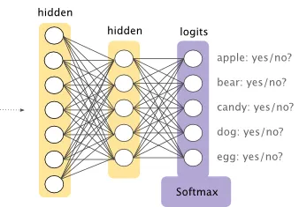
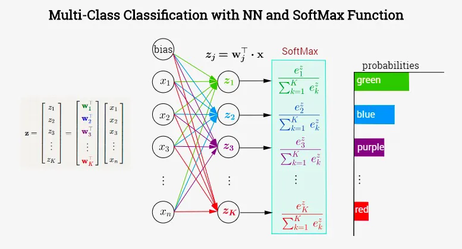
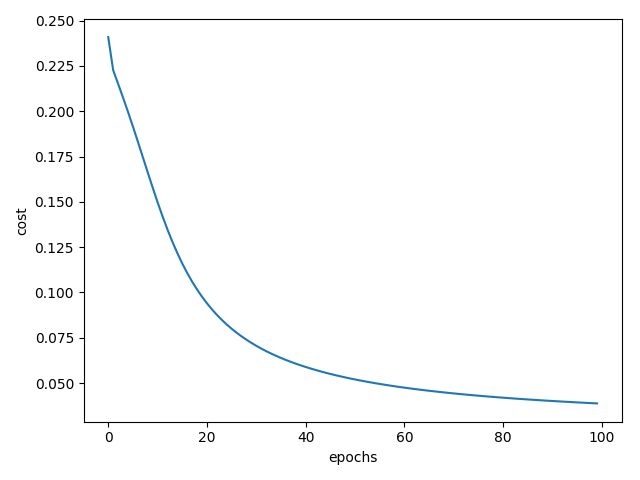

Understanding multi-class classification using Feedforward Neural Network is the foundation for most of the other complex and domain specific architecture. However often most lectures or books goes through Binary classification using Binary Cross Entropy Loss in detail and skips the derivation of the backpropagation using the Softmax Activation.In this Understanding  and implementing Neural Network with Softmax in Python from scratch we will go through the mathematical derivation of the backpropagation using Softmax Activation and also implement the same using python from scratch. 

We will continue from where we left off in the previous tutorial on backpropagation using binary cross entropy loss function.We will extend the same code to work with Softmax Activation. In case you need to refer, please find the previous tutorial [here](https://adeveloperdiary.github.io/posts/machine%20learning/algorithm/understand-and-implement-the-backpropagation-algorithm-from-scratch-in-python/).


## Softmax
The Sigmoid Activation function we have used earlier for binary classification needs to be changed for multi-class classification. The basic idea of Softmax is to distribute the probability of different classes so that they sum to 1. Earlier we have used only one Sigmoid hidden unit, now the number of Softmax hidden units needs to be same as the number of classes. Since we will be using the full MNIST dataset here, we have total 10 classes, hence we need 10 hidden units at the final layer of our Network. The Softmax Activation function looks at all the `Z` values from all (10 here) hidden unit and provides the probability for the each class. Later during prediction we can just take the most probable one and assume that’s that final output.

So as you see in the below picture, there are 5 hidden units at the final layer, each corresponds to a specific class. 


### Mathematical Definition of Softmax
The Softmax function can be defined as below, where `c` is equal to the number of classes. 

$$
a_i = \frac{e^{z_i}}{\sum_{k=1}^c e^{z_k}} \\
\text{where} \sum_{i=1}^c a_i = 1
$$

The below diagram shows the SoftMax function, each of the hidden unit at the last layer output a number between `0 and 1`. 



####Implementation Note
The above Softmax function is not really a stable one, if you implement this using python you will frequently get nan error due to floating point limitation in `NumPy`. In order to avoid that we can multiply both the numerator and denominator with a constant `c`. 
$$
\begin{align}
a_i =& \frac{ce^{z_i}}{c\sum_{k=1}^c e^{z_k}} \\
=& \frac{e^{z_i+logc}}{\sum_{k=1}^c e^{z_k}+logc} \\
\end{align}
$$

A popular choice of the \(log c \) constant is \( -max\left ( z \right ) \)

$$
a_i = \frac{e^{z_i - max\left ( z \right )}}{\sum_{k=1}^c e^{z_k}- max\left ( z \right )}
$$


```python   
def softmax(self, Z):
	expZ = np.exp(Z - np.max(Z))
	return expZ / expZ.sum(axis=0, keepdims=True)</pre> 
```

## SoftMax in Forward Propagation
In our previous tutorial we had used the Sigmoid at the final layer. Now we will just replace that with Softmax function. Thats all the change you need to make.


```python
def forward(self, X):
	store = {}

	A = X.T
	for l in range(self.L - 1):
		Z = self.parameters["W" + str(l + 1)].dot(A) + self.parameters["b" + str(l + 1)]
		A = self.sigmoid(Z)
		store["A" + str(l + 1)] = A
		store["W" + str(l + 1)] = self.parameters["W" + str(l + 1)]
		store["Z" + str(l + 1)] = Z
	
	Z = self.parameters["W" + str(self.L)].dot(A) + self.parameters["b" + str(self.L)]
	A = self.softmax(Z) # Replace this line
	store["A" + str(self.L)] = A
	store["W" + str(self.L)] = self.parameters["W" + str(self.L)]
	store["Z" + str(self.L)] = Z
	
	return A, store
```

## Loss Function
We will be using the Cross-Entropy Loss (in log scale) with the SoftMax, which can be defined as,

$$
L = - \sum_{i=0}^c y_i log a_i 
$$


```python
cost = -np.mean(Y * np.log(A.T + 1e-8))
```

#### Numerical Approximation
As you have seen in the above code, we have added a very small number `1e-8` inside the log just to avoid divide by zero error.

Due to this our loss may not be absolutely `0`.

## Derivative of SoftMax
Our main focus is to understand the derivation of how to use this SoftMax function during backpropagation. As you already know ( Please refer my previous post if needed ), we shall start the backpropagation by taking the derivative of the Loss/Cost function. However, there is a neat trick we can apply in order to make the derivation simpler. To do so, let’s first understand the derivative of the Softmax function.

We know that if \(f(x) = \frac{g(x)}{h(x)}\) then we can take the derivative of \(f(x)\) using the following formula,

$$
f(x) = \frac{g'(x)h(x) - h'(x)g(x)}{h(x)^2}
$$

In case of Softmax function, 

$$
\begin{align}
g(x) &= e^{z_i}  \\
h(x) &=\sum_{k=1}^c e^{z_k} 
\end{align}
$$

Now,
$$
\frac{da_i}{dz_j} = \frac{d}{dz_j} \bigg( \frac{e^{z_i}}{\sum_{k=1}^c e^{z_k}} \bigg) = \frac{d}{dz_j}  \bigg(  \frac{g(x)}{h(x)} \bigg)
$$

#### Calculate \(g'(x)\)

$$
\begin{align}
\frac{d}{dz_j} \big( g(x)\big) &= \frac{d}{dz_j} (e^{z_i}) \\
&=\frac{d}{dz_i} (e^{z_i})\frac{dz_i}{dz_j} (z_i) \\
&= e^{z_i} \frac{dz_i}{dz_j} (z_i) \\
&= \left\{\begin{matrix}
&  e^{z_i}  \text{ if } i = j\\ 
&  0 \text{ if } i \not= j
\end{matrix}\right.
\end{align}
$$

#### Calculate \(h'(x)\) 
$$
\begin{align}
\frac{d}{dz_j} \big( h(x)\big) &= \frac{d}{dz_j} \big( \sum_{k=1}^c e^{z_k}\big) \\
&= \frac{d}{dz_j} \big( \sum_{k=1, k \not=j}^c e^{z_k} + e^{z_j}\big) \\
&= \frac{d}{dz_j} \big( \sum_{k=1, k \not=j}^c e^{z_k} \big) + \frac{d}{dz_j} \big( e^{z_j}\big) \\
&=0+ e^{z_j} \\
&= e^{z_j} \\
\end{align}
$$

So we have two scenarios, when \( i = j \):

$$
\begin{align}
\frac{da_i}{dz_j} &= \frac{e^{z_i}\sum_{k=1}^c e^{z_k} -e^{z_j}e^{z_i} }{\big( \sum_{k=1}^c e^{z_k} \big)^2} \\
&= \frac{e^{z_i} \big(\sum_{k=1}^c e^{z_k} -e^{z_j} \big)}{\big( \sum_{k=1}^c e^{z_k} \big)^2} \\
&= \frac{e^{z_i}}{\sum_{k=1}^c e^{z_k}} . \frac{\sum_{k=1}^c e^{z_k} -e^{z_j}}{\sum_{k=1}^c e^{z_k}} \\
&= a_i (1- a_j) \\
&= a_i (1- a_i)  \text{ ; since }  i=j 
\end{align}
$$

And when \(I\not=j\)

$$
\begin{align}
\frac{da_i}{dz_j} &= \frac{0  \sum_{k=1}^c e^{z_k} -e^{z_j}e^{z_i} }{\big( \sum_{k=1}^c e^{z_k} \big)^2} \\
&= \frac{ - e^{z_j}e^{z_i}}{\big( \sum_{k=1}^c e^{z_k} \big)^2} \\
&= -a_i a_j \\
\end{align}
$$

## Derivative of Cross-Entropy Loss with Softmax
As we have already done for backpropagation using Sigmoid, we need to now calculate \( \frac{dL}{dw_i} \) using chain rule of derivative. The First step of that will be to calculate the derivative of the Loss function w.r.t. \(a\). However when we use Softmax activation function we can directly derive the derivative of \( \frac{dL}{dz_i} \). Hence during programming we can skip one step. 

Later you will find that the backpropagation of both Softmax and Sigmoid will be exactly same. You can go back to previous tutorial and make modification to directly compute the \(dZ^L\) and not \(dA^L\). We computed \(dA^L\) there so that its easy for initial understanding.

$$
\require{cancel}
\begin{align}
\frac{dL}{dz_i} &= \frac{d}{dz_i} \bigg[  - \sum_{k=1}^c y_k log (a_k) \bigg] \\
&= - \sum_{k=1}^c y_k \frac{d \big( log (a_k) \big)}{dz_i} \\
&= - \sum_{k=1}^c y_k \frac{d \big( log (a_k) \big)}{da_k} . \frac{da_k}{dz_i} \\
&= - \sum_{k=1}^c\frac{y_k}{a_k} . \frac{da_k}{dz_i} \\
&= - \bigg[ \frac{y_i}{a_i} . \frac{da_i}{dz_i}  + \sum_{k=1, k \not=i}^c \frac{y_k}{a_k}  \frac{da_k}{dz_i} \bigg] \\
&= - \frac{y_i}{\cancel{a_i}} . \cancel{a_i}(1-a_i) \text{ } - \sum_{k=1, k \not=i}^c \frac{y_k}{\cancel{a_k}} . (\cancel{a_k}a_i) \\
&= - y_i +y_ia_i + \sum_{k=1, k \not=i}^c y_ka_i \\
&= a_i \big( y_i + \sum_{k=1, k \not=i}^c y_k \big) - y_i \\
&= a_i + \sum_{k=1}^c y_k -y_i \\
&= a_i . 1 - y_i \text{ , since } \sum_{k=1}^c y_k =1 \\
&= a_i - y_i
\end{align}
$$

If you notice closely, this is the same equation as we had for Binary Cross-Entropy Loss (Refer the previous article). 

## Backpropagation
Now we will use the previously derived derivative of Cross-Entropy Loss with Softmax to complete the Backpropagation.

The matrix form of the previous derivation can be written as :

$$
\begin{align}
\frac{dL}{dZ} &= A - Y
\end{align}
$$

For the final layer L we can define as:

$$
\begin{align}
\frac{dL}{dW^L} &= \frac{dL}{dZ^L} \frac{dZ^L}{dW^L} \\
&= (A^L-Y) \frac{d}{dW^L} \big( A^{L-1}W^L + b^L \big) \\
&= (A^L-Y) A^{L-1}
\end{align}
$$

For all other layers except the layer `L` we can define as:

$$
\begin{align}
\frac{dL}{dW^{L-1}} &= \frac{dL}{dZ^L} \frac{dZ^L}{dA^{L-1}}\frac{dA^{L-1}}{dZ^{L-1}} \frac{dZ^{L-1}}{dW^{L-1}}\\
&= (A^L-Y) \frac{d}{dA^{L-1}} \big( A^{L-1}W^L + b^L \big) \\ 
& \frac{d}{dZ^{L-1}} \big( \sigma(Z^{L-1}) \big) \frac{d}{dW^{L-1}} \big( A^{L-2}W^{L-1} + b^{L-1} \big)\\
&= (A^L-Y) W^L\sigma'(Z^{L-1})A^{L-2}
\end{align}
$$

This is exactly same as our existing solution. 

#### Code 
Below is the code of the `backward()` function. The only difference between this and previous version is, we are directly calculating \(dZ\) and not \(dA\). Hence we can update the highlighted lines like following:

```python
def backward(self, X, Y, store):

	derivatives = {}
	
	store["A0"] = X.T
	
	A = store["A" + str(self.L)]
	dZ = A - Y.T
	
	dW = dZ.dot(store["A" + str(self.L - 1)].T) / self.n
	db = np.sum(dZ, axis=1, keepdims=True) / self.n
	dAPrev = store["W" + str(self.L)].T.dot(dZ)
	
	derivatives["dW" + str(self.L)] = dW
	derivatives["db" + str(self.L)] = db
	
	for l in range(self.L - 1, 0, -1):
		dZ = dAPrev * self.sigmoid(dAPrev, store["Z" + str(l)])
		dW = dZ.dot(store["A" + str(l - 1)].T) / self.n
		db = np.sum(dZ, axis=1, keepdims=True) / self.n
		if l &gt; 1:
			dAPrev = store["W" + str(l)].T.dot(dZ)
	
		derivatives["dW" + str(l)] = dW
		derivatives["db" + str(l)] = db
	
	return derivatives
```

## One Hot Encoding
Instead of using `0 and 1` for binary classification, we need to use `One Hot Encoding` transformation of `Y`. We will be using `sklearn.preprocessing.OneHotEncoder` class. In our example, our transformed `Y` will have  `10 columns` since we have 10 different classes.

We will add the additional transformation in the `pre_process_data()` function.

```python
def pre_process_data(train_x, train_y, test_x, test_y):
    # Normalize
    train_x = train_x / 255.
    test_x = test_x / 255.

    enc = OneHotEncoder(sparse=False, categories='auto')
    train_y = enc.fit_transform(train_y.reshape(len(train_y), -1))
    
    test_y = enc.transform(test_y.reshape(len(test_y), -1))
    
    return train_x, train_y, test_x, test_y
```

## Predict()
The `predict()` function will be changed for Softmax. First we need to get the most probable class by calling `np.argmax()` function, then do the same for the `OneHotEncoded` `Y` values to convert them to numeric data. Finally calculate the accuracy.


```python 
def predict(self, X, Y):
	A, cache = self.forward(X)
	y_hat = np.argmax(A, axis=0)
	Y = np.argmax(Y, axis=1)
	accuracy = (y_hat == Y).mean()
	return accuracy * 100

```

## Full Code


```python
import numpy as np
import datasets.mnist.loader as mnist
import matplotlib.pylab as plt
from sklearn.preprocessing import OneHotEncoder


class ANN:
    def __init__(self, layers_size):
        self.layers_size = layers_size
        self.parameters = {}
        self.L = len(self.layers_size)
        self.n = 0
        self.costs = []

    def sigmoid(self, Z):
        return 1 / (1 + np.exp(-Z))
    
    def softmax(self, Z):
        expZ = np.exp(Z - np.max(Z))
        return expZ / expZ.sum(axis=0, keepdims=True)
    
    def initialize_parameters(self):
        np.random.seed(1)
    
        for l in range(1, len(self.layers_size)):
            self.parameters["W" + str(l)] = np.random.randn(self.layers_size[l], self.layers_size[l - 1]) / np.sqrt(
                self.layers_size[l - 1])
            self.parameters["b" + str(l)] = np.zeros((self.layers_size[l], 1))
    
    def forward(self, X):
        store = {}
    
        A = X.T
        for l in range(self.L - 1):
            Z = self.parameters["W" + str(l + 1)].dot(A) + self.parameters["b" + str(l + 1)]
            A = self.sigmoid(Z)
            store["A" + str(l + 1)] = A
            store["W" + str(l + 1)] = self.parameters["W" + str(l + 1)]
            store["Z" + str(l + 1)] = Z
    
        Z = self.parameters["W" + str(self.L)].dot(A) + self.parameters["b" + str(self.L)]
        A = self.softmax(Z)
        store["A" + str(self.L)] = A
        store["W" + str(self.L)] = self.parameters["W" + str(self.L)]
        store["Z" + str(self.L)] = Z
    
        return A, store
    
    def sigmoid_derivative(self, Z):
        s = 1 / (1 + np.exp(-Z))
        return s * (1 - s)
    
    def backward(self, X, Y, store):
    
        derivatives = {}
    
        store["A0"] = X.T
    
        A = store["A" + str(self.L)]
        dZ = A - Y.T
    
        dW = dZ.dot(store["A" + str(self.L - 1)].T) / self.n
        db = np.sum(dZ, axis=1, keepdims=True) / self.n
        dAPrev = store["W" + str(self.L)].T.dot(dZ)
    
        derivatives["dW" + str(self.L)] = dW
        derivatives["db" + str(self.L)] = db
    
        for l in range(self.L - 1, 0, -1):
            dZ = dAPrev * self.sigmoid_derivative(store["Z" + str(l)])
            dW = 1. / self.n * dZ.dot(store["A" + str(l - 1)].T)
            db = 1. / self.n * np.sum(dZ, axis=1, keepdims=True)
            if l > 1:
                dAPrev = store["W" + str(l)].T.dot(dZ)
    
            derivatives["dW" + str(l)] = dW
            derivatives["db" + str(l)] = db
    
        return derivatives
    
    def fit(self, X, Y, learning_rate=0.01, n_iterations=2500):
        np.random.seed(1)
    
        self.n = X.shape[0]
    
        self.layers_size.insert(0, X.shape[1])
    
        self.initialize_parameters()
        for loop in range(n_iterations):
            A, store = self.forward(X)
            cost = -np.mean(Y * np.log(A.T+ 1e-8))
            derivatives = self.backward(X, Y, store)
    
            for l in range(1, self.L + 1):
                self.parameters["W" + str(l)] = self.parameters["W" + str(l)] - learning_rate * derivatives[
                    "dW" + str(l)]
                self.parameters["b" + str(l)] = self.parameters["b" + str(l)] - learning_rate * derivatives[
                    "db" + str(l)]
    
            if loop % 100 == 0:
                print("Cost: ", cost, "Train Accuracy:", self.predict(X, Y))
    
            if loop % 10 == 0:
                self.costs.append(cost)
    
    def predict(self, X, Y):
        A, cache = self.forward(X)
        y_hat = np.argmax(A, axis=0)
        Y = np.argmax(Y, axis=1)
        accuracy = (y_hat == Y).mean()
        return accuracy * 100
    
    def plot_cost(self):
        plt.figure()
        plt.plot(np.arange(len(self.costs)), self.costs)
        plt.xlabel("epochs")
        plt.ylabel("cost")
        plt.show()


def pre_process_data(train_x, train_y, test_x, test_y):
    # Normalize
    train_x = train_x / 255.
    test_x = test_x / 255.

    enc = OneHotEncoder(sparse=False, categories='auto')
    train_y = enc.fit_transform(train_y.reshape(len(train_y), -1))
    
    test_y = enc.transform(test_y.reshape(len(test_y), -1))
    
    return train_x, train_y, test_x, test_y


if __name__ == '__main__':
    train_x, train_y, test_x, test_y = mnist.get_data()

    train_x, train_y, test_x, test_y = pre_process_data(train_x, train_y, test_x, test_y)
    
    print("train_x's shape: " + str(train_x.shape))
    print("test_x's shape: " + str(test_x.shape))
    
    layers_dims = [50, 10]
    
    ann = ANN(layers_dims)
    ann.fit(train_x, train_y, learning_rate=0.1, n_iterations=1000)
    print("Train Accuracy:", ann.predict(train_x, train_y))
    print("Test Accuracy:", ann.predict(test_x, test_y))
    ann.plot_cost()

```

## Output
Here is the plot of the cost function:



This is the output after 1000 iteration. Here our test accuracy is more than train accuracy, do you know why ? Post a comment in case you are not sure and I will explain.

```
train_x's shape: (60000, 784)
test_x's shape: (10000, 784)
Cost:  0.24014291022543646 Train Accuracy: 8.393333333333333
Cost:  0.16293340442170298 Train Accuracy: 70.35833333333333
Cost:  0.11068081204697405 Train Accuracy: 79.54833333333333
Cost:  0.08353159072761683 Train Accuracy: 83.24833333333333
Cost:  0.06871067093157585 Train Accuracy: 85.32
Cost:  0.05959970354422914 Train Accuracy: 86.56666666666666
Cost:  0.05347708397827516 Train Accuracy: 87.46333333333334
Cost:  0.049101880831507155 Train Accuracy: 88.12
Cost:  0.04583107963137556 Train Accuracy: 88.59666666666666
Cost:  0.04329685602394087 Train Accuracy: 89.00833333333334
Train Accuracy: 89.31333333333333
Test Accuracy: 89.89
```

Please find the full project here:

<div style='text-align:center;margin-bottom:30px;'>
<input type='button' value="GitHub" onclick="javascript:window.open('https://github.com/adeveloperdiary/blog/tree/master/Backpropagation_Algorithm_using_Softmax','_blank')"/>
</div>