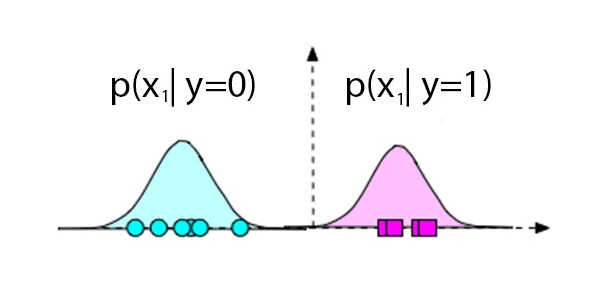

Naive Bayes Classifier is one of the simple Machine Learning algorithm to implement, hence most of the time it has been taught as the first classifier to many students. However, many of the tutorials are rather incomplete and does not provide the proper understanding. Hence, today in this Introduction to Naive Bayes Classifier using R and Python tutorial we will learn this simple yet useful concept. Bayesian Modeling is the foundation of many important statistical concepts such as Hierarchical Models (Bayesian networks), Markov Chain Monte Carlo etc. 

Naive Bayes Classifier is a special simplified case of `Bayesian networks` where we assume that each feature value is independent to each other. `Hierarchical Models` can be used to define the dependency between features and we can build much complex and accurate Models using JAGS, BUGS or Stan ( which is out of scope of this tutorial ).

## Prerequisites 
This tutorial expect you to already know the `Bayes Theorem` and some understanding of `Gaussian Distributions`.

## Objective 
Say, we have a dataset and the classes (label/target) associated with each data. For an example, if we consider the `Iris` dataset with only 2 types of flower, `Versicolor` and `Virginica` then the feature ( `X` ) vector will contain 4 types of features - `Petal length`, `Petal width`, `Sepal length`, `Sepal width`. The Versicolor and Virginica will be the class ( `Y` ) of each sample of data. Now using the training data we will like to build our `Naive Bayes Classifier` so that using any unlabeled data we should be able to classify the flower correctly.

## Bayes Theorem 
We can write the Bayes Theorem as following where `X` is the feature vector and `Y` is the output class/target variable.

$$
p(Y|X) = \frac{p(X|Y)p(Y)}{p(X)}
$$

As you already know, the definition of each of the probabilities are:

$$
\text{posterior} = \frac{\text{likelihood}  * \text{prior}}{ \text{marginal} } 
$$

## Naive Bayes Classifier 
We will now use the above Bayes Theorem to come up with Bayes Classifier. 

### Simplify the Posterior Probability
Say we have only two class 0 and 1 [ 0 = Versicolor, 1 = Virginica], then our objective will be to find the values of $$p(Y=0|X) $$and $$p(Y=1|X) $$, then whichever probability value is larger than the other, we will predict the data belongs to that class.

We can define that mathematically as:

$$
\arg\max_{c} (p(y_c|X) ) 
$$

### Simplify the Likelihood Probability
By saying `Naive`, we have assumed that each feature is `independent`. We can then define the `likelihood` as the multiplication of the probability of each of the features given the class.

$$
\begin{align} 
p(X|Y) &= p(x_1|y_c)p(x_2|y_c)...p(x_n|y_c) \\
&= \prod_{i=1}^n p(x_i|y_c) \\
& \text{where }  y_c \text{ is any specific class, 0 or 1 }
\end{align}
$$

### Simplify the Prior Probability
We can define the `prior` as $$\frac{m_c}{m}$$, where $$m_c$$ is the number of sample for the class $$c$$ and $$m$$ is the total number of samples in our dataset.

### Simplify the Marginal Probability
The Marginal Probability is not really useful to us since it does not depend on `Y`, hence same for all the classes. So we can use the following way,

$$
\begin{align}
p(Y|X) \propto & \text{ } p(X|Y)p(Y) \\
= & \text{ } p(X|Y)p(Y) + k \\
& \text{where  k = some constant}
\end{align}
$$

The `k` constant can be dropped during implementation since it’s the same for all the classes.

### Final Equation
The final equation looks like following: 

$$
\begin{align}
\text{prediction} &= \arg\max_{c} (p(y_c|X) ) \\
&= \arg\max_{c}  \prod_{i=1}^n p(x_i|y_c) p(y_c) \\
\end{align}
$$

However the product might create numerical issues. We will use log scale in our implementation, since log is a monotonic function we should achieve the same result. 

$$
\begin{align}
log ( \text{prediction} ) =& \arg\max_{c} \bigg( \sum_{i=1}^n log(p(x_i|y_c))+ log(p(y_c)) \bigg) \\
=& \arg\max_{c} \bigg( \sum_{i=1}^n log(p(x_i|y_c))+ log(\frac{m_c}{m}) \bigg)\\
\end{align}
$$

Believe or not, we are done defining our Naive Bayes Classifier. There is just one thing pending, we need to define a model to calculate the likelihood.

## How to define the Likelihood?
There are different strategies and it really depends on the features. 

### Discrete Variable
In case the features are discrete variable then we can define the likelihood using simply the probability of each feature. For an example, in case we are creating a classifier to detect spam emails, and we have three words (discount, offer and dinner ) as our features, then we can define our likelihood as:

$$
\begin{align}
p(X|Y=\text{ spam })=& p(\text{discount=yes}|spam)*p(\text{offer=yes}|spam) \\ & *p(\text{dinner=no}|spam)\\
=& (10/15)*( 7/15 )*( 1/15 )
\end{align}
$$

You can then calculate the prior and easily classify the data using the final equation we have. 

**Note:** Often in exams this comes as a problem to solve by hand.

### Continuous Variable
In case our features are continuous ( like we have in our iris dataset ) we have two options:

- `Quantize` the continuous values and use them as categorical variable.
- Define a `distribution` and model the likelihood using it.

I will talk about vector quantization in a future video, however let’s look more into the 2nd option.

If you plot any feature \(x_1$$the distribution might look `Normal/Gaussian`, hence we can use normal distribution to define our likelihood. For simplicity, assume we have only one feature and if we plot the data for both the classes, it might look like following:





In the above case, any new point in the left side will have a higher probably for $$p(x_1 \mid y=0) $$ than $$p(x_1 \mid y=1)$$. We can define the probability using the `Univariate Gaussian Distribution`.
$$
P(x \mid \mu,\sigma) = \frac{1}{\sigma \sqrt{2\pi}} e^{-(x-\mu)^2 / 2 \sigma^2}
$$

We can easily estimate the `mean` and `variance` from our train data. 

So our likelihood will be,  $$P(x \mid \mu, \sigma, y_c) $$

#### Important Note
Now, you might be tempted to plot the feature and in case they are looking like exponential distribution, you probably want use exponential distribution to define the likelihood. I must tell you that you shouldn’t do anything like that. There are many reasons, 

- Limited data might not provide accurate distribution, hence prediction will be wrong.
- We really don’t need to match the distribution exactly with the data, as long as we can separate them, our classifier will perfectly.

So we mostly use `Gaussian` or `Bernoulli` distribution for continuous variable. 

## Code Naive Bayes Classifier using Python from scratch 
Enough of theory, let's now actually build the classifier using Python from scratch.

First let's understand the structure of our `NaiveBayes` class.

```python
import numpy as np
import seaborn as sns
from sklearn import preprocessing
from sklearn.model_selection import train_test_split
from Logging.Logging import output_log
import math


class NaiveBayes:
    def __init__(self):
        pass    

    def fit(self, X, y):
        pass
    
    def predict(self, X):
        return True
    
    def accuracy(self, y, prediction):
        return True

if __name__ == '__main__':
    iris = sns.load_dataset("iris")
    iris = iris.loc[iris["species"] != "setosa"]

    le = preprocessing.LabelEncoder()
    y = le.fit_transform(iris["species"])
    X = iris.drop(["species"], axis=1).values
    
    train_accuracy = np.zeros([100])
    test_accuracy = np.zeros([100])
    
    for loop in range(100):
        X_train, X_test, y_train, y_test = train_test_split(X, y, test_size=0.3, random_state=loop)
    
        model = NaiveBayes()
        model.fit(X_train, y_train)
    	
        prediction = model.predict(X_train)
        train_accuracy[loop] = model.accuracy(y_train, prediction)
    	
        prediction = model.predict(X_test)
        test_accuracy[loop] = model.accuracy(y_test, prediction)
    
    output_log("Average Train Accuracy {}%".format(np.mean(train_accuracy)))
    output_log("Average Test Accuracy {}%".format(np.mean(train_accuracy)))
```

We will be using `seaborn` package just to access the iris data without writing any code. Then we will define the skeleton of the `NaiveBayes` class. 

In this example we will work on binary classification, hence we wont use the setosa flower type.There will be only 100 sample data. We will convert the class to numeric value in line 26-27.

In order to get a better estimate of our classifier, we will run the classification 100 times on randomly split data and then average them out to get our estimate. Hence we have the loop and inside the loop we are splitting the data into train/test sets.

Finally we will instantiate our class and invoke the `fit()` function only once.


### fit()
The fit function wont return any value. `Normalization` is very important when implementing NaiveBayes classifier since the scale of the data will impact the prediction. Here we will normalize each feature so that the `mean` is 0 and `standard deviation` is 1.

We will start by calling a function named `calculate_mean_sd()` which will calculate and store $$\mu $$and \(\sigma$$as class variable. Then we will call `normalize()` function to scale the data.

Next,we need to calculate the $$\mu $$and \(\sigma$$for each class. Finally calculate the prior for each class and save them to class variable.

```python
def fit(self, X, y):
	self.calculate_mean_sd(X)
	train_scaled = self.normalize(X)

	X_class1 = train_scaled[np.where(y == 0)]
	X_class2 = train_scaled[np.where(y == 1)]
	
	self.class1_mean = np.mean(X_class1, axis=0)
	self.class1_sd = np.std(X_class1, axis=0)
	
	self.class2_mean = np.mean(X_class2, axis=0)
	self.class2_sd = np.std(X_class2, axis=0)
	
	self.class1_prior = X_class1.shape[0] / X.shape[0]
	self.class2_prior = X_class2.shape[0] / X.shape[0]
```

Below are the calculate_mean_sd() and normalize() function.

```python
def calculate_mean_sd(self, X):
	self.train_mean = np.mean(X, axis=0)
	self.train_sd = np.std(X, axis=0)

def normalize(self, X):
	train_scaled = (X - self.train_mean) / self.train_sd
	return train_scaled
```

### predict()
We will pass the test data into the `predict()` function. First scale the data using `normalize()` function, which uses the $$\mu $$and \(\sigma$$calculated during training.

Next go thorugh each row and calculate the likelihood by looping through each feature. Remember, this is a very in-efficient code, since its not vectorized. In our R code we will see a much faster version.

Python does not have a built-in `dnorm` function to calculate the density of a Normal Distribution, hence we will write our own `dnorm()` function.

Finally, we compare the two output and predict the class based on the larger value.

```python
def predict(self, X):
	test_scaled = self.normalize(X)
	len = test_scaled.shape[0]
	prediction = np.zeros([len])
	
	for row in range(len):
	
		log_sum_class1 = 0
		log_sum_class2 = 0
	
		for col in range(test_scaled.shape[1]):
			log_sum_class1 += math.log(self.dnorm(test_scaled[row, col], self.class1_mean[col], self.class1_sd[col]))
			log_sum_class2 += math.log(self.dnorm(test_scaled[row, col], self.class2_mean[col], self.class2_sd[col]))
	
		log_sum_class1 += math.log(self.class1_prior)
		log_sum_class2 += math.log(self.class2_prior)
	
		if log_sum_class1 &lt; log_sum_class2:
			prediction[row] = 1
	
	return prediction
```


Here is the `dnorm()` function.

```python    
def dnorm(self, x, mu, sd):
	return 1 / (np.sqrt(2 * np.pi) * sd) * np.e ** (-np.power((x - mu) / sd, 2) / 2)
```

### accuracy()
The accuracy() function is very easy. Here is the code:

```python
def accuracy(self, y, prediction):
	accuracy = (prediction == y).mean()
	return accuracy * 100
```

### Output

```
[OUTPUT] Average Train Accuracy 93.9857142857143%
[OUTPUT] Average Test Accuracy 93.9857142857143%
```

#### Full Python Code:

```python
import numpy as np
import seaborn as sns
from sklearn import preprocessing
from sklearn.model_selection import train_test_split
from Logging.Logging import output_log
import math


class NaiveBayes:
    def __init__(self):
        self.train_mean = None
        self.train_sd = None
        self.class1_mean = None
        self.class1_sd = None
        self.class2_mean = None
        self.class2_sd = None

    def dnorm(self, x, mu, sd):
        return 1 / (np.sqrt(2 * np.pi) * sd) * np.e ** (-np.power((x - mu) / sd, 2) / 2)
    
    def calculate_mean_sd(self, X):
        self.train_mean = np.mean(X, axis=0)
        self.train_sd = np.std(X, axis=0)
    
    def normalize(self, X):
        train_scaled = (X - self.train_mean) / self.train_sd
        return train_scaled
    
    def fit(self, X, y):
        self.calculate_mean_sd(X)
        train_scaled = self.normalize(X)
    
        X_class1 = train_scaled[np.where(y == 0)]
        X_class2 = train_scaled[np.where(y == 1)]
    
        self.class1_mean = np.mean(X_class1, axis=0)
        self.class1_sd = np.std(X_class1, axis=0)
    
        self.class2_mean = np.mean(X_class2, axis=0)
        self.class2_sd = np.std(X_class2, axis=0)
    
        self.class1_prior = X_class1.shape[0] / X.shape[0]
        self.class2_prior = X_class2.shape[0] / X.shape[0]
    
    def predict(self, X):
        test_scaled = self.normalize(X)
    
        len = test_scaled.shape[0]
    
        prediction = np.zeros([len])
    
        for row in range(len):
    
            log_sum_class1 = 0
            log_sum_class2 = 0
    
            for col in range(test_scaled.shape[1]):
                log_sum_class1 += math.log(self.dnorm(test_scaled[row, col], self.class1_mean[col], self.class1_sd[col]))
                log_sum_class2 += math.log(self.dnorm(test_scaled[row, col], self.class2_mean[col], self.class2_sd[col]))
    
            log_sum_class1 += math.log(self.class1_prior)
            log_sum_class2 += math.log(self.class2_prior)
    
            if log_sum_class1 &lt; log_sum_class2:
                prediction[row] = 1
    
        return prediction
    
    def accuracy(self, y, prediction):
        accuracy = (prediction == y).mean()
        return accuracy * 100


if __name__ == '__main__':
    iris = sns.load_dataset("iris")
    iris = iris.loc[iris["species"] != "setosa"]

    le = preprocessing.LabelEncoder()
    y = le.fit_transform(iris["species"])
    X = iris.drop(["species"], axis=1).values
    
    train_accuracy = np.zeros([100])
    test_accuracy = np.zeros([100])
    
    for loop in range(100):
        X_train, X_test, y_train, y_test = train_test_split(X, y, test_size=0.3, random_state=loop)
    
        model = NaiveBayes()
        model.fit(X_train, y_train)
        prediction = model.predict(X_train)
        train_accuracy[loop] = model.accuracy(y_train, prediction)
        prediction = model.predict(X_test)
        test_accuracy[loop] = model.accuracy(y_test, prediction)
    
    output_log("Average Train Accuracy {}%".format(np.mean(train_accuracy)))
    output_log("Average Test Accuracy {}%".format(np.mean(train_accuracy)))
```

## Update 

Recently I have rewtitten the above function in a bit different way. Here is my modified version. 

```python
import numpy as np
import seaborn as sns
from scipy.stats import multivariate_normal

class NaiveBayes():

    def __init__(self) -> None:
        self.eps = 1e-6

    def _normalize(self, X):
        if self.mean is None and self.std is None:
            # Calculate mean and std for normalizing data
            self.mean = np.mean(X, axis=0) 
            self.std = np.std(X, axis=0)

        # normalize
        X_scaled = (X-self.mean)/self.std
        return X_scaled

    def fit(self, X, y) -> None:
        self.mean = None
        self.std = None
        X_scaled = self._normalize(X)

        self.num_classes = len(np.unique(y))

        self.class_mean = {}
        self.class_std = {}
        self.class_prior = {}

        for c in range(self.num_classes):
            X_temp = X_scaled[y == c]

            self.class_mean[c] = np.mean(X_temp, axis=0)  # per column
            self.class_std[c] = np.std(X_temp, axis=0)
            self.class_prior[c] = X_temp.shape[0]/X.shape[0]

    def _normal_pdf(self, X, mean, std):
        # pdf in log scale
        # pdf= -1/2 sum ( (X-Mean)**2/(std+eps) by row ) - 1/2 sum log (sigma+eps) - n_features/2 (log 2*pi)
				
        # We are not going to use this but its a good way to compare with the multivariate_normal.pdf() function
        # from the scipy library.
        pdf_calc= - (1/2)*np.sum(np.square(X-mean)/(std+self.eps), axis=1) - \
            (1/2)*np.sum(np.log(std+self.eps)) - (X.shape[1]/2)*np.log(2*np.pi)
        
        pdf_lib= np.log(multivariate_normal.pdf(X,mean,std))
        
        return pdf_lib

    def predict(self, X, y):
        X_scaled = self._normalize(X)
        probs = np.zeros((X_scaled.shape[0], self.num_classes))

        for c in range(self.num_classes):
            class_prob = self._normal_pdf(
                X_scaled, self.class_mean[c], self.class_std[c])
            probs[:, c] = class_prob+self.class_prior[c]

        y_hat = np.argmax(probs, axis=1)
        print(f"Acuracy: {self._accuracy(y,y_hat)}")

        return y_hat

    def _accuracy(self, y, y_hat):
        return np.sum(y == y_hat)/y.shape[0]


if __name__ == "__main__":
    data = sns.load_dataset("iris")
    data = data[data['species'] != 'setosa']

    data['label'] = 0
    data.loc[data['species'] == 'versicolor', 'label'] = 1

    data = data.sample(frac=1).reset_index(drop=True)

    y = data.label.values
    X = data.drop(columns=['species', 'label']).values

    model = NaiveBayes()
    model.fit(X[:75, :], y[:75])
    model.predict(X[-25:, :], y[-25:])
```


## Code Naive Bayes Classifier using R from scratch 

I am not going through the full code here and provided inline comments. Fundamentally it's the same as the python version. However here are two main differences:

- Using built-in dnorm() function.
- Operations are vectorized

```R
library(caret)

#Data Preparation
data=iris[which(iris$Species!='setosa'),]
data$Species=as.numeric(data$Species)
data$Species=data$Species-2
data=as.matrix()

y_index=ncol(data)

#Placeholder for test &amp; train accuracy
trainData_prediction=rep(1,100)
tstData_prediction=rep(1,100)

# Execulute 100 times and later average the accuracy
for(count in c(1:100))
{

  #Split the data in train &amp; test set
  set.seed(count)
  split=createDataPartition(y=data[,y_index], p=0.7, list=FALSE)

  training_data=data[split,]
  test_data=data[-split,]

  training_x=training_data[,-y_index]
  training_y=training_data[,y_index]

  #Normalize Train Data
  tr_ori_mean &lt;- apply(training_x,2, mean)  
  tr_ori_sd   &lt;- apply(training_x,2, sd)    

  tr_offsets &lt;- t(t(training_x) - tr_ori_mean)         
  tr_scaled_data  &lt;- t(t(tr_offsets) / tr_ori_sd)

  #Get Positive class Index
  positive_idx = which(training_data[,y_index] == 1)


  positive_data = tr_scaled_data[positive_idx,]
  negative_data = tr_scaled_data[-positive_idx,]


  #Get Means and SD on Scaled Data
  pos_means=apply(positive_data,2,mean)
  pos_sd=apply(positive_data,2,sd)

  neg_means=apply(negative_data,2,mean)
  neg_sd=apply(negative_data,2,sd)

  test_x=test_data[,1:y_index-1]

  predict_func=function(test_x_row){
    
    target=0;
    
    #Used dnorm() function for normal distribution and calculate probability
    p_pos=sum(log(dnorm(test_x_row,pos_means,pos_sd)))+log(length(positive_idx)/length(training_y))
    p_neg=sum(log(dnorm(test_x_row,neg_means,neg_sd)))+log( 1 - (length(positive_idx)/length(training_y)))
    
    if(p_pos&gt;p_neg){
      target=1
    }else{
      target=0
    }  
  }

  #Scale Test Data
  tst_offsets &lt;- t(t(test_x) - tr_ori_mean)         
  tst_scaled_data  &lt;- t(t(tst_offsets) / tr_ori_sd)

  #Predict for test data, get prediction for each row
  y_pred=apply(tst_scaled_data,1,predict_func)
  target=test_data[,y_index]

  tstData_prediction[count]=length(which((y_pred==target)==TRUE))/length(target)

  #Predict for train data ( optional, output not printed )
  y_pred_train=apply(tr_scaled_data,1,predict_func)

  trainData_prediction[count]=length(which((y_pred_train==training_y)==TRUE))/length(training_y)

}
print(paste("Average Train Data Accuracy:",mean(trainData_prediction)*100.0,sep = " "))
print(paste("Average Test Data Accuracy:",mean(tstData_prediction)*100.0,sep = " "))
```

Please find the full project here:

<div style='text-align:center;margin-bottom:30px;'>
<input type='button' value="GitHub" onclick="javascript:window.open('https://github.com/adeveloperdiary/blog/tree/master/NaiveBayes','_blank')"/>
</div>


