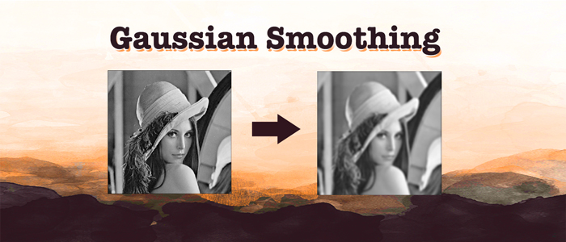
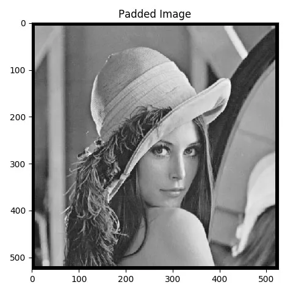
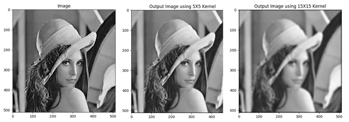

Using Gaussian filter/kernel to smooth/blur an image is a very important tool in Computer Vision. You will find many algorithms using it before actually processing the image. Today we will be Applying Gaussian Smoothing to an image using Python from scratch and not using library like OpenCV.

## High Level Steps

There are two steps to this process:

- Create a Gaussian Kernel/Filter
- Perform Convolution and Average

## Gaussian Kernel/Filter

Create a function named `gaussian_kernel()`, which takes mainly two parameters. The size of the kernel and the standard deviation.

```python
def gaussian_kernel(size, sigma=1, verbose=False):
 
    kernel_1D = np.linspace(-(size // 2), size // 2, size)
    for i in range(size):
        kernel_1D[i] = dnorm(kernel_1D[i], 0, sigma)
    kernel_2D = np.outer(kernel_1D.T, kernel_1D.T)
 
    kernel_2D *= 1.0 / kernel_2D.max()
 
    if verbose:
        plt.imshow(kernel_2D, interpolation='none',cmap='gray')
        plt.title("Image")
        plt.show()
 
    return kernel_2D
```

Create a vector of equally spaced number using the size argument passed. When the `size = 5`, the `kernel_1D` will be like the following:

```python
array([-2., -1.,  0.,  1.,  2.])
```

Now we will call the `dnorm()` function which returns the density using the `mean = 0` and standard deviation. We will see the function definition later. The `kernel_1D` vector will look like:

```python
array([0.05399097, 0.24197072, 0.39894228, 0.24197072, 0.05399097])
```

Then we will create the outer product and normalize to make sure the center value is always 1.

## Kernel Output

In order to set the sigma automatically, we will use following equation: (This will work for our purpose, where filter size is between 3-21):

```python
sigma=math.sqrt(kernel_size)
```

Here is the output of different kernel sizes.


As you are seeing the `sigma` value was automatically set, which worked nicely. This simple trick will save you time to find the sigma for different settings.

### dnorm()

```python
def dnorm(x, mu, sd):
    return 1 / (np.sqrt(2 * np.pi) * sd) * np.e ** (-np.power((x - mu) / sd, 2) / 2)
```

Here is the `dorm()` function. Just calculated the density using the formula of `Univariate Normal Distribution`.

## Convolution and Average
We will create the convolution function in a generic way so that we can use it for other operations. This is not the most efficient way of writing a convolution function, you can always replace with one provided by a library. However the main objective is to perform all the basic operations from scratch. 

I am not going to go detail on the `Convolution` ( or `Cross-Correlation` )  operation, since there are many fantastic tutorials available already. Here we will only focus on the implementation.

Let’s look at the `convolution()` function part by part.

```python
def convolution(image, kernel, average=False, verbose=False):

    if len(image.shape) == 3:
        print("Found 3 Channels : {}".format(image.shape))
        image = cv2.cvtColor(image, cv2.COLOR_BGR2GRAY)
        print("Converted to Gray Channel. Size : {}".format(image.shape))
    else:
        print("Image Shape : {}".format(image.shape))

    print("Kernel Shape : {}".format(kernel.shape))

    if verbose:
        plt.imshow(image, cmap='gray')
        plt.title("Image")
        plt.show()
```

The function has the image and kernel as the required parameters and we will also pass average as the 3rd argument. The average argument will be used only for smoothing filter. Notice, we can actually pass any filter/kernel, hence this function is not coupled/depended on the previously written `gaussian_kernel()` function.

Since our `convolution()` function only works on image with single channel, we will convert the image to gray scale in case we find the image has 3 channels ( Color Image ). Then plot the gray scale image using `matplotlib`.

```python 
image_row, image_col = image.shape
kernel_row, kernel_col = kernel.shape

output = np.zeros(image.shape)

pad_height = int((kernel_row - 1) / 2)
pad_width = int((kernel_col - 1) / 2)

padded_image = np.zeros((image_row + (2 * pad_height), image_col + (2 * pad_width)))

padded_image[pad_height:padded_image.shape[0] - pad_height, pad_width:padded_image.shape[1] - pad_width] = image
```

We want the output image to have the same dimension as the input image. This is technically known as the `“same convolution”`. In order to do so we need to pad the image. Here we will use `zero padding`, we will talk about other types of padding later in the tutorial. Now for `“same convolution”` we need to calculate the size of the padding using the following formula, where `k` is the size of the kernel.

$$
\frac{(k-1)}{2}
$$

In the the last two lines, we are basically creating an empty numpy 2D array and then copying the image to the proper location so that we can have the padding applied in the final output. In the below image we have applied a padding of 7, hence you can see the black border.



```python
for row in range(image_row):
    for col in range(image_col):
        output[row, col] = np.sum(kernel * padded_image[row:row + kernel_row, col:col + kernel_col])
```

Now simply implement the convolution operation using two loops. 

```python
if average:
    output[row, col] /= kernel.shape[0] * kernel.shape[1]
```

In order to apply the smooth/blur effect we will divide the output pixel by the total number of pixel available in the kernel/filter. This will be done only if the value of average is set `True`.

We are finally done with our simple convolution function. Here is the output image.



## gaussian_blur()

So the `gaussian_blur()` function will call the `gaussian_kernel()` function first to create the kernel and then invoke `convolution()` function.

```python
def gaussian_blur(image, kernel_size, verbose=False):
    kernel = gaussian_kernel(kernel_size, sigma=math.sqrt(kernel_size), verbose=verbose)
    return convolution(image, kernel, average=True, verbose=verbose)
```

## main()

In the main function, we just need to call our `gaussian_blur()` function by passing the arguments.

```python
if __name__ == '__main__':
    ap = argparse.ArgumentParser()
    ap.add_argument("-i", "--image", required=True, help="Path to the image")
    args = vars(ap.parse_args())

    image = cv2.imread(args["image"])

    gaussian_blur(image, 9, verbose=True)
```

## Conclusion
As you have noticed, once we use a larger filter/kernel there is a black border appearing in the final output. This is because we have used zero padding and the color of zero is black. You can implement two different strategies in order to avoid this.

- Don’t use any padding, the dimension of the output image will be different but there won’t be any dark border.
- Instead of using zero padding, use the edge pixel from the image and use them for padding.


## Full Code

```python 
import numpy as np
import cv2
import matplotlib.pyplot as plt


def convolution(image, kernel, average=False, verbose=False):
    if len(image.shape) == 3:
        print("Found 3 Channels : {}".format(image.shape))
        image = cv2.cvtColor(image, cv2.COLOR_BGR2GRAY)
        print("Converted to Gray Channel. Size : {}".format(image.shape))
    else:
        print("Image Shape : {}".format(image.shape))

    print("Kernel Shape : {}".format(kernel.shape))

    if verbose:
        plt.imshow(image, cmap='gray')
        plt.title("Image")
        plt.show()

    image_row, image_col = image.shape
    kernel_row, kernel_col = kernel.shape

    output = np.zeros(image.shape)

    pad_height = int((kernel_row - 1) / 2)
    pad_width = int((kernel_col - 1) / 2)

    padded_image = np.zeros((image_row + (2 * pad_height), image_col + (2 * pad_width)))

    padded_image[pad_height:padded_image.shape[0] - pad_height, pad_width:padded_image.shape[1] - pad_width] = image

    if verbose:
        plt.imshow(padded_image, cmap='gray')
        plt.title("Padded Image")
        plt.show()

    for row in range(image_row):
        for col in range(image_col):
            output[row, col] = np.sum(kernel * padded_image[row:row + kernel_row, col:col + kernel_col])
            if average:
                output[row, col] /= kernel.shape[0] * kernel.shape[1]

    print("Output Image size : {}".format(output.shape))

    if verbose:
        plt.imshow(output, cmap='gray')
        plt.title("Output Image using {}X{} Kernel".format(kernel_row, kernel_col))
        plt.show()

    return output
```

```python 
import numpy as np
import cv2
import argparse
import matplotlib.pyplot as plt
import math
from Computer_Vision.Gaussian_Smoothing.convolution import convolution


def dnorm(x, mu, sd):
    return 1 / (np.sqrt(2 * np.pi) * sd) * np.e ** (-np.power((x - mu) / sd, 2) / 2)


def gaussian_kernel(size, sigma=1, verbose=False):
    kernel_1D = np.linspace(-(size // 2), size // 2, size)
    for i in range(size):
        kernel_1D[i] = dnorm(kernel_1D[i], 0, sigma)
    kernel_2D = np.outer(kernel_1D.T, kernel_1D.T)

    kernel_2D *= 1.0 / kernel_2D.max()

    if verbose:
        plt.imshow(kernel_2D, interpolation='none', cmap='gray')
        plt.title("Kernel ( {}X{} )".format(size, size))
        plt.show()

    return kernel_2D


def gaussian_blur(image, kernel_size, verbose=False):
    kernel = gaussian_kernel(kernel_size, sigma=math.sqrt(kernel_size), verbose=verbose)
    return convolution(image, kernel, average=True, verbose=verbose)


if __name__ == '__main__':
    ap = argparse.ArgumentParser()
    ap.add_argument("-i", "--image", required=True, help="Path to the image")
    args = vars(ap.parse_args())

    image = cv2.imread(args["image"])

    gaussian_blur(image, 5, verbose=True)
```


## Project in Github
Please find the full project here:

<div style='text-align:center;margin-bottom:30px;'>
<input type='button' value="GitHub" onclick="javascript:window.open('https://github.com/adeveloperdiary/blog/tree/master/Computer_Vision/Gaussian_Smoothing','_blank')"/>
</div>