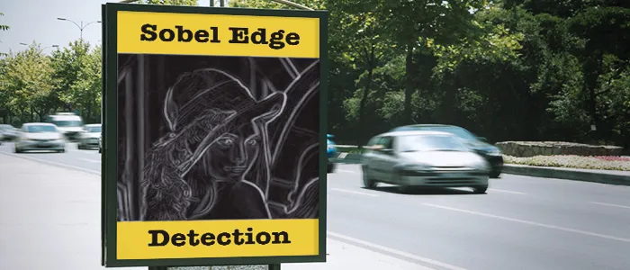
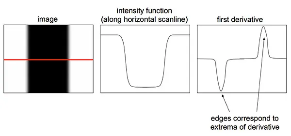
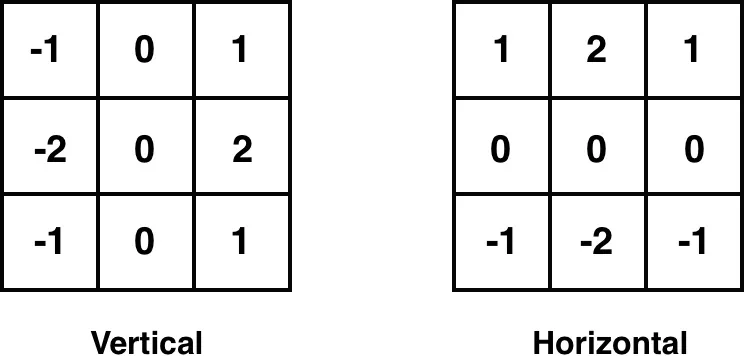
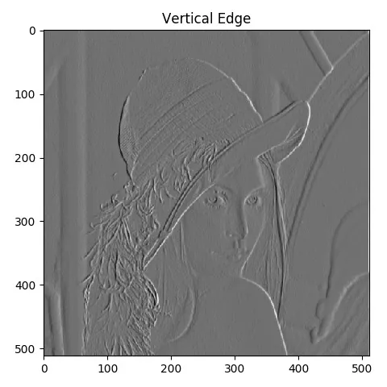
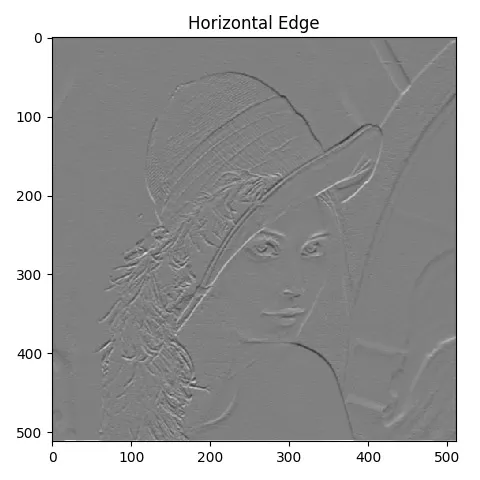
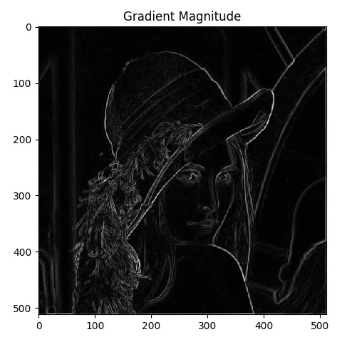

Sobel edge detection is one of the foundational building block of Computer Vision. Even when you start learning deep learning if you find the reference of Sobel filter. In this tutorial we will learn How to implement Sobel edge detection using Python from scratch.

We will be referring the same code for the Convolution and Gaussian Smoothing function from the following blog.

The objective will be to find the edges in the below image:


## What is an edge?
An edge is a place of rapid change in the image intensity function.

## How to detect an edge?
In order to detect edge we need to detect the discontinuities in image and we know that we can use derivative to detect discontinuities.  



Image Credit: http://stanford.edu/

As you are seeing in the above picture, the edges corresponds to the derivatives. Since images are discrete in nature, we can easily take the derivate of an image using `2D derivative mask`.

However derivates are also effected by noise, hence it's advisable to smooth the image first before taking the derivative. Then we can use the convolution using the mask to detect the edges. Again, I am not going into the math part, we will focus only on the implementation details here.

## Sobel Operator
Sobel Operator is a specific type of 2D derivative mask which is efficient in detecting the edges in an image. We will use following two masks:



## main

Let’s look at the implementation now.

```python
if __name__ == '__main__':
    filter = np.array([[-1, 0, 1], [-2, 0, 2], [-1, 0, 1]])

    ap = argparse.ArgumentParser()
    ap.add_argument("-i", "--image", required=True, help="Path to the image")
    args = vars(ap.parse_args())

    image = cv2.imread(args["image"])
    image = gaussian_blur(image, 9, verbose=True)
    sobel_edge_detection(image, filter, verbose=True)
```

We will create the vertical mask using `numpy` array. The horizontal mask will be derived from vertical mask. We will pass the mask as the argument so that we can really utilize the `sobel_edge_detection()` function using any mask. Next apply smoothing using `gaussian_blur()` function. Please refer my tutorial on <a href="https://adeveloperdiary.github.io/posts/machine%20learning/computer%20vision/Applying-Gaussian-Smoothing-to-an-Image-using-Python-from-scratch/" rel="noopener" target="_blank">Gaussian Smoothing</a> to find more details on this function.

Finally call the `sobel_edge_detection()` function by passing the image and the vertical filter.

## sobel_edge_detection()

```python
def sobel_edge_detection(image, filter, verbose=False):
    new_image_x = convolution(image, filter, verbose)

    if verbose:
        plt.imshow(new_image_x, cmap='gray')
        plt.title("Horizontal Edge")
        plt.show()
```

We will first call the `convolution()` function using the vertical mask.  The output of the derivative looks like this:



```python
new_image_y = convolution(image, np.flip(filter.T, axis=0), verbose)

if verbose:
    plt.imshow(new_image_y, cmap='gray')
    plt.title("Vertical Edge")
    plt.show()
```


Then apply the convolution using the horizontal mask. We will simply take a transpose of the mask and flip it along horizontal axis. Here is the output:



In order to combine both the vertical and horizontal edges (derivatives) we can use the following equation:

$$
G = \sqrt{G_x^2 + G_y^2}
$$


```python
gradient_magnitude = np.sqrt(np.square(new_image_x) + np.square(new_image_y))

gradient_magnitude *= 255.0 / gradient_magnitude.max()

if verbose:
    plt.imshow(gradient_magnitude, cmap='gray')
    plt.title("Gradient Magnitude")
    plt.show()
```


We will implement the same equation and then normalize the output to be between 0 and 255.

## Output
Here is the final output.




## Limitation in Sobel Edge Detection Technique

- Poor Localization, which means you will see many edges where we actually should have only edge.
- Can miss edges which are neither verticle or horizontal.

## Canny Edge Detector

Next we will implement Canny edge detector where we will overcome theses issues.

## Full Code

```python
import numpy as np
import cv2
import argparse
import matplotlib.pyplot as plt
from Computer_Vision.Sobel_Edge_Detection.convolution import convolution
from Computer_Vision.Sobel_Edge_Detection.gaussian_smoothing import gaussian_blur


def sobel_edge_detection(image, filter, verbose=False):
    new_image_x = convolution(image, filter, verbose)

    if verbose:
        plt.imshow(new_image_x, cmap='gray')
        plt.title("Horizontal Edge")
        plt.show()

    new_image_y = convolution(image, np.flip(filter.T, axis=0), verbose)

    if verbose:
        plt.imshow(new_image_y, cmap='gray')
        plt.title("Vertical Edge")
        plt.show()

    gradient_magnitude = np.sqrt(np.square(new_image_x) + np.square(new_image_y))

    gradient_magnitude *= 255.0 / gradient_magnitude.max()

    if verbose:
        plt.imshow(gradient_magnitude, cmap='gray')
        plt.title("Gradient Magnitude")
        plt.show()

    return gradient_magnitude


if __name__ == '__main__':
    filter = np.array([[-1, 0, 1], [-2, 0, 2], [-1, 0, 1]])

    ap = argparse.ArgumentParser()
    ap.add_argument("-i", "--image", required=True, help="Path to the image")
    args = vars(ap.parse_args())

    image = cv2.imread(args["image"])
    image = gaussian_blur(image, 9, verbose=True)
    sobel_edge_detection(image, filter, verbose=True)
```


## Project in Github
Please find the full project here:

<div style='text-align:center;margin-bottom:30px;'>
<input type='button' value="GitHub" onclick="javascript:window.open('https://github.com/adeveloperdiary/blog/tree/master/Computer_Vision/Sobel_Edge_Detection','_blank')"/>
</div>
