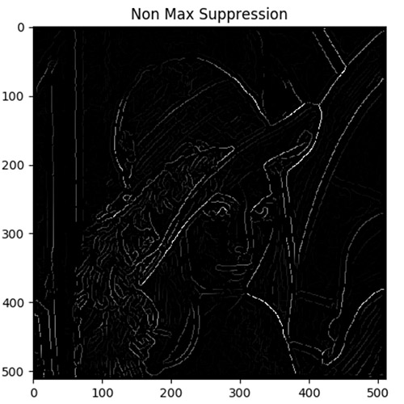
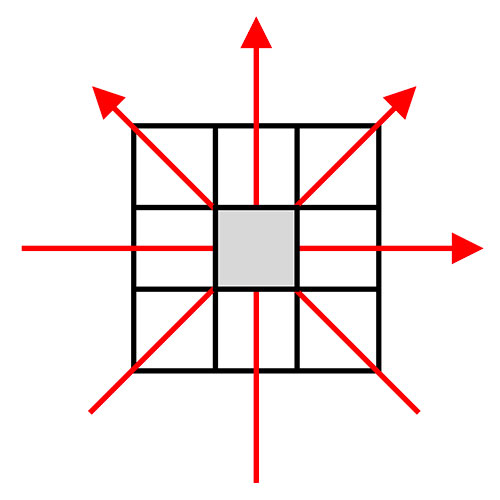
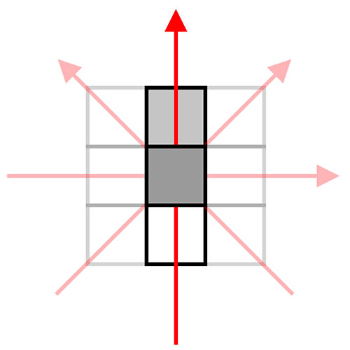
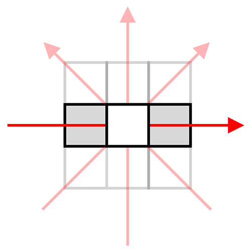
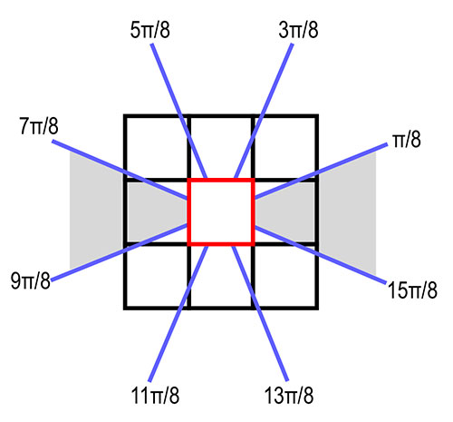
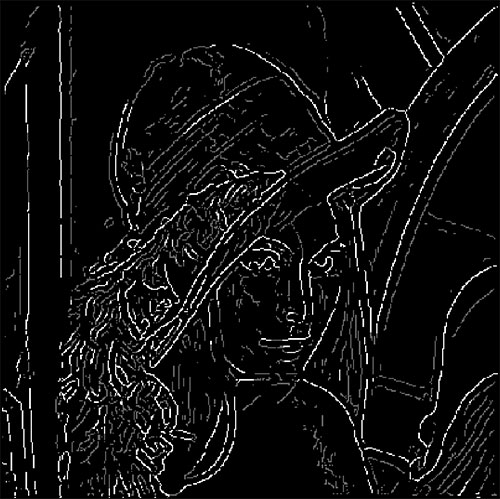
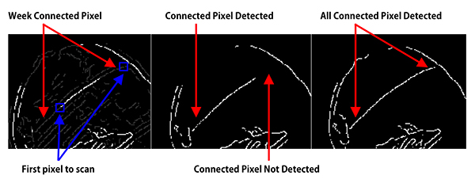
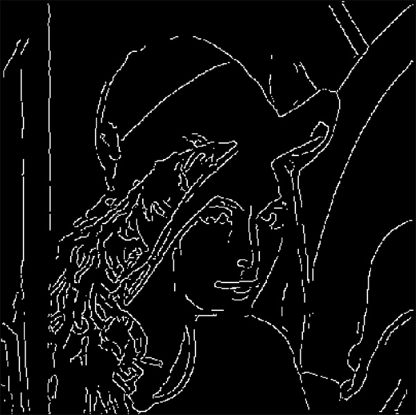

Canny edge detector is the most widely used edge detector in Computer Vision, hence understanding and implementing it will be very important for any CV Engineer. In this tutorial we will Implement Canny Edge Detection Algorithm using Python from scratch. There are many incomplete implementation are available in GitHub, however we will understand every step and build the complete algorithm.


## Canny Edge Detector Steps
- Smooth image with Gaussian Noise.
- Find magnitude and orientation of gradient.
- Apply Non-max suppression.
- Apply Hysteresis threshold.


## Smooth image with Gaussian Noise
I have already posted tutorial on this. Please refer it  [here](https://adeveloperdiary.github.io/posts/machine%20learning/computer%20vision/Applying-Gaussian-Smoothing-to-an-Image-using-Python-from-scratch/)

## Find magnitude and orientation of gradient

I also have a tutorial on calculating the magnitude of the gradient. Please refer it [here](https://adeveloperdiary.github.io/posts/machine%20learning/computer%20vision/how-to-implement-sobel-edge-detection-using-python-from-scratch/)

### Orientation of Gradient  
We will update our   `sobel_edge_detection()` function to calculate the   `Orientation of Gradient`. 

```python
def sobel_edge_detection(image, filter, convert_to_degree=False, verbose=False):
    ...
```

First we will add another argument to the function named   `convert_to_degree`.

The equation for calculating the Orientation of Gradient is:

$$
\theta = tan^{-1} \bigg( \frac{G_x}{G_y} \bigg)
$$

```python
gradient_direction = np.arctan2(new_image_y, new_image_x)

if convert_to_degree:
    gradient_direction = np.rad2deg(gradient_direction)
    gradient_direction += 180

return gradient_magnitude, gradient_direction
```

Use the Numpy’s   `arctan2()  ` function to calculate the gradient direction. However the returned value will be in radian. If the   `convert_to_degree  ` is set to   `True  ` then we will convert it to degree by calling the   `rad2deg()  ` function. This returns the degree between   `-180 to 180  `, which we will convert from   `0 to 360  ` by adding   `180  ` to   `gradient_direction  `.

Finally we will return both the magnitude and direction of gradient.

As you have seen already we can plot the Gradient Magnitude.



## Apply Non-max Suppression
This is probably the most important step in Canny Edge Detection Algorithm. We have two different parameters 

- Magnitude of the Gradient
- Direction of the Gradient

Our objective is to remove redundant/duplicate edges identified by Sobel Edge Detection ( Refer the image above ). We want just one line to show the edge rather than having multiple lines for the same edge. This can be done by the Non-Max Suppression Algorithm.

A pixel can have total 4 directions for the gradient (shown below) since there are total 8 neighboring pixels. 



We want to make sure no adjacent pixels are representing the same edge and in order to do that, we want to compare the Magnitude of the gradient between one pixel and it's neighboring pixels along the same direction and select the pixel whose magnitude is the largest. Let’s understand that in more detail.

We will start with a black image where all pixel values are zero.

Now, consider the following example. We have a pixel (middle one) who’s gradient's direction is 90 degree. Hence we will compare the magnitude of the gradient with both the pixel above (90 Degree) and below (270 Degree) it. Now in this example white represents higher value (255) and black represents lower value (0). We can see that the bottom pixel has higher value than the one we are comparing with. Hence we won’t take the value of the selected pixel. Since we started with a black image, the value of this this pixel will remain 0.



Here is another example, say the gradient direction of a given pixel is 0 degree. So we will compare the magnitude of gradient of the right ( 0 degree ) and left ( 180 degree ) pixel with it. In this example, clearly the magnitude of gradient of the selected pixel is higher than the other two, hence we update our output pixel value by the magnitude of gradient of the selected pixel.



We will repeat this for all the pixel except the boarding pixel of the image. The output will look like following:


There is one more concept to go through before we jump into the code. In our example we have taken the direction as 90 ( or 0 ) degree, where we know we had to compare the top or bottom pixel. What about 57 Degree or 113 Degree? 

In order to solve this problem, we will consider a range of degrees to select a neighbor. Look at the below picture. If the direction of the middle pixel is between \(\frac{15\pi}{8}\) &amp; \(\frac{\pi}{8}\) and also between \(\frac{7\pi}{8}\) &amp; \(\frac{9\pi}{8}\), then we shall compare the middle pixel with the left one right neighbor pixels.



Now let’s look at the code:

```python
def non_max_suppression(gradient_magnitude, gradient_direction, verbose):

    image_row, image_col = gradient_magnitude.shape

    output = np.zeros(gradient_magnitude.shape)

    PI = 180
```

Our   `non_max_suppression()  ` function takes 2 arguments. The Gradient Magnitude and Direction.

Our output image will start with with a back image with the same width and height of the input image. Then we will set pi to 180 degree.


```python
for row in range(1, image_row - 1):
    for col in range(1, image_col - 1):
        direction = gradient_direction[row, col]

        if (0 <= direction < PI / 8) or (15 * PI / 8 <= direction <= 2 * PI):
            before_pixel = gradient_magnitude[row, col - 1]
            after_pixel = gradient_magnitude[row, col + 1]

        elif (PI / 8 <= direction < 3 * PI / 8) or (9 * PI / 8 <= direction < 11 * PI / 8):
            before_pixel = gradient_magnitude[row + 1, col - 1]
            after_pixel = gradient_magnitude[row - 1, col + 1]

        elif (3 * PI / 8 <= direction < 5 * PI / 8) or (11 * PI / 8 <= direction < 13 * PI / 8):
            before_pixel = gradient_magnitude[row - 1, col]
            after_pixel = gradient_magnitude[row + 1, col]

        else:
            before_pixel = gradient_magnitude[row - 1, col - 1]
            after_pixel = gradient_magnitude[row + 1, col + 1]

        if gradient_magnitude[row, col] >= before_pixel and gradient_magnitude[row, col] >= after_pixel:
            output[row, col] = gradient_magnitude[row, col]
```

This loop is the main part of the algorithm. We will loop through all the pixels in the gradient directions ( except the border pixels ). Then based on the value of gradient direction we will store the gradient magnitude of the two neighboring pixel. At the end we will find out whether the selected/middle pixel has the highest gradient magnitude or not. If not we continue with the loop, otherwise update the output image for the given row and col with the value of the gradient magnitude. 

## Apply Hysteresis threshold
If you notice, the output after non-max suppression has few edges in bright white, however many of them are between gray to dark-gray. Again, our objective is to produce clear edges ( all the edge pixel will be 255 ). We will achieve this using   `Hysteresis Threshold  `.

We will break the concept in two parts:

- Apply thresholding
- Apply hysteresis


### Apply thresholding  
The main idea of thresholding, as the name suggest is to take all the edges and define them either week (some low number say 50) or strong ( white - 255 ). It will be more easy to understand when you look at the output:




```python
def threshold(image, low, high, weak, verbose=False):
    info_log("threshold()")

    output = np.zeros(image.shape)

    strong = 255

    strong_row, strong_col = np.where(image >= high)
    weak_row, weak_col = np.where((image <= high) &amp; (image >= low))

    output[strong_row, strong_col] = strong
    output[weak_row, weak_col] = weak

    if verbose:
        plt.imshow(output, cmap='gray')
        plt.title("threshold")
        plt.show()

    return output
```

In our   `threshold()  ` function if the value of any pixel is higher than the high value, then we set it to 255. We assume these are proper edges. Next if the pixels are between low and high value then we set them to week value ( passed as an argument ). Remaining pixels will all the 0.

The function call will look like below:


```python
weak = 100

new_image = threshold(new_image, 5, 20, weak=weak, verbose=args["verbose"])
```

### Apply hysteresis  
So we already have the confirmed edges in white pixel ( 255 ) and other pixels in some weak value ( say 50 ). The objective of the hysteresis function is to identify the weak pixels which can be edges and discard the remaining. 

Obvious question is how to determine which pixels are part of real edges? We want to find out whether a selected pixel is connected to the already defined edge pixels, if so we can consider this pixel also to be part of an edge.The simple solution is to find out whether any given pixels neighbors ( as we have seen earlier, there will be total 8 ) has value equal to 255, if yes then change the value of the pixel to 255, otherwise discard the pixel by setting the value to 0.

```python
def hysteresis(image, weak):
    image_row, image_col = image.shape

    top_to_bottom = image.copy()

    for row in range(1, image_row):
        for col in range(1, image_col):
            if top_to_bottom[row, col] == weak:
                if top_to_bottom[row, col + 1] == 255 or top_to_bottom[row, col - 1] == 255 or top_to_bottom[row - 1, col] == 255 or top_to_bottom[
                    row + 1, col] == 255 or top_to_bottom[
                    row - 1, col - 1] == 255 or top_to_bottom[row + 1, col - 1] == 255 or top_to_bottom[row - 1, col + 1] == 255 or top_to_bottom[
                    row + 1, col + 1] == 255:
                    top_to_bottom[row, col] = 255
                else:
                    top_to_bottom[row, col] = 0
```

We will loop through each pixel in the image, if the value of the pixel is weak (we have to do this only for weak pixels) and verify whether there are any neighboring pixel with value 255. If not then set the value of the pixel to 0.

Many of the tutorials available online implements hysteresis partially. The above code detects connected edges only if the weak pixels are after the strong pixels. Let's look at an example.

The thresholding output has a circular edge in the hat, where the middle part contains strong pixels, left and right side have weak pixels. As per hysteresis algorithm the entire edge should have been selected since its connected and continuous. 

However if we implement just algorithm we have learned so far, the left part of the edge will be detected but not the right part ( 2nd Image ). This is because we are scanning from left-top to bottom-down. When we arrive at the a pixel at the right top corner of the edge right weak edge, there are no neighboring pixels with the value 255, hence its been set to 0. However that’s not true when we arrive at the first pixel of the left weak edge (blue arrow).



In order to fix the problem, we need to also scan the image from bottom-right to top-left corner, which will help to detect the right part of the edge. ( 3rd image on top ). We will do this total 4 times from all corners.


```python
bottom_to_top = image.copy()

for row in range(image_row - 1, 0, -1):
    for col in range(image_col - 1, 0, -1):
        if bottom_to_top[row, col] == weak:
            if bottom_to_top[row, col + 1] == 255 or bottom_to_top[row, col - 1] == 255 or bottom_to_top[row - 1, col] == 255 or bottom_to_top[
                row + 1, col] == 255 or bottom_to_top[
                row - 1, col - 1] == 255 or bottom_to_top[row + 1, col - 1] == 255 or bottom_to_top[row - 1, col + 1] == 255 or bottom_to_top[
                row + 1, col + 1] == 255:
                bottom_to_top[row, col] = 255
            else:
                bottom_to_top[row, col] = 0

right_to_left = image.copy()

for row in range(1, image_row):
    for col in range(image_col - 1, 0, -1):
        if right_to_left[row, col] == weak:
            if right_to_left[row, col + 1] == 255 or right_to_left[row, col - 1] == 255 or right_to_left[row - 1, col] == 255 or right_to_left[
                row + 1, col] == 255 or right_to_left[
                row - 1, col - 1] == 255 or right_to_left[row + 1, col - 1] == 255 or right_to_left[row - 1, col + 1] == 255 or right_to_left[
                row + 1, col + 1] == 255:
                right_to_left[row, col] = 255
            else:
                right_to_left[row, col] = 0

left_to_right = image.copy()

for row in range(image_row - 1, 0, -1):
    for col in range(1, image_col):
        if left_to_right[row, col] == weak:
            if left_to_right[row, col + 1] == 255 or left_to_right[row, col - 1] == 255 or left_to_right[row - 1, col] == 255 or left_to_right[
                row + 1, col] == 255 or left_to_right[
                row - 1, col - 1] == 255 or left_to_right[row + 1, col - 1] == 255 or left_to_right[row - 1, col + 1] == 255 or left_to_right[
                row + 1, col + 1] == 255:
                left_to_right[row, col] = 255
            else:
                left_to_right[row, col] = 0
```

Sum all the pixels to create our final image. The white pixels will add up, hence to make sure there is no pixel value greater than 255, we threshold them to 255. Return the   `final_image  `.


```python
final_image = top_to_bottom + bottom_to_top + right_to_left + left_to_right

final_image[final_image > 255] = 255

return final_image
```

The output will look like:




## Full Code


```python
import numpy as np
import cv2
import argparse

from Computer_Vision.Canny_Edge_Detection.sobel import sobel_edge_detection
from Computer_Vision.Canny_Edge_Detection.gaussian_smoothing import gaussian_blur

import matplotlib.pyplot as plt


def non_max_suppression(gradient_magnitude, gradient_direction, verbose):
    image_row, image_col = gradient_magnitude.shape

    output = np.zeros(gradient_magnitude.shape)

    PI = 180

    for row in range(1, image_row - 1):
        for col in range(1, image_col - 1):
            direction = gradient_direction[row, col]

            if (0 <= direction < PI / 8) or (15 * PI / 8 <= direction <= 2 * PI):
                before_pixel = gradient_magnitude[row, col - 1]
                after_pixel = gradient_magnitude[row, col + 1]

            elif (PI / 8 <= direction < 3 * PI / 8) or (9 * PI / 8 <= direction < 11 * PI / 8):
                before_pixel = gradient_magnitude[row + 1, col - 1]
                after_pixel = gradient_magnitude[row - 1, col + 1]

            elif (3 * PI / 8 <= direction < 5 * PI / 8) or (11 * PI / 8 <= direction < 13 * PI / 8):
                before_pixel = gradient_magnitude[row - 1, col]
                after_pixel = gradient_magnitude[row + 1, col]

            else:
                before_pixel = gradient_magnitude[row - 1, col - 1]
                after_pixel = gradient_magnitude[row + 1, col + 1]

            if gradient_magnitude[row, col] >= before_pixel and gradient_magnitude[row, col] >= after_pixel:
                output[row, col] = gradient_magnitude[row, col]

    if verbose:
        plt.imshow(output, cmap='gray')
        plt.title("Non Max Suppression")
        plt.show()

    return output


def threshold(image, low, high, weak, verbose=False):
    output = np.zeros(image.shape)

    strong = 255

    strong_row, strong_col = np.where(image >= high)
    weak_row, weak_col = np.where((image <= high) &amp; (image >= low))

    output[strong_row, strong_col] = strong
    output[weak_row, weak_col] = weak

    if verbose:
        plt.imshow(output, cmap='gray')
        plt.title("threshold")
        plt.show()

    return output


def hysteresis(image, weak):
    image_row, image_col = image.shape

    top_to_bottom = image.copy()

    for row in range(1, image_row):
        for col in range(1, image_col):
            if top_to_bottom[row, col] == weak:
                if top_to_bottom[row, col + 1] == 255 or top_to_bottom[row, col - 1] == 255 or top_to_bottom[row - 1, col] == 255 or top_to_bottom[
                    row + 1, col] == 255 or top_to_bottom[
                    row - 1, col - 1] == 255 or top_to_bottom[row + 1, col - 1] == 255 or top_to_bottom[row - 1, col + 1] == 255 or top_to_bottom[
                    row + 1, col + 1] == 255:
                    top_to_bottom[row, col] = 255
                else:
                    top_to_bottom[row, col] = 0

    bottom_to_top = image.copy()

    for row in range(image_row - 1, 0, -1):
        for col in range(image_col - 1, 0, -1):
            if bottom_to_top[row, col] == weak:
                if bottom_to_top[row, col + 1] == 255 or bottom_to_top[row, col - 1] == 255 or bottom_to_top[row - 1, col] == 255 or bottom_to_top[
                    row + 1, col] == 255 or bottom_to_top[
                    row - 1, col - 1] == 255 or bottom_to_top[row + 1, col - 1] == 255 or bottom_to_top[row - 1, col + 1] == 255 or bottom_to_top[
                    row + 1, col + 1] == 255:
                    bottom_to_top[row, col] = 255
                else:
                    bottom_to_top[row, col] = 0

    right_to_left = image.copy()

    for row in range(1, image_row):
        for col in range(image_col - 1, 0, -1):
            if right_to_left[row, col] == weak:
                if right_to_left[row, col + 1] == 255 or right_to_left[row, col - 1] == 255 or right_to_left[row - 1, col] == 255 or right_to_left[
                    row + 1, col] == 255 or right_to_left[
                    row - 1, col - 1] == 255 or right_to_left[row + 1, col - 1] == 255 or right_to_left[row - 1, col + 1] == 255 or right_to_left[
                    row + 1, col + 1] == 255:
                    right_to_left[row, col] = 255
                else:
                    right_to_left[row, col] = 0

    left_to_right = image.copy()

    for row in range(image_row - 1, 0, -1):
        for col in range(1, image_col):
            if left_to_right[row, col] == weak:
                if left_to_right[row, col + 1] == 255 or left_to_right[row, col - 1] == 255 or left_to_right[row - 1, col] == 255 or left_to_right[
                    row + 1, col] == 255 or left_to_right[
                    row - 1, col - 1] == 255 or left_to_right[row + 1, col - 1] == 255 or left_to_right[row - 1, col + 1] == 255 or left_to_right[
                    row + 1, col + 1] == 255:
                    left_to_right[row, col] = 255
                else:
                    left_to_right[row, col] = 0

    final_image = top_to_bottom + bottom_to_top + right_to_left + left_to_right

    final_image[final_image > 255] = 255

    return final_image


if __name__ == '__main__':
    ap = argparse.ArgumentParser()
    ap.add_argument("-i", "--image", required=True, help="Path to the image")
    ap.add_argument("-v", "--verbose", type=bool, default=False, help="Path to the image")
    args = vars(ap.parse_args())

    image = cv2.imread(args["image"])

    blurred_image = gaussian_blur(image, kernel_size=9, verbose=False)

    edge_filter = np.array([[-1, 0, 1], [-2, 0, 2], [-1, 0, 1]])

    gradient_magnitude, gradient_direction = sobel_edge_detection(blurred_image, edge_filter, convert_to_degree=True, verbose=args["verbose"])

    new_image = non_max_suppression(gradient_magnitude, gradient_direction, verbose=args["verbose"])

    weak = 50

    new_image = threshold(new_image, 5, 20, weak=weak, verbose=args["verbose"])

    new_image = hysteresis(new_image, weak)

    plt.imshow(new_image, cmap='gray')
    plt.title("Canny Edge Detector")
    plt.show()
```


## Project in Github
Please find the full project here:

<div style='text-align:center;margin-bottom:30px;'>
<input type='button' value="GitHub" onclick="javascript:window.open('https://github.com/adeveloperdiary/blog/tree/master/Computer_Vision/Canny_Edge_Detection','_blank')"/>
</div>