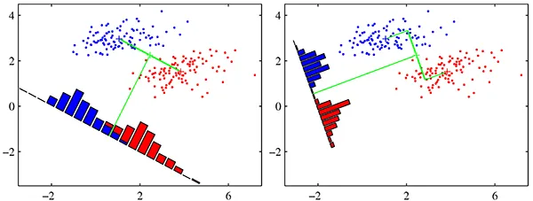

Linear Discriminant Analysis (LDA) is an important tool in both Classification and Dimensionality Reduction technique. Most of the text book covers this topic in general, however in this Linear Discriminant Analysis - from Theory to Code tutorial we will understand both the mathematical derivations, as well how to implement as simple LDA using Python code. I believe you should be confident about LDA after going through the post end to end.

## Prerequisite
You need to understand basic Linear Algebra in order to follow in this tutorial. Specifically you should know about Vector, Matrix and Eigen Decomposition.

## Objective
Linear Discriminant Analysis can be used for both Classification and Dimensionality Reduction. The basic idea is to find a vector `w` which maximizes the separation between target classes after projecting them onto `w`. Refer the below diagram for a better idea, where the first plot shows a non-optimal projection of the data points and the 2nd plot shows an optimal projection of the data point so that the classes are well separated. 

LDA is a supervised algorithm ( Unlike PCA ), hence we need to have the target classes specified. 



<span style="font-size:10px">Credit: Above picture has been taken from "Pattern Recognition and Machine Learning" by "Christopher Bishop"</span>

## Orthogonal Projection
As per the objective, we need to project the input data onto `w` vector. Assume that we already know w (I will show how to find optimal w later). Now let’s derive the equation for orthogonally projecting a vector `x` ( input vector ) onto vector w. 

In the below diagram the vector `p` is called the `Orthogonal Projection` of `x` onto `w`. The `d` vector is the perpendicular distance between x and w. This is also known as the `residual` or `error vector`.

$$
d= x-p
$$


Since `p` is parallel to `w`, we can write,

$$
\begin{align}
p=cw \\
\text{where } c = \text{some scaler}
\end{align}
$$

We can rewrite `d` as,

$$
\begin{align}
d & = x-p\\
 & = x-cw
\end{align}
$$

We know that if two vectors are orthogonal to each other than the dot product between them will be 0. In this case p and d are orthogonal to each other, hence we can write them as,

$$
\begin{align}
p^Td & = 0 \\
(cw)^T(x-cw) & = 0 \\
cw^Tx - c^2wTw & = 0 \\
cw^Tw & = w^Tx \\
c & = \frac{w^Tx}{w^Tw}
\end{align}
$$

We can now rewrite the expression of p as,

$$
\begin{align}
p & = \left (  \frac{w^Tx}{w^Tw}  \right ) w
\end{align}
$$

## Optimal Linear Discriminant
First we will develop the general concept on building an Optimal Linear Discriminant, then work on the objective function later. 

Assume w to an `unit vector`, which means,

$$
w^Tw = 1
$$

We can write the orthogonal projection of any n-dimensional vector $$\hat{x_i} $$ onto the vector w as,

$$
\begin{align}
\hat{x_i} & = \left (  \frac{w^Tx_i}{w^Tw}  \right ) w \\
& = \left (  w^Tx_i  \right ) w \\
& = a_i w
\end{align}
$$

Above $$ a_i $$ is the offset/coordinate of  $$ \hat{x_i} $$ along the line `w`. A set of these scaler values $$ \left \{  a_1, a_2  ... a_n  \right \} $$ represents the mapping from $$ \mathbf{R}^d \rightarrow  \mathbf{R} $$. This means if we know the value of $$ w $$, we can reduce the dimension of the data from d-dimension to 1-dimension.

### Dataset Assumption
Just for simplicity, assume our dataset has only 2 target class and 2 input fields. This will help us to visualize the results effectively. So we can say,

$$
\begin{align}
x_i \in \mathbf{R}^d \\
\text{where } d = 2 
\end{align}
$$

Also, we can define $$D$$ as following,
$$
\begin{align}
D_i = \left \{ x_j|y_j = c_i \right \}
\end{align}
$$

Here $$ y_i $$ is the target labels and $$ c_i $$ is the target class.  $$ D_i $$ is the subset of the datasets labelled with class $$c_i$$

### Mean of the Projected Points
Since we already know the target class labels, we can easily calculate the mean of the projected data points for each class separately as,

$$
\begin{align}
m_1 & = \frac{1}{n_1} \sum_{x_i \in D_1} a_i \\
& = \frac{1}{n_1} \sum_{x_i \in D_1} w^Tx_i \\
& = w^T \left ( \frac{1}{n_1} \sum_{x_i \in D_1} x_i \right ) \\
& = w^T \mu_1 
\end{align}
$$

Here, $$ \mu_1$$ is the mean of all input data points in $$D_1$$

Very similarly, we can define $$m_2$$ as,

$$
\begin{align}
m_1 & = w^T \mu_2
\end{align}
$$

### Two Important Ideas
In order to maximize the separation between the classes ( in the projected space ), we can think of maximizing the difference between the projected means $$ |m_1-m_2| $$. 

However this condition alone is not sufficient to make sure in the projected space the data points are separated for each class. We need to think about the variance of the projected data in each class. A large variance will lead to overlapping data points among two classes ( we have only 2 classes in our data ).

So we need to look at minimizing the variance in class too. `LDA` does not use the variance directly, rather uses the following formulation.

$$
\begin{align}
s_i^2 = \sum_{x_j \in D_i} (a_j - m_i)^2
\end{align}
$$

$$ s_i^2 $$ is the total squared deviation from the mean ( remember, variance is the mean deviation). This is also known as `scatter matrix`.

## Fisher's LDA
We can incorporate the above two ideas, 

- Maximize the distance between projected means
- Minimize the sum of the projected scatter

into one equation, named as Fisher's LDA.

$$
\begin{align}
\max_w J(w) = \frac{(m_1-m_2)^2}{s_1+s_2}
\end{align}
$$

So the goal of LDA is to find the vector $$ w $$ which maximizes $$ J(w) $$. This vector $$ w $$ is also called as `Optimal Linear Discriminant`.

### Rewrite the Equation using InputData
The above objective function is in projected space, so let's express it using the input data, since $$ w $$ is still unknown.

$$
\begin{align}
(m_1-m_2)^2 = &  (w^T\mu_1 - w^T\mu_2)^2 \\
= & [w^T(\mu_1-\mu_2)]^2 \\
= & w^T(\mu_1-\mu_2)(\mu_1-\mu_2)^Tw \\
= & w^TBw
\end{align}
$$

Here $$B$$ is called between class `scatter matrix`. It will be a `dxd` matrix.

$$
\begin{align}
s_1^2= & \sum_{x_i \in D_i} (a_i - m_1)^2 \\
= & \sum_{x_i \in D_i} (w^Tx_i - w^T\mu_1)^2 \\
= & \sum_{x_i \in D_i} \bigg( w^T \left (  x_i - \mu_1 \right ) \bigg)^2 \\
= & w^T \bigg( \sum_{x_i \in D_i}  \left (  x_i - \mu_1 \right )\left (  x_i - \mu_1 \right )^T \bigg) w \\
= & w^TS_1w
\end{align}
$$

Above, $$S_1$$ is the scatter matrix for $$D_1$$.

Similarly we can define $$S_2$$.

$$
\begin{align}
s_2^2 = & w^TS_2w
\end{align}
$$

We can combine the above equations,

$$
\begin{align}
s_1^2+s_2^2 & = w^TS_1w+w^TS_2w\\
& = w^T(S_1+S_2)w \\
& = w^TSw
\end{align}
$$

Now, we can rewrite the LDA `Objective Function` as,

$$
\begin{align}
\max_w J(w) = \frac{w^TBw}{w^TSw}
\end{align}
$$

## Solving the Objective Function
You might have already guessed, in order to solve for the best direction of $$w$$ we need to differentiate the objective function w.r.t $$w$$ and set that to zero. 

Recall that if $$f(x)$$ and $$f(x)$$ are two functions, when we can define the derivative w.r.t $$x$$ as,

$$
\frac{d}{dx} \bigg( \frac{f(x)}{g(x)} \bigg) = \frac{f{\prime}(x)g(x) - g(x){\prime}f(x)}{g(x)^2}
$$

We can use the above formula to differentiate our cost/objective function.

$$
\begin{align}
\frac{d}{dw} J(w) = &  \frac{(2Bw)(w^TSw) - (2Sw)(w^TBw)}{(w^TSw)^2} = 0 \\ 
Bw(w^TSw)= & Sw(w^TBw) \\
Bw =& Sw \bigg ( \frac{w^TBw}{w^TSw} \bigg) \\
Bw =& J(w) Sw \\
Bw =& \lambda Sw \\
S^{-1}Bw =& \lambda S^{-1}Sw \\
(S^{-1}B)w =& \lambda w \\
\end{align}
$$

If the $$S $$ not a `singular` matrix ( inverse exists ) then the above equation can be considered as general `Eigenvalue-Eigenvector` decomposition.
$$\lambda = J(w)$$ is Eigenvalue and $$w$$ is the Eigenvector of the matrix $$S^{-1}B$$.

Now all we have to do is calculate the Eigen decomposition of $$S^{-1}B$$, then get the Eigenvector corresponding to the largest Eigenvalue. That will be our optimized best valued $$w$$ vector.

## LDA for Multi-Class
In case you want to use LDA for more than 2 classes, there will be a small change in the way we calculate $$B$$. The scatter matrix $$S$$ still be the same.

$$
\begin{align}
B = \sum_{i = 1}^C n_i (\mu_i - \mu)(\mu_i - \mu)^T
\end{align}
$$

Where,
- $$C$$ = numbest of target classes
- $$n_i$$ = Number of dataset in each class
- $$\mu_i$$ = Mean of the datasets for specific class
- $$\mu$$ = Mean of the entire dataset


## LDA Python Implementation
First we will create a LDA class, implement the logics there and then run different experiments.

```python
class LDA:
    def __init__(self):
        pass

    def fit(self, X, y):
        pass
```

### fit()
Then inside the `fit()` function, first get the target classes, then calculate the mean for each class. Store them in `mean_vectors` list.

```python
def fit(self, X, y):
	target_classes = np.unique(y)
	mean_vectors = []
	for cls in target_classes:
		mean_vectors.append(np.mean(X[y == cls], axis=0))
```

If the number of class is 2, then simply calculate the B matrix as per the above equation.

```python
mu1_mu2 = (mean_vectors[0] - mean_vectors[1]).reshape(1, X.shape[1])
B = np.dot(mu1_mu2.T, mu1_mu2)
```

In case there are more than 2 classes, we need to first calculate the mean of the entire dataset. Then using that calculate the `B` matrix. 

```python
data_mean = np.mean(X, axis=0).reshape(1, X.shape[1])
B = np.zeros((X.shape[1], X.shape[1]))
for i, mean_vec in enumerate(mean_vectors):
	n = X[y == i].shape[0]
	mean_vec = mean_vec.reshape(1, X.shape[1])
	mu1_mu2 = mean_vec - data_mean

	B += n * np.dot(mu1_mu2.T, mu1_mu2)
```

Now its time to create the S matrix. Define an empty array `s_matrix` to store the scatter matrix for each class. Then loop through the `mean_vectors` and each data points to calculate the `Si`. Append each value to the list. Again, we are just following above formula. In case you are confused, please refer the equations.

```python
s_matrix = []

for cls, mean in enumerate(mean_vectors):
	Si = np.zeros((X.shape[1], X.shape[1]))
	for row in X[y == cls]:
		t = (row - mean).reshape(1, X.shape[1])
		Si += np.dot(t.T, t)
	s_matrix.append(Si)
```

Crete the `S` matrix and loop through the `s_matrix` list to append all the values.

```python
S = np.zeros((X.shape[1], X.shape[1]))
for s_i in s_matrix:
	S += s_i
```

Calculate the $$S^{-1}$$ using `np.linalg.inv()` then calculate the $$S^{-1}B$$. Finally call  `np.linalg.eig()` to get the eigen vector and eigen values.

```python
S_inv = np.linalg.inv(S)

S_inv_B = S_inv.dot(B)

eig_vals, eig_vecs = np.linalg.eig(S_inv_B)
```

The `np.linalg.eig()` function does not sort the eigen values, so we need to do that programmatically. Use the `argsort()` function, then reverse the array by using `[::-1]`. Use the index to order the `eig_vals` and `eig_vecs`. Finally return the `eig_vecs`.


```python
idx = eig_vals.argsort()[::-1]

eig_vals = eig_vals[idx] # Not needed
eig_vecs = eig_vecs[:, idx]

return eig_vecs
```


### load_data()
We will be using the iris dataset. Hence need a function to load the datasets as needed for running various experiments. I am not explaining this `load_data()`, feel free to post comments if you need any help.

```python
def load_data(cols, load_all=False, head=False):
    iris = sns.load_dataset("iris")

    if not load_all:
        if head:
            iris = iris.head(100)
        else:
            iris = iris.tail(100)

    le = preprocessing.LabelEncoder()
    y = le.fit_transform(iris["species"])

    X = iris.drop(["species"], axis=1)

    if len(cols) &gt; 0:
        X = X[cols]

    return X.values, y
```


### Experiment 1: 2 Classes, 2 Column Dataset
We will use `petal_length` and `petal_width` only. Also we will use only 2 classes from the dataset. Call `load_data()`. The shape of `X` will be `(100, 2)`

```python
cols = ["petal_length", "petal_width"]
X, y = load_data(cols, load_all=False, head=True)
print(X.shape)
```

Invoke `fit()` by passing the `X` and `y`, which will return all the eigen vectors.

```python
lda = LDA()
W = lda.fit(X, y)
```

We can just get the first eigen vector since we want to reduce the dimension to 1.

```python
W = eig_vecs[:, :1]
```

We will loop through each data point, plot them using `ax.scatter()` then use the `Orthogonal Projection` to calculate the projected space.

```python
colors = ['red', 'green', 'blue']
fig, ax = plt.subplots(figsize=(10, 8))
for point, pred in zip(X, y):
    ax.scatter(point[0], point[1], color=colors[pred], alpha=0.3)
    proj = (np.dot(point, W) * W) / np.dot(W.T, W)

    ax.scatter(proj[0], proj[1], color=colors[pred], alpha=0.3)

plt.show()
```

Here is the plot below. You can see the LDA algorithm has found the plane to separate the data optimally.


### Experiment 2: 3 Classes, 2 Column Dataset
We will use the full `iris` dataset with 3 classes. Pass `load_all=True` in the `load_data()` function. There are no other changes required.

```python
cols = ["petal_length", "petal_width"]
X, y = load_data(cols, load_all=True, head=True)
print(X.shape)

lda = LDA()
eig_vecs = lda.fit(X, y)
W = eig_vecs[:, :1]

colors = ['red', 'green', 'blue']
fig, ax = plt.subplots(figsize=(10, 8))
for point, pred in zip(X, y):
    ax.scatter(point[0], point[1], color=colors[pred], alpha=0.3)
    proj = (np.dot(point, W) * W) / np.dot(W.T, W)

    ax.scatter(proj[0], proj[1], color=colors[pred], alpha=0.3)

plt.show()
```

Here is the plot. You can see that all three classes are well separated in 1 dimension. 


### Experiment 3: 3 Classes, 4 Column Dataset
Now, if we want to reduce the dimension of the data from 4 to 2, we can take the 2 eigen vectors and them transform the data using `X.dot(W)`.

```python
X, y = load_data([], load_all=True, head=True)
print(X.shape)

lda = LDA()
eig_vecs = lda.fit(X, y)
W = eig_vecs[:, :2] # Take 2 eigen vectors

transformed = X.dot(W)

plt.scatter(transformed[:, 0], transformed[:, 1], c=y, cmap=plt.cm.Set1)
plt.show()
```

Here is the projected data in 2 dimensions. As you can see we are able to reduce the dimension from 4 to 2 using LDA without loosing much information.


### sklearn library
Use can use built in `LinearDiscriminantAnalysis` class from the sklearn library.

```python
from sklearn.discriminant_analysis import LinearDiscriminantAnalysis

clf = LinearDiscriminantAnalysis()
clf.fit(X, y)
transformed = clf.transform(X)

plt.scatter(transformed[:, 0], transformed[:, 1], c=y, cmap=plt.cm.Set1)
plt.show()
```

The plot looks the same, it's just the flipped.


## Conclusion
Linear Discriminant Analysis (LDA) is simple yet powerful tool. Often PCA and LDA are compared, however LDA is Supervised Learning Method and PCA is Unsupervised Learning Method. There are other extensions of LDA are available, such as Kernel LDA, QDA etc. 

You can find the full code in GitHub.

<div style='text-align:center;margin-bottom:30px;'>
<input type='button' value="GitHub" onclick="javascript:window.open('https://github.com/adeveloperdiary/blog/blob/master/LDA/lda.py','_blank')"/>
</div>