Support Vector Machines (SVM) is a very popular machine learning algorithm for classification. We still use it where we don't have enough dataset to implement Artificial Neural Networks. In academia almost every Machine Learning course has SVM as part of the curriculum since it's very important for every ML student to learn and understand SVM. However most of the time the learning curve is not very smooth as it's a vast subject by itself and often most of the curriculums are trying to squeeze many topics in one course.

I felt SVM is very hard to understand during my ML class at University, then had another struggle to find the resources which can teach me SVM from ground up. It took me around 2 weeks just to go through all the derivations and have a basic understanding of Support Vector Machines. Hence I wanted to create a tutorial where I want to explain every intricate part of SVM in a very beginner friendly way. This **Support Vector Machines for Beginners - Linear SVM** article is the first part of the lengthy series. We will go through concepts, mathematical derivations then code everything in python without using any SVM library. If you have just completed Logistic Regression or want to brush up your knowledge on SVM then this tutorial will help you.

This tutorial series has total around 80 pages (A4 Size) of handwritten contents. I have tried to provide as much as necessary details including mathematical derivations and programming concepts. This is the first part of the 4 parts series.

## Video Tutorials

I have been recording some part of the tutorial as it's easier to understand in video than just plain text. Hence I hope recorded videos will help you. I strongly recommend to follow along with both the video and text. Some parts are repeated in both video and the text intentionally. Read the text after watching the video to recap each concept. The recordings are still in progress and I will incorporate them whenever ready, however didn't want to hold the content till all the recordings are ready.

## Prerequisites

I will explain all the concepts from scratch, however I will suggest to learn Logistic Regression before starting Support Vector Machines.

## Why Support Vector Machines (SVM) is better than other ML Classification Algorithms

[](https://youtu.be/kOlJ0M2LZPM)

on-linear boundary (There is a way to implement kernel in Logistic Regression). As you might already know, the feature engineering step is a time consuming process in the software development pipeline. In SVM we can classify data using `non-linear boundary` without the manual feature engineering step. There is still a HyperParameter for the `kernel` type to set, but you will mostly have few options to choose from. This also helps to establish a baseline for your model.

## Learning Curve

Unless you are from math or statistics background many of the concepts and terminologies might not sound familiar. Hence generally its a good practice to breakdown the concept of SVM in three parts:

- Linear SVM
  - Hard Margin Classifier
  - Soft Margin Classifier
- Non - Linear SVM

[](https://youtu.be/0ARFtw8mG_M)

### 1. Linear SVM - Hard Margin Classifier

Here we will build our initial concept of SVM by classifying perfectly separated dataset ( linear classification ). This is also called "Linear SVM - Hard Margin Classifier". We will define the objective function. This tutorial is dedicated for Hard Margin Classifier.

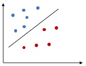

### 2. Linear SVM - Soft Margin Classifier

We will extend our concept of Hard Margin Classifier to solve for dataset where there are some outliers. In this case all of the data points cant be separated using a straight line, there will be some miss-classified points. This is similar of adding regularization to a regression model.

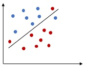

### 3. Non - Linear SVM

Finally we will learn how to derive Non-linear SVM using kernel. I will probably have a separate tutorial on kernel before this.

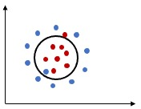

## Additional Technical Concepts

- Hyperplane
- Margin
  - Functional Margin
  - Geometric Margin
- Quadratic Programming
- Lagrange Multiplier
- Kernel Methods

## Maximal Margin Classifier

[](https://youtu.be/cL54xzgVWe0)

In order to explain Linear SVM many books or articles uses **Maximal Margin Classifier**. Hence it’s good to understand the relationship between them. Linear SVM is a `generalization` of Maximal Margin Classifier. Remember that Maximal Margin Classifier does not have any practical use and its a theoretical concept.

## Hyperplane

[](https://youtu.be/fmUhzMp699c)

We can use a line to separate data which is in two dimension (Have 2 features `x1 and x2` ). Similarly need a 2D plane to separate data in 3 dimension. In order to generalize the concepts, we will call them hyperplane, instead of line, plane or cube for n dimension of data, where `n > 0.`

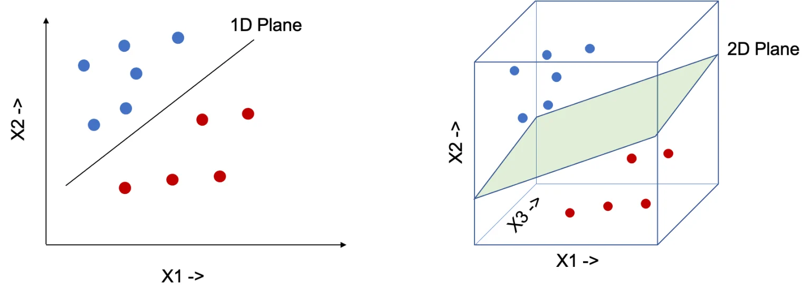

Few important points to be noted for hyperplane,

- A Hyperplane splits the original D – dimensional space into two half-spaces.
- A dataset is `linearly separable` if each half space has points only from a single class.

### Mathematical Definition of Hyperplane

Above we saw more of the intuition behind Hyperplane, here is the Mathematical Definition:

> In a D-dimensional space, a hyperplane is a flat `affine subspace` of dimension (D-1)

If you are not familiar with **affine subspace**, please watch the video below for more clarification:

[](https://youtu.be/P0T33ftRiL4)

### Equation of Hyperplane:

In `two dimension` we can represent the Hyperplane using the following equation. This similar to the equation of `affine combination`, however we have added the bias `b` here.
$$
\begin{align} \beta_1x_1+\beta_2x_2+b \end{align}
$$
We can generalize this for d-dimensions and represent in vectorized form.
$$
\begin{align} h(x) =&amp; \beta_1x_1+...+\beta_dx_d+b \\ = &amp; \bigg( \sum_{i=1}^d \beta_ix_i \bigg) +b \\ = &amp; \beta^Tx + b \end{align}
$$
For any point $$X = (x_1,…,x_d) $$,

- `h(X) = 0` then `X` lies on the hyperplane
- `h(X) < 0 or h(X) > 0` then `X` falls to one side of the hyperplane.

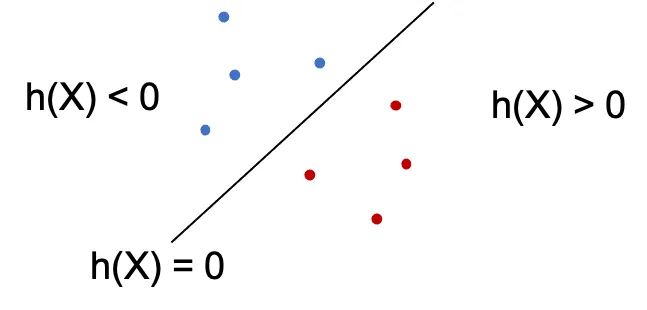

### Separating Hyperplane

We will now make a very important assumption about the coefficient \ weight vector $\beta$. If $x_1$ and $x_2$  are two arbitrary points that lie on the hyperplane, we can write,
$$
\begin{align} h(x_1) = & \beta^T x_1 + b = 0 \\ h(x_2) = & \beta^T x_2 + b = 0 \\ \text{Hence, } \beta^T x_1 + b = & \beta^T x_2 + b \\ \beta^T (x_1 - x_2 ) = & 0 \end{align}
$$
We know if the dot product of two vectors is zero then the vectors are orthogonal to each other. Here the weight vector $\ beta$ is orthogonal to $(x_1 - x_2 )$. As $(x_1 - x_2 )$ lie on the hyperplane, the *weight vector $\beta$ is orthogonal to the Hyperplane too.*

We know if the dot product of two vectors is zero then the vectors are orthogonal to each other. Here the weight vector $\beta$ is orthogonal to $(x_1 - x_2 )$. As $(x_1 - x_2 )$ lie on the hyperplane, the *weight vector $\beta$ is orthogonal to the Hyperplane too.*

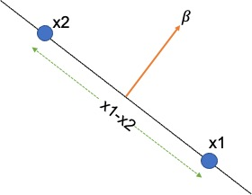

In other words, the weight vector $\beta$ indicates the direction that is normal to the hyperplane. The bias **b** is the offset of the hyperplane in the d-dimensional space.

### Maximal Margin Classifier

We can perform classification using a separating hyperplane. The sign of the $ h(x_i) $ indicates whether the output label is `+1 or -1` and the magnitude defines how far the $ x_i $ lies from the Hyperplane.

We know that,
$$
\begin{align} h(X_i) = & \beta^T X_i + b = 0 \end{align}
$$
Now we can define two cases, one for +1 and another for -1. Then we can combine the two equations to one.
$$
\begin{align} \left.\begin{matrix} h(X_i) < 0 \text{ if } y_i = -1 \\ h(X_i) > 0 \text{ if } y_i = +1 \end{matrix}\right\} y_i(\beta^TX_i+b) > 0 \end{align}
$$

#### How to choose a Hyperplane?

The above equation will help to find the classifier performance, however we need to find the best Hyperplane. If the data can be perfectly separated by a Hyperplane, then there can be infinite number of possible Hyperplanes, as a given separating hyperplane can be shifted/rotated. Hence we need to have a way to decide which Hyperplane to use.

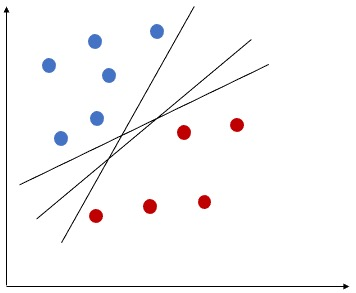

## What is Margin?

Margin can be defined using the `minimum distance` (normal distance) from each observations to a given separating hyperplane. Let's see how we can use Margin to find optimal Hyperplane.

> The size of the Margin defines the `confidence` of the classifier, hence the most wide margin is preferable.

Let’s select two Hyperplanes, based on the margin. The first one has much wider margin than the 2nd one, hence the first Hyperplane is more optimal than 2nd one.

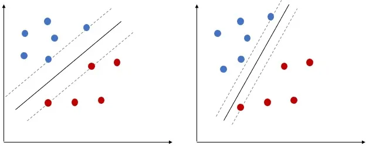

Finally, we can say, in `Maximal Margin Classifier`, in order to classify the data, we will use a separating hyperplane, which has the `farthest` (max) `minimum` (min) distance from the observations. ( Remember will still use the Margin to select the optimal separating Hyperplane)

The above statement is very important, make sure that you understand it. Watch the video or post comments if you need help.

Next, we will understand how we can define margin mathematically.

## Margin

Use the observable dataset to find the best margin, so that the appropriate Hyperplane can be identified. We will discuss about two types of margin.

- We can conceptually define the equation of margin ( known as `Functional Margin` ).
- However later need to use geometry to re-define the equation ( known as `Geometric Margin` ).

### Functional Margin

Functional Margin is used to define the theoretical aspect of margin. Given a training example $(X_i,y_i)$, the Functional Margin of $( \beta, b) $ w.r.t the training example will be,
$$
\begin{align} y_i \left ( \beta^TX_i + b \right ) = \hat{\gamma_i} \end{align}
$$
Instead of the value being just greater than 0, we have defined a value for the margin using $ \gamma $.

Hence we can define the following conditions:

- if $y_i=1$ then $\hat{y_i}>>0$

- if $y_i=0$ then $\hat{y_i}<<0$

However there is an issue with Functional Margin, it's dependent on the values of $ \beta $ and `b`. So if we scale $ \beta $ and `b` ( multiply with some scaler `s` ), the equation of the hyperplane **does not change** but the `margin widens`.

If you plot following two equations, they will represent the same hyperplane, however in our case the margin width will be different.

- $ 2x_1+3x_2 - 5= 0 $
- $ 20x_1+30x_2 - 50= 0 $

Here is the plot for both the equations. We will use **Geometry** to redefine the equation of the margin in order to overcome this issue.

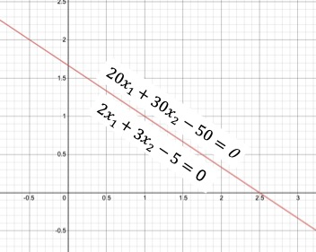

### Geometric Margin

Now let's take help from Geometry to find the equation of the margin. Please refer the below diagram.

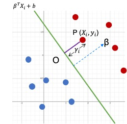

- We will calculate the distance from point `P` to the hyperplane.
- So assume a point $ P ( x_i, y_i ) $ where $ y_i=1 $
- The minimum distance from the point P to the hyperplane is the normal distance `PO`
- The distance of the line segment `PO` is $\gamma_i $
- The equation of the hyperplane is $ \beta^TX_i+b $
- We already know that $ \beta $ is orthogonal ( at 90 degree ) to the separating hyperplane.
- Hence can get the direction of $ \beta $ by using the unit vector $\frac{\beta}{\|\| \beta \|\|}$
- Since `PO` will also have the same direction of $ \beta $, we can calculate define point `O` as,

$$
\begin{align} X_i -\gamma_i . \frac{\beta}{||\beta||} \end{align}
$$

- As point `O` lies on the separating hyperplane we can write the following equation as,
  $$
  \begin{align} \beta^T \left ( X_i -\gamma_i . \frac{\beta}{||\beta||} \right ) + b =0 \\ \beta^T X_i - \gamma_i \frac{\beta^T . \beta}{||\beta||} + b =0 \\ \gamma_i \frac{\beta^T . \beta}{||\beta||} = \beta^T X_i + b \end{align}
  $$

- We can express $ \beta $ using following equation,
  $$
  \begin{align} ||\beta|| &= \sqrt{\sum_{i=1}^D \beta_i^2 } \\ &a= \sqrt{\beta^T\beta} \\ \beta^T\beta &= ||\beta||^2 \end{align}
  $$

- Hence we can write,
  $$
  \begin{align} \gamma_i \frac{||\beta||^2}{||\beta||} =& \beta^T X_i + b \\ \gamma_i ||\beta|| =& \beta^T X_i + \beta^Tb \\ \gamma_i =& \bigg ( X_i \frac{\beta^T}{||\beta||} + \frac{b}{||\beta||} \bigg ) \\ \end{align}
  $$

- Finally, we can combine both positive and negative training examples in one equation,
  $$
  \begin{align} \gamma_i =y_i \bigg ( X_i \frac{\beta^T}{||\beta||} + \frac{b}{||\beta||} \bigg ) \end{align}
  $$
  

### Geometric Margin

>  This is called the `Geometric Margin` and the normalizer $\|\|\beta\|\|$ does not let the margin widen even if we multiply using a scaler.

Going forward we will use this equation in all of our derivations.

## Support Vectors of a Hyperplane

Given a training dataset `( X , y )` and a separating `Hyperplane`, we can find the distance between each point and the Hyperplane as,
$$
\begin{align} \gamma_i = \frac{y_i h(x_i)}{||\beta||} = \frac{y_i ( \beta^Tx_i+b)}{||\beta||} \end{align}
$$
Over all the n points, we define the margin of the linear classifier as the minimum distance of a point from the separating hyperplane.
$$
\begin{align} \gamma_i^* = \min_{x_i} \bigg\{ \frac{y_i ( \beta^Tx_i+b)}{||\beta||} \bigg\} \end{align}
$$

### Why this algorithm is called Support Vector Machine?

> All the points that achieve this minimum distance are called **Support Vectors** $ (x^∗, y^∗) $ for the Hyperplane. Thats the reason this algorithm is named as `Support Vector Machines`.

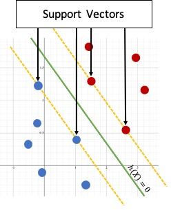

The Support Vectors lie precisely on the margin of the classifier.
$$
\begin{align} \gamma_i^* = \frac{y_i^* ( \beta^Tx^*+b)}{||\beta||} \end{align}
$$

## Canonical Hyperplane

A Hyperplane is said to be Canonical w.r.t the support vectors if,
$$
\begin{align} |\beta^T x^*+ b |=1 \end{align}
$$
So the Geometric Margin will be,
$$
\begin{align} \gamma_i^* = \frac{y^*h(x*))}{||\beta||} = \frac{y_i^* ( \beta^Tx^*+b)}{||\beta||} = \frac{1}{||\beta||} \end{align}
$$
We can represent this using a diagram.

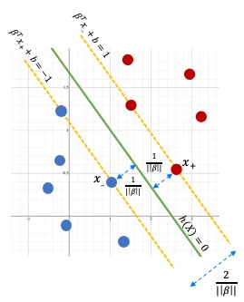

This implies that the min distance between two classes will be at least $\frac{2}{\|\|\beta\|\|}$.

For each support vector $ x_i^*$ we have $ y_i^* h(x_i^*) = 1 $ and for any other points which is not a support vector we can define a single combined equation (for both support vectors and other points),
$$
\begin{align} y_i ( \beta^Tx_i+b) \geq 1 \end{align}
$$

## Linear SVM : Hard Margin Classifier

We will use the **Canonical Hyperplane** for Linear SVM (Hard Margin Classifier), which yields the maximum margins among all separating hyperplanes. So the goal of the objective function is to find the optimal hyperplane $h^*$
$$
\begin{align} h^* = \max_h \{ \gamma^*_h \} = \max_{\beta,b} \Big \{ \frac{1}{||\beta|| } \Big \} \\ \text{ Subject to the constraint : } y_i ( \beta^Tx_i+b) \geq 1 \end{align}
$$
Instead of `maximizing` the margin $ \frac{1}{||\beta||}$ we can also `minimize` $||\beta|| $.  However, $||\beta|| = 1 $ is a `non-convex optimization problem`, which means, there can be **many local optima**. Hence, we can use following minimization formulation ( which is convex in nature )
$$
\begin{align} \text{Objective Function : } \min_{\beta,b} \Big \{ \frac{||\beta^2||}{2} \Big \} \\ \text{s.t Linear Constraint : } y_i ( \beta^Tx_i+b) \geq 1 \end{align}
$$

### Optimization Problem: Primal Problem

> This objective function is a `Primal Convex Optimization Problem` and it can be solved with **Linear Constraints using standard algorithms**

However, this way we wont be able use the objective function to solve for `non-linear` cases. Hence we will find an equivalent problem named `Dual Problem` and solve that using `Lagrange Multipliers`.

## Linear SVM : Soft Margin Classifier

So far we have assumed that the dataset is **perfectly** linearly separable, which doesn't really happen in real scenario. Hence lets look at a little bit more complicated case. We are still working on Linear SVM, however, this time some of the classes overlap such way that a perfect separation is impossible, but remember the data is still linearly separable.

Here is an example of that. Consider a 2-dimension dataset. Thera are mainly two possibilities,

- Single outlier can push the decision boundary greatly, so that the margin becomes very narrow.
- Even though a linear decision boundary can classify the target classes properly, the data may not be separable using a straight line ( no clear boundary )

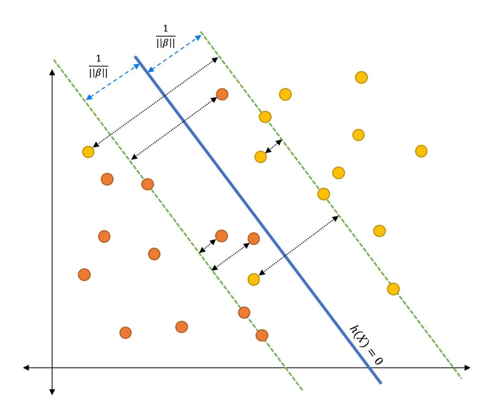

In other words, previously derived Hard Margin Classifier wont work due to the `inequality constraint` $ y_i ( \beta^Tx_i+1 ) \geq 1$

### Slack Variable

We can solve this problem by introducing a new variable named Slack Variable and then redefine our `inequality constraint` as,
$$
\begin{align} y_i ( \beta^Tx_i+b) \geq 1- \xi_i \end{align}
$$
where $ \xi_i \geq 0 $ is the `Slack Variable` for the point $ x_i$.

> The Slack Variable indicates how much the point can violate the margin.

In case of `Canonical Hyperplane`, the point may not be at least $\frac{1}{\|\| \beta \|\|}$ away from the hyperplane.

The Slack Variable helps to define 3 types of data points:

- if $ \xi = 0 $ then the corresponding point $ \xi $ is on the margin or further away.
- if $ 0 < \xi < 1 $ then the point $ \xi $ is within the margin and classified correctly (Correct side of the hyperplane).
- If $ \xi \geq 1 $ then the point is misclassified and present at the wrong side of the hyperplane.

The $ \xi $ is the misclassification penalty. Hence we want to minimize it during optimization.

### Objective Function

Our Hard Margin Classifier’s Objective Function needs to also minimize the slack variable (misclassification penalty). We can write the objective function as,
$$
\begin{align} \text{Objective Function : } \min_{\beta,b,\xi_i} \Big \{ \frac{||\beta^2||}{2} + C \sum_{i=1}^n (\xi_i)^k \Big \} \\ \text{s.t Linear Constraint : } y_i ( \beta^Tx_i+b) \geq 1 - \xi_i , \text{where } \xi_i \geq 0 \end{align}
$$
`C` and `k` are constants which balances the cost of misclassification. The $ \sum_{i=1}^n (\xi_i)^k $ is the loss term and C is a HyperParameter which controls the tread-off between maximizing the margin and minimizing the loss.

The HyperParameter `C` is also called as *`Regularization Constant`*.

- If $ C \to 0 $, then the loss is zero and we are trying to maximize the margin.
- If $ C \to \infty $ then the margin does not have any effect and the objective function tries to just minimize the loss.

In other words, the Hyper Parameter `C` controls the relative weighting between the twin goals of making margin large and ensures that most examples have functional margin at least 1.

The value of C is chosen by Cross Validation during training time.

`k` is typically set to 1 or 2. If k = 1 , then the loss is named as `Hinge Loss` and if k =2 then its called `Quadratic Loss`. We will use both of these in later tutorials.

### Gradient Descent

Understand that Gradient Descent can be used to optimize the objective function when `k = 1 (Hinge Loss)` by changing the inequality constraint to equality constraint.

> I will explain how Gradient Descent can be used to optimize the objective function here, but this method does not help us to solve Non-Linear boundaries, hence this is not a preferred method. However it will be a good practice to see how this classifier might work ( At my University the prof followed this approach ).

As you might already know that we can’t use Gradient Descent to optimize the Soft Margin Objective Function due to the inequality constraint. Hence need to first find a way to change the constraint to equality constraint.

Lets define $ \lambda_i = ( \beta^Tx_i+b) $. Here are some of the important points to consider,

- If $(y_i\lambda_i) > 1$ then the classifier predicts the sign correctly (both of them have same sign) and $x_i$ is far from the margin, hence there is no penalty/loss.
- If $y_i$ and $\lambda_i$ have the same sign, but $\lambda_i < 1$ then $x_i$ is in between the margin and Hyperplane. Event though the classifier predicts the sign correctly, there will be some penalty/loss. Moreover the penalty get larger as $x_i$ gets closer to the Hyperplane.
- If $y_i$ and $\lambda_i$ have different sign, then the penalty will be large and as $x_i$ moves further away from the boundary on the wrong side the penalty/loss will increase linearly.

Now let's plot the penalty/loss using the above 3 statements. I have highlighted each section of the plot with the related three conditions.

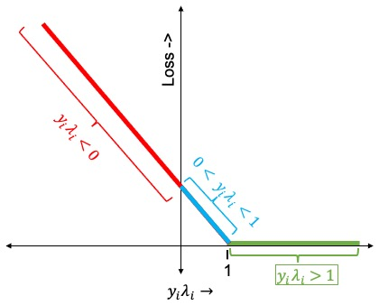

### Hinge Loss

> `Hinge Loss` is referred in many books and you should remember the above plot. We will again talk about Hinge Loss in the next tutorial.

o as we don't need any loss when $y_i\lambda_i > 1$ we can change the inequality constraint to equality constraint by rewriting the equation $y_i ( \beta^Tx_i+b) \geq 1 - \xi_i$ in the following way:
$$
\begin{align} \xi_i = max \bigg ( 0, 1- y_i ( \beta^Tx_i+b) \bigg ) \end{align}
$$
We can incorporate this directly in the Objective Function itself and calculate the Loss Function as,
$$
\begin{align} L = \frac{||\beta^2||}{2} + C \sum_{i=1}^n max \bigg ( 0, 1- y_i ( \beta^Tx_i+b) \bigg ) \end{align}
$$
In order to find the minima, we need to take derivative w.r.t $\beta$ and `b` and then use them in Gradient Descent formula (Same as in Linear/Logistic Regression).
$$
\begin{align} \frac{\delta L}{\delta \beta} =& \beta - C \sum_{i=1, \xi_i \geq 0}^n y_i x_i \\ \frac{\delta L}{\delta b} =& - C \sum_{i=1, \xi_i \geq 0}^n y_i \end{align}
$$

## Coding Soft Margin SVM Classifier with Gradient Descent using Python

I always prefer to have coding to be as part of any tutorial. Even though this algorithm is never going to be used in real projects, it can be good homework to remember the derivation.

### Dataset

We will use the iris dataset for our first SVM algorithm. I am going to drop flower type Setosa and use only 2 classes, Virginica and Versicolor. We will also use just 2 features **petal_length** and **petal_width** so that we can visualize the margin in 2 dimensions.

Create a function named `load_data()` to the data. We will take only bottom 100 data points and then use the `LabelEncoder` to transform the labels to 0 and 1. Finally drop the unwanted species column and return the desired columns.

```python
import seaborn as sns
from sklearn import preprocessing
 
 
def load_data(cols):
    iris = sns.load_dataset("iris")
    iris = iris.tail(100)
 
    le = preprocessing.LabelEncoder()
    y = le.fit_transform(iris["species"])
 
    X = iris.drop(["species"], axis=1)
 
    if len(cols) > 0:
        X = X[cols]
 
    return X.values, y
```

Add the class named `LinearSVMUsingSoftMargin` and define the initialize method.

```python
class LinearSVMUsingSoftMargin:
    def __init__(self, C=1.0):
        self._support_vectors = None
        self.C = C
        self.beta = None
        self.b = None
        self.X = None
        self.y = None
 
        # n is the number of data points
        self.n = 0
 
        # d is the number of dimensions
        self.d = 0
```

Add the following functions. They are same as the equations explained above.

```python
def __decision_function(self, X):
    return X.dot(self.beta) + self.b
 
def __cost(self, margin):
    return (1 / 2) * self.beta.dot(self.beta) + self.C * np.sum(np.maximum(0, 1 - margin))
 
def __margin(self, X, y):
    return y * self.__decision_function(X)
```

Now we will define the `fit()` function. First initialize the $\beta$ and `b`, then start the epochs in a for loop. Calculate the margin and the cost. I am just saving the cost per epoch to an array, you may want to plot that just to make sure the algorithm is converging.

```python
def fit(self, X, y, lr=1e-3, epochs=500):
    # Initialize Beta and b
    self.n, self.d = X.shape
    self.beta = np.random.randn(self.d)
    self.b = 0
 
    # Required only for plotting
    self.X = X
    self.y = y
 
    loss_array = []
    for _ in range(epochs):
        margin = self.__margin(X, y)
        loss = self.__cost(margin)
        loss_array.append(loss)
```

side the same for loop, first get the data points where $(y_i\lambda_i) < 1$ ( Remember the diagram of Hinge Loss ? ), since we are only concern about the points closer to the hyperplane or misclassified.

```python
misclassified_pts_idx = np.where(margin < 1)[0]
```

Implement the Gradient Descent algorithm using the `misclassified_pts_idx` only. Again, this is exactly for the formula derived above (Ref # 24)

```python
d_beta = self.beta - self.C * y[misclassified_pts_idx].dot(X[misclassified_pts_idx])
self.beta = self.beta - lr * d_beta
 
d_b = - self.C * np.sum(y[misclassified_pts_idx])
self.b = self.b - lr * d_b
```

Once training has been completed, get the index of the support vectors.

```python
self._support_vectors = np.where(self.__margin(X, y) <= 1)[0]
```

We are done with the basic `fit()` function. Add two more utility functions.

```python
def predict(self, X):
    return np.sign(self.__decision_function(X))
 
def score(self, X, y):
    P = self.predict(X)
    return np.mean(y == P)
```

Below is the main function. Load the data, then change the labels from 0 and 1 to -1 and 1. Use the `StandardScaler` to normalize the data, this is almost always recommended for SVM.

Finally, initialize the `LinearSVMUsingSoftMargin` class and invoke the `fit()` function.

The code for `plot_decision_boundary()` function is given below in the full code and also in the github repo. I have omitted that here just to focus on the algorithm alone.

```python
if __name__ == '__main__':
    # make sure the targets are (-1, +1)
    cols = ["petal_length", "petal_width"]
    X, y = load_data(cols)
 
    y[y == 0] = -1
 
    # scale the data
    scaler = StandardScaler()
    X = scaler.fit_transform(X)
    # now we'll use our custom implementation
    model = LinearSVMUsingSoftMargin(C=15.0)
 
    model.fit(X, y)
    print("train score:", model.score(X, y))
 
    model.plot_decision_boundary()
```

### Output

Here is the decision boundary. As you notice, the classes can’t be perfectly linearly separated, however using Soft Margin SVM we are able to classify the data Linearly. The Support Vectors have been highlighted using black border. The blue line is the Hyperplane and red dotted lines are the margins.

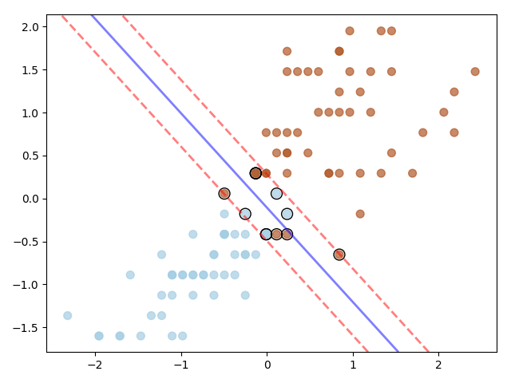

The width of the margin changes based on the value of C hyper parameter.

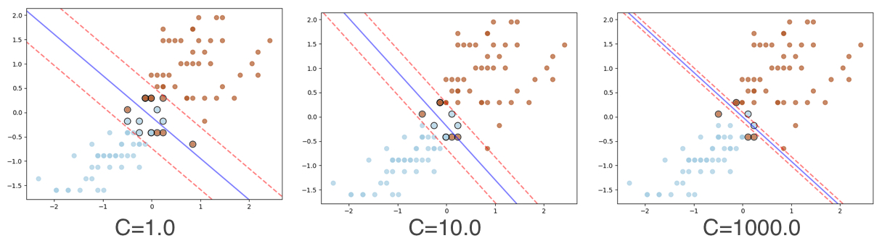

### Full Code

Please find the complete code here.

```python
import numpy as np
import matplotlib.pyplot as plt
import seaborn as sns
from sklearn import preprocessing
from sklearn.preprocessing import StandardScaler
 
 
class LinearSVMUsingSoftMargin:
    def __init__(self, C=1.0):
        self._support_vectors = None
        self.C = C
        self.beta = None
        self.b = None
        self.X = None
        self.y = None
 
        # n is the number of data points
        self.n = 0
 
        # d is the number of dimensions
        self.d = 0
 
    def __decision_function(self, X):
        return X.dot(self.beta) + self.b
 
    def __cost(self, margin):
        return (1 / 2) * self.beta.dot(self.beta) + self.C * np.sum(np.maximum(0, 1 - margin))
 
    def __margin(self, X, y):
        return y * self.__decision_function(X)
 
    def fit(self, X, y, lr=1e-3, epochs=500):
        # Initialize Beta and b
        self.n, self.d = X.shape
        self.beta = np.random.randn(self.d)
        self.b = 0
 
        # Required only for plotting
        self.X = X
        self.y = y
 
        loss_array = []
        for _ in range(epochs):
            margin = self.__margin(X, y)
            loss = self.__cost(margin)
            loss_array.append(loss)
 
            misclassified_pts_idx = np.where(margin < 1)[0]
            d_beta = self.beta - self.C * y[misclassified_pts_idx].dot(X[misclassified_pts_idx])
            self.beta = self.beta - lr * d_beta
 
            d_b = - self.C * np.sum(y[misclassified_pts_idx])
            self.b = self.b - lr * d_b
 
        self._support_vectors = np.where(self.__margin(X, y) <= 1)[0]
 
    def predict(self, X):
        return np.sign(self.__decision_function(X))
 
    def score(self, X, y):
        P = self.predict(X)
        return np.mean(y == P)
 
    def plot_decision_boundary(self):
        plt.scatter(self.X[:, 0], self.X[:, 1], c=self.y, s=50, cmap=plt.cm.Paired, alpha=.7)
        ax = plt.gca()
        xlim = ax.get_xlim()
        ylim = ax.get_ylim()
 
        # create grid to evaluate model
        xx = np.linspace(xlim[0], xlim[1], 30)
        yy = np.linspace(ylim[0], ylim[1], 30)
        YY, XX = np.meshgrid(yy, xx)
        xy = np.vstack([XX.ravel(), YY.ravel()]).T
        Z = self.__decision_function(xy).reshape(XX.shape)
 
        # plot decision boundary and margins
        ax.contour(XX, YY, Z, colors=['r', 'b', 'r'], levels=[-1, 0, 1], alpha=0.5,
                   linestyles=['--', '-', '--'], linewidths=[2.0, 2.0, 2.0])
 
        # highlight the support vectors
        ax.scatter(self.X[:, 0][self._support_vectors], self.X[:, 1][self._support_vectors], s=100,
                   linewidth=1, facecolors='none', edgecolors='k')
 
        plt.show()
 
 
def load_data(cols):
    iris = sns.load_dataset("iris")
    iris = iris.tail(100)
 
    le = preprocessing.LabelEncoder()
    y = le.fit_transform(iris["species"])
 
    X = iris.drop(["species"], axis=1)
 
    if len(cols) > 0:
        X = X[cols]
 
    return X.values, y
 
 
if __name__ == '__main__':
    # make sure the targets are (-1, +1)
    cols = ["petal_length", "petal_width"]
    X, y = load_data(cols)
 
    y[y == 0] = -1
 
    # scale the data
    scaler = StandardScaler()
    X = scaler.fit_transform(X)
    # now we'll use our custom implementation
    model = LinearSVMUsingSoftMargin(C=15.0)
 
    model.fit(X, y)
    print("train score:", model.score(X, y))
 
    model.plot_decision_boundary()
```

## Conclusion

I hope this tutorial provides the basic idea of SVM. We will learn about `Quadratic Programming` and `Lagrange Multiplier` then use them to further derive the objective functions in the next tutorial.

### Full Code

Please click on the link below to access the github repository

<div style='text-align:center;margin-bottom:30px;'>
<input type='button' value="GitHub" onclick="javascript:window.open('https://github.com/adeveloperdiary/blog/blob/master/SVM/Linear_SVM_Soft_Margin_using_GD.py','_blank')"/>
</div>


