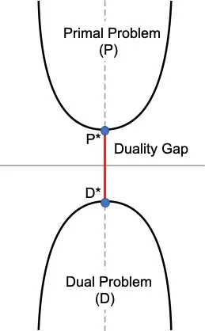
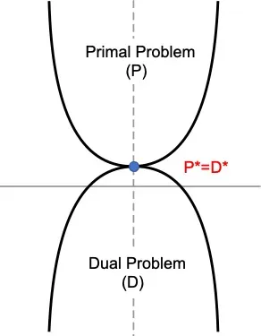
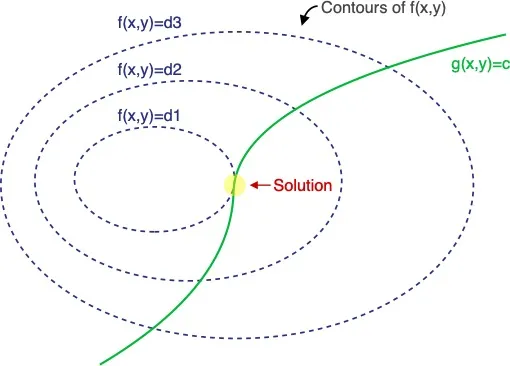
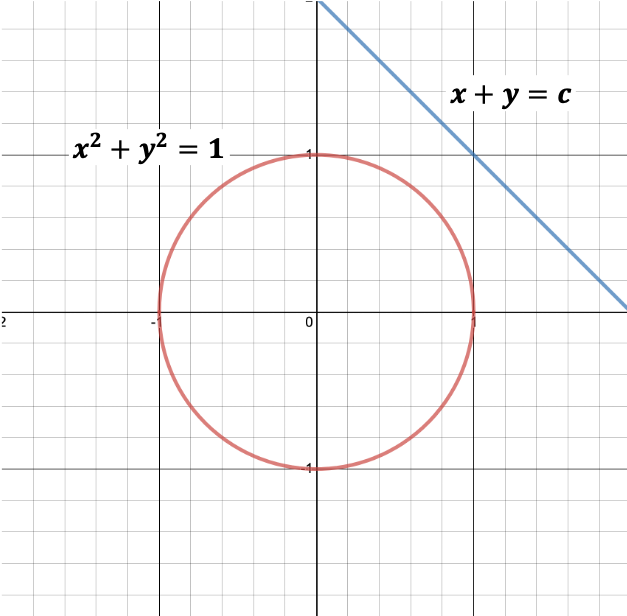
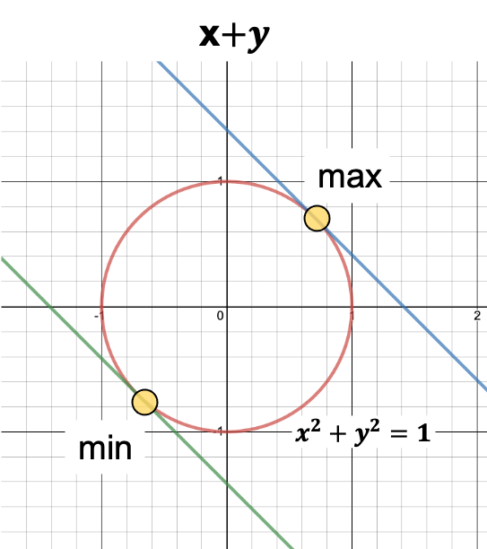
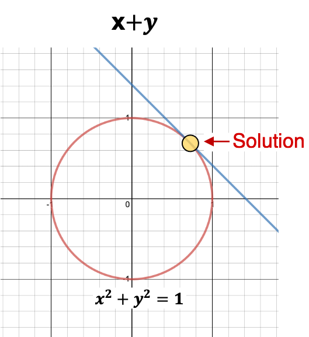

The Objective Function of Primal Problem works fine for Linearly Separable Dataset, however doesn’t solve Non-Linear Dataset. In this **Support Vector Machines for Beginners – Duality Problem** article we will dive deep into transforming the Primal Problem into Dual Problem and solving the objective functions using Quadratic Programming. Don’t worry if this sounds too complicated, I will explain the concepts in a step by step approach.

## Quick Recap

We have gone though the understanding of **Support Vectors** and **Margins**. Then used the concepts to build the Objective Functions for Hard and Soft Margin Classifier in our last tutorial. We have also learned that the Objective Function which we have defined is known as **Primal Problem**.
$$
\begin{align}
\text{Objective Function : } \min_{\beta,b,\xi_i} \Big \{ \frac{||\beta^2||}{2} + C \sum_{i=1}^n (\xi_i)^k \Big \} \\
\text{s.t Linear Constraint : } y_i ( \beta^Tx_i+b) \geq  1 - \xi_i , \text{where }  \xi_i \geq 0
\end{align}
$$
Here are some important points to remember from last tutorial,

- Use training data to define optimal Geometric Margin so that we can identify the support vectors.
- Introduced of Slack Variable and defined the objective function for Soft Margin Classifier.
- Convert the inequality constraint to equality constraint, so that we use Gradient Descent.

In case you need please refer to the previous tutorial.

## Primal Problem

Primal Problem is helpful in solving Linear SVM using SGD. Remember we need to optimize `D+1` ( where **D** is the dimension ) parameters in Primal Problem.

However our final goal is to solve Non-Linear SVM where Primal Problem is not helpful. In order to find a solution, we need to use several mathematical tricks. We will go through all of them one after another.

## Duality

> *In mathematical optimization theory,* **duality** means that optimization problems may be viewed from either of two perspectives, the primal problem or the dual problem (**the duality principle**). The solution to the dual problem provides a lower bound to the solution of the primal (minimization) problem.
>
> *Wikipedia*

I am going to explain in a very simple way so that you can understand without the need to have a strong mathematical background.

- Primal Problem is something that we want to minimize. In the diagram, **P*** minimizes the Primal Objective **P**.
- Dual Problem is something we want to maximize. Here we want to convert the Primal Problem (**P**) to a Dual Problem (**D**). **D*** maximizes the Dual Objective **D**.
- Sometimes solving the Dual Problem is same as solving the Primal Problem.
- $$(P^*−D^*)$$ is called as the **Duality Gap**.
- If $$(P^*−D^*) > 0$$ we can say **weak duality holds**.

- The goal will be to find in which condition we can have $$(P^*−D^*)=0$$ and we can say that **strong duality holds**.
- In this picture, we can see that maximizing the Dual Problem is same as Minimizing the Primal Problem.
- There are some conditions named **KKT condition**, needs to hold in order to have $$(P^*−D^*)=0$$
- Next, we will talk about **Lagrange Multiplier**, which will help us to determine when we can find strong duality.

## **Lagrange Multiplier**

We can find the maximum or minimum of a multivariable function with some constraint using the **Lagrange Multiplier**. It’s important understand Lagrange Multiplier to solve **constraint optimization problems**, like we have in SVM.

If you recall our objective function, we do have one constrain such that $y_i ( \beta^Tx_i+b) \geq  1 - \xi_i$ for the objective function,
$$
\begin{align}
\min_{\beta,b,\xi_i} \Big \{ \frac{||\beta^2||}{2} + C \sum_{i=1}^n (\xi_i)^k \Big \}
\end{align}
$$

### Concepts

We will start with a generalized version. Let’s find out how to solve problem such as:
$$
\begin{align}
\max_{x,y} f(x,y) \\
\text{such that } g(x,y) = c
\end{align}
$$
Refer the below plot where **f(x,y)** function has been represented using the contour plot ( surface ) and **g(x,y)** has been shown as a line ( green ). In case we didn’t have the constraint **g(x,y)**, we could have just taken the derivative of **f(x,y)** w.r.t **x** and **y**, then set them to **0** to find solution for **x** and **y**.

However, now we have a constraint given by the function **g(x,y)** ( represented using the green line). Hence we need to find the point on the green curve for which **f(x,y)** is maximum.

Notice that the solution is the point where **f(x,y)** and **g(x,y)** both are **parallel** (highlighted in yellow circle). Mathematically, gradient vectors at that point of tangency are oriented along the same direction.

We are going to introduce a new variable $$\alpha$$ as **Lagrange Multiplier**. Then express the following as a function named, **Lagrangian.**
$$
\begin{align}
L(x,y,\alpha ) = f(x,y) - \alpha \Big ( g(x,y) - c \Big )
\end{align}
$$
The solution is to find $(x,y,\alpha)$ so that $\Delta L=0$
$$
\begin{align}
\delta_{x,y,\alpha} L(x,y,\alpha) = 0
\end{align}
$$
Let's first take the partial derivative w.r.t $\alpha$
$$
\begin{align}
\delta_{\alpha} L (x,y,\alpha) =& \frac{d}{d \alpha} \bigg (  f(x,y) - \alpha \Big ( g(x,y) - c \Big ) \bigg ) \\
=& - \Big ( g(x,y) -c \Big )
\end{align}
$$
Hence we can say,
$$
\begin{align}
\delta_{\alpha} L (x,y,\alpha) =& - g(x,y) + c = 0
\end{align}
$$
We can also take the partial derivate w.r.t **x**
$$
\begin{align}
\delta_{\alpha}L (x,y,\alpha) =& \frac{d}{d \alpha} \bigg (  f(x,y) - \alpha \Big ( g(x,y) - c \Big ) \bigg ) = 
 0 \\
\delta_x f(x,y) - \alpha  \delta_x g(x,y)  =&  0 \\
\delta_x f(x,y) =&  \alpha \delta_x g(x,y)
\end{align}
$$
Similarly, 
$$
\begin{align}
\delta_y f(x,y) =&  \alpha \delta_y g(x,y)
\end{align}
$$
We can write them using one equation,
$$
\begin{align}
\delta_{x,y} f(x,y) =&  \alpha \delta_{x,y} g(x,y)
\end{align}
$$

This matches with the idea that **$\delta f(x,y)$** and **$\delta g(x,y)$** are both pointing to the **same direction** at the solution ( yellow circle ) . This means the **gradients are indeed parallel**.Note, even if they point to the same direction, they may not have the same **magnitude**, hence the gradient of **g(x,y)** is scaled by $\alpha$. Now we have 3 equations and 3 unknowns. We can easily solve them. If you have come this far and the above idea didn't make a lot of sense, don't worry, finish the entire article and read again few more times and everything starts to make sense. Feel free to post questions in the comment section, I will try my best to answer them. We will now solve one sample equation using **Lagrange Multiplier**.

### Example

This probably is the most common example, it’s really easy to understand hence I haven’t changed it.

#### Problem

Find,
$$
\begin{align}
\max_{x,y} x+ y \\
\text{s.t. } x^2+y^2 = 1
\end{align}
$$

#### Solution

Let’s identify the possible solutions visually, before we use **Lagrange Multiplier**.

- Here is the plot of the constraint $$x^2+y^2=1$$ in red, which is a circle. 
- $x+y$ is basically the entire plane.
- The blue line is an arbitrary representation of $$x+y=c$$

- $$x+y$$ needs to be on the circle as per the defined constraint.
- We can visually identify two points ( among all the points ) where the value of $$x+y$$ needs to touch the circle at two different points.
- These points are the max and min values.

Now let's use **Lagrange Multiplier** to solve this mathematically.
$$
\begin{align}
L(x,y,\alpha ) =& f(x,y) - \alpha \Big ( g(x,y) - c \Big ) \\
=& x+y-\alpha (x^2+y^2-1 )
\end{align}
$$
Take the derivatives w.r.t $x,y,\alpha$.
$$
\begin{align}
\delta_x L(x,y,\alpha ) &= 1-2\alpha x = 0 \\
x=\frac{1}{2\alpha}
\end{align}
$$

$$
\begin{align}
\delta_y L(x,y,\alpha ) &= 1-2\alpha y = 0 \\
y=\frac{1}{2\alpha}
\end{align}
$$

$$
\begin{align}
\delta_{\alpha} L(x,y,\alpha ) = x^2+y^2-1 &= 0 \\
\frac{1}{2\alpha}^2 + \frac{1}{2\alpha}^2 -1 &=0 \\
\frac{1}{2\alpha^2} &=1 \\
\alpha &= \pm \frac{1}{\sqrt{2}}
\end{align}
$$

Using this, we can derive the values of **x** and **y**.
$$
\begin{align}
x &= \pm \frac{1}{ 2 \frac{1}{\sqrt{2}}} \\
x &= \frac{1}{\sqrt{2}} \\
\text{similarly, } \\
y &= \frac{1}{\sqrt{2}}
\end{align}
$$
Since we are tying to maximize $x+y$, we will consider only the positive values.

So we have the final result as,
$$
\begin{align}
f(x,y) =& x+y \\ 
=& \frac{1}{\sqrt{2}} + \frac{1}{\sqrt{2}} \\
=& \sqrt{2}
\end{align}
$$

## Multiple Constraints

**Lagrange Multiplier** can be used for vectorized implementation as well. Assume **x** has **D** dimensions, then there will be total `D+1` unknowns for the following function,
$$
\begin{align}
\max_x f(x) \\
\text{s.t. } g(x) = 0 
\end{align}
$$
You also may have more than one constraint. If you have `n` constraints then there will be total `D+n` unknowns.
$$
\begin{align}
\max_x f(x) &  \\
\text{s.t. } g_1(x) &= 0, g_2(x) = 0, ... , g_n(x) = 0
\end{align}
$$
We can then define the **Lagrangian** as following,
$$
\begin{align}
L(x_1,...,x_D,\alpha_1,...,\alpha_n) = f(x) - \sum_{i=1}^n \alpha_i g_i(x)
\end{align}
$$

## Inequality Constraint

**Lagrange Multiplier** works with Inequality Constraints as well. We can always add inequality constraints along with equality constraint. Let’s taken an example,
$$
\begin{align}
\max_x f(x) & \\
\text{s.t. } g_i(x) \leq 0 & \text{      ,       } \forall i = 1..n \\
h_i(x) = 0 & \text{      ,        } \forall j = 1..m \\  
\end{align}
$$
We can define the **Lagrangian** as (One constant for each constraint),
$$
\begin{align}
L(x,\alpha,\lambda ) = f(x) +  \sum_{i=1}^n \alpha_i g_i(x)+ \sum_{j=1}^m \lambda_j h_j(x) \\
\end{align}
$$
However, in order to find the solution for the variables, it wont be enough only to take the gradients and set those to zero due to the Inequality Constraints. Setting $\Delta_{x, \lambda} L = 0 $ still gives two of the conditions, but for the Inequality Constraint, we need to have 3 additional conditions. Hence instead of total 3, we will now have total 5 conditions.
$$
\begin{align}
\alpha_i g_i(x) =& 0  \text{    ,        } \forall i = 1..n \\
g_i (x) \leq & 0 \text{    ,        } \forall i = 1..n \\
\alpha_i \geq & 0 \text{    ,        } \forall i = 1..n \\
\delta_{x_d} L =& 0  \text{    ,        } \forall d = 1..D \\
\delta_{\lambda_j} L =& 0  \text{    ,        } \forall j = 1..m \\
\end{align}
$$

### **Strong Duality**: KKT Conditions

These above five conditions are called as KKT (Karush–Kuhn–Tucker) conditions and they **must** be met for **strong duality**, i.e for $$P^*-D^*=0$$ to be true.

## Duality: Hard Margin Classifier

We will now change our Hard Margin Classifier’s Objective Function from **Primal Problem** to **Dual Problem** using **Lagrange Multiplier** and **KKT Conditions**.

Recall the optimization problem,
$$
\begin{align}
\text{Objective Function : } \min_{\beta,b} \Big \{ \frac{||\beta^2||}{2} \Big \} \\
\text{s.t Linear Constraint : } y_i ( \beta^Tx_i+b) \geq  1  \text{   ,   } \forall x_i \in D
\end{align}
$$
The constraint can be redefined as following (This is required for the $2^{nd}$ KKT Condition $g_i(x) \leq  0$),
$$
\begin{align}
\text{s.t Linear Constraint : } 1 - y_i ( \beta^Tx_i+b)  \leq  0  \text{   ,   } \forall x_i \in D
\end{align}
$$
The **Lagrangian** can defined as following,
$$
\begin{align}
\text{min  }  L &= \frac{||\beta^2||}{2} +  \sum_{i=1}^n \alpha_i (1- y_i(\beta^Tx_i+b)) \\
&= \frac{||\beta^2||}{2} -  \sum_{i=1}^n \alpha_i (y_i(\beta^Tx_i+b)-1) \\
\end{align}
$$
Here are the remaining 4 **KKT Conditions**, ( $$g_i(x) \leq 0$$  already defined above)

$$
\begin{align}
\alpha_i (1- y_i(\beta^Tx_i+b)) = 0 \\
\text{and  } \alpha_i \geq 0
\end{align}
$$
Taking derivatives w.r.t $\beta$ and **b**,
$$
\begin{align}
\delta_{\beta} L =& \beta - \sum_{i=1}^n \alpha_i y_ix_i = 0 \\
\beta &= \sum_{i=1}^n \alpha_i y_ix_i \\
\text{and }  \delta_{b} L &= \sum_{i=1}^n \alpha_i y_i = 0
\end{align}
$$
Plugging these we get the **Dual Lagrangian Objective Function**,
$$
\begin{align}
L_{dual} =& \frac{||\beta^2||}{2} -  \sum_{i=1}^n \alpha_i (y_i(\beta^Tx_i+b)-1) \\
=& \frac{1}{2} \beta^T\beta -  \sum_{i=1}^n \alpha_i y_i\beta^Tx_i - \sum_{i=1}^n \alpha_i y_ib + \sum_{i=1}^n \alpha_i \\
=& \frac{1}{2} \beta^T\beta -  \beta^T \Big ( \sum_{i=1}^n \alpha_i y_ix_i \Big ) - b \Big ( \sum_{i=1}^n \alpha_i y_i \Big ) + \sum_{i=1}^n \alpha_i \\
=& \frac{1}{2} \beta^T\beta -  \beta^T \Big ( \beta \Big ) - b \Big ( 0 \Big ) + \sum_{i=1}^n \alpha_i \\
=& - \frac{1}{2} \beta^T\beta + \sum_{i=1}^n \alpha_i \\
=& \sum_{i=1}^n \alpha_i - \frac{1}{2} \sum_{i=1}^n\sum_{j=1}^n \alpha_i \alpha_j y_iy_jx_i^Tx_j
\end{align}
$$
**L** should be minimized w.r.t $\beta$ and $b$, and should be maximized w.r.t $\alpha_i$. Hence, instead of **minimizing** the **Primal Problem**, we can now **maximize** the **Dual Problem** (**P\*=D\*** as the KKT conditions are now satisfied). So we can write the following,
$$
\begin{align}
\textbf{Objective Function: } & \max_{\alpha} L_{dual} = \sum_{i=1}^n \alpha_i - \frac{1}{2} \sum_{i=1}^n\sum_{j=1}^n \alpha_i \alpha_j y_iy_jx_i^Tx_j \\
\textbf{Linear Constraints: } & \alpha_i \geq 0, \forall i \in D , \text{ and } \sum_{i=1}^n \alpha_i y_i = 0
\end{align}
$$
The $L_{dual}$ is a **Convex Quadratic** programming problem due to the $\alpha_i\alpha_j$ term and can be solved using standard optimization techniques.

### Weight Vector and Bias

Once we have got the $\alpha_i$ values, we can calculate the weight vector $\beta$ and bias **b**. As per the KKT conditions we had,
$$
\begin{align}
\alpha_i (1- y_i(\beta^Tx_i+b)) = 0 \\
\end{align}
$$
Above equation provides two cases,

- $\alpha_i=0$ 
- $y_i(\beta^Tx_i+b) = 1$

Now, if $y_i(\beta^Tx_i+b) = 1$ then $\alpha_i > 0$, which means the point $x_i$ must be a support vector. Otherwise if $\alpha_i = 0$ then $y_i(\beta^Tx_i+b) \geq 1$, which means if the point is not support vector then $\alpha_i = 0$. The above two intuitions are important, this indicates that non support vectors do not have a role in finding the weight and bias. Once we know $\alpha_i$ for all points, we can compute the weight vector $\beta$ by summing only for the support vectors.
$$
\begin{align}
\beta = \sum_{i , \alpha_i \geq 0} \alpha_i y_ix_i
\end{align}
$$
In order to compute the bias **b**, we need to get one solution $b_i$ per support vector, then average them.
$$
\begin{align}
\alpha_i (1- y_i(\beta^Tx_i+b)) =&  0 \\
y_i(\beta^Tx_i+b) =& 1 \\
b_i =& \frac{1}{y_i} -\beta^Tx_i \\
=& y_i - \beta^Tx_i \\
[\text{ since } y_i \in \{-1,+1\} , y_i=& \frac{1}{y_i}] \\
b =& avg_{\alpha_i \geq 1} \{ b_i \}
\end{align}
$$

### Hard Margin Classifier

We can now find the optimal Hyperplane given $\beta$ and **b**. For any new point **z**, we can predict the class using following,
$$
\begin{align}
\hat{y} = \text{sign}( \beta^Tz +b )
\end{align}
$$

## Duality: Soft Margin Classifier

Similar to the Hard Margin Classifier, we will derive the **Dual Problem** for Soft Margin Classifier also. Let’s recap the Primal Objective function,
$$
\begin{align}
\text{Objective Function : } \min_{\beta,b,\xi_i} \Big \{ \frac{||\beta^2||}{2} + C \sum_{i=1}^n (\xi_i)^k \Big \} \\
\text{s.t Linear Constraint : } y_i ( \beta^Tx_i+b) \geq  1 - \xi_i , \text{where }  \xi_i \geq 0
\end{align}
$$

The value of **k** could be set to either 1 (**Hinge Loss**) or 2 (**Quadratic Loss**).

### Hinge Loss

We can compute the Lagrangian by introducing two Lagrange multipliers $\alpha_i$ and $\lambda_i$ as we have two inequality constraints. (Remember the $2^{nd}$ KKT Condition $g_i(x) \leq  0$ ? )
$$
\begin{align}
\alpha_i (1 - \xi_i- y_i(\beta^Tx_i+b)) = 0 , \text{ and  } \alpha_i \geq 0 \\
\lambda_i (0-\xi_i) = 0 , \text{ and  } \lambda_i \geq 0 \\
\end{align}
$$
The Lagrangian can be then defined as,
$$
\begin{align}
L &=  \frac{||\beta^2||}{2} + C \sum_{i=1}^n \xi_i + \sum_{i=1}^n \alpha_i (1 - \xi_i- y_i(\beta^Tx_i+b)) + \sum_{i=1}^n \lambda_i (0-\xi_i) \\
&=\frac{||\beta^2||}{2} + C \sum_{i=1}^n \xi_i - \sum_{i=1}^n \alpha_i (y_i(\beta^Tx_i+b) - 1 + \xi_i ) - \sum_{i=1}^n \lambda_i \xi_i
\end{align}
$$
We will take partial derivative w.r.t $\beta$, b and $\xi_i$ to turn this to dual Lagrangian. 
$$
\begin{align}
\delta_{\beta} L &= \beta - \sum_{i=1}^n \alpha_i y_i x_i = 0 \\
\beta &= \sum_{i=1}^n \alpha_i y_i x_i \\
\delta_{b} L &= \sum_{i=1}^n \alpha_i y_i = 0 \\
\delta_{\xi_i} L &= C- \alpha_i-\lambda_i = 0
\end{align}
$$
$\delta_{\xi_i} L$ does not have the summation ($\sum$) term, as we are taking partial derivative against $\xi_i$ and not $\xi$. Plugging these to the Lagrangian we get,
$$
\begin{align}
L_{dual} &=\frac{||\beta^2||}{2} + C \sum_{i=1}^n \xi_i - \sum_{i=1}^n \alpha_i (y_i(\beta^Tx_i+b) - 1 + \xi_i ) - \sum_{i=1}^n \lambda_i \xi_i \\
&= \frac{1}{2} \beta^T\beta -\beta^T \bigg (  \sum_{i=1}^n \alpha_i y_i x_i \bigg ) -b \sum_{i=1}^n \alpha_i y_i +\sum_{i=1}^n \alpha_i   + \sum_{i=1}^n \bigg ( C - \alpha_i - \lambda_i  \bigg) \xi_i \\
&= \frac{1}{2} \beta^T\beta -\beta^T \bigg (  \beta \bigg ) -b \bigg( 0 \bigg ) +\sum_{i=1}^n \alpha_i   + \sum_{i=1}^n \bigg ( 0 \bigg) \xi_i \\
&= \sum_{i=1}^n \alpha_i  - \frac{1}{2} \beta^T\beta \\
&= \sum_{i=1}^n \alpha_i  - \frac{1}{2} \sum_{i=1}^n\sum_{j=1}^n \alpha_i \alpha_j y_iy_jx_i^Tx_j \\
\end{align}
$$
The Dual Objective can be written as,
$$
\begin{align}
\textbf{Objective Function: } & \max_{\alpha} L_{dual} = \sum_{i=1}^n \alpha_i - \frac{1}{2} \sum_{i=1}^n\sum_{j=1}^n \alpha_i \alpha_j y_iy_jx_i^Tx_j \\
\textbf{Linear Constraints: } & 0 \leq \alpha_i \leq 0, \forall i \in D , \text{ and } \sum_{i=1}^n \alpha_i y_i = 0
\end{align}
$$
Notice the objective function is same as the Hard Margin Classifier, however the inequality constraint is different.

Since $\alpha_i+\lambda_i=C$ and $\alpha_i \geq 0 ,  \lambda_i \geq 0$, we can say $0 \leq \alpha_i \leq 0$. There is no constraint on $\lambda$ as its not part of the final equation.

#### Weight Vector and Bias

Similar to the Hard Margin Classifier, we can obtain the weight vector from the support vectors as before. Now the Support Vectors include all the points that are on the margin ( Zero Slack $\xi_i=0$ ) and also all the points with positive Slack $\xi_i > 0$
$$
\begin{align}
\beta = \sum_{i , \alpha_i \geq 0} \alpha_i y_ix_i
\end{align}
$$
We can now solve for $\xi_i$,
$$
\begin{align}
\lambda_i (0-\xi_i) =& 0  \\
(C - \alpha_i) (0-\xi_i) =& 0  , [ \lambda_i \text{ from KKT Condition }] \\
\xi_i (C - \alpha_i) =& 0  \\
\end{align}
$$
Now we have two cases for the support vectors with $\alpha_i > 0$

- If $\xi_i > 0 $, then $(C- \alpha_i) = 0$. We can say $\alpha_i = C$
- If  $(C- \alpha_i) > 0$, then $\alpha_i < C$ and $\xi_i = 0$. We can say these support vectors are on the margin.

Using those support vectors that are on the margin, that is $0 \leq \alpha_i \leq 0$ and $\xi_i=0$, we can solve for $b_i$,
$$
\begin{align}
\alpha_i (1 - \xi_i- y_i(\beta^Tx_i+b)) &= 0  \\
\alpha_i (1 - 0 - y_i(\beta^Tx_i+b)) &= 0  \\
\alpha_i (y_i(\beta^Tx_i+b)-1) &= 0  \\
y_i(\beta^Tx_i+b) &= 1  \\
b_i &= \frac{1}{y_i} -\beta^Tx_i \\
&= y_i - \beta^Tx_i \\
\end{align}
$$
We will average all the $b_i$ to compute **b**. Notice both $\beta$ and **b** can be computed without computing the slack value $\xi_i$ for each points.

###  **Quadratic Loss**

We need to make few adjustments to the objective function for the  **Quadratic Loss**.

- Drop the constraint $\xi_i \geq 0 $ as $\sum_{i=1^n}\xi_i^2$ is always positive.
- Any negative value of the slack will be replaced by zero during optimization due to the fact that $\xi_i = 0$ leads to a smaller value of the primary objective.

$$
\begin{align}
\text{Objective Function : } \min_{\beta,b,\xi_i} \Big \{ \frac{||\beta^2||}{2} + C \sum_{i=1}^n \xi_i^2 \Big \} \\
\text{s.t Linear Constraint : } y_i ( \beta^Tx_i+b) \geq  1 - \xi_i
\end{align}
$$

The **Lagrangian** can be defined as below. Notice we only need one **Lagrange Multiplier** due to the dropped constraint.
$$
\begin{align}
L =  \frac{||\beta^2||}{2} + C \sum_{i=1}^n \xi_i^2 - \sum_{i=1}^n \alpha_i (y_i(\beta^Tx_i+b) - 1 + \xi_i )
\end{align}
$$
Now we can calculate based on the KKT Condition like before. Take partial Derivative w.r.t $\beta$,**b** and $\xi_i$ and set them to zero.
$$
\begin{align}
\beta &= \sum_{i=1}^n \alpha_i y_i x_i \\
\sum_{i=1}^n \alpha_i y_i &= 0 \\
\xi_i &= \frac{1}{2C}\alpha_i
\end{align}
$$
Plugging in those into the Lagrangian gives us the Dual Objective. I am expanding the derivation only for the last part since the rest is same as earlier.
$$
\begin{align}
L_{dual} &=  \frac{||\beta^2||}{2} + C \sum_{i=1}^n \xi_i^2 - \sum_{i=1}^n \alpha_i (y_i(\beta^Tx_i+b) - 1 + \xi_i ) \\
&= \sum_{i=1}^n \alpha_i - \frac{1}{2} \sum_{i=1}^n\sum_{j=1}^n \alpha_i \alpha_j y_iy_jx_i^Tx_j  - \sum_{i=1}^n \alpha_i \xi_i \\
&= \sum_{i=1}^n \alpha_i - \frac{1}{2} \sum_{i=1}^n\sum_{j=1}^n \alpha_i \alpha_j y_iy_jx_i^Tx_j  + C \sum_{i=1}^n \Big ( \frac{1}{2C}\alpha_i  \Big)^2  - \sum_{i=1}^n \alpha_i \Big (\frac{1}{2C}\alpha_i \Big ) \\
&= \sum_{i=1}^n \alpha_i - \frac{1}{2} \sum_{i=1}^n\sum_{j=1}^n \alpha_i \alpha_j y_iy_jx_i^Tx_j  + C \sum_{i=1}^n \Big ( \frac{1}{4C^2}\alpha_i^2  \Big)  - \sum_{i=1}^n  \frac{1}{2C}\alpha_i ^2  \\
&= \sum_{i=1}^n \alpha_i - \frac{1}{2} \sum_{i=1}^n\sum_{j=1}^n \alpha_i \alpha_j y_iy_jx_i^Tx_j  + \frac{1}{4C} \sum_{i=1}^n \alpha_i^2  - \frac{1}{2C} \sum_{i=1}^n  \alpha_i ^2  \\
&= \sum_{i=1}^n \alpha_i - \frac{1}{2} \sum_{i=1}^n\sum_{j=1}^n \alpha_i \alpha_j y_iy_jx_i^Tx_j  - \frac{1}{4C} \sum_{i=1}^n  \alpha_i ^2  \\
&= \sum_{i=1}^n \alpha_i - \frac{1}{2} \sum_{i=1}^n\sum_{j=1}^n \alpha_i \alpha_j y_iy_j \Big ( x_i^Tx_j  + \frac{1}{2C} \delta_{ij} \Big )  \\
\end{align}
$$
The $$\delta$$ is a function can be defined as $\delta_{i,j}=1$ if `i=j`, otherwise $\delta_{i,j}=0$ .The Dual Objective can be written as,
$$
\begin{align}
\max_{\alpha} L_{dual} &= \sum_{i=1}^n \alpha_i - \frac{1}{2} \sum_{i=1}^n\sum_{j=1}^n \alpha_i \alpha_j y_iy_j \Big ( x_i^Tx_j  + \frac{1}{2C} \delta_{ij} \Big )  \\
\text{s.t constraint : } & \alpha_i \geq 0, \forall i \in D , \text{ and } \sum_{i=1}^n \alpha_iy_i = 0
\end{align}
$$

#### Weight Vector and Bias

Follow the same approach to compute the weight and bias as,
$$
\begin{align}
\beta = \sum_{i , \alpha_i \geq 0} \alpha_i y_ix_i\\ 
b = \text{ avg}_{i, C \leq \alpha_i \leq 0 } \Big \{  y_i - \beta^Tx_i \Big \}
\end{align}
$$

## Conclusion

We have gone through plethora of equations and derivations in this tutorial. If you are learning SVM for the first time, you must be utterly confused on why we need to convert Primal Problem to Dual Problem.  If you look that Dual Objective function we have now, the most important part is $ x_i^Tx_j$.

We will use something called **Kernel Trick** to represent $x_i^Tx_j$ as **inner product** in order to achieve Non-Linearity.  This is the main reason that we went though all these computation just to define an objective function. 

In the next tutorial we will learn briefly about Kernel and use it in SVM Dual Problem.

