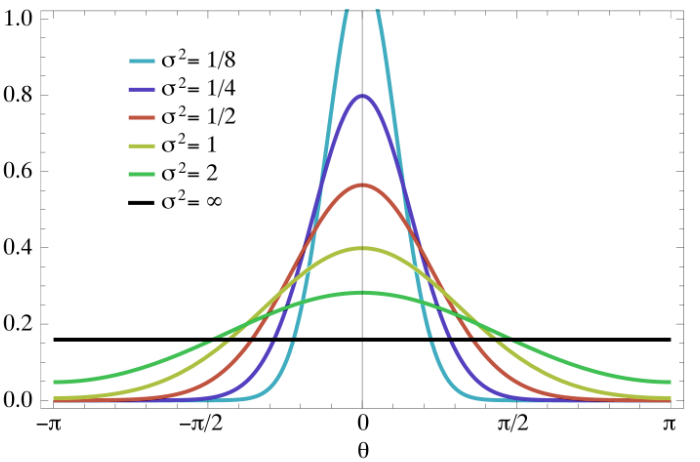

Kernel Methods the widely used in Clustering and Support Vector Machine. Even though the concept is very simple, most of the time students are not clear on the basics. We can use Linear SVM to perform Non Linear Classification just by adding Kernel Trick. All the detailed derivations from Prime Problem to Dual Problem had only one objective, use Kernel Trick to make the computation much easier. Here in this **Support Vector Machines for Beginners – Kernel SVM** tutorial we will lean about Kernel and understand how it can be use in the SVM Dual Problem.

## Prerequisite

Basic understanding of Linear Algebra and Statistic should be sufficient for this tutorial. Also please refer the previous part of SVM tutorial if needed.

## Why Polynomial Feature expansion is bad for Linear Model ?

We can use Linear Classifier for Non Linear Classification by expanding the **input space** to a **feature space**.It’s better to understand this using an example.Here is the Linear SVM Objective Function that we have already derived for Gradient Descent.
$$
\begin{align}
L = \frac{||\beta^2||}{2} + C \sum_{i=1}^n max \bigg ( 0, 1- y_i ( \beta^Tx_i+b) \bigg ) 
\end{align}
$$
Now if we want to extend this to support Non-Linear Classification we could try to perform **Feature Engineering** (The same concept you might have already read in Linear/Logistic Regression). Assume **x** is two dimensional feature vector $(x_1,x_2)$, hence we can expand the **input** to following **features**,
$$
\begin{align}
(x_1,x_2) \to (x_1, x_2, x_1^2, x_2^2, x_1x_2 )
\end{align}
$$
We can represent this as $\phi(x)$,
$$
\begin{align}
\phi(x) =  (x_1, x_2, x_1^2, x_2^2, x_1x_2 )
\end{align}
$$
Then instead of $x_i$ use $\phi(x_i)$ in the Loss Function. 
$$
\begin{align}
L = \frac{||\beta^2||}{2} + C \sum_{i=1}^n max \bigg ( 0, 1- y_i ( \beta^T\phi(x_i)+b) \bigg ) 
\end{align}
$$
Few important points to notice here,

- Going forward, we will call the input data as **Input Space** and the newly created features as **Feature Space** $\phi(x)$. 
- We know that the classes in input space is not linearly separable, hence we are introducing the feature space and assuming that the classes in feature space are linearly separable. (Otherwise the Linear SVM Classifier won't even work)
- If the input space has **I** dimension and the feature space has **D**, our objective is to make **D >>  I**, by introducing new features.

The above approach works fine, however the **time and space complexity is exponentially large**. Assume our input space is an image, then the dimension of the input space is already 900 ( 30px X 30px Image ). A realistic feature space could easily have dimension of 400K. 

The feature vector for one image will be of 400k dimension, while there might be tens-n-thousands of input images required to train the classifier. All the data points in the input space needs to be transformed to the feature space. Imagine the dimension of the vectors we need to deal with. Not only the transformation needs significantly more computation power, but we need additional memory to even store the new feature space. So even though this version of SVM is capable of performing Non-Linear Classification, we can't use this with real datasets.

## Kernel Trick

We can use the **Kernel Trick** to implement the same Non Linear SVM (similar feature engineering method), without the need to have any higher dimensional feature vector (Less time and space complexity) .

In other words, using Kernel Trick, we don't need to perform the input space to feature space transformation calculations or even store the feature space in memory. Let's define the following feature space. ( This almost same as the previous example, just added few more scalers and a bias) 
$$
\begin{align}
x &= (x_1,x_2)  \\
\phi(x) &= (1, \sqrt{2}x_1, \sqrt{2}x_2, x_1^2, x_2^2, \sqrt{2}x_1x_2 )
\end{align}
$$
Remember that the Kernel Trick works only when we can represent the feature space as an **inner product**. ( You may be confused about this statement, however just continue reading and revisit each section as needed. )

#### Inner Product vs Dot Product:

> Dot Product is a specific type of Inner Product. Hence don't be confused by seeing Inner Product and Dot Product used interchangeably. **Inner Product** is an abstract idea while **Dot Product** has specific mathematical formula.

Let me show what happens when we represent the feature space as an inner product using our example above. We will use **dot product** here to represent the following,
$$
\begin{align}
\phi(x) . \phi(z) &= (1, \sqrt{2}x_1, \sqrt{2}x_2, x_1^2, x_2^2, \sqrt{2}x_1x_2 ). (1, \sqrt{2}z_1, \sqrt{2}z_2, z_1^2, z_2^2, \sqrt{2}z_1z_2 ) \\
&= 1+ 2x_1z_1 + 2x_2z_2+x_1^2z_1^2+x_2^2z_2^2+2x_1x_2z_1z_2 \\
&= ( 1 + x_1z_1+x_2z_2)^2 \\
&= ( 1 + x.z)^2  \\
\end{align}
$$
Did you notice the magic of mathematics ? We can represent the dot product $\phi(x) . \phi(z)$ in feature space just by using a simple formula $( 1 + x.z)^2$ in input space. So we do not have to perform any complex transformations or store the feature space in memory, if the dot product of feature space can be represented using dot product of input space.

### Kernel Function

This method is named as **Kernel Trick** and the corresponding function $\phi(x_i)\phi(x_j) = ( 1 + x_i.x_j)^2$ is called as **Kernel function**. Kernel Function is often represented as $K(x_i,x_j)$

### Kernel Representation

>  If the feature space is **abstract vector space** then the Kernel is represented using $K(x_i,x_j) = < \phi(x_i),\phi(x_j) > $ and when the feature space is **vector space** then the **transpose** operator can be used. So don't be confused seeing these two different representations, they are essentially the same. 

$$
\begin{align}
\phi(x_i)^T \phi(x_j) \equiv <\phi(x_i),\phi(x_j)>
\end{align}
$$

Any Machine Learning algorithm can use Kernel Method, however it's mainly used in **SVM** and **Clustering**. At this point you may have two questions,

- We have the dual form of the objective function where $x_ix_j$ can be replaced by $\phi(x_i)^T\phi(x_j)$, but the prediction still has the form $\hat{y} = \text{sign}( \beta^Tx_i +b )$. How to use $\phi(x_i)^T\phi(x_j)$ there ? Without this it really does not make sense to use the dual form.
- How to identify a Kernel function ?

### Kernel Matrix

We can represent the pairwise dot products as a `nxn` matrix. It's called as **Kernel Matrix**. Both Kernel Function and Kernel Matrix is generally denoted using **K**.

$$
\begin{align}
K = 
\begin 
{bmatrix} 
 K(x_1,x_1) & K(x_1,x_2) & ... & K(x_1,x_n)\\ 
 K(x_2,x_1) &  K(x_2,x_2)  & ... & K(x_2,x_n) \\ 
 ... &  ...  &  ... & ... \\ 
 K(x_n,x_1) &  K(x_n,x_2)  & ... & K(x_n,x_n) 
\end{bmatrix}
\end{align}
$$

## Mercer's Condition

A Kernel Function is valid **iff** ( if and only if ) the following conditions are satisfied. These are called as **Mercer's Condition**.

- **Symmetric :** $K(x_i,x_j)= K(x_j,x_i )$
- **Positive semi-definite :** $a^TKa \geq 0 , a \in \Bbb R^n$

### Proof of Mercer's Condition

Let's see how we can proof them.

#### 1. **Symmetric**

Since dot product is **Symmetric**, **K** is also symmetric. 

#### 2. **Positive semi-definite**

We can say **K** is positive semi-definite as the below square term is always greater than zero,
$$
\begin{align}
a^TKa =& \sum_{i=1}^n \sum_{j=1}^n a_i a_j K( x_i,x_j) \\
=& \sum_{i=1}^n \sum_{j=1}^n a_i a_j \phi(x_i)^T\phi(x_j) \\
=& \bigg (   \sum_{i=1}^n a_i \phi(x_i)  \bigg )^T \bigg ( \sum_{j=1}^n a_j \phi(x_j) \bigg ) \\
=& \bigg | \bigg | \sum_{i=1}^n a_i \phi(x_i) \bigg | \bigg | ^2 \geq 0
\end{align}
$$

## Kernel Types

There are mainly 2 types of Kernel Function we will be discussing here, since they are more relevant to SVM. 

### 1. Polynomial Kernel

There are two types of Polynomial Kernels:

- Homogeneous
- Inhomogeneous

#### Homogeneous Polynomial Kernel

Homogeneous Polynomial Kernel is defined as,
$$
\begin{align}
K_q (x,z) = \phi(x)^T \phi(z) = (x^Tz)^q 
\end{align}
$$
Here **q** is the degree of polynomial. This Kernel corresponds to a feature space spanned by all products of exactly **q** attributes. The most typical cases are linear ( q = 1 ) and quadratic ( q = 2 ) kernels given as,
$$
\begin{align}
K_1 (x,z) &=  x^Tz \\
K_2 (x,z) &= (x^Tz)^2
\end{align}
$$

#### Inhomogeneous Polynomial Kernel

Inhomogeneous Polynomial Kernel is defined as,
$$
\begin{align}
K_q (x,z) = \phi(x)^T \phi(z) = (c+ x^Tz)^q 
\end{align}
$$
Here $c \geq 0$ is some constant.  We have already seen in our previous example, where **q** was equal to **2**. The proof can be done using binomial expansion for **q** degree. ( Let me know in case you are interested to see the proof )

### 2. Gaussian Kernel

Gaussian Kernel is also called as **Gaussian Radial Basis Function** ( RBF ) and one of the most popular and powerful Kernel. The Gaussian Kernel is defined as,
$$
\begin{align}
K (x,z) = \exp \bigg \{  - \frac{||x-z||^2}{2\sigma^2}  \bigg \}
\end{align}
$$
Here $\sigma$ is the **spread parameter** that plays the same role as standard deviation in normal density function.

You can see in the above image that a low $\sigma$ value will be prone to overfitting. In case you are using Gaussian Kernel, you need to set the sigma value as a Hyper Parameter ( some libraries uses precision, which is inverse of $\sigma$, instead of $\sigma$. In that case, a high precision value will be prone to overfitting )

### RBF : Infinite Dimensionality

> It is important to note that the **feature space** of Gaussian Kernel has Infinite Dimensionality.

Gaussian Kernel always provides a value between 0 and 1.

## Non Linear SVM using Kernel

The following section goes through the the different objective functions and shows how to use Kernel Tricks for Non Linear SVM.

### Hinge Loss

We will start with Hinge Loss and see how the optimization/cost function can be changed to use the Kernel Function,
$$
\begin{align}
\max_{\alpha} L_{dual} &= \sum_{i=1}^n \alpha_i - \frac{1}{2} \sum_{i=1}^n\sum_{j=1}^n \alpha_i \alpha_j y_iy_jx_i^Tx_j \\
&= \sum_{i=1}^n \alpha_i - \frac{1}{2} \sum_{i=1}^n\sum_{j=1}^n \alpha_i \alpha_j y_iy_j \phi(x_i)^T\phi(x_j) \\
&= \sum_{i=1}^n \alpha_i - \frac{1}{2} \sum_{i=1}^n\sum_{j=1}^n \alpha_i \alpha_j y_iy_j K(x_i, x_j) \\
\end{align}
$$
Notice that the dual Lagrangian depends on the the dot product between two vectors in the feature space, hence we can use the Kernel Trick for this optimization.

#### Weight Vector and Bias

Recall the equation for weight vector $\beta$,
$$
\begin{align}
\beta &= \sum_{i , \alpha_i \geq 0} \alpha_i y_ix_i \\
&= \sum_{i , \alpha_i \geq 0} \alpha_i y_i \phi(x_i) \\
\end{align}
$$
As you can see above, there is no direct way to use the Kernel Trick to compute the weight vector $\beta$. However we need this for our prediction function to work. Let's find out the alternative option we have. The Kernel Trick can be utilized for the bias, again recall the equation for bias,
$$
\begin{align}
b &= \text{ avg}_{i, C \leq \alpha_i \leq 0 } \Big \{  b_i \Big \} \\
&= \text{ avg}_{i, C \leq \alpha_i \leq 0 } \Big \{  y_i - \beta^Tx_i \Big \}
\end{align}
$$
We can substitute $\beta$ in the above equation as, 
$$
\begin{align}
bi &=   y_i - \beta^T\phi(x_i ) \\
&=   y_i - \sum_{j , \alpha_j \geq 0} \alpha_j y_j \phi(x_j)^T \phi(x_i ) \\
&=   y_i - \sum_{j , \alpha_j \geq 0} \alpha_j y_j K(x_j, x_i ) \\
\end{align}
$$

#### Kernel SVM Classifier

We need to find out how we can use the classifier to predict without even using the $\beta$ directly. Recall the equation,
$$
\begin{align}
\hat{y} &= \text{sign}( \beta^Tz_i +b ) \\
&= \text{sign}( \beta^T \phi(z) +b ) \\
&= sign \bigg ( \sum_{i , \alpha_i \geq 0} \alpha_i y_i \phi(x_i)^T \phi(z_i) + b \bigg ) \\
&= sign \bigg ( \sum_{i , \alpha_i \geq 0} \alpha_i y_i K(x_i , z_i) + b \bigg ) \\
&= sign \bigg ( \sum_{i , \alpha_i \geq 0} \alpha_i y_i K(x_i , z_i) + \text{ avg}_{i, C \leq \alpha_i \leq 0 } \Big \{  b_i \Big \} \bigg ) \\
&= sign \bigg ( \sum_{i , \alpha_i \geq 0} \alpha_i y_i K(x_i , z_i) + \text{ avg}_{i, C \leq \alpha_i \leq 0 } \Big \{  y_i - \sum_{j , \alpha_j \geq 0} \alpha_j y_j K(x_j, x_i ) \Big \} \bigg ) \\
\end{align}
$$
Once again, $\hat{y}$ uses only the dot products in the feature space.

###  **Quadratic Loss**

The loss function for **Quadratic Loss** is different than Hinge Loss, hence we will see how to use the Kernel Trick there, however rest of the equations are same, hence we wont repeat them here. Recall the loss function from previous article,
$$
\begin{align}
L_{dual} &= \sum_{i=1}^n \alpha_i - \frac{1}{2} \sum_{i=1}^n\sum_{j=1}^n \alpha_i \alpha_j y_iy_j \Big ( x_i^Tx_j  + \frac{1}{2C} \delta_{ij} \Big )  \\
\end{align}
$$
Define a new Kernel Function $K_d$ as following,
$$
\begin{align}
K_d ( x_i,x_j ) &=  x_i^Tx_j  + \frac{1}{2C} \delta_{ij}  \\
&=  K(x_i, x_j )  + \frac{1}{2C} \delta_{ij}  \\
\end{align}
$$
As $\delta_ij=1$ when **i=j**, the diagonal values of the **Kernel Matrix** K are updated and  $\delta_ij$ is only dependent on $\alpha_i$

## Conclusion

I hope that above discussion should cover the basics of Support Vector Machine. We still have to understand the optimization step on how to train a SVM classifier. In the next tutorial we will go through the details on that and also write python code to implement the same.

