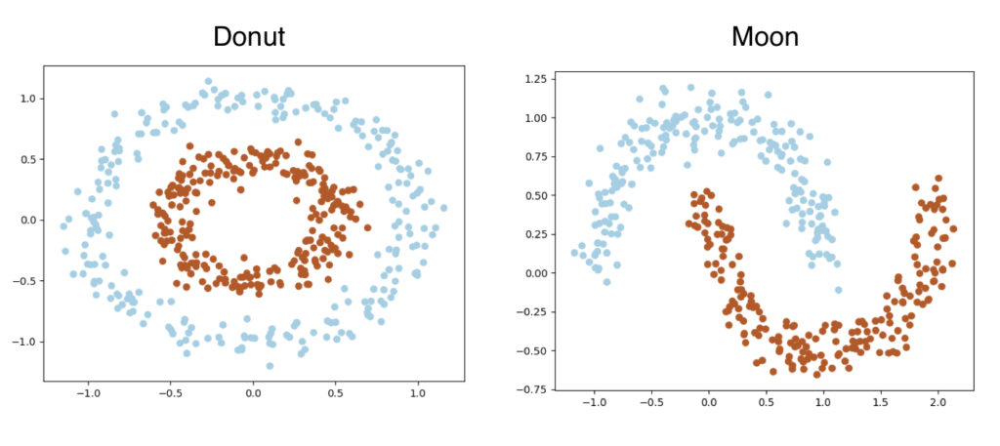
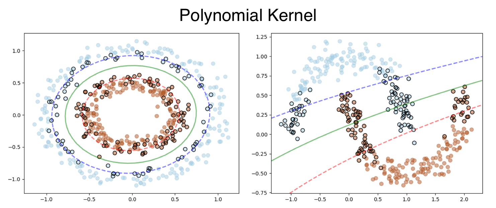
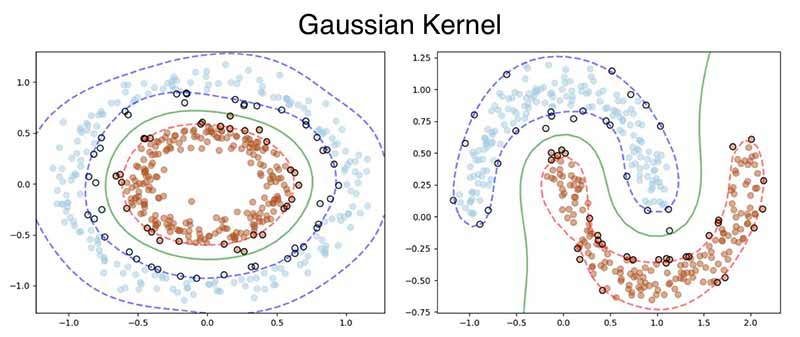
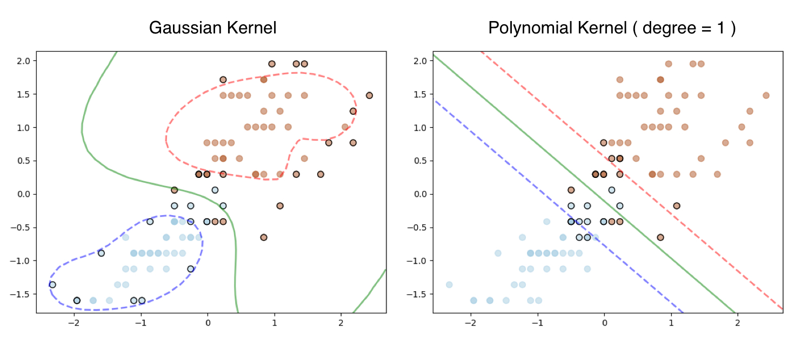
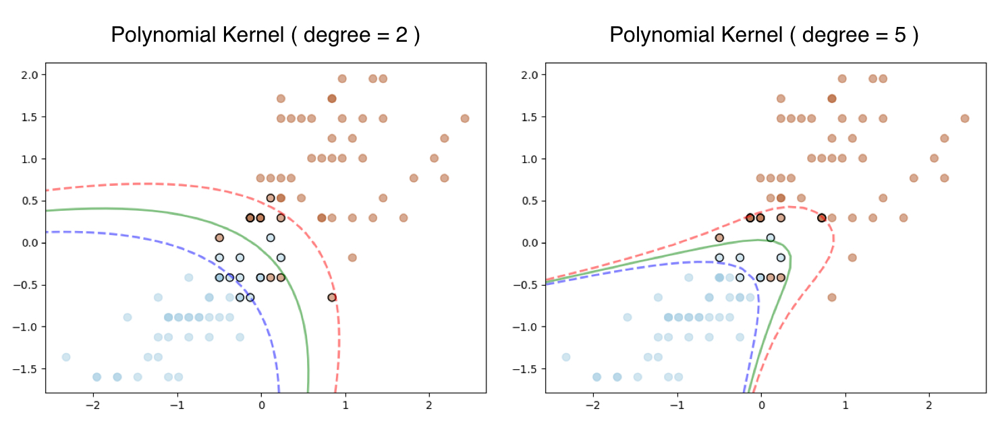
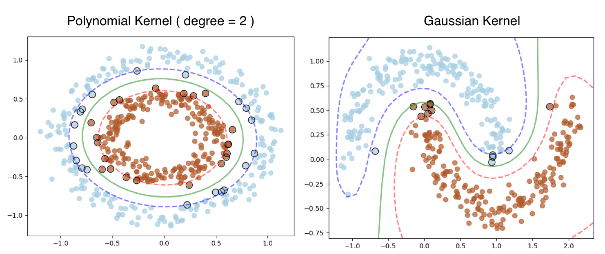
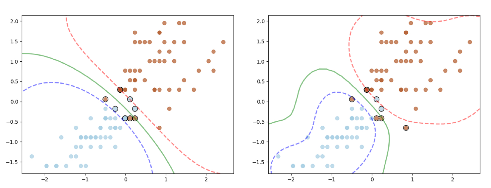

We will now work on training SVM using the optimization algorithms (Primal and Dual) that we have defined. Even though these training algorithms can be good foundation for more complex and efficient algorithms, they are only useful for learning purpose and not for real application. Generally, SVM Training algorithms needs loops than vectorized implementations, hence most of them are written in more efficient language like C++. In **this Support Vector Machines (SVM) for Beginners – Training Algorithms** tutorial we will learn how to implement the SVM Dual and Primal problem to classify non-linear data.

## Prerequisite

Optimization algorithms such as Gradient Descent is used for training SVM, hence some understanding to Linear\Logistic Regression should be sufficient for this tutorial. I will go through the math in detail, however please go thorough the previous post if you need to recap the Kernel Methods. 

## Training Dual SVM using Kernel

Before we get started with the Gradient Descent algorithm, we will reformulate the **weight vector** and **bias** just to vectorize some part of the computation.

stead of dealing with bias term separately, we will add 1 to each data point (You might have already seen this in Linear/Logistic Regression). The $i^{th}$ data point looks like following,
$$
\begin{align}
x_i = (x_{i1},.......,x_{id},1)^T
\end{align}
$$
Similarly, add the bias **b** at the end of the weight vector $\beta$, so that
$$
\begin{align}
\beta = (\beta_1,.......,\beta_d,b)^T
\end{align}
$$
Now the equation of the hyperplane can be written as,
$$
\begin{align}
h(x_i) & :  \beta^T x_i = 0 \\
h(x_i) & : \begin{pmatrix}
\beta_1 & ... & \beta_d & b 
\end{pmatrix} \begin{pmatrix}
x_{i1}\\ 
...\\ 
x_{id}\\ 
1
\end{pmatrix} = 0 \\
h(x_i) & : \beta_1x_{i1}+...+\beta_dx_{id}+b =0
\end{align}
$$
We can rewrite the inequality constraint as,
$$
\begin{align}
y_i\beta^Tx_i \geq 1- \xi_i
\end{align}
$$

### Gradient Descent

We will go through the **Hinge Loss** scenario as Quadratic Loss can be achieved by using appropriate Kernel. As we recall, the loss function of hinge loss in dual form is written as, 
$$
\begin{align}
\max_{\alpha} L_{dual}(\alpha)  =\max_{\alpha} \Big \{ \sum_{i=1}^n \alpha_i - \frac{1}{2} \sum_{i=1}^n\sum_{j=1}^n \alpha_i \alpha_j y_iy_j K(x_i, x_j) \Big \} \\
\end{align}
$$
The following section is a bit tricky, in case you are confused please try this by hand using a paper.

We are now going to apply some neat trick and for that instead of all the $\alpha$ values (above equation), we will work on just the $k^{th}$  $\alpha$ term only. ( Notice I have taken one $\sum$ out.)
$$
\begin{align}
L(\alpha)  =\alpha_k - \frac{1}{2} \sum_{j=1}^n \alpha_k \alpha_j y_ky_j K(x_k, x_j) 
\end{align}
$$
Now move the $k^{th}$ elements outside of the $\sum$. This may take a moment to get the understanding, don't worry I am going to go very slow here.
$$
\begin{align}
L(\alpha) =\alpha_k - \frac{1}{2} \alpha_k \alpha_k y_ky_k K(x_k, x_k) - \sum_{j=1, j \neq k }^n \alpha_k \alpha_j y_ky_j K(x_j, x_k)
\end{align}
$$
Simplifying further, 
$$
\begin{align}
L(\alpha) =\alpha_k - \frac{1}{2} \alpha_k^2 y_k^2 K(x_k, x_k) - \alpha_k y_k \sum_{j=1, j \neq k }^n  \alpha_j y_j K(x_j, x_k)
\end{align}
$$
We can get the gradient of the $k^{th}$ component by differentiating $L(\alpha_k)$ w.r.t $\alpha_k$ 
$$
\begin{align}
\require{cancel}
\frac{\delta L(\alpha_k)}{\delta \alpha_k} =\frac{\delta}{\delta \alpha_k} \Big \{ \alpha_k - \frac{1}{2} \alpha_k^2 y_k^2 K(x_k, x_k) - \alpha_k y_k \sum_{j=1, j \neq k }^n  \alpha_j y_j K(x_j, x_k) \Big \} \\
= 1 - \frac{1}{\cancel{2}} \cancel{2} \alpha_k y_k^2 K(x_k, x_k) - y_k \sum_{j=1, j \neq k }^n  \alpha_j y_j K(x_j, x_k) \\
= 1 - \alpha_k y_k y_k K(x_k, x_k) - y_k \sum_{j=1, j \neq k }^n  \alpha_j y_j K(x_j, x_k)
\end{align}
$$
Now put the $k^{th}$ term back into the $\sum$
$$
\begin{align}
\frac{\delta L(\alpha_k)}{\delta \alpha_k} = 1 - y_k \sum_{j=1 }^n  \alpha_j y_j K(x_j, x_k)
\end{align}
$$
The gradient of the objective function w.r.t $\alpha$ can be derived using the partial derivative of $L(\alpha)$ as given below,
$$
\begin{align}
\Delta L(\alpha ) = \bigg (    \frac{\delta L(\alpha)}{\delta \alpha_1} , \frac{\delta L(\alpha)}{\delta \alpha_2} , ... , \frac{\delta L(\alpha)}{\delta \alpha_k} , ... , \frac{\delta L(\alpha)}{\delta \alpha_d} \bigg )
\end{align}
$$
where,
$$
\begin{align}
\frac{\delta L(\alpha)}{\delta \alpha_k} = \frac{\delta L(\alpha_k)}{\delta \alpha_k} = 1 - y_k \sum_{j=1 }^n  \alpha_j y_j K(x_j, x_k)
\end{align}
$$
As you might have already guessed, we will using **Gradient Ascent** and not Descent as we need to **maximize** the objective function $L(\alpha)$. Here is the equation to update $\alpha$ where $\eta$ is the learning rate. This is the same equation you might already already used in Linear/Logistic Regression.
$$
\begin{align}
\alpha_{t+1} = \alpha_t+\eta_t \Delta L(\alpha)
\end{align}
$$
Since $\alpha$ will have **d** dimension,  we will follow **stochastic gradient ascent** approach and update each component $\alpha_k$ independently. Then immediately use the new value to update the other components. This will help us to achieve convergence much faster. 
$$
\begin{align}
\alpha_k &= \alpha_k+\eta_t \frac{\delta L(\alpha )}{\delta \alpha_k} \\
&= \alpha_k+\eta_t \bigg ( 1 - y_k \sum_{j=1 }^n  \alpha_j y_j K(x_j, x_k) \bigg )
\end{align}
$$
There is a nice way to set the learning rate $\eta_k$. We can proof mathematically that the following value of $\eta_k$ will make the gradient at $\alpha_k$ go to zero.
$$
\begin{align}
\eta_k = \frac{1}{K(x_k,x_k)}
\end{align}
$$
I am skipping the derivation here, as its not important for our algorithm to work, however please let me know if you are interested, then I will add it here. **Note** : I am still investigating on the usefulness of this $\eta$ value. I will update the post accordingly.

Finally we need to take care the constraint $\alpha_k \in [0,C]$. If we the value of $\alpha_k \leq 0 $ then we will reset it to **0** and if  $\alpha_k \geq C $, then we reset it to **C**.

### Python Implementation

We will now implement the above algorithm using python from scratch. I want to highlight few changes before we get started,

- Instead of loops we will be using vectorized operations.
- Hence we are going to use only one learning rate $\eta$ for all the $\alpha$ and not going to use $\eta_k = \frac{1}{K(x_k,x_k)}$. This will simplify our implementation, however feel free to update the code to use the optimal values of $\eta_k$ 
- We will also try out two different Kernels
  - Polynomial Kernel
  - Gaussian Kernel
- We will also try our SVM on two different generated dataset, Donut and Moon. Both of them have two classes and they are **not linearly** separable. We will generate 500 data points for each datasets.
- We **won't be** combining the weight vector and bias in one vector here (as shown above). This could be a good exercise. 



#### SVMDualProblem Class

Create a class named `SVMDualProblem`. Create the `__init__()` function and defined 4 arguments as below.

- **C** is there to balance the cost of misclassification. We generally set it to 1 to start with.

- kernel takes two values for us,

  - `poly` for Polynomial Kernel
    - Provide the `degree` for Polynomial Kernel

  - `rbf` for Gaussian Kernel
    - Provide the `sigma` value for Gaussian Kernel

```python
class SVMDualProblem:
    def __init__(self, C=1.0, kernel='rbf', sigma=0.1, degree=2):
```

We need to select the appropriate kernel function based on the `kernel` variable. We will have to write the functions for corresponding kernel. Here is the rest of the `__init__()` function. 

```python
def __init__(self, C=1.0, kernel='rbf', sigma=0.1, degree=2):
    self.C = C
    if kernel == 'poly':
        self.kernel = self._polynomial_kernel
        self.c = 1
        self.degree = degree
    else:
        self.kernel = self._rbf_kernel
        self.sigma = sigma

    self.X = None
    self.y = None
    self.alpha = None
    self.b = 0
    self.ones = None
```

Next is the **Polynomial Kernel** function. This is same as the equation given in the Kernel Methods tutorial.

```python
def _polynomial_kernel(self, X1, X2):
    return (self.c + X1.dot(X2.T)) ** self.degree
```

Here is the **Gaussian Kernel** function, where the `np.linalg.norm()` function is used to calculate the distance between **X1** and **X2**.

```python
def _rbf_kernel(self, X1, X2):
    return np.exp(-(1 / self.sigma ** 2) * np.linalg.norm(X1[:, np.newaxis] - X2[np.newaxis, :], axis=2) ** 2)
```

We will now define the `fit()` function. It takes total 4 arguments, 

- Training Features - `X`
- Output Labels - `y` [ -1,+1 ]
- Learning Rate ( we are using the same learning rate for all $\alpha_k$).
- Number of epochs

We will start with the initializations. I have mentioned the dimension of the vectors whenever needed as comments. Initialize $\alpha$ randomly and set the **bias** to zero. The `self.ones` is a vectors of 1's with size **n**. This will be used later in the training loop.

```python
def fit(self, X, y, lr=1e-3, epochs=500):

    self.X = X
    self.y = y

    # (n,)
    self.alpha = np.random.random(X.shape[0])
    self.b = 0
    # (n,)
    self.ones = np.ones(X.shape[0])
```

The **Kernel Matrix** can be calculated by passing X to our Kernel Function `self.kernel(X, X)`. Notice $\sum_{i=1}^n\sum_{j=1}^n y_iy_j K(x_i, x_j)$ does not have any learnable parameters and fixed for a given training set. Hence we can calculate that before the training loop.

```python
 		#(n,n) =      (n,n) *        (n,n)
 		y_iy_jk_ij = np.outer(y, y) * self.kernel(X, X)
```

Create a list to store the losses so that we can plot them later. Start the training loop. Remember the gradient function ? The only different is we will be using a vectorized form here to calculate the gradient for all $\alpha_k$.
$$
\begin{align}
 1 - y_k \sum_{j=1 }^n  \alpha_j y_j K(x_j, x_k)
\end{align}
$$
So instead of 1 we will have a vector of **n** ones ( assuming our dataset has 500 data points ). Similarly, we can calculate the summation and multiplication together using a **dot product** between $y_jy_kK(x_j,x_k)$ and $\alpha_k$. We can also replace it with `gradient = self.ones - np.sum(y_iy_jk_ij * self.alpha)`

Once the gradient has been computed, update $\alpha$ as per gradient ascent rule.

```python
    losses = []
  	for _ in range(epochs):
        # (n,)  =    (n,)      (n,n).(n,)=(n,)
        gradient = self.ones - y_iy_jk_ij.dot(self.alpha)
        self.alpha = self.alpha + lr * gradient
```

Clip the $\alpha$ values accordingly.

```python
        self.alpha[self.alpha > self.C] = self.C
        self.alpha[self.alpha < 0] = 0
```

Finally calculate the loss using the loss function. Here is the Loss Function to recap, we can sum over all the $\alpha$ using `np.sum(self.alpha)`. The $\sum_{i=1}^n\sum_{j=1}^n y_iy_j$ can be calculated using `np.outer(y, y)`. This will be a `(n x n)` matrix. 
$$
\begin{align}
\sum_{i=1}^n \alpha_i - \frac{1}{2} \sum_{i=1}^n\sum_{j=1}^n \alpha_i \alpha_j y_iy_j K(x_i, x_j)
\end{align}
$$

```python
        #                                        (500,500)                            (500,500)
        loss = np.sum(self.alpha) - 0.5 * np.sum(np.outer(self.alpha, self.alpha) * y_iy_jk_ij)
        losses.append(loss)
```

Once training has been completed, we can calculate the bias **b**. Remember that we don't even need the weight vector $\beta$ here. Here is the equation of **b**.
$$
\begin{align}
b = \text{ avg}_{i, C \leq \alpha_i \leq 0 } \Big \{  y_i - \sum_{j , \alpha_j \geq 0} \alpha_j y_j K(x_j, x_i ) \Big \}
\end{align}
$$
In the code, we will first identify the index of all the $\alpha$ values which satisfy the criteria, then perform the computations using those $\alpha$ values only. I am again using dot product, however you can replace it with `b_i = y[index] - np.sum((self.alpha * y).reshape(-1, 1)*self.kernel(X, X[index]), axis=0)`

```python
    index = np.where((self.alpha) > 0 & (self.alpha < self.C))[0]
    #(m,)= (m,)       (n,).(n,m)= (m,)
    b_i = y[index] - (self.alpha * y).dot(self.kernel(X, X[index]))
    self.b = np.mean(b_i)
```

Finally plot the loss function.

```python
    plt.plot(losses)
    plt.title("loss per epochs")
    plt.show()
```

Just like before, during the prediction we need a `_decision_function()` Here is the formula,
$$
\begin{align}
\hat{y} = sign \bigg ( \sum_{i , \alpha_i \geq 0} \alpha_i y_i \phi(x_i)^T \phi(z_i) + b \bigg ) \\
\end{align}
$$

```python
    def _decision_function(self, X):
        return (self.alpha * self.y).dot(self.kernel(self.X, X)) + self.b
```

Add the following functions for prediction, they are same as the previous example.

```python
    def predict(self, X):
        return np.sign(self._decision_function(X))
 
    def score(self, X, y):
        y_hat = self.predict(X)
        return np.mean(y == y_hat)
```

#### Generate Datasets

Create a class named `SampleData`. We will use `sklearn`‘s `datasets` package.

```python
class SampleData:
    def get_moon(self, n_samples, noise=0.05):
        noisy_moons = datasets.make_moons(n_samples=n_samples, noise=noise, random_state=6)
        return noisy_moons[0], noisy_moons[1]
 
    def get_donut(self, n_samples, noise=0.05, factor=0.5):
        noisy_circles = datasets.make_circles(n_samples=n_samples, factor=factor, noise=noise)
        return noisy_circles[0], noisy_circles[1]
 
    def plot(self, X, y):
        ax = plt.gca()
        ax.scatter(X[:, 0], X[:, 1], c=y, cmap=plt.cm.Paired)
        plt.show()
```

#### __main__

Here is the main block, notice the class labels needs to be converted to [-1,+1]. Again I am not showing the code of `plot_decision_boundary()` function here. Please find it in github repo.

```python
if __name__ == '__main__':
    sample = SampleData()
    X, y = sample.get_donut(n_samples=500, noise=0.08)
    y[y == 0] = -1
 
    svm = SVMDualProblem(C=1.0, kernel='poly', degree=2)
    svm.fit(X, y, lr=1e-3)
    print("train score:", svm.score(X, y))
    svm.plot_decision_boundary()
 
    X, y = sample.get_moon(n_samples=400, noise=0.1)
    y[y == 0] = -1
 
    svm = SVMDualProblem(C=1.0, kernel='rbf', sigma=0.5)
    svm.fit(X, y, lr=1e-2)
    print("train score:", svm.score(X, y))
    svm.plot_decision_boundary()
```

#### Output

Let’s look that output, the **Polynomial Kernel** works fine for Donut dataset, however fails to classify for the moon dataset.



**RBF** is a much robust kernel, hence works flawlessly on both the datasets.



In case you are wondering how this works on the **iris dataset** we used in our first example here is the output. The Linear SVM still works with **Polynomial Kernel** and `degree = 1`





### Full Code

Please click on the button to access the full code in github.

<div style='text-align:center;margin-bottom:30px;'>
<input type='button' value="GitHub" onclick="javascript:window.open('https://github.com/adeveloperdiary/blog/blob/master/SVM/NonLinearSVM_DualProblem.py','_blank')"/>
</div>
## Training Primal SVM using Kernel

You might be surprised to see the heading. So far we have learned that the whole point of deriving the dual problem from primal problem is the usability of Kernel. However researchers have found a way of using the Kernel with Primal Problem too.

Start by recalling the Objective Function using the Hinge Loss used in our Gradient Descent algorithm.
$$
\begin{align}
L = \frac{||\beta^2||}{2} + C \sum_{i=1}^n max \bigg ( 0, 1- y_i ( \beta^Tx_i+b) \bigg ) 
\end{align}
$$
We can express the weight vector $\beta$ using following expression,
$$
\begin{align}
\beta = \sum_{i=1}^n \omega_i\phi(x_i)
\end{align}
$$
Here $\omega_i$ is the coefficient of the point $\phi(x_i)$ in **feature space**. In other words, the optimal weight vector in feature space is expressed as a **linear combination** of the points $\phi(x_i)$ in feature space. We can not magically define anything and assume it to work. Generally I always try to provide the full mathematical derivation of all the algorithms, however the derivation of the above formula is lengthy, complex and not needed for implementing using python. Hence I am planning to skip for now. This approach is also called as **Newton Optimization**. We can define the vectorize form as following,
$$
\begin{align}
\beta = \phi(x)^T\omega
\end{align}
$$
So by replacing the $\beta$ in the loss function and introducing feature space $\phi$ we can rewrite the equation as,
$$
\begin{align}
L &= \frac{ 1 }{2} \beta^T\beta + C \sum_{i=1}^n max \bigg ( 0, 1- y_i ( \beta^T\phi(x_i)+b) \bigg ) \\
&= \frac{ 1 }{2} (\phi(x)^T\omega)^T(\phi(x)^T\omega) + C \sum_{i=1}^n max \bigg ( 0, 1- y_i ((\phi(x)^T\omega)^T\phi(x_i)+b) \bigg ) \\
&= \frac{ 1 }{2} \omega^T\phi(x)\phi(x)^T\omega + C \sum_{i=1}^n max \bigg ( 0, 1- y_i (\omega^T\phi(x)\phi(x_i)+b) \bigg ) \\
&= \frac{ 1 }{2} \omega^TK(x,x^T) \omega + C \sum_{i=1}^n max \bigg ( 0, 1- y_i (\omega^TK(x,x_i)+b) \bigg ) \\
\end{align}
$$
Now we have a Primal Objective function using the Kernel. In order to find the minima, we need to take derivative w.r.t $\omega$ and `b` and then use them in Gradient Descent formula (Same as in Linear/Logistic Regression). Please refer the first post if needed.
$$
\begin{align}
\require{cancel}
\frac{\delta L}{\delta \omega} &= \frac{1}{\cancel{2}} \cancel{2} K(x,x^T) \omega - C \sum_{i=1, \xi_i \geq 0}^n y_i K(x,x_i) \\
&= K(x,x^T) \omega - C \sum_{i=1, \xi_i \geq 0}^n y_i K(x,x_i) \\
\frac{\delta L}{\delta b} &= - C \sum_{i=1, \xi_i \geq 0}^n y_i  
\end{align}
$$
The prediction can be computed using following formula,
$$
\begin{align}
\hat{y} &= \text{sign}( \beta^Tz +b ) \\
&= \text{sign}( (\phi(x)^T\omega)^T\phi(z) +b ) \\
&= \text{sign}( \omega^T \phi(x)\phi(z) +b ) \\
&= \text{sign}( \omega^T K(x,z) +b ) \\
\end{align}
$$

### Python Implementation

The implementation is very similar to the previous examples, hence I am not going to go very detail. Define the `SVMPrimalProblem` class. Here is the `__init__()` function.

```python
class SVMPrimalProblem:
    def __init__(self, C=1.0, kernel='rbf', sigma=.1, degree=2):
 
        if kernel == 'poly':
            self.kernel = self._polynomial_kernel
            self.c = 1
            self.degree = degree
        else:
            self.kernel = self._rbf_kernel
            self.sigma = sigma
 
        self._support_vectors = None
        self.C = C
        self.w = None
        self.b = None
        self.X = None
        self.y = None
        self.K = None
```

Define the Kernel functions.

```python
    def _rbf_kernel(self, X1, X2):
        return np.exp(-(1 / self.sigma ** 2) * np.linalg.norm(X1[:, np.newaxis] - X2[np.newaxis, :], axis=2) ** 2)
 
    def _polynomial_kernel(self, X1, X2):
        return (self.c + X1.dot(X2.T)) ** self.degree
```

The `fit()` function is exactly same, except the equation we are minimizing the $\omega$ now.

```python
    def fit(self, X, y, lr=1e-5, epochs=500):
        # Initialize Beta and b
        self.w = np.random.randn(X.shape[0])
        self.b = 0
 
        self.X = X
        self.y = y
        # Kernel Matrix
        self.K = self.kernel(X, X)
 
        loss_array = []
        for _ in range(epochs):
            margin = self.__margin(X, y)
 
            misclassified_pts_idx = np.where(margin < 1)[0]
            d_w = self.K.dot(self.w) - self.C * y[misclassified_pts_idx].dot(self.K[misclassified_pts_idx])
            self.w = self.w - lr * d_w
 
            d_b = - self.C * np.sum(y[misclassified_pts_idx])
            self.b = self.b - lr * d_b
 
            loss = (1 / 2) * self.w.dot(self.K.dot(self.w)) + self.C * np.sum(np.maximum(0, 1 - margin))
            loss_array.append(loss)
 
        self._support_vectors = np.where(self.__margin(X, y) <= 1)[0]
 
        plt.plot(loss_array)
        plt.title("loss per epochs")
        plt.show()
```

The `__margin()` function is exactly same, however the `__decision_function` was changed for the new formula.

```python
    def predict(self, X):
        return np.sign(self.__decision_function(X))
 
    def score(self, X, y):
        prediction = self.predict(X)
        return np.mean(y == prediction)
```

Like before we will be using Donut and Moon datasets.

```python
if __name__ == '__main__':
    sample = SampleData()
    X, y = sample.get_donut(n_samples=500, noise=0.08)
    y[y == 0] = -1
 
    svm = SVMPrimalProblem(C=1.0, kernel='poly', degree=2)
    svm.fit(X, y, lr=1e-5, epochs=500)
    print("train score:", svm.score(X, y))
    svm.plot_decision_boundary()
 
    X, y = sample.get_moon(n_samples=400, noise=0.1)
    y[y == 0] = -1
 
    svm = SVMPrimalProblem(C=1.0, kernel='rbf', sigma=.7)
    svm.fit(X, y, lr=1e-3)
    print("train score:", svm.score(X, y))
    svm.plot_decision_boundary()
```

#### Output

Here is the output, the polynomial kernel was applied to the Donut dataset and RBF Kernel to the Moon Dataset.



I have tested the code against the iris dataset as well using the **Gaussian Kernel** (different $\sigma$ settings) and here is the output.



### Full Code

Please click on the button to access the full code in github.  

<div style='text-align:center;margin-bottom:30px;'>
<input type='button' value="GitHub" onclick="javascript:window.open('https://github.com/adeveloperdiary/blog/blob/master/SVM/NonLinearSVM_PrimalProblem.py','_blank')"/>
</div>

## Conclusion

I hope this tutorial will help students to get started with SVM. Feel free to post any feedback in the comment section.
