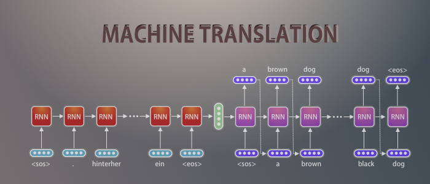
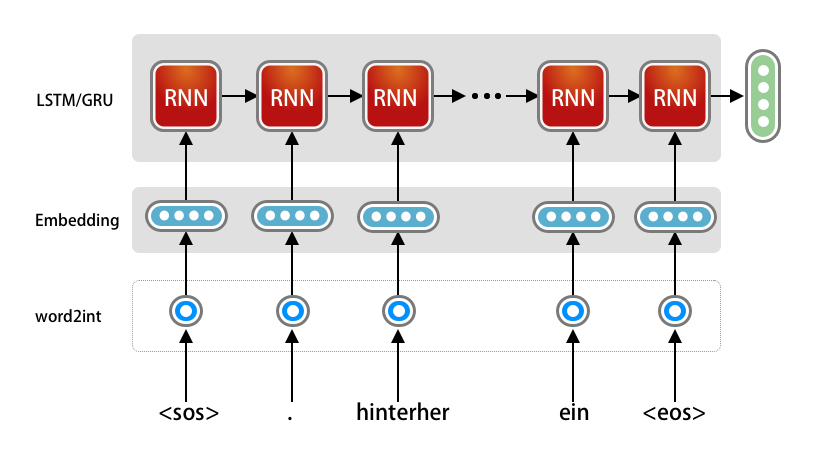
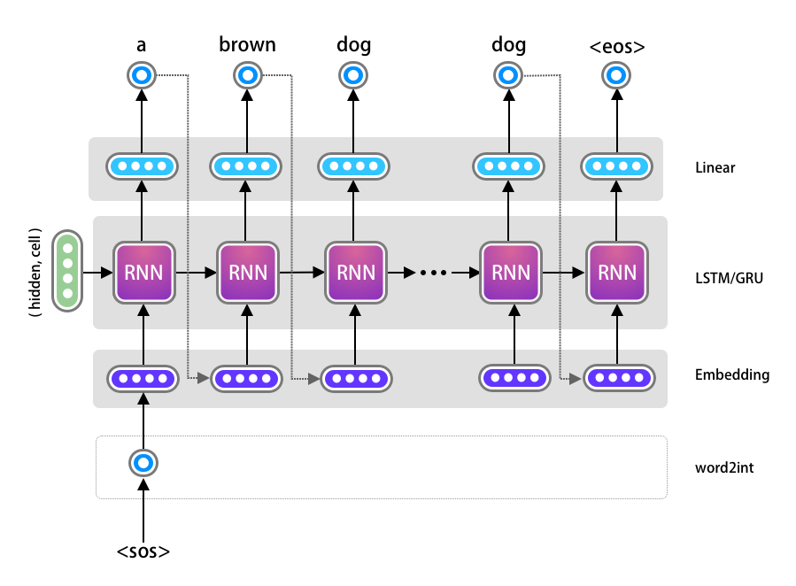
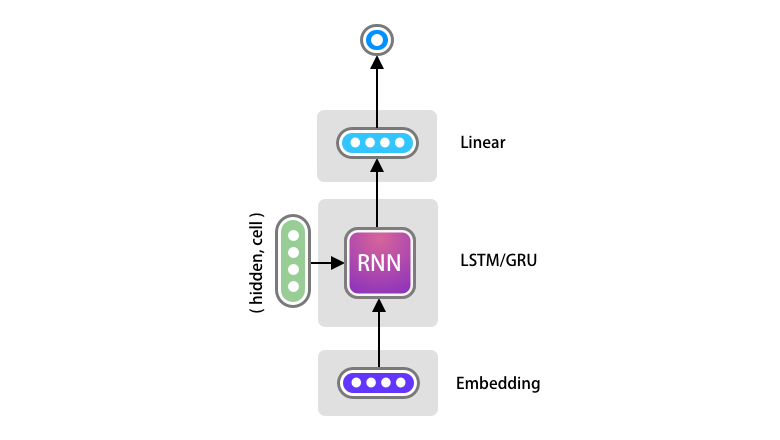
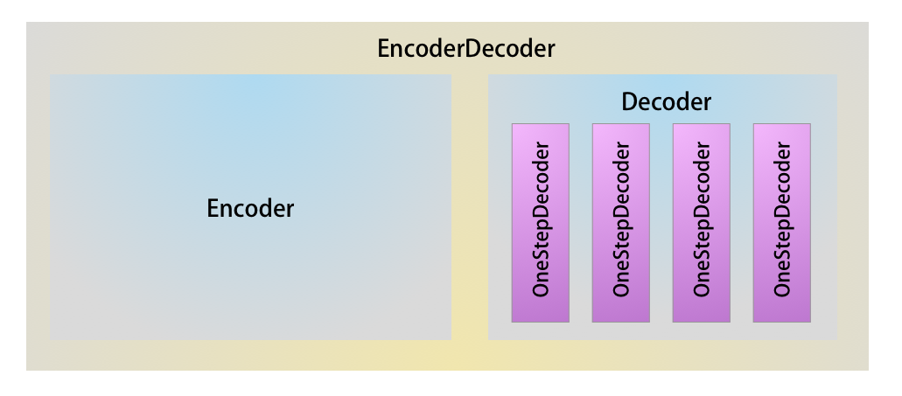
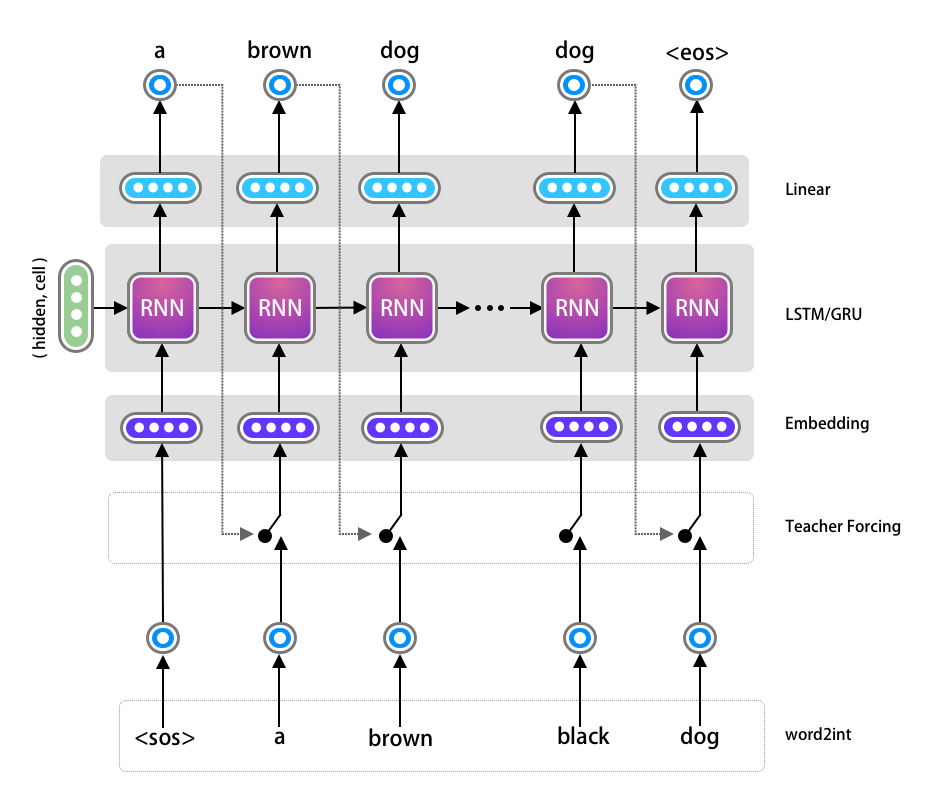
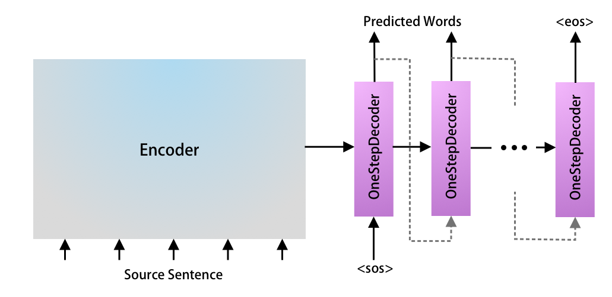
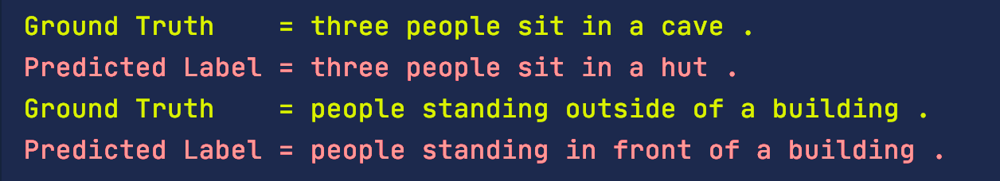
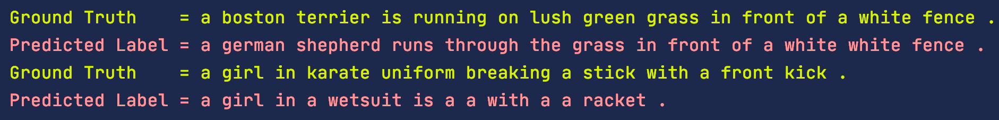

Seq2Seq (Encoder-Decoder) Model Architecture has become ubiquitous due to the advancement of Transformer Architecture in recent years. Large corporations started to train huge networks and published them to the research community. Recently Open API has licensed their most advanced pre-trained Transformer model GPT-3 to Microsoft. Even though the practical implementation of RNN has become almost non-existent, anyone starting to learn the most advanced algorithms still need to understand how to implement a Seq2Seq Model just using RNN and its variants (LSTM, GRU). In this **Machine Translation using Recurrent Neural Network and PyTorch tutorial** I will show how to implement a RNN from scratch.

## Prerequisites

Since I am going to focus on the implementation details, I won’t be going to through the concepts of RNN, LSTM or GRU. I hope that you have read the text books in order to get a conceptual idea about Seq2Seq (Encoder-Decoder) Model. We will however go through some theory, so that we can discuss the program in a detailed way along with some variations.

## Encoder-Decoder Model Architecture

I am using Seq2Seq and Encoder-Decoder interchangeably as they kinda means the same. Below is the diagram of basic Encoder-Decoder Model Architecture. We need to feed the input text to the Encoder and output text to the decoder. The encoder will pass some data, named as Context Vectors to the decoder so that the decoder can do its job.

This is a very simplified version of the architecture. As I build each part, I will focus more on specifics.


Encoder-Decoder Model can be used in different fields of Artificial Intelligence such as Machine Translation, Entity Named Recognition, Summarization, Chat-Bot, Question-Answering and many more.

Here we will be translating from German to English. I searched for many different datasources, however settled with the one provided by PyTorch as it takes much lesser computation power to train using this dataset. You can use Google CoLab to train your model if you don’t have access to a GPU.

I am choosing German to English translation (and not vice-versa) as I don’t know German, however I can easily identify the model performance by looking at the output ( which will be in English ).

We will start with a simple Encoder-Decoder architecture, then get into more complex version gradually.

## Encoder Model using PyTorch

I will defer the simple data processing steps until the model is ready. However just understand that, the input data will be a sequence of strings in array which will start with `<sos>` and end with `<eos>`. Take a look at a simple version of encoder architecture.



As you already know that Neural Network can only understand number, we need to first convert each word to unique token of integer number, then use One-Hot Encoding to represent each word (which is depicted as `one-hot` in the diagram above). This will be taken care as part of the preprocessing, which will be explained later.

We need to use PyTorch to be able to create the embedding and RNN layer. We will create the sub-class of the `torch.nn.Module` class and define the `__init__()` and `forward()` method.

### __init__()

The Embedding layer will take the input data and output the embedding vector, hence the dimension of those needs to be defined in line number 5 as `input_dim` and `embedding_dim`.

The `vocab_len` is nothing but the number of unique words present in our vocabulary. After pre-processing the data, we can count the number of unique words in our vocabulary and use that count here.

The `embedding_dim` is the output/final dimension of the embedding vector we need. A good practice is to use 256-512 for sample demo app like we are building here.

Next we will define our `LSTM` Layer, which takes the `embedding_dim` as the input data and create total 3 outputs – `hidden`, `cell` and `output`. Here we need to define the number of neurons we need in LSTM, which is defined using the hidden dimension. Again, this is just a number and we will set this as 1024.

LSTM can be stacked, hence we will pass the `n_layers` as a parameter, however for our initial implementation we will just use 1 layer.

```python
class Encoder(nn.Module):
    def __init__(self, vocab_len, embedding_dim, hidden_dim, n_layers, dropout_prob):
        super().__init__()
 
        self.embedding = nn.Embedding(vocab_len, embedding_dim)
        self.rnn = nn.LSTM(embedding_dim, hidden_dim, n_layers, dropout=dropout_prob)
 
        self.dropout = nn.Dropout(dropout_prob)
 
    def forward(self, input_batch):
        embed = self.dropout(self.embedding(input_batch))
        outputs, (hidden, cell) = self.rnn(embed)
 
        return hidden, cell
```

### forward()

The forward function is very straight forward. Notice I am using a `dropout` layer after the embedding layer, this is absolutely **optional**.

The encoder is the most simple among rest of the code. Notice we are completely ignorant on the **batch size** and the **time dimension** (sentence length) as both will be taken care dynamically by PyTorch.

The Embedding layer uses the `vocab_len` for converting the `input_batch` to one-hot representation internally.

Another important point to notice here is, we can feed an entire batch at once to the encoder model. A batch will have the dimension of `[time_dimension, batch_size]`. In PyTorch if don’t pass the `hidden` and `cell` to the RNN module, it will initialize one for us and process the entire batch at once.

So the output (`outputs, hidden, cell`) of the LSTM module is the final output after processing for all the time dimensions for all the sentences in the batch. We do not need the `outputs` vector from the LSTM, as we need to pass just the **context vector** to the decoder block, which consists of the `hidden` and `cell` vector only. Hence let’s return them from the function here.

**Note:** Since we are using LSTM we have the additional **cell** state, however if we are using GRU, we will have only the hidden state.

## Decoder Model using PyTorch

Implementation of Decoder needs to be done in **two steps**. Let’s understand more from the diagram below.



The decoder’s input in a time step $$t$$, is dependent on the output of the previous time step $$t−1$$. When $t=0$ it will take the output of the Encoder as the input for its initial hidden, cell state. We will first create a Decoder Model just for one time step of the decoder and later add a wrapper for the entire time sequence.

### One Time Step of the Decoder

The one time step of the decoder looks like the following diagram. Here all we want to implement is one Embedding Layer, LSTM and Linear Layer.

**Note:** Some of the implementation uses a **LogSoftMax** layer (e.g official PyTorch documentation at the time of writing) after the **Linear** layer. Since we do not need a probability distribution here and can work with the most probable value, we are omitting the use of **LogSoftMax** can will just use the output of the **Linear** layer. The **LogSoftMax** might be useful in other use cases such as Beam Search.



The code for `OneStepDecoder` is very simple to implement. There are however few important points to notice.

Since the output of the **Linear** layer will be the input to the Embedding layer of the next time step, the output dimension should be same as the decoder’s input dimension and target sentences vocabulary size. Here we are naming it as input_output_dim.

Secondly, the `target_token` is just one dimensional as we are just passing the previous most probable generated index of the word for all the batches. However as discussed previously, the Embedding layer expects input as `[time_dimension, batch_size]`. Hence call the `unsqueeze(0)` function just to add an additional time dimension as **1**.

We will take the output of the LSTM and remove this time_dimension before passing it to the **Linear** layer.

```python
class OneStepDecoder(nn.Module):
    def __init__(self, input_output_dim, embedding_dim, hidden_dim, n_layers, dropout_prob):
        super().__init__()
        # self.input_output_dim will be used later
        self.input_output_dim = input_output_dim
 
        self.embedding = nn.Embedding(input_output_dim, embedding_dim)
        self.rnn = nn.LSTM(embedding_dim, hidden_dim, n_layers, dropout=dropout_prob)
        self.fc = nn.Linear(hidden_dim, input_output_dim)
        self.dropout = nn.Dropout(dropout_prob)
 
    def forward(self, target_token, hidden, cell):
        target_token = target_token.unsqueeze(0)
        embedding_layer = self.dropout(self.embedding(target_token))
        output, (hidden, cell) = self.rnn(embedding_layer, (hidden, cell))
 
        linear = self.fc(output.squeeze(0))
 
        return linear, hidden, cell
```

### Decoder Model

Now we are ready to build the full Decoder model. First, pass the instance of `OneStepDecoder` in the constructor.

The main objective is to call the OneStepDecoder as many times we have the time dimension in our batch.

So far we have ignored the **Time and Batch dimension** as PyTorch was taking care of that automatically, however now we need get them (`target_len, batch_size`) from the **target**.

We need to store the output of each Decoder Time Step for each batch, we created a tensor named `predictions` using PyTorch.

Next, take the very first input from the target data (which will be <sos>) and pass it along with the `hidden` and `cell` from the encoder. The `input`, `hidden` and `cell` variable will be overwritten in the consecutive time step.

Finally loop through the time step ( remember that each batch may have a variable number of time sequence and batch size ) and call the `one_step_decoder`. Store the predicted output to the predictions vector and get the most probable word token by call the `argmax()` function.

```python
class Decoder(nn.Module):
    def __init__(self, one_step_decoder, device):
        super().__init__()
        self.one_step_decoder = one_step_decoder
        self.device=device
 
    def forward(self, target, hidden, cell):
        target_len, batch_size = target.shape[0], target.shape[1]
        target_vocab_size = self.one_step_decoder.input_output_dim
        # Store the predictions in an array for loss calculations
        predictions = torch.zeros(target_len, batch_size, target_vocab_size).to(self.device)
        # Take the very first word token, which will be sos
        input = target[0, :]
        
        # Loop through all the time steps
        for t in range(target_len):
            predict, hidden, cell = self.one_step_decoder(input, hidden, cell)
 
            predictions[t] = predict
            input= predict.argmax(1)        
        
        return predictions
```

## Combine Encoder and Decoder

The next step will be to combine the Encoder and Decoder models. The below diagram shows the model hierarchy. We already have the Encoder and Decoder model, we need to combine them in a model named EncoderDecoder.



Here is the code for the EncoderDecoder Model. The code is self explanatory, let me know in the comments if you have any question on this.

```python
class EncoderDecoder(nn.Module):
    def __init__(self, encoder, decoder):
        super().__init__()
 
        self.encoder = encoder
        self.decoder = decoder        
 
    def forward(self, source, target):
        
        hidden, cell = self.encoder(source)
        outputs= self.encoder(target, hidden, cell)
                    
        return outputs
```

## Teacher Forcing

We could train what we have build so far, however we will just add one more concept called Teacher Forcing in the Decoder mode. If you already know about this please feel free to skip ahead.

When one of OneStepDecoder predicts the wrong word, the next consecutive OneStepDecoder does not learn as it receives the wrong input and the trend continues for the remaining of the tokens in the sequence. This leads to very slow convergence of model.

One way of addressing this problem is to randomly provide the correct input to the OneStepDecoder, irrespective of the output from the previous time step. This way we are enforcing the current OneStepDecoder to learn from correct data. This leads to **faster convergence**. The process is called as **Teacher Forcing**, since we are intermittently helping the decoder to learn from correct target sequence.

I have updated the previous diagram in order to get an intuition about the idea. As you see all we are doing is randomly choosing between the previous step’s output vs the actual target.



The code is straightforward, first we want to control how much of teacher forcing to use, hence pass that as a parameter as during inference we wont be using it at all. The following code is part of our Decoder loop for enabling Teacher Forcing. We can pass the `teacher_forcing_ratio` to `0` in order to disable it during inference time.

```python
...
do_teacher_forcing = random.random() < teacher_forcing_ratio
...
input = target[t] if do_teacher_forcing else input
```

The decoder’s `forward()` method looks like this:

```python
def forward(self, target, hidden, cell, teacher_forcing_ratio=0.5):
    target_len, batch_size = target.shape[0], target.shape[1]
    target_vocab_size = self.one_step_decoder.input_output_dim
    # Store the predictions in an array for loss calculations
    predictions = torch.zeros(target_len, batch_size, target_vocab_size).to(self.device)
    # Take the very first word token, which will be sos
    input = target[0, :]
        
    # Loop through all the time steps
    for t in range(target_len):
        predict, hidden, cell = self.one_step_decoder(input, hidden, cell)
 
        predictions[t] = predict
        input= predict.argmax(1)        
 
        # Teacher forcing
        do_teacher_forcing = random.random() < teacher_forcing_ratio        
        input = target[t] if do_teacher_forcing else input
 
    return predictions
```

Notice the `teacher_forcing_ratio` is being passed as an argument to the forward method and not to the constructor, so that the value can be changed during the life cycle of the training. We can have more teacher forcing in the beginning of the training, however as training progresses we can reduce the value so that the network can learn by itself.

## Bidirectional & Stacked LSTM

We can certainly use Bidirectional and Stacked LSTM for better performance. Here we will use `n_layers` as 2, the above code does not have any impact however. Feel free to try out Bidirectional LSTM.

## Dataset Preparation

Let’s shift our focus on the dataset preparation so that we can start our training. We will be using **Multi30k** dataset with **Spacy** tokenizer.

In case you are interested to learn more about Spacy, please visit the following link: https://www.presentslide.in/2019/07/implementing-spacy-advanced-natural-language-processing.html

The **get_datasets()** function is self explanatory, go though and ask me questions if you have any. We will reverse the German tokens as it enforces the initial LSTM layers in the Decoder to get more influenced by the initial part of source German tokens, which if you think about it makes more sense.

#### Note: 

> I recently noticed the newer spacy library might not work work using the below code. As a best practice, its going to be easy to use huggingface datasets library to use. Please refer my transformer tutorial to find out how to use it.

```python
def get_datasets():
	# Download the language files
	spacy_de = spacy.load('de')
	spacy_en = spacy.load('en')
 
	# define the tokenizers
	def tokenize_de(text):
	    return [token.text for token in spacy_de.tokenizer(text)][::-1]
 
 
	def tokenize_en(text):
	    return [token.text for token in spacy_en.tokenizer(text)]
 
	# Create the pytext's Field
	Source = Field(tokenize=tokenize_de, init_token='<sos>', eos_token='<eos>', lower=True)
	Target = Field(tokenize=tokenize_en, init_token='<sos>', eos_token='<eos>', lower=True)
 
	# Splits the data in Train, Test and Validation data
	train_data, valid_data, test_data = Multi30k.splits(exts=('.de', '.en'), fields=(Source, Target))
 
	# Build the vocabulary for both the language
	Source.build_vocab(train_data, min_freq=3)
	Target.build_vocab(train_data, min_freq=3)
 
	# Set the batch size
	BATCH_SIZE = 128
 
	# Create the Iterator using builtin Bucketing
	train_iterator, valid_iterator, test_iterator = BucketIterator.splits((train_data, valid_data, test_data), 
	                                                                      batch_size=BATCH_SIZE, 
	                                                                      sort_within_batch=True,
	                                                                      sort_key=lambda x: len(x.src),
	                                                                      device=device)
	return train_iterator,valid_iterator,test_iterator,Source,Target

```

## Model Initialization

This part is similar to any other PyTorch program. Initialize the model, optimizer and loss function.

```python
def create_model(source, target):
    # Define the required dimensions and hyper parameters
    embedding_dim = 256
    hidden_dim = 1024
    dropout = 0.5
 
    # Instanciate the models
    encoder = Encoder(len(source.vocab), embedding_dim, hidden_dim, n_layers=2, dropout_prob=dropout)
    one_step_decoder = OneStepDecoder(len(target.vocab), embedding_dim, hidden_dim, n_layers=2, dropout_prob=dropout)
    decoder = Decoder(one_step_decoder, device)
 
    model = EncoderDecoder(encoder, decoder)
 
    model = model.to(device)
 
    # Define the optimizer
    optimizer = optim.Adam(model.parameters())
 
    # Makes sure the CrossEntropyLoss ignores the padding tokens.
    TARGET_PAD_IDX = target.vocab.stoi&#91;target.pad_token]
    criterion = nn.CrossEntropyLoss(ignore_index=TARGET_PAD_IDX)
 
    return model, optimizer, criterion
```

## Training Loop

This code is also very generic, except just one part. We will be discarding the first token from the forward pass and also from the target token sequence.

```python
def train(train_iterator, valid_iterator, source, target, epochs=10):
    model, optimizer, criterion = create_model(source, target)
 
    clip = 1
 
    for epoch in range(1, epochs + 1):
        pbar = tqdm(total=len(train_iterator), bar_format='{l_bar}{bar:10}{r_bar}{bar:-10b}', unit=' batches', ncols=200)
 
        training_loss = []
        # set training mode
        model.train()
 
        # Loop through the training batch
        for i, batch in enumerate(train_iterator):
            # Get the source and target tokens
            src = batch.src
            trg = batch.trg
 
            optimizer.zero_grad()
 
            # Forward pass
            output = model(src, trg)
 
            # reshape the output
            output_dim = output.shape[-1]
 
            # Discard the first token as this will always be 0
            output = output[1:].view(-1, output_dim)
 
            # Discard the sos token from target
            trg = trg[1:].view(-1)
 
            # Calculate the loss
            loss = criterion(output, trg)
 
            # back propagation
            loss.backward()
 
            # Gradient Clipping for stability
            torch.nn.utils.clip_grad_norm_(model.parameters(), clip)
 
            optimizer.step()
 
            training_loss.append(loss.item())
 
            pbar.set_postfix(
                epoch=f" {epoch}, train loss= {round(sum(training_loss) / len(training_loss), 4)}", refresh=True)
            pbar.update()
 
        with torch.no_grad():
            # Set the model to eval
            model.eval()
 
            validation_loss = []
 
            # Loop through the validation batch
            for i, batch in enumerate(valid_iterator):
                src = batch.src
                trg = batch.trg
 
                # Forward pass
                output = model(src, trg, 0)
 
                output_dim = output.shape[-1]
 
                output = output[1:].view(-1, output_dim)
                trg = trg[1:].view(-1)
 
                # Calculate Loss
                loss = criterion(output, trg)
 
                validation_loss.append(loss.item())
 
        pbar.set_postfix(
            epoch=f" {epoch}, train loss= {round(sum(training_loss) / len(training_loss), 4)}, val loss= {round(sum(validation_loss) / len(validation_loss), 4)}",
            refresh=False)
 
        pbar.close()
 
    return model
```

## Execution

Run following lines of code to execute your model training and save to disk. Make sure to save both the Source and Target vocabulary in disk so that it can be used during inference.

```python
train_iterator, valid_iterator, test_iterator, source, target = get_datasets(batch_size=512)
model = train(train_iterator, valid_iterator, source, target, epochs=1)
 
checkpoint = {
    'model_state_dict': model.state_dict(),
    'source': source.vocab,
    'target': target.vocab
}
 
torch.save(checkpoint, 'nmt-model-lstm-20.pth')
```

The output prints the Train and Validation Loss.

```
100%|██████████| 114/114 [00:16<00:00,  6.90 batches/s, epoch=1, train loss= 4.9292, val loss= 4.8979]                                                                                                  
100%|██████████| 114/114 [00:16<00:00,  6.83 batches/s, epoch=2, train loss= 4.3143, val loss= 4.5898]                                                                                                  
100%|██████████| 114/114 [00:16<00:00,  6.81 batches/s, epoch=3, train loss= 3.9902, val loss= 4.3482]                                                                                                  
100%|██████████| 114/114 [00:16<00:00,  6.76 batches/s, epoch=4, train loss= 3.6813, val loss= 4.1082]                                                                                                  
100%|██████████| 114/114 [00:16<00:00,  6.78 batches/s, epoch=5, train loss= 3.4669, val loss= 4.0274]                                                                                                  
100%|██████████| 114/114 [00:16<00:00,  6.72 batches/s, epoch=6, train loss= 3.3279, val loss= 3.8433]                                                                                                  
100%|██████████| 114/114 [00:16<00:00,  6.72 batches/s, epoch=7, train loss= 3.156, val loss= 3.863]                                                                                                    
100%|██████████| 114/114 [00:17<00:00,  6.70 batches/s, epoch=8, train loss= 3.039, val loss= 3.8006]                                                                                                   
100%|██████████| 114/114 [00:16<00:00,  6.73 batches/s, epoch=9, train loss= 2.9121, val loss= 3.7312]                                                                                                  
100%|██████████| 114/114 [00:17<00:00,  6.71 batches/s, epoch=10, train loss= 2.8272, val loss= 3.7297]                                                                                                 
100%|██████████| 114/114 [00:17<00:00,  6.69 batches/s, epoch=11, train loss= 2.697, val loss= 3.6217]                                                                                                  
100%|██████████| 114/114 [00:17<00:00,  6.69 batches/s, epoch=12, train loss= 2.6489, val loss= 3.5662]                                                                                                 
100%|██████████| 114/114 [00:17<00:00,  6.70 batches/s, epoch=13, train loss= 2.5568, val loss= 3.6312]                                                                                                 
100%|██████████| 114/114 [00:16<00:00,  6.71 batches/s, epoch=14, train loss= 2.4507, val loss= 3.6511]                                                                                                 
100%|██████████| 114/114 [00:16<00:00,  6.72 batches/s, epoch=15, train loss= 2.3717, val loss= 3.6543]                                                                                                 
100%|██████████| 114/114 [00:17<00:00,  6.69 batches/s, epoch=16, train loss= 2.3243, val loss= 3.5326]                                                                                                 
100%|██████████| 114/114 [00:16<00:00,  6.72 batches/s, epoch=17, train loss= 2.2451, val loss= 3.6471]                                                                                                 
100%|██████████| 114/114 [00:17<00:00,  6.69 batches/s, epoch=18, train loss= 2.1703, val loss= 3.65]                                                                                                   
100%|██████████| 114/114 [00:17<00:00,  6.70 batches/s, epoch=19, train loss= 2.0889, val loss= 3.6411]                                                                                                 
100%|██████████| 114/114 [00:17<00:00,  6.68 batches/s, epoch=20, train loss= 2.0468, val loss= 3.6686]   
```

There are other metrics such as **BLEU** Score which can be used in order to evaluate the model, however we will get to that in another tutorial on Attention Models.

### Access code in Github

Please click on the button to access the NMT_BasicRNN_train.py github.

<div style='text-align:center;margin-bottom:30px;'>
<input type='button' value="GitHub" onclick="javascript:window.open('https://github.com/adeveloperdiary/DeepLearning_MiniProjects/blob/master/Neural_Machine_Translation/NMT_BasicRNN_train.py','_blank')"/>
</div>
## Inference

Now we will learn how make predictions using **Encoder Decoder Models**. Inference on Seq2Seq models are not as straight forward as other models, hence lets get to that in detail.

The hierarchy of the inference model will be bit different. We don’t need the EncoderDecoder and Decoder Model anymore. Here are the high level steps:

- Load the model and vocabulary from the checkpoint file.
- Load the Test (Unseen) dataset.
- Convert each source token to integer values using the vocabulary
- Take the integer value of `<sos>` from the target vocabulary.
- Run the forward pass of the Encoder.
- Use the **hidden** and **cell** vector of the **Encoder** and in loop run the forward pass of the **OneStepDecoder** until some specified step (say 50) or when `<eos>` has been generated by the model.
- Record the most probable word inside the loop.
- Find the corresponding word from target vocabulary and print in console.



Here is the code to load the model, dataset and vocabulary.

```python
def load_models_and_test_data(file_name):
    test_data = get_test_datasets()
    checkpoint = torch.load(file_name)
    source_vocab = checkpoint['source']
    target_vocab = checkpoint['target']
    model = create_model_for_inference(source_vocab, target_vocab)
    model.load_state_dict(checkpoint['model_state_dict'])
 
    return model, source_vocab, target_vocab, test_data
```

### predict()

Get the specific example from test dataset using the id and convert the sentence to number of integers using the sentence tokenizer and source vocabulary. Then create a batch of 1 test data using the `unsqueeze()` function.

```python
def predict(id, model, source_vocab, target_vocab, test_data):    
    src = vars(test_data.examples[id])['src']
    trg = vars(test_data.examples[id])['trg']
 
    # Convert each source token to integer values using the vocabulary
    tokens = ['<sos>'] + [token.lower() for token in src] + ['<eos>']
    src_indexes = [source_vocab.stoi[token] for token in tokens]
    src_tensor = torch.LongTensor(src_indexes).unsqueeze(1).to(device)

```

Set the model to **eval** mode for inference and call the forward method of the Encoder by passing the tokenized source sentence at one.

```python
    model.eval()
 
    # Run the forward pass of the encoder
    hidden, cell = model.encoder(src_tensor)
```

Now take the integer value of **<sos>** from the target vocabulary and convert it to a Torch tensor.

```python
    # Take the integer value of <sos> from the target vocabulary.
    trg_index = [target_vocab.stoi['<sos>']]
    next_token = torch.LongTensor(trg_index).to(device)
```

Create an array named `outputs` in order to store the generated words. Loop through specific number of times (or until end of sentence has been received). Call the `forward` method of `OneStepDecoder` directly. Then find the most probable predicted output and save the corresponding word from the Target vocabulary. Print the ground truth and predicted sentence.

```python
    outputs = []
    with torch.no_grad():
        # Use the hidden and cell vector of the Encoder and in loop
        # run the forward pass of the OneStepDecoder until some specified
        # step (say 50) or when <eos> has been generated by the model.
        for _ in range(30):
            output, hidden, cell = model.decoder.one_step_decoder(next_token, hidden, cell)
 
            # Take the most probable word
            next_token = output.argmax(1)
            predicted = target_vocab.itos[output.argmax(1).item()]
            if predicted == '<eos>':
                break
            else:
                outputs.append(predicted)
 
    print(colored(f'Ground Truth    = {" ".join(trg)}', 'green'))
    print(colored(f'Predicted Label = {" ".join(outputs)}', 'red'))
```

Finally define a main function to run the prediction.

```python
if __name__ == '__main__':
    checkpoint_file = 'nmt-model-lstm-20.pth'
    model, source_vocab, target_vocab, test_data = load_models_and_test_data(checkpoint_file)
    predict(14, model, source_vocab, target_vocab, test_data)
    predict(20, model, source_vocab, target_vocab, test_data)
```

## Output

Here are some good predictions, which worked nicely. Remember the model hasn’t seen the test data yet, hence it has generalized well for shorter sentences.



However, here are some not so good prediction. We can clearly see that RNN is suffering from long sentences.



### Access code in Github

Please click on the button to access the nmt_basicrnn_inference.py github.

<div style='text-align:center;margin-bottom:30px;'>
<input type='button' value="GitHub" onclick="javascript:window.open('https://github.com/adeveloperdiary/DeepLearning_MiniProjects/blob/master/Neural_Machine_Translation/NMT_BasicRNN_Inference.py','_blank')"/>
</div>

## Conclusion

I hope that this tutorial provides the implementation details of Machine Translation using Encoder Decoder model with RNN. There are many advancements to this basic RNN model, however it’s probably wise to just add **attention** mechanism to this network for performance improvements.


