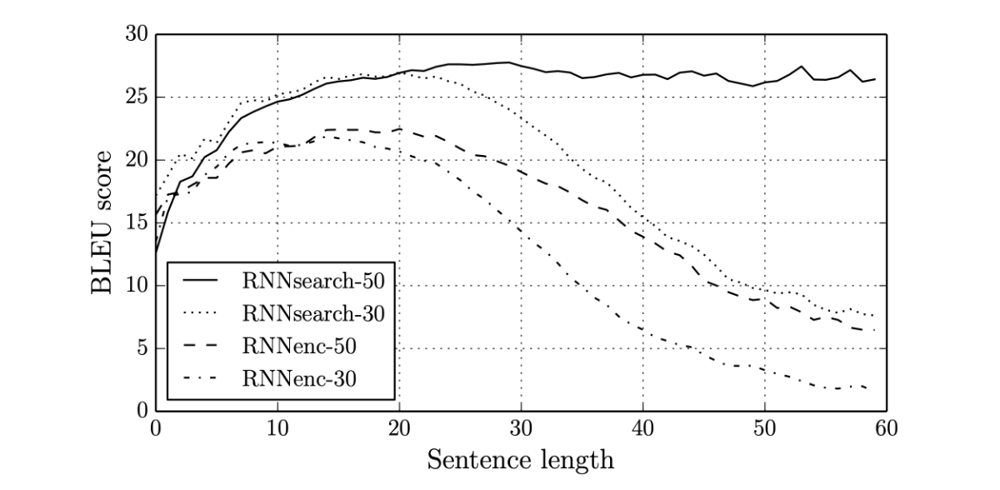
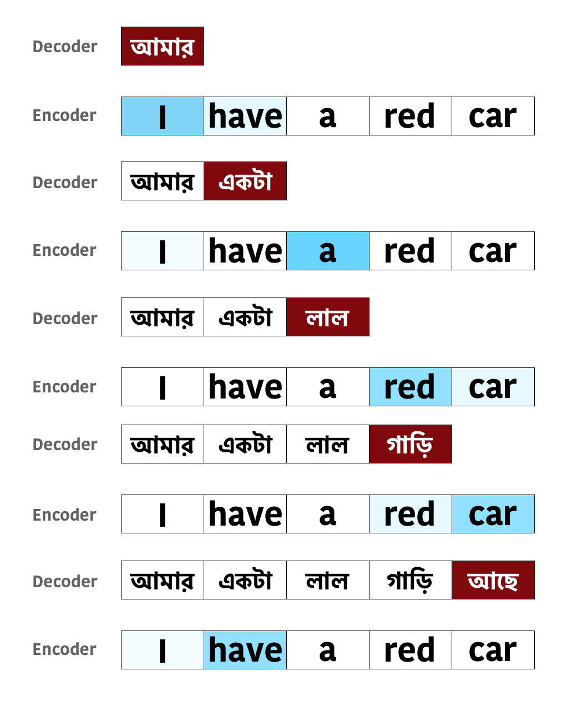
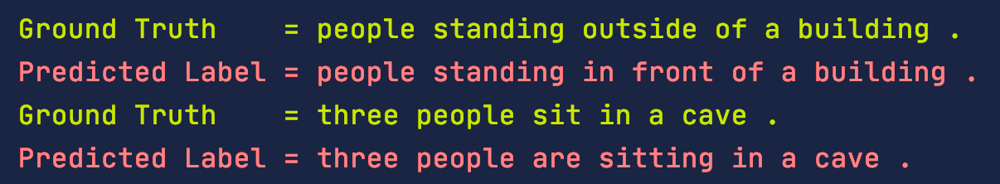
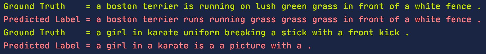
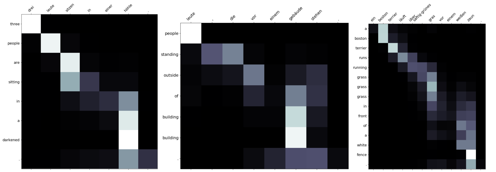

Attention mechanism has become one of very important concept in Natural Language Processing (NLP) due to the huge impact of Transformer models. In the last article we have seen how to implement Machine Translation task using simple RNN. In this **Machine Translation using Attention with PyTorch** tutorial we will use the Attention mechanism in order to improve the model.

## Prerequisites

The code of this tutorial is base based on the previous tutorial, so in case you need to refer that here is the link.

## What is wrong with the RNN models?

RNN based model ( including LSTM and GRU ) has few major limitations which prevented it to be deployed for complex NLP implementations.In Machine Translation, the accuracy reduces as the sentence length increases. Below is the diagram from [[Bahdanau et al.,2015](https://arxiv.org/abs/1409.0473)] shows that as the sentence length increases, the **BLEU** (in NLP BLEU method is used to compare the distance between two sentences, we will learn more on this later) score decreases for RNN based models.



This is not entirely unexpected as the context vector (which holds the compressed data from the encoder) is not sufficient enough the decoder to learn long range dependencies. Researchers have found that the context vector (hidden & cell) is the **bottleneck** in the Encoder-Decoder Model design.

## Why Attention?

In the paper *Neural Machine Translation by Jointly Learning to Align and Translate* [[Bahdanau et al.,2015](https://arxiv.org/abs/1409.0473)], the researchers used a different mechanism than the context vector for the decoder to learn from the encoder. They used an **Alignment vector** to represent the relevant information. This way of extracting information is also known as Attention in human psychology, hence the name Attention became popular.

As you see in the above diagram, the solid line represents the **BLEU** score of the model using **Attention**. The score does not get reduced with longer sentences like RNNs. This shows the early success of the Attention based models over RNNs.

## What is Attention mechanism?

Even though this tutorial is not theory based, we will go through the general concept of Attention and its different variations as well. We will use **Machine Translation** as an example to understand how Attention works, even-though it can be used for other types of NLP tasks as well.

Attention mimics the way human translator works. A human translator will look at one or few words at a time and start writing the translation. The human translator does not look at the whole sentence for each word he/she is translating, rather he/she focuses on specific words in the source sentence for the current translated word. Let’s look at it using an example.



Imagine the task is to translate from **English** to **Bangla** ( You may have probably never heard of this language, however it’s the 7th most spoken language in the world in 2020). You don’t have to really understand the language to understand Attention.

Keeping the concept of Encoder and Decoder, imagine a human translator is performing the translation. So for generating each word ( in red ) the translator needs the entire source sentence to focus into specific words (in blue). For an example, for the 1st word **আমার**, **I** and **have** are important, however **I** is more important (dark blue) than **have** (light blue). Similarly, for the last word **আছে**, **I** and **have** are again important, however **have** is more important than **I**.

In the above diagram, for each predicted word in **Bangla**, the related **English** words were highlighted in blue. The different shades of blue indicates the importance. You can immediately recognize that this is a much robust method and the previous EncoderDecoder Model using RNN was not doing this. The decoder was looking into one fixed context vector only at the beginning. That’s the reason the context vector was the bottleneck for the decoder’s performance.

In attention we mimic this human translator’s process. So for every word the decoder generates, it will have access all the states of the encoder (across the time dimension), so that the decoder can learn which words are more important for the translation, then extracts required information from there. Our objective is to find these relationships by estimating functions using neural network so that the decoder can effectively use them to predict next word. Finally, we no longer constrained by the length of the source sentence and can identify relationship/dependency even of the sentence is very large.

## Technical Definition

There are different variations of Attentions. We will start with more general version and build our concept gradually.

Use the **decoder** **hidden** **state** (for GRU) from the previous time step $D_h^{(t-1)}$ (it will have shape `[1, batch size, decoder hidden dimension]` ) and the **encoder outputs** $E_o$ (it will have shape `[source token length, batch size, encoder hidden dimension]`) to create a distribution so that the importance of each word in encoder can be defined mathematically. 
$$
\begin{align}
a^{t} &= align(E_o,D_h^{(t-1)}) \\
\end{align}
$$
In the above equation $a^t$ is called as **Alignment weights**, and since we want to have a probability distribution, we can just apply the **softmax** ( just like the final layer of any classification neural network )function to a set of weights (calculated by the scoring function $s$ ). We can expand the above equation as,
$$
\begin{align}
a^{t} &= align(E_o,D_h^{(t-1)}) \\
&= softmax ( s (E_o,D_h^{(t-1)}))
\end{align}
$$
The alignment weights provides the importance of each word in the Source sentence, which can be then multiplied (dot product) with encoder outputs to create the **weighted** matrix. 
$$
\begin{align}
W^t = E_o \cdot a^{t} 
\end{align}
$$
This $W^t$ will be used along with the Embedding Matrix as input to the Decoder RNN (GRU). The details above is the general structure of the the Attention concept. We can express all of these in one equation as:
$$
\begin{align}
W^t= E_o \cdot softmax ( s (E_o,D_h^{(t-1)}))
\end{align}
$$
There are many implementation of  the scoring function $s$, however we will use the one by **Louong et al** and later implement it using PyTorch. This is called as **Additive Scoring Function**.
$$
\begin{align}
s = W_s ( tanh ( W_c [E_o+D_h^{(t-1)}]))
\end{align}
$$
The $W_s$ and $W_c$ are learnable parameter during training and in PyTorch we will use a **Linear** layer for these. The final equation will look like:
$$
\begin{align}
W^t= E_o \cdot softmax ( W_s ( tanh ( W_c [E_o+D_h^{(t-1)}])))
\end{align}
$$
There are few other **scoring function** such as:

- Additive Attention ( Concat, Linear )
- Bilinear Attention (Multiplicative)
- Dot Product Attention (Multiplicative)
  - We will cover this more in **Transformer** tutorial.
- Scaled Product Attention (Multiplicative)
- Location-based

### PyTorch Implementation

Here is the code for calculating the **Alignment or Attention weights**. We need to calculate the `attn_hidden` for each source words. Instead of repeating this using a loop, we can duplicate the hidden state `src_len` number of times and perform the operations. The following code is as per the equation above and I have provided my comments inside the code as well. It’s a good idea to define separate Attention module so that you can easily replace this with other types of scoring function (as discussed above).

```python
class Attention(nn.Module):
    def __init__(self, encoder_hidden_dim, decoder_hidden_dim):
        super().__init__()
 
        # The input dimension will the the concatenation of
        # encoder_hidden_dim (hidden) and  decoder_hidden_dim(encoder_outputs)
        self.attn_hidden_vector = nn.Linear(encoder_hidden_dim + decoder_hidden_dim, decoder_hidden_dim)
 
        # We need source len number of values for n batch as the dimension
        # of the attention weights. The attn_hidden_vector will have the
        # dimension of [source len, batch size, decoder hidden dim]
        # If we set the output dim of this Linear layer to 1 then the
        # effective output dimension will be [source len, batch size]
        self.attn_scoring_fn = nn.Linear(decoder_hidden_dim, 1, bias=False)
 
    def forward(self, hidden, encoder_outputs):
        # hidden = [1, batch size, decoder hidden dim]
        src_len = encoder_outputs.shape[0]
 
        # We need to calculate the attn_hidden for each source words.
        # Instead of repeating this using a loop, we can duplicate
        # hidden src_len number of times and perform the operations.
        hidden = hidden.repeat(src_len, 1, 1)
 
        # Calculate Attention Hidden values
        attn_hidden = torch.tanh(self.attn_hidden_vector(torch.cat((hidden, encoder_outputs), dim=2)))
 
        # Calculate the Scoring function. Remove 3rd dimension.
        attn_scoring_vector = self.attn_scoring_fn(attn_hidden).squeeze(2)
 
        # The attn_scoring_vector has dimension of [source len, batch size]
        # Since we need to calculate the softmax per record in the batch
        # we will switch the dimension to [batch size,source len]
        attn_scoring_vector = attn_scoring_vector.permute(1, 0)
 
        # Softmax function for normalizing the weights to
        # probability distribution
        return F.softmax(attn_scoring_vector, dim=1)
```

## Types of Attention

Before jumping into the implementation, I wanted to highlight on few other types of Attention.

- Soft/Global Attention
  - The mechanism we defined earlier is named as Soft/Global Attention. Here we are considering all the encoder states to create the weighted average of the encoder outputs.
- Hard Attention
  - Same as Soft Attention, the only difference is it chooses only one of the encoder states rather than the weighted average.
  - This is not differentiable hence used only for specific use cases.
- Local Attention
  - This is a combination of Soft and Had Attention.
  - One of the way to implement Local Attention is to use a small window of the encoder hidden states to calculate the context. This is end to End differentiable and called as **Predictive Alignment**.
- Self-Attention
  - Use the attention on the same sentence for feature extraction. We can build network just using **Self-Attention** (**Multi-Head Self-Attention**) and without even using any RNNs.
  - We will discuss more on **Self-Attention**, **Multi-Head Self-Attention**, and **Scaled Dot Product Attention** in a future tutorial.
- Hierarchical Attention
  - Proposed in 2016, **Hierarchical Attention** is a multi-level neural network architecture that takes advantage of **hierarchical** features in text data.
  - This is mostly used for Document Classifications.

## PyTorch Implementation of Machine Translations

We will reuse most of the code from our previous tutorial. There is no change in the Encoder Module.

```python
class Encoder(nn.Module):
    def __init__(self, vocab_len, embedding_dim, encoder_hidden_dim, n_layers=1, dropout_prob=0.5):
        super().__init__()
 
        self.embedding = nn.Embedding(vocab_len, embedding_dim)
        self.rnn = nn.GRU(embedding_dim, encoder_hidden_dim, n_layers, dropout=dropout_prob)
 
        self.dropout = nn.Dropout(dropout_prob)
 
    def forward(self, input_batch):
        embedded = self.dropout(self.embedding(input_batch))
        outputs, hidden = self.rnn(embedded)
 
        return outputs, hidden
```

Next we need to update the **OneStepDecoder** in order to incorporate the Attention module. Here is the **__init__()** function, nothing fancier. Just add the attention module in the self.

```python
class OneStepDecoder(nn.Module):
    def __init__(self, input_output_dim, embedding_dim, encoder_hidden_dim, decoder_hidden_dim, attention, dropout_prob=0.5):
        super().__init__()
 
        self.output_dim = input_output_dim
        self.attention = attention
 
        self.embedding = nn.Embedding(input_output_dim, embedding_dim)
 
        # Add the encoder_hidden_dim and embedding_dim
        self.rnn = nn.GRU(encoder_hidden_dim + embedding_dim, decoder_hidden_dim)
        # Combine all the features for better prediction
        self.fc = nn.Linear(encoder_hidden_dim + decoder_hidden_dim + embedding_dim, input_output_dim)
 
        self.dropout = nn.Dropout(dropout_prob)
```

We need to make sure all the dimensions match for the calculations. We need calculate $W^t$ and then concatenate with the embedded layer output before passing it to the GRU. 

We are going to combine **embedded output**, **GRU** **output** and $W^t$, then feed that into the final **Linear** layer. This is **not** related to Attention, however this seems to improve the performance of the model. You can find more on about it in this paper:  *[Learning Phrase Representations using RNN Encoder-Decoder for Statistical Machine Translation](https://arxiv.org/abs/1406.1078)*

```python
    def forward(self, input, hidden, encoder_outputs):
        # Add the source len dimension
        input = input.unsqueeze(0)
 
        embedded = self.dropout(self.embedding(input))
 
        # Calculate the attention weights
        a = self.attention(hidden, encoder_outputs).unsqueeze(1)
 
        # We need to perform the batch wise dot product.
        # Hence need to shift the batch dimension to the front.
        encoder_outputs = encoder_outputs.permute(1, 0, 2)
 
        # Use PyTorch's bmm function to calculate the weight W.
        W = torch.bmm(a, encoder_outputs)
 
        # Revert the batch dimension.
        W = W.permute(1, 0, 2)
 
        # concatenate the previous output with W
        rnn_input = torch.cat((embedded, W), dim=2)
 
        output, hidden = self.rnn(rnn_input, hidden)
 
        # Remove the sentence length dimension and pass them to the Linear layer
        predicted_token = self.fc(torch.cat((output.squeeze(0), W.squeeze(0), embedded.squeeze(0)), dim=1))
 
        return predicted_token, hidden, a.squeeze(1)

```

Here is the **Decoder** module. We need to pass the **encoder_outputs** to the **one_step_decoder’s** forward method. Also notice that for the first loop the hidden state will be the encoder hidden state. In case you are using a different **encoder hidden state dimension** or using **Bidirectional GRU** in the encoder model, you need to use a **Linear** layer to compress/expand the encoder hidden dimension so that it matches with decoder hidden dimension.

Remaining code is exactly the same.

```python
class Decoder(nn.Module):
    def __init__(self, one_step_decoder, device):
        super().__init__()
        self.one_step_decoder = one_step_decoder
        self.device = device
 
    def forward(self, target, encoder_outputs, hidden, teacher_forcing_ratio=0.5):
        batch_size = target.shape[1]
        trg_len = target.shape[0]
        trg_vocab_size = self.one_step_decoder.output_dim
 
        outputs = torch.zeros(trg_len, batch_size, trg_vocab_size).to(self.device)
        input = target[0, :]
 
        for t in range(1, trg_len):
            # Pass the encoder_outputs. For the first time step the 
            # hidden state comes from the encoder model.
            output, hidden, a = self.one_step_decoder(input, hidden, encoder_outputs)
            outputs[t] = output
 
            teacher_force = random.random() < teacher_forcing_ratio
            top1 = output.argmax(1)
 
            input = target[t] if teacher_force else top1
 
        return outputs
```

Finally, we will be using the same **get_datasets()** function, but with one minor change. We no longer have to reverse the source sentence. The tokenizer for German will be same as English ( remove `[::-1]` )

```python
    # define the tokenizer
    def tokenize_de(text):
        return [token.text for token in spacy_de.tokenizer(text)]
```

### Access code in Github

Please click on the button to access the NMT_RNN_with_Attention_train.py in github.

<div style='text-align:center;margin-bottom:30px;'>
<input type='button' value="GitHub" onclick="javascript:window.open('https://github.com/adeveloperdiary/DeepLearning_MiniProjects/blob/master/Neural_Machine_Translation/NMT_RNN_with_Attention_train.py','_blank')"/>
</div>
## Inference

Again, no real change to the inference. However we will see two new concepts here, but before that lets see the prediction using the same data we used in our RNN only model. Here are the output of the same test data after 5 epochs. You can see that the prediction of the Attention model is much better, however we need a way to quantify the prediction quality.





### BLEU Score

It’s not easy compare generated text between two models. Hence a technique named BLEU used to evaluate the quality of text generated by Artificial Intelligence. Higher BLEU score is always better, however it has been argued that although BLEU has significant advantages, there is no guarantee that an increase in BLEU score is an indicator of improved translation quality. Below is the code to calculate the BLEU score using PyTorch’s builtin function.

```python
def cal_bleu_score(dataset, model, source_vocab, target_vocab):
    targets = []
    predictions = []
 
    for i in range(len(dataset)):
        target = vars(test_data.examples[i])['trg']
        predicted_words = predict(i, model, source_vocab, target_vocab, dataset)
        predictions.append(predicted_words[1:-1])
        targets.append([target])
 
    print(f'BLEU Score: {round(bleu_score(predictions, targets) * 100, 2)}')

```

For the previous RNN model after 25 epochs of training, the BLEU score on the test set is **18.58**.

However the BLEU score of the Attention model after 5 epochs is **28.05**. This is already a huge improvement. After I trained the Attention model for 25 epochs the BLEU score was **30.1**.

## Visualizing Attention Weights

One of the cool feature of Attention is that you can visualize the attention weights and understand which source words had higher weightage on predicting each translated words. We can plot the weight matrix for each prediction, using Numpy.

```python
def display_attention(sentence, translation, attention):
    fig = plt.figure(figsize=(10, 10))
    ax = fig.add_subplot(111)
 
    attention = attention.squeeze(1).cpu().detach().numpy()[:-1, 1:-1]
 
    cax = ax.matshow(attention, cmap='bone')
 
    ax.tick_params(labelsize=15)
    ax.set_xticklabels([''] + [t.lower() for t in sentence] + [''],
                       rotation=45)
    ax.set_yticklabels([''] + translation + [''])
 
    ax.xaxis.set_major_locator(ticker.MultipleLocator(1))
    ax.yaxis.set_major_locator(ticker.MultipleLocator(1))
 
    plt.show()
    plt.close()
```

You can see the which of the German words had higher weightage for predicting each english words. Not all the diagonal boxes are white as the dependencies may be scatter across the sentence.

In the first sentence, **in** depends a lot on **hohle** than the German word **in**.



### Access code in Github

Please click on the button to access the nmt_rnn_with_attention_inference.py in github.

<div style='text-align:center;margin-bottom:30px;'>
<input type='button' value="GitHub" onclick="javascript:window.open('https://github.com/adeveloperdiary/DeepLearning_MiniProjects/blob/master/Neural_Machine_Translation/NMT_RNN_with_Attention_Inference.py','_blank')"/>
</div>

## Conclusion

We have gone through the basic understanding of Attention. The Attention mechanism can be more tuned using **Packed Padded Sequences**, where we can mask the padded part of the sequence from any calculation. This yields to slightly higher performance. Next we will learn more on **Self-Attention** and them start building our first Transformer Model.

