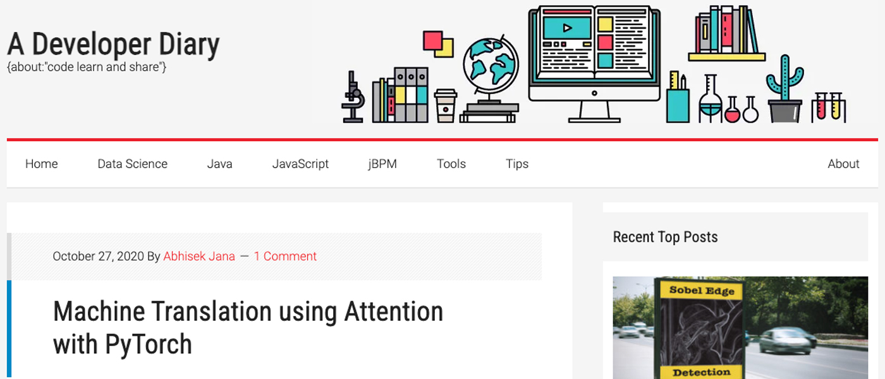
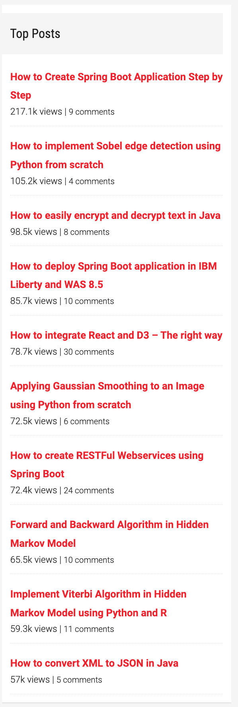
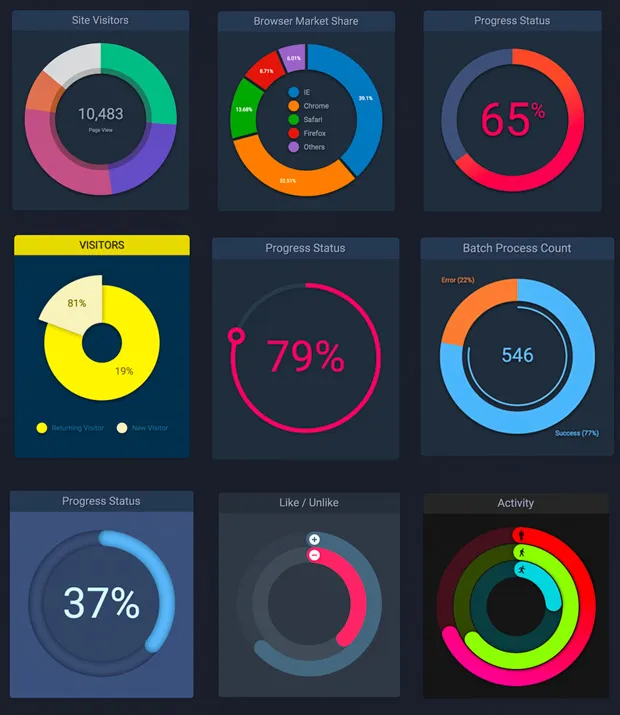

After nine years of utilizing WordPress as the hosting platform for my blog, I have made the strategic decision to migrate to GitPages. This transition is driven by the enhanced efficiency in content publication offered by GitPages, which significantly reduces the time required to disseminate articles.

Over the past few years, the cumbersome process of posting content using the new WordPress editors has impeded my ability to regularly publish articles. Typically, I compose initial drafts in Markdown and then painstakingly transfer them piece by piece into WordPress. The switch to GitPages not only streamlines this process but also provides the added benefit of being a cost-free platform.

In light of my commitment to focus exclusively on Artificial Intelligence, I have opted not to migrate posts pertaining to other areas of interest such as D3.js, React.js, Angular.js, Java, and GraphDB.

While some of my previous posts have garnered significant traction and engagement, I will take this opportunity to reflect on and highlight some of those notable moments.

  
<ins class="adsbygoogle"
     style="display:block; text-align:center;"
     data-ad-layout="in-article"
     data-ad-format="fluid"
     data-ad-client="ca-pub-9350330443439877"
     data-ad-slot="5234352564"></ins>

## Top Posts

Despite being recorded three years after the initial blog publication, I am delighted to share the current top posts. It's truly fascinating to observe that topics such as Hidden Markov Model, Computer Vision, and Spring Boot continue to resonate strongly with the viewers.

## Links to PDF versions

- [An Introduction to Spring Boot - A Developer Diary.pdf](https://github.com/adeveloperdiary/adevdiary_pdfbackups/blob/main/	An Introduction to Spring Boot - A Developer Diary.pdf)
- [Applying Gaussian Smoothing to an Image using Python from scratch - A Developer Diary.pdf](https://github.com/adeveloperdiary/adevdiary_pdfbackups/blob/main/	Applying Gaussian Smoothing to an Image using Python from scratch - A Developer Diary.pdf)
- [Compare 2 XML in JAVA - Part 1 - A Developer Diary.pdf](https://github.com/adeveloperdiary/adevdiary_pdfbackups/blob/main/	Compare 2 XML in JAVA - Part 1 - A Developer Diary.pdf)
- [Create 3D Donut Chart using D3.js - A Developer Diary.pdf](https://github.com/adeveloperdiary/adevdiary_pdfbackups/blob/main/	Create 3D Donut Chart using D3.js - A Developer Diary.pdf)
- [Create Pie Area Chart using d3.js - A Developer Diary.pdf](https://github.com/adeveloperdiary/adevdiary_pdfbackups/blob/main/	Create Pie Area Chart using d3.js - A Developer Diary.pdf)
- [Create Pie Charts using D3.js - A Developer Diary.pdf](https://github.com/adeveloperdiary/adevdiary_pdfbackups/blob/main/	Create Pie Charts using D3.js - A Developer Diary.pdf)
- [Create a Simple Pie Chart using D3.js - A Developer Diary.pdf](https://github.com/adeveloperdiary/adevdiary_pdfbackups/blob/main/	Create a Simple Pie Chart using D3.js - A Developer Diary.pdf)
- [Create a simple Donut Chart using D3.js - A Developer Diary.pdf](https://github.com/adeveloperdiary/adevdiary_pdfbackups/blob/main/	Create a simple Donut Chart using D3.js - A Developer Diary.pdf)
- [Create custom progress chart using d3.js - Part1 - A Developer Diary.pdf](https://github.com/adeveloperdiary/adevdiary_pdfbackups/blob/main/	Create custom progress chart using d3.js - Part1 - A Developer Diary.pdf)
- [Create custom progress chart using d3.js - Part2 - A Developer Diary.pdf](https://github.com/adeveloperdiary/adevdiary_pdfbackups/blob/main/	Create custom progress chart using d3.js - Part2 - A Developer Diary.pdf)
- [Create iWatch Activity Chart using d3.js - A Developer Diary.pdf](https://github.com/adeveloperdiary/adevdiary_pdfbackups/blob/main/	Create iWatch Activity Chart using d3.js - A Developer Diary.pdf)
- [Derivation and implementation of Baum Welch Algorithm for Hidden Markov Model - A Developer Diary.pdf](https://github.com/adeveloperdiary/adevdiary_pdfbackups/blob/main/	Derivation and implementation of Baum Welch Algorithm for Hidden Markov Model - A Developer Diary.pdf)
- [Develop Microservices using Netflix OSS and Spring Boot - A Developer Diary.pdf](https://github.com/adeveloperdiary/adevdiary_pdfbackups/blob/main/	Develop Microservices using Netflix OSS and Spring Boot - A Developer Diary.pdf)
- [Forward and Backward Algorithm in Hidden Markov Model - A Developer Diary.pdf](https://github.com/adeveloperdiary/adevdiary_pdfbackups/blob/main/	Forward and Backward Algorithm in Hidden Markov Model - A Developer Diary.pdf)
- [Get started with jBPM KIE and Drools Workbench part 3.pdf](https://github.com/adeveloperdiary/adevdiary_pdfbackups/blob/main/	Get started with jBPM KIE and Drools Workbench part 3.pdf)
- [Get started with jBPM KIE and Drools Workbench – Part 1 - A Developer Diary.pdf](https://github.com/adeveloperdiary/adevdiary_pdfbackups/blob/main/	Get started with jBPM KIE and Drools Workbench – Part 1 - A Developer Diary.pdf)
- [Get started with jBPM KIE and Drools Workbench.pdf](https://github.com/adeveloperdiary/adevdiary_pdfbackups/blob/main/	Get started with jBPM KIE and Drools Workbench.pdf)
- [How to Automate REST API JSON Schema Validation testing using Postman - A Developer Diary.pdf](https://github.com/adeveloperdiary/adevdiary_pdfbackups/blob/main/	How to Automate REST API JSON Schema Validation testing using Postman - A Developer Diary.pdf)
- [How to Create Interactive Charts using D3.js - A Developer Diary.pdf](https://github.com/adeveloperdiary/adevdiary_pdfbackups/blob/main/	How to Create Interactive Charts using D3.js - A Developer Diary.pdf)
- [How to Create Spring Boot Application Step by Step - A Developer Diary.pdf](https://github.com/adeveloperdiary/adevdiary_pdfbackups/blob/main/	How to Create Spring Boot Application Step by Step - A Developer Diary.pdf)
- [How to Create Stacked Bar Chart using d3.js - A Developer Diary.pdf](https://github.com/adeveloperdiary/adevdiary_pdfbackups/blob/main/	How to Create Stacked Bar Chart using d3.js - A Developer Diary.pdf)
- [How to Learn and Master Angular easily - Part1.pdf](https://github.com/adeveloperdiary/adevdiary_pdfbackups/blob/main/	How to Learn and Master Angular easily - Part1.pdf)
- [How to Learn and Master Angular easily - Part2.pdf](https://github.com/adeveloperdiary/adevdiary_pdfbackups/blob/main/	How to Learn and Master Angular easily - Part2.pdf)
- [How to Learn and Master Angular easily - Part3.pdf](https://github.com/adeveloperdiary/adevdiary_pdfbackups/blob/main/	How to Learn and Master Angular easily - Part3.pdf)
- [How to Learn and Master Angular easily - Part4.pdf](https://github.com/adeveloperdiary/adevdiary_pdfbackups/blob/main/	How to Learn and Master Angular easily - Part4.pdf)
- [How to Learn and Master Angular easily - Part5.pdf](https://github.com/adeveloperdiary/adevdiary_pdfbackups/blob/main/	How to Learn and Master Angular easily - Part5.pdf)
- [How to Learn and Master Angular easily - Part6.pdf](https://github.com/adeveloperdiary/adevdiary_pdfbackups/blob/main/	How to Learn and Master Angular easily - Part6.pdf)
- [How to configure REST Service (JAX-RS) in IBM Liberty Profile.pdf](https://github.com/adeveloperdiary/adevdiary_pdfbackups/blob/main/	How to configure REST Service (JAX-RS) in IBM Liberty Profile.pdf)
- [How to connect to TitanDB using Gremlin API - A Developer Diary.pdf](https://github.com/adeveloperdiary/adevdiary_pdfbackups/blob/main/	How to connect to TitanDB using Gremlin API - A Developer Diary.pdf)
- [How to convert XML to JSON in Java - A Developer Diary.pdf](https://github.com/adeveloperdiary/adevdiary_pdfbackups/blob/main/	How to convert XML to JSON in Java - A Developer Diary.pdf)
- [How to create Progress chart using d3.js - A Developer Diary.pdf](https://github.com/adeveloperdiary/adevdiary_pdfbackups/blob/main/	How to create Progress chart using d3.js - A Developer Diary.pdf)
- [How to create RESTFul Webservices using Spring Boot - A Developer Diary.pdf](https://github.com/adeveloperdiary/adevdiary_pdfbackups/blob/main/	How to create RESTFul Webservices using Spring Boot - A Developer Diary.pdf)
- [How to create an Angular project in Yeoman.pdf](https://github.com/adeveloperdiary/adevdiary_pdfbackups/blob/main/	How to create an Angular project in Yeoman.pdf)
- [How to create reusable charts with React and D3 Part1 - A Developer Diary.pdf](https://github.com/adeveloperdiary/adevdiary_pdfbackups/blob/main/	How to create reusable charts with React and D3 Part1 - A Developer Diary.pdf)
- [How to create reusable charts with React and D3 Part2 - A Developer Diary.pdf](https://github.com/adeveloperdiary/adevdiary_pdfbackups/blob/main/	How to create reusable charts with React and D3 Part2 - A Developer Diary.pdf)
- [How to create reusable charts with React and D3 Part3 - A Developer Diary.pdf](https://github.com/adeveloperdiary/adevdiary_pdfbackups/blob/main/	How to create reusable charts with React and D3 Part3 - A Developer Diary.pdf)
- [How to delete node_modules directory from Windows.pdf](https://github.com/adeveloperdiary/adevdiary_pdfbackups/blob/main/	How to delete node_modules directory from Windows.pdf)
- [How to deploy Spring Boot application in IBM Liberty and WAS 8.5 - A Developer Diary.pdf](https://github.com/adeveloperdiary/adevdiary_pdfbackups/blob/main/	How to deploy Spring Boot application in IBM Liberty and WAS 8.5 - A Developer Diary.pdf)
- [How to easily encrypt and decrypt text in Java.pdf](https://github.com/adeveloperdiary/adevdiary_pdfbackups/blob/main/	How to easily encrypt and decrypt text in Java.pdf)
- [How to implement Sobel edge detection using Python from scratch - A Developer Diary.pdf](https://github.com/adeveloperdiary/adevdiary_pdfbackups/blob/main/	How to implement Sobel edge detection using Python from scratch - A Developer Diary.pdf)
- [How to integrate React and D3 - The right way - A Developer Diary.pdf](https://github.com/adeveloperdiary/adevdiary_pdfbackups/blob/main/	How to integrate React and D3 - The right way - A Developer Diary.pdf)
- [How to prepare Imagenet dataset for Image Classification - A Developer Diary.pdf](https://github.com/adeveloperdiary/adevdiary_pdfbackups/blob/main/	How to prepare Imagenet dataset for Image Classification - A Developer Diary.pdf)
- [How to setup Angular 2 with TypeScript Development Workspace - A Developer Diary.pdf](https://github.com/adeveloperdiary/adevdiary_pdfbackups/blob/main/	How to setup Angular 2 with TypeScript Development Workspace - A Developer Diary.pdf)
- [How to setup IBM Liberty Profile - A Developer Diary.pdf](https://github.com/adeveloperdiary/adevdiary_pdfbackups/blob/main/	How to setup IBM Liberty Profile - A Developer Diary.pdf)
- [How to use Filter in Angular JS - A Developer Diary.pdf](https://github.com/adeveloperdiary/adevdiary_pdfbackups/blob/main/	How to use Filter in Angular JS - A Developer Diary.pdf)
- [How to visualize Gradient Descent using Contour plot in Python.pdf](https://github.com/adeveloperdiary/adevdiary_pdfbackups/blob/main/	How to visualize Gradient Descent using Contour plot in Python.pdf)
- [How use ui-router with Angular JS - A Developer Diary.pdf](https://github.com/adeveloperdiary/adevdiary_pdfbackups/blob/main/	How use ui-router with Angular JS - A Developer Diary.pdf)
- [Imagenet PreProcessing using TFRecord and Tensorflow 2.0 Data API - A Developer Diary.pdf](https://github.com/adeveloperdiary/adevdiary_pdfbackups/blob/main/	Imagenet PreProcessing using TFRecord and Tensorflow 2.0 Data API - A Developer Diary.pdf)
- [Implement Canny edge detector using Python from scratch - A Developer Diary.pdf](https://github.com/adeveloperdiary/adevdiary_pdfbackups/blob/main/	Implement Canny edge detector using Python from scratch - A Developer Diary.pdf)
- [Implement Neural Network using PyTorch - A Developer Diary.pdf](https://github.com/adeveloperdiary/adevdiary_pdfbackups/blob/main/	Implement Neural Network using PyTorch - A Developer Diary.pdf)
- [Implement Neural Network using TensorFlow - A Developer Diary.pdf](https://github.com/adeveloperdiary/adevdiary_pdfbackups/blob/main/	Implement Neural Network using TensorFlow - A Developer Diary.pdf)
- [Implement Viterbi Algorithm in Hidden Markov Model using Python and R - A Developer Diary.pdf](https://github.com/adeveloperdiary/adevdiary_pdfbackups/blob/main/	Implement Viterbi Algorithm in Hidden Markov Model using Python and R - A Developer Diary.pdf)
- [Introduction to Coordinate Descent using Least Squares Regression.pdf](https://github.com/adeveloperdiary/adevdiary_pdfbackups/blob/main/	Introduction to Coordinate Descent using Least Squares Regression.pdf)
- [Introduction to Hidden Markov Model - A Developer Diary.pdf](https://github.com/adeveloperdiary/adevdiary_pdfbackups/blob/main/	Introduction to Hidden Markov Model - A Developer Diary.pdf)
- [Introduction to Naive Bayes Classifier using R and Python - A Developer Diary.pdf](https://github.com/adeveloperdiary/adevdiary_pdfbackups/blob/main/	Introduction to Naive Bayes Classifier using R and Python - A Developer Diary.pdf)
- [Java WebService Client using SAAJ API.pdf](https://github.com/adeveloperdiary/adevdiary_pdfbackups/blob/main/	Java WebService Client using SAAJ API.pdf)
- [Linear Discriminant Analysis - from Theory to Code - A Developer Diary.pdf](https://github.com/adeveloperdiary/adevdiary_pdfbackups/blob/main/	Linear Discriminant Analysis - from Theory to Code - A Developer Diary.pdf)
- [Machine Translation using Attention with PyTorch - A Developer Diary.pdf](https://github.com/adeveloperdiary/adevdiary_pdfbackups/blob/main/	Machine Translation using Attention with PyTorch - A Developer Diary.pdf)
- [Machine Translation using Recurrent Neural Network and PyTorch - A Developer Diary.pdf](https://github.com/adeveloperdiary/adevdiary_pdfbackups/blob/main/	Machine Translation using Recurrent Neural Network and PyTorch - A Developer Diary.pdf)
- [Setup React JS Development Environment for ES5 and ES6 - A Developer Diary.pdf](https://github.com/adeveloperdiary/adevdiary_pdfbackups/blob/main/	Setup React JS Development Environment for ES5 and ES6 - A Developer Diary.pdf)
- [Steps for implementing DynaCache in Liberty and Websphere.pdf](https://github.com/adeveloperdiary/adevdiary_pdfbackups/blob/main/	Steps for implementing DynaCache in Liberty and Websphere.pdf)
- [Support Vector Machines for Beginners - Duality Problem.pdf](https://github.com/adeveloperdiary/adevdiary_pdfbackups/blob/main/	Support Vector Machines for Beginners - Duality Problem.pdf)
- [Support Vector Machines for Beginners - Kernel SVM.pdf](https://github.com/adeveloperdiary/adevdiary_pdfbackups/blob/main/	Support Vector Machines for Beginners - Kernel SVM.pdf)
- [Support Vector Machines for Beginners - Linear SVM - A Developer Diary.pdf](https://github.com/adeveloperdiary/adevdiary_pdfbackups/blob/main/	Support Vector Machines for Beginners - Linear SVM - A Developer Diary.pdf)
- [Support Vector Machines for Beginners - Training Algorithms - A Developer Diary.pdf](https://github.com/adeveloperdiary/adevdiary_pdfbackups/blob/main/	Support Vector Machines for Beginners - Training Algorithms - A Developer Diary.pdf)
- [Understand and Implement the Backpropagation Algorithm From Scratch In Python - A Developer Diary.pdf](https://github.com/adeveloperdiary/adevdiary_pdfbackups/blob/main/	Understand and Implement the Backpropagation Algorithm From Scratch In Python - A Developer Diary.pdf)
- [Understanding and implementing Neural Network with SoftMax in Python from scratch - A Developer Diary.pdf](https://github.com/adeveloperdiary/adevdiary_pdfbackups/blob/main/	Understanding and implementing Neural Network with SoftMax in Python from scratch - A Developer Diary.pdf)
- [Univariate Linear Regression using Octave - Machine Learning Step by Step - A Developer Diary.pdf](https://github.com/adeveloperdiary/adevdiary_pdfbackups/blob/main/	Univariate Linear Regression using Octave - Machine Learning Step by Step - A Developer Diary.pdf)

## JavaScript Tutorials

Here are the demo of the some of the java-script tutorials.

<iframe height="571.0355834960938" style="width: 100%;" scrolling="no" title="iWatch Activity Chart using d3.js" src="https://codepen.io/adeveloperdiary/embed/qOgpKK?default-tab=result" frameborder="no" loading="lazy" allowtransparency="true" allowfullscreen="true">
  See the Pen <a href="https://codepen.io/adeveloperdiary/pen/qOgpKK">
  iWatch Activity Chart using d3.js</a> by JANA (<a href="https://codepen.io/adeveloperdiary">@adeveloperdiary</a>)
  on <a href="https://codepen.io">CodePen</a>.
</iframe>

<iframe height="540.490234375" style="width: 100%;" scrolling="no" title="Progress Chart using d3.js" src="https://codepen.io/adeveloperdiary/embed/EVroVW?default-tab=result" frameborder="no" loading="lazy" allowtransparency="true" allowfullscreen="true">
  See the Pen <a href="https://codepen.io/adeveloperdiary/pen/EVroVW">
  Progress Chart using d3.js</a> by JANA (<a href="https://codepen.io/adeveloperdiary">@adeveloperdiary</a>)
  on <a href="https://codepen.io">CodePen</a>.
</iframe>

<iframe height="600" style="width: 100%;" scrolling="no" title="Progress Chart using d3.js" src="https://codepen.io/adeveloperdiary/embed/OydzpG?default-tab=result" frameborder="no" loading="lazy" allowtransparency="true" allowfullscreen="true">
  See the Pen <a href="https://codepen.io/adeveloperdiary/pen/OydzpG">
  Progress Chart using d3.js</a> by JANA (<a href="https://codepen.io/adeveloperdiary">@adeveloperdiary</a>)
  on <a href="https://codepen.io">CodePen</a>.
</iframe>

<iframe height="593.7379150390625" style="width: 100%;" scrolling="no" title="Polar Area Chart d3.js" src="https://codepen.io/adeveloperdiary/embed/epxGax?default-tab=result" frameborder="no" loading="lazy" allowtransparency="true" allowfullscreen="true">
  See the Pen <a href="https://codepen.io/adeveloperdiary/pen/epxGax">
  Polar Area Chart d3.js</a> by JANA (<a href="https://codepen.io/adeveloperdiary">@adeveloperdiary</a>)
  on <a href="https://codepen.io">CodePen</a>.
</iframe>

<iframe height="541.6096801757812" style="width: 100%;" scrolling="no" title="3D Pie Chart using d3.js" src="https://codepen.io/adeveloperdiary/embed/gaqwpZ?default-tab=result" frameborder="no" loading="lazy" allowtransparency="true" allowfullscreen="true">
  See the Pen <a href="https://codepen.io/adeveloperdiary/pen/gaqwpZ">
  3D Pie Chart using d3.js</a> by JANA (<a href="https://codepen.io/adeveloperdiary">@adeveloperdiary</a>)
  on <a href="https://codepen.io">CodePen</a>.
</iframe>

Some of the other ones:

​			

With that, it's time to conclude and transition to the next phase.

