Welcome to the first installment of the series on building a Transformer model from scratch using PyTorch! In this step-by-step guide, we'll delve into the fascinating world of Transformers, the backbone of many state-of-the-art natural language processing models today. Whether you're a budding AI enthusiast or a seasoned developer looking to deepen your understanding of neural networks, this series aims to demystify the Transformer architecture and make it accessible to all levels of expertise. So, let's embark on this journey together as we unravel the intricacies of Transformers and lay the groundwork for our own implementation using the powerful PyTorch framework. Get ready to dive into the world of self-attention mechanisms, positional encoding, and more, as we build our very own Transformer model!

Let's kick things off with some essential imports. Since we're building everything from scratch, we'll only need the fundamental libraries. I'm assuming you're either utilizing a local GPU or are familiar with Google Colab if you plan to use it (though I won't cover how to save/load models from Colab for training in this tutorial). Don't worry if you don't have access to a GPU; you should still be able to run the code on a CPU for learning purposes.

```python
import torch
import torch.nn as nn
import math
import numpy as np
```

### Input Embedding

The initial layer in our model focuses on learning word **embeddings** for each word. If you're unfamiliar with embeddings, I highly recommend exploring concepts like `word2vec`. Essentially, embeddings are mathematical representations of words using vectors. Since Neural Networks can't directly comprehend words, strings, or characters, our first step is to tokenize sentences into words and assign a unique numeric value to each word. This process is known as **Tokenization**. This tutorial assumes you already grasp the purpose of Tokenization, as it's a fundamental concept in all NLP-related use cases, including ML models.

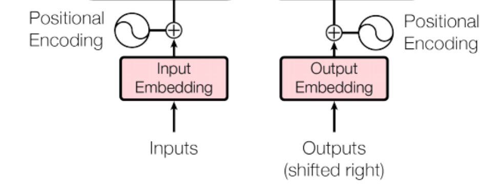

We've previously explored **RNN**-based `encoder-decoder` models, where we employed the `Embedding` layer to learn word embeddings. The **Input & Output Embedding** layers in the Transformer model operate in much the same manner.

In essence, the input sentence undergoes tokenization into words, which are then mapped to feature vectors, serving as input for the encoder.

In the **Attention Is All You Need** paper, `d_model` denotes the embedding dimension. Hence, we'll adhere to this naming convention. We'll utilize this layer twice in the Transformer model: once during encoding, where we'll pass the vocabulary size of the source data, and during decoding, where we'll need to pass the target dataset's vocabulary size (we'll calculate this later on).

One more thing to mention is, the authors multiplied the embeddings with $\sqrt{d_{model}}$. In the paper, $d_{model}$ is set to 512, so the $\sqrt{d_{model}} = 22.62$

Instead of created two separate embedding layers, we will create one `IOEmbeddingBlock` which will be used for both Input embedding and output embeddings.

```python
class IOEmbeddingBlock(nn.Module):
    """
    Args:
        d_model (int): Embedding Dimension
        vocabulary_size (int): Vocabulary Size 
    """

    def __init__(self, d_model: int, vocabulary_size: int):
        super().__init__()
        self.d_model = d_model
        self.vocab_size = vocabulary_size
        self.embedding = nn.Embedding(vocabulary_size, d_model)

    def forward(self, x):
        return self.embedding(x) * math.sqrt(self.d_model)
```

### Positional Encoding

The order of words can hold significant meaning in Natural Language Processing. While RNNs rely on word sequences, the Transformer architecture introduces multi-head attention to enhance speed through parallelism, sacrificing positional details. Consequently, the authors of the paper made a deliberate effort to preserve position information by directly incorporating it into the embedding layer through addition (sum). This technique of preserving word order is referred to as **Positional Encoding**.


There are many heuristics for defining positional encoding such as using binary representations. Below is an example of that. However storing encoding this way will take large amount memory, however this explains the idea.

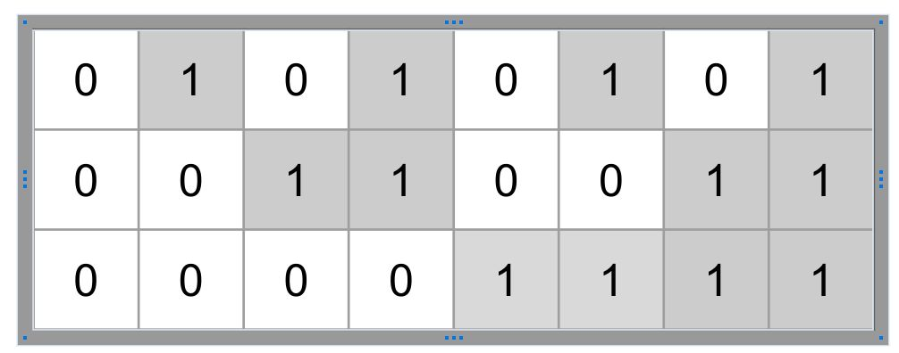

The Attention is all you need paper uses the following for capturing the positional encoding. If the length of the sentence is given by `seq_len` and the embedding dimension is $d_{model}$ then the Positional Encoding is also a 2D matrix (Same dimension  as the embedding). Below is the two equation which have been used, where `pos` is the position w.r.t to the length of the sentence `seq_len` and `i` is the position of the embedding dimension $d_{model}$


$$
\begin{align}
PE(pos,2i) = sin \Bigg ( \frac{pos^T}{10000^{\frac{2i}{d_{model}}}} \Bigg) \\
PE(pos,2i+1) = cos \Bigg ( \frac{pos^T}{10000^{\frac{2i}{d_{model}}}} \Bigg)
\end{align}
$$
However due to more numerical stability, we will transform the denominator to log scale & then to exponential. Here is one of the formula:


$$
\begin{align}
sin \Bigg ( \frac{pos}{10000{\frac{2i}{d_{model}}}} \Bigg) = 
sin \Bigg ( pos^T * exp \Big ( log(\frac{1}{10000^{\frac{2i}{d_{model}}}})\Big) \Bigg) \\
= sin \Bigg ( pos^T * exp \Big ( -log(10000^{\frac{2i}{d_{model}}})\Big) \Bigg) \\
= sin \Bigg ( pos^T * exp \Big ( -\frac{2i}{d_{model}}*log(10000)\Big) \Bigg) \\
\end{align}
$$
The authors didn't explain reason of using such a formula or pros & cons of using other ones. However one advantage of using this is that its already normalized between `-1` and `+`1 due to the nature of the `sin` and `cosine` function. 

Enough of theory, lets understand how to implement them using PyTorch. Before implementing in our transformer model, let's try to build a vectorized solution.

Here is the high level idea. We know that the positional encoding will have `[seq_len, d_model]` dimension. So if we can have a vector for $i$ of dimension `d_model` and another vector for `pos` of dimension `seq_len`, then we can just multiply them to get the outer product $\text{pos}^T * i$ to get `[seq_len, 1] * [1, d_model] = [seq_len, d_model]` as our final result.

Let's assume our embedding dimension is just `10`. At first we shall focus on the the part inside exponential as its same for both `sin` and `cosine` function. We can have $i$ to be a vector so that all the calculations for the embedding dimension can be done at once without using any loops. Here is the two ways we can create $2i$, first creating a vector from `0` till `d_model/2`  and then multiplying by `2` to make `2i` or by using `step` parameter of the `torch.arange` function. Both generates the same output. 

By now you probably have already understood that $2i$ will always have half length of `d_model` as we will be using same values [`0, 0, 1, 1, 2, 2`] for both `sin` and `cosine`. 

```python
d_model = 10
# Option 1
i = torch.arange(0, d_model/2, 1, dtype=float)
print(2*i)
# Option 2
two_i = torch.arange(0, d_model, 2).float()
print(two_i)
np.testing.assert_almost_equal(2*i.numpy(), two_i.numpy())
```

```she
tensor([0., 2., 4., 6., 8.], dtype=torch.float64)
tensor([0., 2., 4., 6., 8.])
```

We have the right part of the matrix multiplication, now lets code the left side where we have the `pos`. Again assuming our `seq_len` is just `10` . We can use the same `torch.arange` function however in order to transpose the vector we need one two dimensional vector and not 1D. Hence we can use either `unsqueeze(1)` or `view(1,-1)`. 

```python
seq_len = 10
pos = torch.arange(0, seq_len).unsqueeze(1)
print(pos.shape)
print(pos)
# Test using view() and transpose()
p = torch.transpose(torch.arange(0, seq_len).view(1, -1), 1, 0)
np.testing.assert_equal(pos.numpy(), p.numpy())
```

```
torch.Size([10, 1])
tensor([[0],
        [1],
        [2],
        [3],
        [4],
        [5],
        [6],
        [7],
        [8],
        [9]])
```

Since we have two outer function `sin` and `cosine` we can not just multiply `pos` and `2i`. So lets create an empty matrix to hold the positional encoding. 

```python
positional_encoding = torch.zeros(seq_len, d_model)
print(positional_encoding.shape)
```

```
torch.Size([10, 10])
```

Now calculate the exponential first & then assign `sin()` for even number position and `cos()` for odd number position.

```python
exponantial = torch.exp(two_i*(-math.log(10000.0))/d_model)
print(exponantial.shape, exponantial)
# outer product (10 x 1 )*(1 x 5) = (10 x 5)
positional_encoding[:, 0::2] = torch.sin(pos*exponantial)
positional_encoding[:, 1::2] = torch.cos(pos*exponantial)
```

```
torch.Size([5]) tensor([1.0000e+00, 1.5849e-01, 2.5119e-02, 3.9811e-03, 6.3096e-04])
```

Thats all, we now have the positional encoding needed for our Transformer. Let's first visualize the positional encoding using `matplotlib`

```python
import matplotlib.pyplot as plt
plt.imshow(positional_encoding, aspect="auto")
plt.colorbar()
plt.show()
```

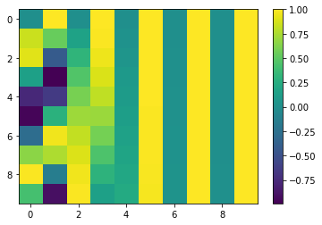

You might not see the patterns yet, but lets bump up the value of `seq_len` to `1000` and `d_model` to `512`. 

```python
def generate_positional_encoding(d_model, seq_len):
    two_i = torch.arange(0, d_model, 2).float()
    pos = torch.arange(0, seq_len).unsqueeze(1)
    positional_encoding = torch.zeros(seq_len, d_model)
    exponantial = torch.exp(two_i*(-math.log(10000.0))/d_model)
    positional_encoding[:, 0::2] = torch.sin(pos*exponantial)
    positional_encoding[:, 1::2] = torch.cos(pos*exponantial)
    return positional_encoding


plt.imshow(generate_positional_encoding(512, 1000), aspect="auto")
plt.colorbar()
plt.show()
```

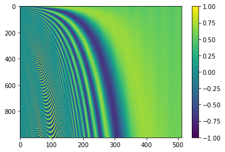

You might have noticed a pattern emerging. The function definition we encountered earlier suggests that the frequencies decrease, forming a geometric progression.

Now for our transformer, we will be creating a class named `PositionalEncoding` extending the pytorch's `nn.Module` class. Honestly this class is not required as there is no learning when calculating positional encoding, however its going to  help to modularize the code.

The below code is what we have seen already with some additional changes. 

- The `__init__()` function takes the value of `dropout` as an argument and we create the dropout using `nn.Dropout(dropout)`. 
- Once the `positional_encoding` is captured, we add the batch dimension as we will be passing batches of tokenized sentences into the module during training.
- Since `positional_encoding` is not being learned, it won't be saved to disk when we save the model. In order to enforce pytorch to save the `positional_encoding` as well, we shall register it in the buffer. Notice, in the `forward()` function we are able to use `positional_encoding` by referencing from `self`, however we have not defined in to be under `self` in the `__init__` function. The `register_buffer` function does all the magic. 

```python
class PositionalEncodingBlock(nn.Module):
    def __init__(self, d_model: int, seq_len: int, dropout: float):
        super().__init__()
        # We only need dropout as there is no learning for
        # Positional Encoding
        self.dropout = nn.Dropout(dropout)

        positional_encoding = torch.zeros(seq_len, d_model)

        # convert it to column vector for outer product
        pos = torch.arange(0, seq_len, dtype=float).unsqueeze(1)
        two_i = torch.arange(0, d_model, 2, dtype=float)
        exponantial = torch.exp(two_i * (-math.log(10000.0) / d_model))

        # [seq_len,1] x [1, d_model/2] = [seq_len, d_model/2]
        positional_encoding[:, 0::2] = torch.sin(pos * exponantial)
        positional_encoding[:, 0::2] = torch.cos(pos * exponantial)

        # Create the batch dimension for python brodcast
        # [1, seq_len, d_model]
        positional_encoding = positional_encoding.unsqueeze(0)

        # Use register buffer to save positional_encoding when the
        # model is exported in disk.
        self.register_buffer("positional_encoding", positional_encoding)

    def forward(self, x):
        # Add the positional encoding with the embeddings.
        x = x + self.positional_encoding.requires_grad_(False)
        return self.dropout(x)
```

- Now in the forward function all we are doing it adding the positional encoding to the previously learned embedding. Their dimension is same so there shouldn't be any issue. We just need to set `requires_grad_(False)` to `self.positional_encoding` to inform autograd that do not need gradients to be calculated for `self.positional_encoding` as we are not trying to learn anything. Mathematically we can express this as $X = E + P$ where all of them are $$\in R^{l \text{ x } d}$$. Here $l$ is the `seq_len` and $d$ is `d_model`
- Finally just return the output of the `dropout()`.

### Multi Head Self Attention Block

This probably is the most important layer of the transformer. I have already gone through the concepts of Attention & its purpose in the previous post https://www.adeveloperdiary.com/data-science/deep-learning/nlp/machine-translation-using-attention-with-pytorch/. Here I will explain one specific example used in the paper in detail. 

There are 3 separate places attention block has been used. We will create one class to be used for all of them. 

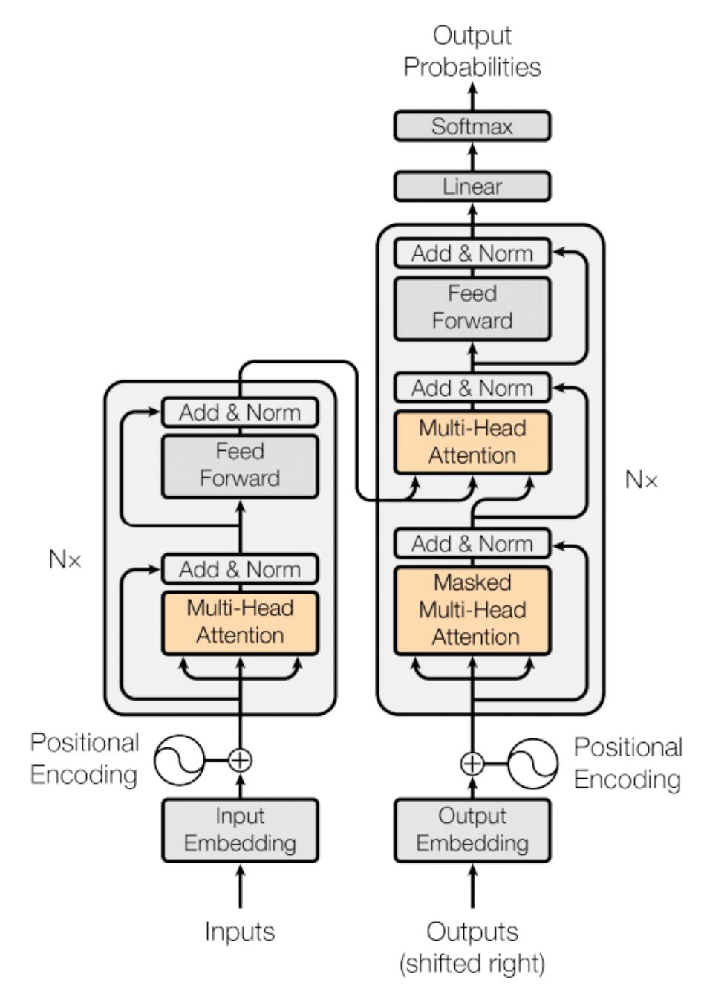

The paper uses `Masked-Multi-Head-Self-Attention` in the implementation and it is fairly easy to understand. So at the high level we have 3 matrix **Q** [Query], **K** [Key] & **V**[Value]. (For now don't worry about how to get them) We need to use the following equation for calculating **self-attention** (or scaled dot product attention). 


$$
\begin{align}
\text{softmax} \Bigg ( \frac{QK^T}{\sqrt{d_k}} \Bigg)V
\end{align}
$$


The $Q = W_q^TX$ , $K=W_k^TX$ and $V= W_v^T X$ where $W_q, W_k, W_v$ are parameters we need to learn by training. If you notice, its just the linear combinations of the $X$ using the weight vector $W$. So we can simply use the `nn.Linear()` by setting `bias=False` to implement this in the code. 

- The role of the query (Q) is to combine with every other key (K) [ $\sum_{j=0}^l q_ik_j^T$ ] to influence the weights of the output. The dimension of Q & K is `[batch, seq_len,d_model] `. So the dimension of $QK^T$ will be `[batch,seq_len,seq_len]`.
- The role of the value (V) is to extract information by combining with the **normalized** version (using `softmax`) of the output of $QK^T$ . The $\sqrt{d_k}$ is another normalization factor which makes $QK^T$ not to be influenced by the the size of the embedding dimension as we are summing up $q_iK_j^T$

Let's see how the implementation might look like. Its basically very simple as the code below requires little explanation. The `k.transpose(-2, -1)` switches the last two dimensions `[batch,seq_len,d_k]` to `[batch,d_k,seq_len]`. This way we can now multiply the matrix q & k. the resultant scores will of dimension `[batch, seq_len, seq_len]`

```python
def attention(q, k, v, d_k):
    scores = (q @ k.transpose(-2, -1)) / math.sqrt(d_k)
    scores = scores.softmax(dim=-1)
    return scores @ v
```

 Even though this was simple, lets see how all might work together. If you are confident on the above code, you can skip this part.

Let's create 3 random matrix, assuming our batch dimension is 1, `seq_len` is 3 and `d_k` is 6. At this point you might be wondering why we are naming this as `d_k` and not `d_mode`'. No worries, we will talk about it soon.

```python
d_k=6
q=torch.rand(1,3,d_k)					
k=torch.rand(1,3,d_k)
v=torch.rand(1,3,d_k)
print(q)
```

```
tensor([[[0.5632, 0.0326, 0.4685, 0.3702, 0.5376, 0.0412],
         [0.4214, 0.8490, 0.1355, 0.2032, 0.8867, 0.3364],
         [0.5808, 0.7172, 0.5806, 0.5573, 0.4954, 0.7809]]])
```

Now, switch the last two position of k. The dimension is now `[batch, d_k, seq_len]`

```python
k.transpose(-2,-1)
```

```
tensor([[[0.5758, 0.9157, 0.6534],
         [0.3122, 0.3960, 0.7965],
         [0.6065, 0.7968, 0.6544],
         [0.5582, 0.4983, 0.8660],
         [0.1457, 0.3153, 0.2595],
         [0.8510, 0.7234, 0.8986]]])
```

Let's calculate $QK^T$. We can see the new dimension is `[batch,seq_len, seq_len]`

```python
scores = (q @ k.transpose(-2, -1)) / math.sqrt(d_k)
scores
```

```
tensor([[[0.3832, 0.5249, 0.4889],
         [0.4567, 0.5937, 0.7139],
         [0.7994, 0.9297, 1.0792]]])
```

Calculate the normalized values using softmax. We want to normalize them by the row, so pass the `dim=-1`

```python
scores = scores.softmax(dim=-1)
scores
```

```
tensor([[[0.3064, 0.3530, 0.3406],
         [0.2907, 0.3334, 0.3759],
         [0.2889, 0.3290, 0.3821]]])
```

Let's confirm that they are indeed normalized by the row. 

```python
torch.sum(scores, axis=-1)
```

```
tensor([[1.0000, 1.0000, 1.0000]])
```

Finally, calculate the attention scores by multiplying V. Here we get the original dimension back `[batch, seq_len, d_k]`

```python
scores @ v
```

```
tensor([[[0.2178, 0.4904, 0.4241, 0.4463, 0.4945, 0.3244],
         [0.2069, 0.4997, 0.4199, 0.4666, 0.5153, 0.3134],
         [0.2056, 0.5008, 0.4186, 0.4701, 0.5191, 0.3118]]])
```

I hope, you were able to follow along. If needed keep running the code in a local notebook to see the results by yourself.

Now there are two variations of Self-Attention we need to talk about.

- Multi-Head Self Attention (Used in both Encoder & Decoder)
- Masked Multi-Head Self Attention (Used in Decoder)

#### Multi-Head Self Attention

Before we start to talk about Multi-Head Self Attention, its again very simple concept to understand, so stay focused and we will go though in detail with sample code.

Instead of using all the data along the embedding dimension which is `d_model`, researchers found that if we break the embedding dimension then calculate self-attention for each part separately then it helps the model to learn different aspects. Before getting into math or equation, lets find out how this works in code first.

Let's use our previous dummy `q, k & v` and our  `attention()` function. So instead of calculating the attention for entire `d_model` dimension, let's break it in half. Since our `d_model=6`, the `d_k=3`. Since we are breaking the `d_model` in half our head variable is set to `2`. So `head` in **Multi-Head Self Attention** is the number of splits we want make in the embedding dimension (`d_model`).

```python
d_model=6
head=2
d_k=d_model//head # d_k = 3
q=torch.rand(1,3,d_model)
k=torch.rand(1,3,d_model)
v=torch.rand(1,3,d_model)
print(q)
```

```
tensor([[[0.1216, 0.9945, 0.2923, 0.6468, 0.1091, 0.6439],
         [0.2322, 0.5040, 0.4810, 0.6872, 0.5585, 0.1266],
         [0.1643, 0.3280, 0.4879, 0.4179, 0.8893, 0.7107]]])
```

Now, let's split the `d_model` in `h` ways. 

```python
# (batch, seq_len, d_model) --> (batch, seq_len, head, d_k)
q = q.view(q.shape[0], q.shape[1], head, d_k)
print(q)
```

```
tensor([[[[0.1216, 0.9945, 0.2923],
          [0.6468, 0.1091, 0.6439]],

         [[0.2322, 0.5040, 0.4810],
          [0.6872, 0.5585, 0.1266]],

         [[0.1643, 0.3280, 0.4879],
          [0.4179, 0.8893, 0.7107]]]])
```

Since all the calculations happens between `[seq_len, d_k]` inside our `attention()` function, we need to take transpose of `head` and `seq_len`

```python
# (batch, seq_len, head, d_k) --> (batch, head, seq_len, d_k)
q = q.transpose(1, 2)
q
```

```
tensor([[[[0.1216, 0.9945, 0.2923],
          [0.2322, 0.5040, 0.4810],
          [0.1643, 0.3280, 0.4879]],

         [[0.6468, 0.1091, 0.6439],
          [0.6872, 0.5585, 0.1266],
          [0.4179, 0.8893, 0.7107]]]])
```

If you notice, we have now done a split in the middle of original `q`. 

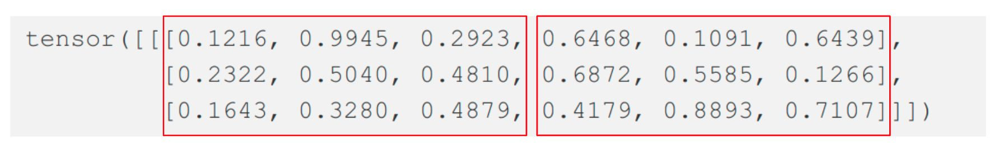

We now perform same operation on both `k` and `v`.

```python
k = k.view(k.shape[0], k.shape[1], head, d_k).transpose(1, 2)
v = v.view(v.shape[0], v.shape[1], head, d_k).transpose(1, 2)
```

Now use the previous attention method we have created. 

```python
x=attention(q,k,v,d_k)
x
```

```
tensor([[[[0.7046, 0.7257, 0.3448],
          [0.7034, 0.7232, 0.3456],
          [0.7131, 0.7404, 0.3420]],

         [[0.6503, 0.3282, 0.5810],
          [0.6509, 0.3380, 0.5808],
          [0.6532, 0.3351, 0.5777]]]])
```

It work! exactly same way it worked last time. Only difference is the attention scores are for each of the heads.

Next we need to merge (concatenate) the different heads into original shape. First we transpose the matrix to switch `head` and `seq_len` (Perform same transpose operation again). Then multiply the `head` and `d_k` to be same as `d_model`

```python
print(x.shape)
x = x.transpose(1, 2).contiguous().view(x.shape[0], -1, d_model)
print(x.shape)
```

```
torch.Size([1, 2, 3, 3])
torch.Size([1, 3, 6])
```

Probably you are now able to understand why we called the last dimension of `q, k, v` in the `attention()` function as `d_k` and not `d_model` as they are indeed different. $d_k= d_{model}/\text{heads}$. So how this might all look when we also have the batch dimension added ? As you see below, the `d_model` (embedding dimension) was split into `n` number of heads. The attention scores are calculated separately for each `heads` and then concatenated together into `d_model`.

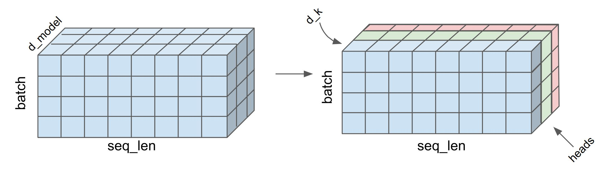

This mechanism of calculating attention scores using multiple heads is called as Multi-Head Self Attention. Question is why self-attention was used and not any other types of attentions? The answer is simply **computation speed** in massively parallelized GPU/TPU units. As you saw, the entire operation is vectorized and can be run in parallel. 

It's time for a bit of theory behind the need of Multi-head Self Attention. Multi-head attention helps to get different subspace representations instead of just a single one. This helps to capture and focus on different aspect of the same input. Each head can learn some different relationship. We can visualize this after our transformer model is trained sufficiently. 

There is just one last thing in Multi-Head Self Attention. After concatenating all the heads together, we perform another linear transformation using $W_o$. This helps to increase/decrease significance of any heads/attention scores. This additional transformation is applied only in Multi-head attention and not during vanilla self-attention. Let's look at the mathematical function of Multi-head self attention.


$$
\begin{align}
\text{head}_i = \text{attention}(q_i,k_i,v_i) \\
\text{multihead}(Q,K,V) = W_o \text{concat} ( \text{head}_1,\text{head}_2,....,\text{head}_h)
\end{align}
$$
 Thats all needed for the encoder part. There is just more variation we need to talk about for the decoder part named Masked Self-Attention. 

#### Masked Multi-head Self Attention

In the transformer model, we want the decoder to learn from the encoder sequence and the decoder sequence it has already seen. In the self-attention of encoder, we are multiplying `Q` and `K`, which means the relationships between words can be both forward & backward looking. However in decoder, the current word (token) can refer everything that has come before it, but not what might come after it during training since during inference we wont be having the information and this is exactly we are trying to predict (the next word [token]).

Recall, our $QK^T$ sums across the embedding dimension (`d_model`) so it will have the `[seq_len, seq_len]` shape for each `head` and each `sentence` in a batch.

```python
scores = (q @ k.transpose(-2, -1)) / math.sqrt(d_k)
scores
```

```
tensor([[[0.8329, 0.4217, 0.5164],
         [0.4830, 0.3263, 0.2464],
         [0.6326, 0.4154, 0.4587]]])
```

As you see below, lets assume our input sentence is "I LOVE PYTHON". Here in the left the values of $QK^T$ is given for the encoder where for the word `I` we calculate the scores for both `LOVE` and `PYTHON` (Green Row). This is the example of forward looking. We do that same for each word. This is fine for the encoder to learn which word might come in future, however for the decoder during inference we need to predict the next word, hence we won't know the next word to calculate the scores. Say the model predicts `I` , then both `LOVE` and `PYTHON` are not yet predicted yet hence the scores shouldn't be available.

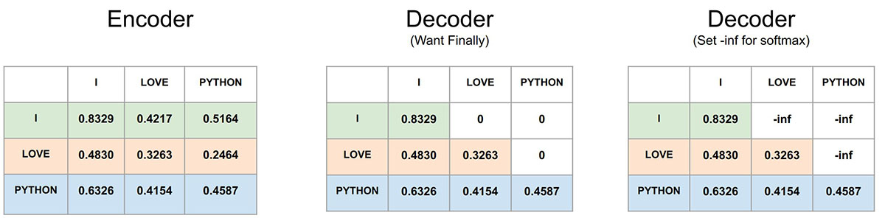

In order for the decoder to be trained this way (no forward looking), we can set future values to  `0` . As you see at the middle matrix, it is the same output of $QK^T$, however we have masked the future scores. So `I` can only have the scores for itself, `LOVE` can have the scores for both `I` and itself (middle row) and `PYTHON` can have the scores for all the previous words as its the last word (last row). So by setting zeros (or we can call it **masking**) in the top triangular matrix after calculating $QK^T$ we can train the decoder attention to look only backward (word that are already been predicted) and not forward. This is called **Masked Self Attention**.

However in order to get `0` we need to set them to `-inf` (theoretically) as the `softmax` function will transform `-inf` to `0` after exponential transformation.  

Mathematically, we can write this as below (for one head). Here $M$ is the mask applied to the square matrix $QK^T$.  
$$
\begin{align}
\text{masked attention}(Q,K,V) = \text{softmax} \Bigg (  \frac{QK^T +M}{\sqrt{d_k}} \Bigg) V
\end{align}
$$
We first understand how to create the mask, then apply it (just one line of code). 

 We can use `torch.triu()` to calculate triangular matrix. Setting  `diagonal=1` will set the diagonal values to `0`.

```python
mask_filter=torch.triu(torch.ones(1,3,3), diagonal=1).type(torch.int)
mask_filter
```

```
tensor([[[0, 1, 1],
         [0, 0, 1],
         [0, 0, 0]]], dtype=torch.int32)
```

Then we can assign boolean `True` where ever the values are `1` , remaining ones can be `False`. Now we have our mask filter ready. Lets use it see in practice first.

```python
mask_filter=mask_filter==0
mask_filter
```

```
tensor([[[ True, False, False],
         [ True,  True, False],
         [ True,  True,  True]]])
```

In order to create a mask of any `seq_len`, we can first a row vector of size `seq_len` using `torch.ones(seq_len)` then to apply the filter just multiply the `mask`. Now our upper triangular mask is ready to be used. 

```python
mask=torch.ones(3) * mask_filter
```

```
tensor([[[1., 0., 0.],
         [1., 1., 0.],
         [1., 1., 1.]]])
```

In order to apply it in out `attention()` function after calculating $QK^T$ we can use the `masked_fill_()` function as below. We are using very small negative number.

```python
scores.masked_fill_(mask == 0, -1e8)
scores
```

```python
tensor([[[ 6.2218e-01, -1.0000e-08, -1.0000e-08],
         [ 5.9029e-01,  3.5968e-01, -1.0000e-08],
         [ 5.3427e-01,  5.7470e-01,  6.6179e-01]]])
```

We can run the `softmax` to verify the result. As you can see that after `softmax` the very small values (close to `-inf`) becomes `0`.

```python
scores = scores.softmax(dim=-1)
scores
```

```python
tensor([[[1.0000, 0.0000, 0.0000],
         [0.5082, 0.4918, 0.0000],
         [0.3313, 0.3327, 0.3360]]])
```

#### PyTorch Module

Now we have all the knowledge to create the Masked Multi-head Self Attention Block using pytorch Module. Create a class named `MaskedMultiHeadSelfAttentionBlock` and lets find how to define the `__init__()` function.

We need to pass the `d_model`, number of `head` and the `dropout` value. Then using them calculate the value of `d_k`. Define total 4 linear layers using `nn.Linear()` function and set `bias=False` for our attention weights $W_q, W_k,W_v, W_o$.  

```python
class MaskedMultiHeadSelfAttentionBlock(nn.Module):
    def __init__(self, d_model: int, head: int, dropout: float):
        super().__init__()
        self.d_model = d_model
        self.head = head
        
        self.d_k = d_model // head

        self.Wq = nn.Linear(d_model, d_model, bias=False)
        self.Wk = nn.Linear(d_model, d_model, bias=False)
        self.Wv = nn.Linear(d_model, d_model, bias=False)

        # Paper used another dense layer here
        self.Wo = nn.Linear(d_model, d_model, bias=False)
        self.dropout = nn.Dropout(dropout)
```

Just like the previous `attention()` function, we will define an `attention()` function in our `MaskedMultiHeadSelfAttentionBlock`. We have already discussed about most of the code given below. Let's make the mask optional, however during data preprocessing we will learn that masking is needed for encoder as well. Define an additional dropout layer is dropout is not None.

```python
	def attention(self, q, k, v, mask, dropout: nn.Dropout):
        # Multiply query and key transpose
        # (batch, head, seq_len, d_k) @ (batch, head, d_k, seq_len)
        # = [seq_len, d_k] @ [d_k, seq_len] = [seq_len,seq_len]
        # = (batch, head, seq_len, seq_len)
        scores = (q @ k.transpose(-2, -1)) / math.sqrt(self.d_k)

        if mask is not None:
            # Whereever mask is zero fill with very small value and not None
            scores.masked_fill_(mask == 0, -1e8)

        # (batch, head, seq_len, seq_len)
        # dim=-1 is seq_len
        scores = scores.softmax(dim=-1)

        if dropout is not None:
            scores = dropout(scores)

        # (batch, head, seq_len, seq_len) @ # (batch, head, seq_len, d_model)
        # (seq_len, seq_len) @ (seq_len, d_model) = (seq_len, d_model)
        # -> (batch, head, seq_len, d_model)
        return (scores @ v)
```

Finally here is the forward function where we will pass the same `x` output from our `PositionalEncodingBlock` three times (`q, k, v`) . Now create the query, key and value using the linear combinations between `q, k, v` and `Wq, Wk, Wv`. Remaining code same as what we have already seen. Return the linear combination of final attention scores and `Wo`. 

```python
	def forward(self, q, k, v, mask): 
        query = self.Wq(q)
        key = self.Wk(k)
        value = self.Wv(v)

        # Attention head on embedding dimension and not on sequence/batch dimension.
        # (batch, seq_len, d_model) --> (batch, seq_len, h, d_k)
        query = query.view(query.shape[0], query.shape[1], self.head, self.d_k)
        # All the calculations happens between (seq_len, d_k)
        # So need to take transpose of h and seq_len.
        # (batch, seq_len, h, d_k) --> (batch, h, seq_len, d_k)
        query = query.transpose(1, 2)

        # Same way in one line
        key = key.view(key.shape[0], key.shape[1], self.head, self.d_k).transpose(1, 2)
        value = value.view(value.shape[0], value.shape[1], self.head, self.d_k).transpose(1, 2)
		
        # Calculate attention scores
        x, self.attention_scores = self.attention(
            query, key, value, mask, self.dropout
        )

        # Now need to merge head & d_k to d_model
        x = x.transpose(1, 2).contiguous().view(x.shape[0], -1, self.head * self.d_k)

        return self.Wo(x)
```

### Feed Forward Block

Notice both encoder and decoder have the same `FeedForwardBlock`, which can be expressed using simple math expression. There are two linear transformations including bias and after the first linear transformation `relu` has been used as activation function.
$$
FF(x) = \text{ReLU}(XW_1 + b_1)W_2+b_2
$$
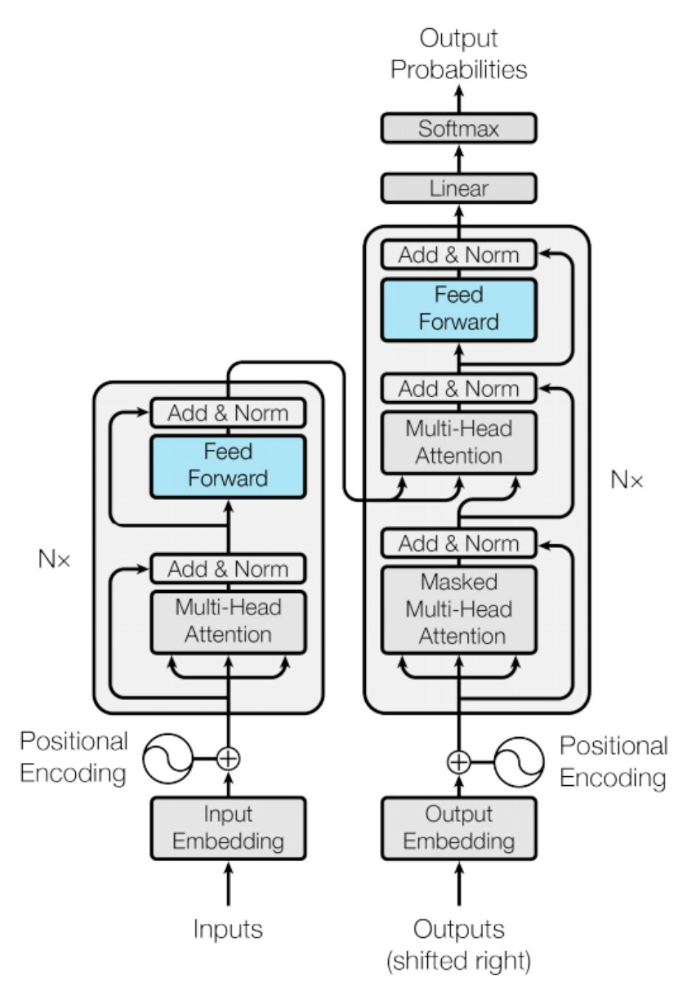

It's very straight forward, hence skipping the detail explnation.

```python
class FeedForwardBlock(nn.Module):
    def __init__(self, d_model: int, d_ff: int, dropout: float):
        super().__init__()
        # Default d_ff was 2048 in the paper
        self.linear1 = nn.Linear(d_model, d_ff)
        self.dropout = nn.Dropout(dropout)
        self.linear2 = nn.Linear(d_ff, d_model)

    def forward(self, x):
        return self.linear2(self.dropout(torch.relu(self.linear1(x))))
```

### Add & Norm

The Add & Norm layer is `Layer Normalization` (Similar to Batch Normalization) and Skip Connection was first introduced in Residual Network (ResNet). The input `X` is short circuited to the output `z` then both are added and passed through layer normalization. If you want to learn how to implement one you can refer my code here. [https://github.com/adeveloperdiary/DeepLearning_MiniProjects/tree/master/ResNet](https://github.com/adeveloperdiary/DeepLearning_MiniProjects/tree/master/ResNet)

In each encoder the Add & Norm is used 2 times and in decoder 3 times. 

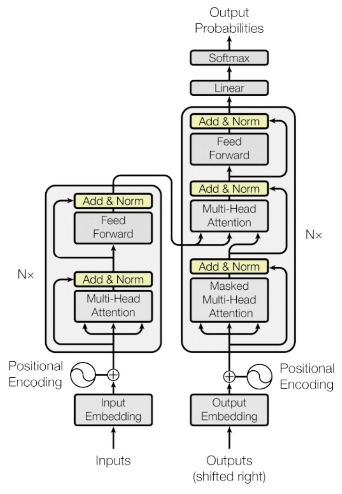

#### Layer Normalization

In our implementation, we will implement Layer Normalization and Skip Connection using separate classes. Layer Normalization ensures each layers to have `0` mean and unit variance (variance of `1`). Layer Normalization reduces the covariance shift (changes in distribution of the hidden units) and therefore speeds up  the convergence with fewer iterations. The normalizations statistics are calculated across all features and all elements for each instance independently.

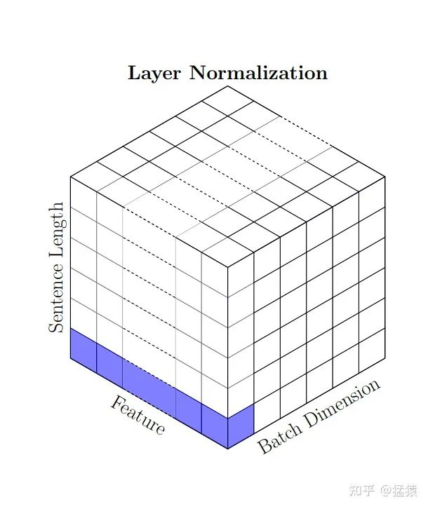

The equation of Layer Normalization can be defined as below. Here $\bar{X}^l$ is the mean of $X^l$ . $\alpha$ and $\beta$ are **scale** and **shift** parameters which can be learned during training.
$$
\begin{align}
Z^l_i = \alpha * \Bigg ( \frac{X^l_i - \bar{X}^l}{\sigma^l+\epsilon} \Bigg) + \beta
\end{align}
$$
Remember, that the summary statistics are calculated using the embedding dimension (features in this case). In case of computer vision, it will be channels. So not across the batch, rather separately for each sentence and its embeddings. Here is the code to understand.

```python
x=torch.rand(2,3,6)# [batch, seq_len, d_model]
print(x)
mean = x.mean(dim=-1, keepdim=True)
mean
```

```
tensor([[[0.4214, 0.3972, 0.1069, 0.0417, 0.9699, 0.1395],
         [0.3039, 0.6732, 0.2056, 0.7818, 0.0950, 0.2606],
         [0.6264, 0.3442, 0.5267, 0.8246, 0.7381, 0.5209]],

        [[0.3190, 0.1876, 0.3290, 0.2831, 0.0124, 0.8651],
         [0.7272, 0.5862, 0.2364, 0.2710, 0.1685, 0.5581],
         [0.8177, 0.6130, 0.5976, 0.7620, 0.8081, 0.4919]]])
tensor([[[0.3461],
         [0.3867],
         [0.5968]],

        [[0.3327],
         [0.4246],
         [0.6817]]])
```

We are going to implement vectorized implementation for the above equation. Define the $\alpha$ and $\beta$  parameter using `nn.Parameter()` function. They are scaler values hence define them as vectors. In the `forward()` function, we first calculate the mean and standard deviation using the last dimension. Then simply calculate `Z` and return it using the equation above.

```python
class LayerNormalizationBlock(nn.Module):
    def __init__(self, eps: float = 1e-8):
        super().__init__()

        self.eps = eps
        self.alpha = nn.Parameter(torch.ones(1))
        self.beta = nn.Parameter(torch.zeros(1))

    def forward(self, x):
        mean = x.mean(dim=-1, keepdim=True)
        std = x.std(dim=-1, keepdim=True)

        return self.alpha * (x - mean) / (std + self.eps) + self.beta
```

### Skip Connection

The implementation in the paper uses **Post Layer Normalization**, that is Layer Normalization after Skip Connection. However recent studies shows that using Pre-Layer Normalization may be more effective than Post Layer Normalization. 

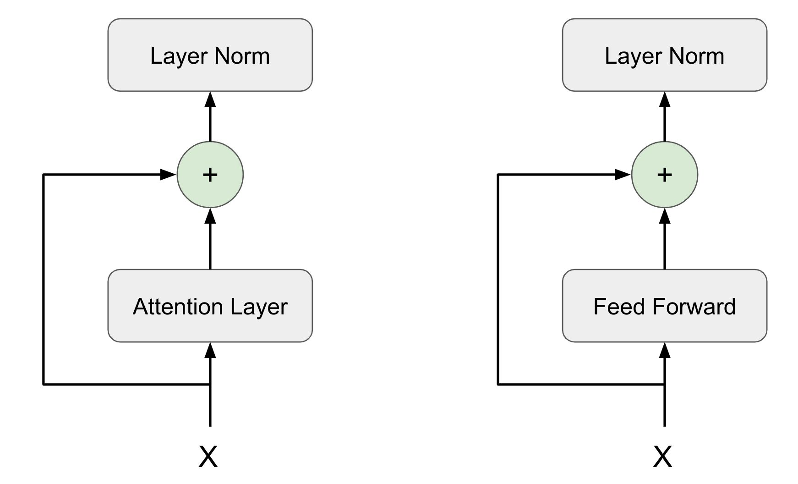


Hence In our code we will implement **Pre-Layer Normalization**, however you should be able to change the sequence easily and try both.

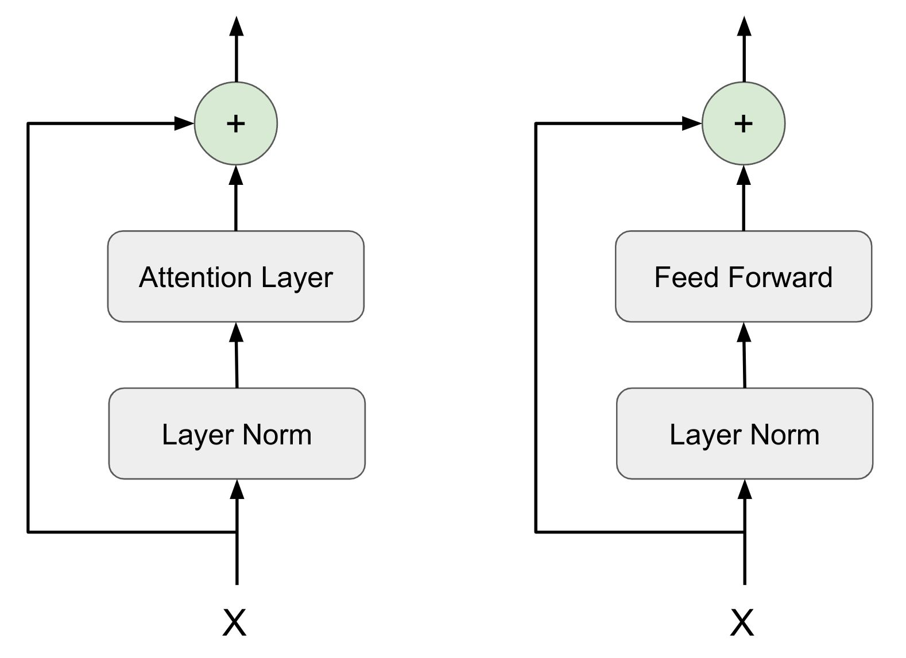

In the `SkipConnectionBlock` class, we will define an instance of `LayerNormalizationBlock` class. In the `forward()` function, we will receive two parameters `x` and the `prev_layer`. This `prev_layer` might sound bit confusing, so let me try to explain. 

If you notice Skip Connection is used 5 times in the encoder and decoder block. The previous layer is not same for all 5 scenarios. It could be either the `FeedForwardBlock` or `MaskedMultiHeadSelfAttentionBlock`. We want to generalize the `SkipConnectionBlock` so that irrespective of the previous layer configuration it will still work for all the sceneries. Hence we are defining previous layer as the 2nd argument of the `forward()` function. Since the previous layer itself is being passes, we can invoke its `forward()` function from `SkipConnectionBlock` itself.

May be it will be even easier to understand from the diagram. Our `SkipConnectionBlock` is going to encapsulate everything in the dotted yellow box below. 

- It takes `x` and the `prev_layer` (In this case `MaskedMultiHeadSelfAttentionBlock`) as input. 
- Then first passes `x` through `LayerNormalizationBlock`. 
- Then the output of `LayerNormalizationBlock` goes through whatever `prev_layer` has been passed (could be either `FeedForwardBlock` or `MaskedMultiHeadSelfAttentionBlock`)
- Then adds with previous input `x` after using a `dropout`.

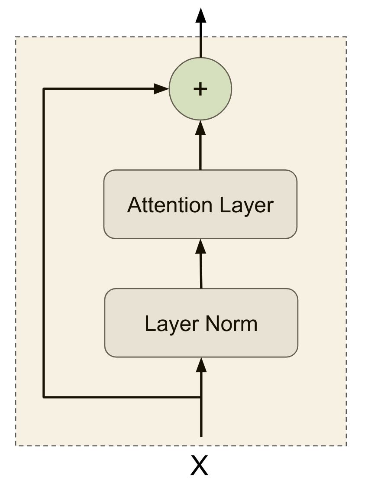

Here is the exact logic in code.

```python
class SkipConnectionBlock(nn.Module):
    def __init__(self, dropout: float):
        super().__init__()

        self.dropout = nn.Dropout(dropout)
        self.layer_norm_block = LayerNormalizationBlock()

    def forward(self, x, prev_layer):
        return x + self.dropout(prev_layer(self.layer_norm_block(x)))
```

### Encoder Block

We have all the components ready, now need to assemble the higher level blocks. Let's build the `EncoderBlock`. As shown in the picture below, it takes the `FeedForwardBlock` and `MaskedMultiHeadSelfAttentionBlock` as input. Then initializes two `SkipConnectionBlock`.  

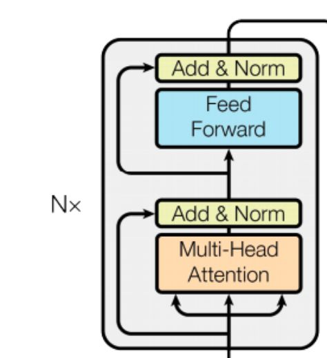

Instead of creating two separate instance variable for creating the `SkipConnectionBlock` we can use the `ModuleList` class to create an array of `SkipConnectionBlock`. 

```python
class EndoderBlock(nn.Module):
    def __init__(self, attention_block: MaskedMultiHeadSelfAttentionBlock, ff_block: FeedForwardBlock, dropout: float):
        super().__init__()

        self.attention_block = attention_block
        self.ff_block = ff_block

        #self.skip_conn1=ResidualConnection(dropout)
        #self.skip_conn2=ResidualConnection(dropout)
        
        self.skip_connections = nn.ModuleList([SkipConnectionBlock(dropout) for _ in range(2)])
```

In the `forward` method, we can simply access the `SkipConnectionBlock` instances and just like in the diagram above, we first take the input `x` (`x` comes from either `PositionalEncodingBlock` or another `EndoderBlock`) and pass it through the `MaskedMultiHeadSelfAttentionBlock`. Since we need to pass 4 inputs, we use the `lambda` (dummy) function to invoke the `forward()` method of the `MaskedMultiHeadSelfAttentionBlock`.

```python
	def forward(self, x, src_mask):
        #x=self.skip_conn1(x,lambda x: self.attention(x, x, x, src_mask))
        #x=self.skip_conn2(x,self.ff)
        
        x = self.skip_connections[0](x, lambda x: self.attention_block(x, x, x, src_mask))
        x = self.skip_connections[1](x, self.ff_block)
        
        return x
```

Then we take the output from the `MaskedMultiHeadSelfAttentionBlock` and invoke the `forward()` method of the `FeedForwardBlock`.

### Encoder Sequence Block

There are many of the `EndoderBlock` are chained in sequence one after another. We will create another module which does this sequencing. If we have 2 `EndoderBlock` stacked then the `EncoderSequenceBlock` is going to invoke them one after another. 

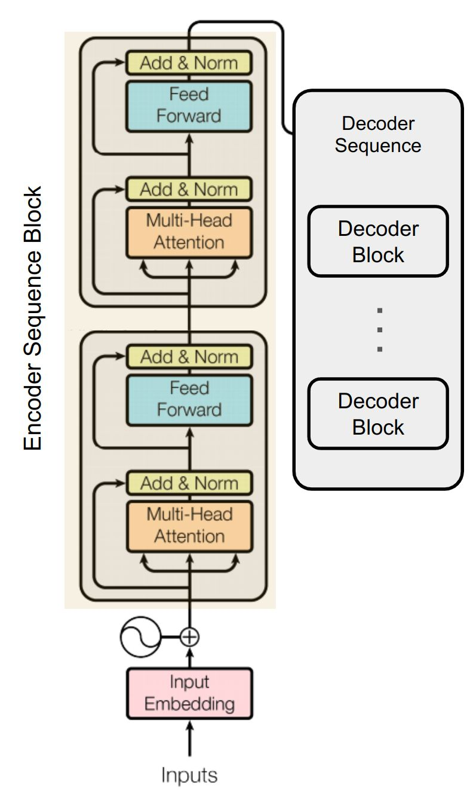

The `EncoderSequenceBlock` takes the `ModuleList` of all the `EndoderBlock` that needs to be invoked in sequence. There is just one change from the paper implementation. Recall that we are using Pre-Layer Normalization (not Post Layer Normalization like in the paper). Hence we will be adding one Post Layer Normalization after all the `EndoderBlock` are executed. 

```python
class EncoderSequenceBlock(nn.Module):
    def __init__(self, encoder_blocks: nn.ModuleList):
        super().__init__()
        self.encoder_blocks = encoder_blocks
        self.norm = LayerNormalizationBlock()

    def forward(self, x, mask):
        for encoder_block in self.encoder_blocks:
            x = encoder_block(x, mask)
		# Additional Layer Normalization
        return self.norm(x)
```

### Decoder Block

Just like the `EndoderBlock`, we will be creating `DecoderBlock`. The `DecoderBlock` has three Skip Connections. It also takes 3 blocks as input arguments. Two of them are `MaskedMultiHeadSelfAttentionBlock` and one `FeedForwardBlock`. The 2nd `MaskedMultiHeadSelfAttentionBlock` is receiving the output from the last `EncoderBlock` in the `EncoderSequenceBlock`, hence its called as `cross attention`.

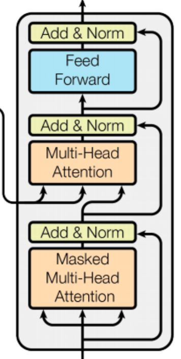

Very similar way we have done in the `EncoderBlock`. The `ModuleList` containing `SkipConnectionBlock` will have length 3 as now there are three skip connections.

```python
class DecoderBlock(nn.Module):
    def __init__(
        self,
        attention_block: MaskedMultiHeadSelfAttentionBlock,
        cross_attention_block: MaskedMultiHeadSelfAttentionBlock,
        ff_block: FeedForwardBlock,
        dropout: float,
    ):
        super().__init__()
        self.attention_block = attention_block
        self.cross_attention_block = cross_attention_block
        self.ff_block = ff_block

        self.skip_connections = nn.ModuleList(
            [SkipConnectionBlock(dropout) for _ in range(3)]
        )
```

The `forward()` function receives the `last_encoder_block_output` and the `src_mask` as well. The `attention_block` is called as usual. However when calling the `forward()` method of the `cross_attention_block` we need to pass the `last_encoder_block_output` as both `k` (key) and `v` (value). The `q` (query) however will be the output from the first `attention_block` we have already defined.

```python
	def forward(self, x, last_encoder_block_output, src_mask, tgt_mask):
        x = self.skip_connections[0](
            x, lambda x: self.attention_block(x, x, x, tgt_mask))
        x = self.skip_connections[1](
            x, lambda x: self.cross_attention_block(
                x, last_encoder_block_output, last_encoder_block_output, src_mask),
        )
        x = self.skip_connections[2](x, self.ff_block)

        return x
```

Important concept to understand here is to see how the encoder and decoder is connected and sharing information. Every `DecoderBlock` receives the same `last_encoder_block_output` as both `k` and `v`. 

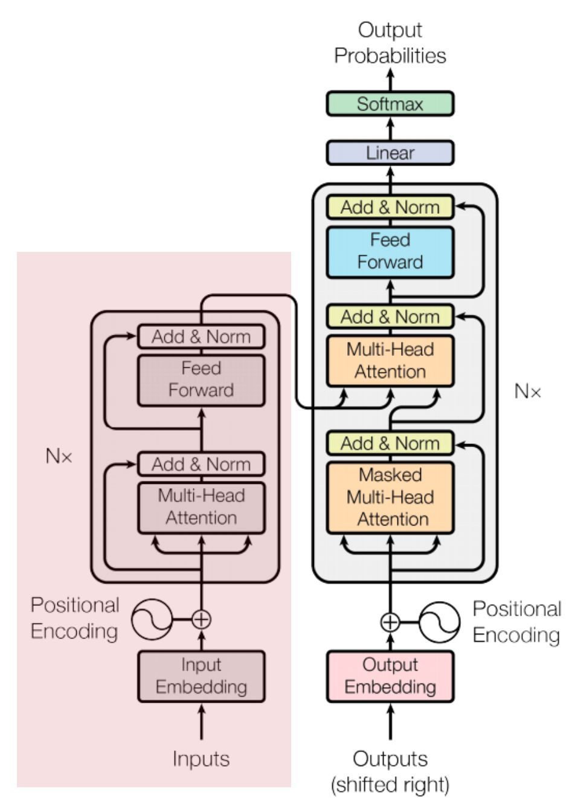

### Decoder Sequence Block

Very similar to `EncoderSequenceBlock`. Only difference is the `forward()` function accepts two additional arguments.

```python
class DecoderSequenceBlock(nn.Module):
    def __init__(self, decoder_blocks: nn.ModuleList):
        super().__init__()
        self.decoder_blocks = decoder_blocks
        self.norm = LayerNormalizationBlock()

    def forward(self, x, encoder_output, src_mask, tgt_mask):
        for decoder_block in self.decoder_blocks:
            x = decoder_block(x, encoder_output, src_mask, tgt_mask)
        return self.norm(x)
```

### Linear Softmax Block

The final linear and softmax is defined in the `LinearSoftmaxBlock`.  The input dimension of the `nn.Linear` will be `d_model` and output will be `vocab_size`. This also act as a projection from embedding dimension to a single value so that we can get the token id back for prediction. Finally we will use `log_softmax()` on the last layer.

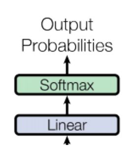

```python
class LinearSoftmaxBlock(nn.Module):
    def __init__(self, d_model: int, vocab_size: int):
        super().__init__()
        self.linear = nn.Linear(d_model, vocab_size)

    def forward(self, x):
        # Softmax using the last dimension
        # [batch, seq_len, d_model] -> [batch, seq_len]
        return torch.log_softmax(self.linear(x), dim=-1)
```

### Transformer

We are at our final step of creating the Transformer model. Here we are going to combine the modules we have created together. Below is the diagram for reference.

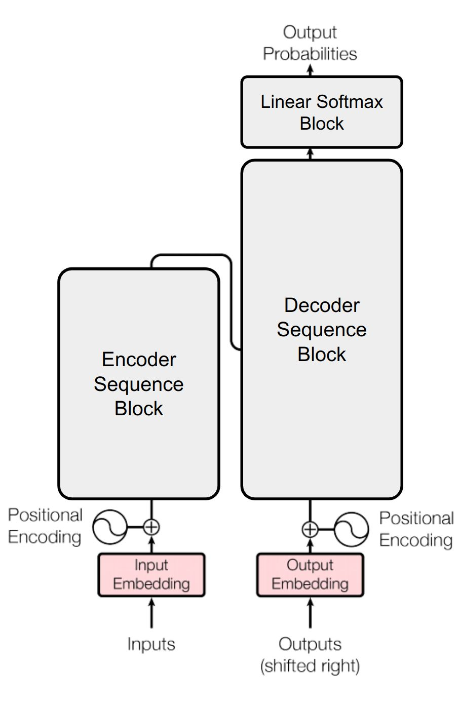

We have created three functions `encode()`, `decode()` and `linear_projection()` 

```python
class Transformer(nn.Module):
    def __init__(
        self,
        input_embed_block: IOEmbeddingBlock,
        output_embed_block: IOEmbeddingBlock,
        input_pos_block: PositionalEncodingBlock,
        output_pos_block: PositionalEncodingBlock,
        encoder_seq_block: EncoderSequenceBlock,
        decoder_seq_block: DecoderSequenceBlock,        
        linear_softmax_block: LinearSoftmaxBlock,
    ):
        super().__init__()        
        self.input_embed_block = input_embed_block
        self.output_embed_block = output_embed_block
        self.input_pos_block = input_pos_block
        self.output_pos_block = output_pos_block
        self.encoder_seq_block = encoder_seq_block
        self.decoder_seq_block = decoder_seq_block
        self.linear_softmax_block = linear_softmax_block

    def encode(self, src, src_mask):
        src = self.input_embed_block(src)
        src = self.input_pos_block(src)
        return self.encoder_seq_block(src, src_mask)

    def decode(self, encoder_output, src_mask, tgt, tgt_mask):
        tgt = self.output_embed_block(tgt)
        tgt = self.output_pos_block(tgt)
        return self.decoder_seq_block(tgt, encoder_output, src_mask, tgt_mask)

    def linear_projection(self, x):
        return self.linear_softmax_block(x)
```

## Conclusion

In conclusion, in this first part of our series on coding a Transformer model from scratch using PyTorch, we've laid down the foundational understanding and implementation of the architecture. From grasping the essence of embeddings and tokenization to delving into the significance of positional encoding, we've embarked on a journey to demystify the complexities of Transformers. By breaking down each step into digestible concepts, we've aimed to make the process accessible to both novice and seasoned developers alike. Armed with this knowledge, we're now well-equipped to delve deeper into the intricacies of building and training our own Transformer model. Stay tuned for the upcoming parts of this series where we'll explore further aspects and refine our implementation to harness the full power of Transformers in natural language processing tasks.

