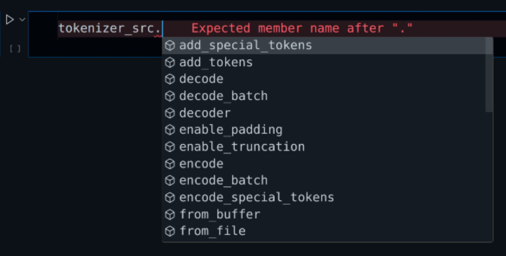

Welcome back to the second installment of our series on coding a Transformer model from scratch using PyTorch! In this part, we'll dive into the crucial aspect of data processing and preparation. Handling data efficiently is paramount for any machine learning task, and building a Transformer model is no exception. We'll guide you through the step-by-step process of downloading the data and performing essential preprocessing tasks such as tokenization and padding using PyTorch. By the end of this tutorial, you'll have a solid understanding of how to preprocess your data effectively, setting the stage for training your Transformer model. So, let's roll up our sleeves and get started on this data preprocessing journey!

## Tokenizer

To begin, let's install two essential packages:

```shell
pip install datasets
pip install transformers
```

For our tokenizer, I suggest starting with the `opus_books` [https://huggingface.co/datasets/opus_books] dataset from the `huggingface` library. However, feel free to experiment with larger datasets if you aim to build a more robust model. For context, I'm training the model using a NVIDIA 2080ti GPU with 11GB of available RAM.

### Downloading Data

You can easily download the dataset directly from `huggingface` using the `load_dataset()` function from the `datasets` package. The first argument specifies the dataset's name, while the second argument defines the two different languages for translation. In this case, I'm downloading the English and French language translations. The last argument determines the available set we require, such as train, test, or validation. Since our focus is on learning, we'll simply download the `train` file and subsequently split it into `train` and `validation` sets as necessary.

```python
from datasets import load_dataset
hf_dataset=load_dataset('opus_books',f'en-fr',split='train')
```

If you just print the `hf_dataset`, it will show total number of rows and the feature names.

```
Dataset({
    features: ['id', 'translation'],
    num_rows: 127085
})
```

We can access this as `dict` by passing the feature name and index of any element.

```python
hf_dataset['translation'][0]
```

```
{'en': 'The Wanderer', 'fr': 'Le grand Meaulnes'}
```

### Dataset Iterator

As observed, to efficiently process the entire dataset, we require a function to iterate through each translation in a lazy manner. We can accomplish this by utilizing `yield` instead of `return` to create a generator function. Below is the `get_one_sentence()` function, which takes in the entire dataset and the language to retrieve the sentence from. By employing `yield`, the function produces a value while retaining its state, enabling it to resume from where it left off. This approach eliminates the need to duplicate the dataset in memory, enhancing efficiency.

```python
def traverse_sentences(dataset, lang):
    for row in dataset:
        yield row['translation'][lang]
```

We can test the above function to make sure its working as expected.

```python
print(next(traverse_sentences(hf_dataset,'en')))
print(next(traverse_sentences(hf_dataset,'fr')))
```

```
The Wanderer
Le grand Meaulnes
```

### Tokenizer

```python
from tokenizers import Tokenizer
from tokenizers.models import WordLevel
from tokenizers.trainers import WordLevelTrainer
from tokenizers.pre_tokenizers import Whitespace
```

Create an instance of the `WordLevel` `Tokenizer` and set `[UNK]` for unknown tokens. 

```python
tokenizer=Tokenizer(WordLevel(unk_token='[UNK]'))
```

We want to split the sentences by white space before applying the tokenizer. Hence set the `pre_tokenizer` to `Whitespace()`

```python
tokenizer.pre_tokenizer=Whitespace()
```

Now we need to define the trainer. We will use 4 special tokens `"[UNK]","[PAD]","[SOS]","[EOS]"` for Unknown tokens, Paddings, Start & End of Sentences. Also set `min_frequency` to `2 ` or `3` to accept words when their frequency of occurrence is at least equal to `min_frequency`.

```python
trainer = WordLevelTrainer(special_tokens=["[UNK]","[PAD]","[SOS]","[EOS]"],min_frequency=2)
```

In order to train the `tokenizer` , we need to pass all the sentences one by one. We can use the `traverse_sentences` function. 

Invoke `train_from_iterator()` function by passing the function `get_one_sentence` and the `trainer`. Then `save` the tokenizer to local path. This code is very mostly copied from the documentation of `tokenizer` library. You can always refer the official documentation for additional details.

```python
tokenizer.train_from_iterator(traverse_sentences(dataset,lang),trainer=trainer)
tokenizer.save(str(tokenizer_path))
```

##### Let's put everything together in a single function. We will load the tokenizer if its already created otherwise we will create one. 

```python
from pathlib import Path
def init_tokenizer(dataset, lang):
    tokenizer_path = Path(f"tokenizer_{lang}.json")
    tokenizer_loaded = False

    if tokenizer_path.exists():
        # try loading tokenizer if exists
        try:
            tokenizer = Tokenizer.from_file(str(tokenizer_path))
            tokenizer_loaded = True
        except:
            pass
    if not tokenizer_loaded:
        # initiate tokenizer
        tokenizer = Tokenizer(WordLevel(unk_token='[UNK]'))
        tokenizer.pre_tokenizer = Whitespace()
        trainer = WordLevelTrainer(
            special_tokens=["[UNK]", "[PAD]", "[SOS]", "[EOS]"], min_frequency=2)
        tokenizer.train_from_iterator(
            traverse_sentences(dataset, lang), trainer=trainer)
        tokenizer.save(str(tokenizer_path))
    return tokenizer
```

Question is why we need the tokenizer instance. The `Tokenizer` includes many built-in functions which can be directly invoked. Here is a glimpse. The most important ones will be `token_to_id()` and `id_to_token()`.

Hugging Face's Transformers library provides a comprehensive suite of tools for NLP tasks, including tokenization functionalities. 



Let's break down each part of the code:

1. **Initialization**: The `init_tokenizer()` function initializes the tokenizer object `tokenizer_en` using some Hugging Face dataset and specifying the language as English ('en').
2. **Vocabulary Size**: `tokenizer_en.get_vocab_size()` retrieves and prints the size of the vocabulary used by the tokenizer.
3. **Conversion Between Token and ID**:
   - `tokenizer_en.id_to_token(1234)`: This line retrieves and prints the token corresponding to the ID 1234.
   - `tokenizer_en.token_to_id('learning')`: This line retrieves and prints the ID corresponding to the token "learning".
4. **Tokenization**:
   - `tokenizer_en.encode("i love learning").ids`: This line tokenizes the sentence "i love learning" and prints the resulting array of token IDs.
5. **Reconstruction from Token IDs**: `tokenizer_en.decode([5552, 194, 3125])` reconstructs the original sentence from the given array of token IDs.

```python
tokenizer_en=init_tokenizer(hf_dataset,'en')
# Get the vocabulary size
print(f"Vocabulary Size : {tokenizer_en.get_vocab_size()}")
# Get the word for random id
print(f"Word for id 1234 : {tokenizer_en.id_to_token(1234)}")
# Get the id for "learning"
print(f"Id of word 'learning' : {tokenizer_en.token_to_id('learning')}")
# Convert sentence to array of token ids
print(f'Tokenize the sentence "i love learning" : {tokenizer_en.encode("i love learning").ids}')
# Convert array of token ids to sentence.
print(f"Convert tokens to words : {tokenizer_en.decode([5552, 194, 3125])}")
```

```
Vocabulary Size : 15698
Word for id 1234 : pay
Id of word 'learning' : 3125
Tokenize the sentence "i love learning" : [5552, 194, 3125]
Convert tokens to words : i love learning
```

## PyTorch Dataset

Once we have established the necessary vocabulary, our attention can then shift towards the development of the `Dataset`. Chances are, you're already acquainted with utilizing the `Dataset` class, given its pivotal role in crafting the `DataLoader`.

In PyTorch, the `Dataset` and `DataLoader` classes are fundamental components for handling and preparing data for training machine learning models. 

### **Dataset**:

- The `Dataset` class in PyTorch serves as an abstraction for representing a dataset. It allows you to encapsulate your data, whether it's images, text, audio, or any other type, and provide a consistent interface for accessing individual samples.
- By subclassing the `Dataset` class and implementing the `__len__` and `__getitem__` methods, you can define how your dataset is structured and how individual samples are retrieved.

Create a custom dataset class named `TranslateDataset` by subclassing `torch.utils.data.Dataset` and implementing the `__len__` and `__getitem__` methods to load and preprocess your text data.

The main objective the `__getitem__` method is to return the data needed for both training/validation and inference. 

Let's recall `encode()` and `decode()` method signature of the `Transformer` class we created in the previous tutorial on Transformer Model,  

```python
def encode(self, src, src_mask):
    ...
    
def decode(self, encoder_output, src_mask, tgt, tgt_mask):
    ...
```

So to train the model, we need the following values :

- `src` - Source Sentence (Tokenized - Array of Numbers)
-  `src_mask` - Source Mask is needed for enabling padding. (Array of 1's and 0's)
	- This can be either 2D or 1D. If its 1D then broadcasting will be used.
- `tgt` - Target Sentence (Tokenized - Array of Numbers)
- `tgt_mask` - Target Mask is needed for enabling padding & `MaskedAttention` in the decoder. (Array of 1's and 0's)
  - This will always be 2D.

Next, we will define the `__init__()` function of the `TranslateDataset` class. The main part here is define three tensor for `SOS`, `EOS` and `PAD` tokens. Later we will find out how to use them.

Now, we need a Tensor Array having one element in it. The element will be the `token_id` of either `[SOS]`, `[EOS]` and `[PAD]`. 

Let's break down the code step by step:

1. `token_id = tokenizer.token_to_id("[SOS]")`: This line calls a method `token_to_id` of the `tokenizer` object to convert the special token "[SOS]" into its corresponding token ID. The token ID is then stored in the variable `token_id`.
2. `print(f"Token id of [SOS] is : {token_id}")`: This line simply prints out the token ID of `[SOS]`.
3. `sos_token = torch.tensor([token_id], dtype=torch.int64)`: Here, the token ID obtained in the previous step is converted into a PyTorch tensor. The `torch.tensor()` function is used for this purpose. The `dtype=torch.int64` argument specifies that the tensor will have a data type of 64-bit integer.
4. `print(f"Tensor Object :{sos_token}")`: Finally, this line prints out the created tensor object containing the token ID of `[SOS]`.

So, in summary, this code takes the special token "[SOS]", converts it into its corresponding token ID using a tokenizer, and then creates a PyTorch tensor containing this token ID.

```python
token_id=tokenizer.token_to_id("[SOS]")
print(f"Token id of [SOS] is : {token_id}")
sos_token=torch.tensor([token_id],dtype=torch.int64)
print(f"Tensor Object :{sos_token}")
```

```
Token id of [SOS] is : 2
Tensor Object :tensor([2])
```

### `__init__()` Function

Finally, let's use this in the `__init__()` function.

```python
class TranslateDataset(Dataset):
    def __init__(self, dataset, tokenizer_src, tokenizer_tgt, config) -> None:
        super().__init__()
        self.dataset = dataset
        self.tokenizer_src = tokenizer_src
        self.tokenizer_tgt = tokenizer_tgt
        self.lang_src = config['lang_src']
        self.lang_tgt = config['lang_src']
        self.seq_len = config['seq_len']

        self.sos_token = torch.tensor(
            [tokenizer_src.token_to_id("[SOS]")], dtype=torch.int64)
        self.eos_token = torch.tensor(
            [tokenizer_src.token_to_id("[EOS]")], dtype=torch.int64)
        self.pad_token = torch.tensor(
            [tokenizer_src.token_to_id("[PAD]")], dtype=torch.int64)
		
        # Explain this later
        self.decoder_default_mask = torch.triu(torch.ones(
            1, self.seq_len, self.seq_len), diagonal=1).type(torch.int) == 0
```

### `__len__()` Function

```python
def __len__(self):
        return len(self.dataset)
```

### `__getitem__` Function

We will fist learn the concepts and then only implement the function. The below code gets the source sentence using the `index`, which is set to `0` for testing.

```python
index=0
src_text = hf_dataset[index]['translation']['en']
print(f"Source Text: {src_text}")
```

```
Source Text: The Wanderer
```

Next tokenize the English sentence using `tokenizer`'s `encode()` function.  We are going to call this encoder input tokens as this will be passed to the encoder. 

```python
enc_input_tokens = tokenizer.encode(src_text).ids
enc_input_tokens = torch.tensor(enc_input_tokens, dtype=torch.int64)
print(f"Tokens : {enc_input_tokens}")
```

```
Tokens : tensor([62,  0])
```

The input size for above sentence is just two, however we will train the model to accept max sequence length of 350-500. Now need to use the padding to make the input sequence length to the max value we want. 

First we need to calculate the length of the padding. We need to subtract 2, one for `[SOS]` and another for `[EOS]`. In the below example the `enc_num_padding_tokens` is `16`.

```python
pad_token = torch.tensor([tokenizer.token_to_id("[PAD]")], dtype=torch.int64)
max_seq_len=10 # Sample length
enc_num_padding_tokens = max_seq_len - len(enc_input_tokens) - 2
print(f"Padding Length : {enc_num_padding_tokens}")
padding_arr=torch.tensor([pad_token] * enc_num_padding_tokens, dtype=torch.int64)
print(f"Padding : {padding_arr}")
```

 ```
 Padding Length : 6 
 Padding : tensor([1, 1, 1, 1, 1, 1])
 ```

For `dec_num_padding_tokens` we can just subtract `1 ` instead of `2` as the `[EOS]` is not needed for the decoder.

Finally, we can construct the input (`src`) for the encoder the following way. `tensor[SOS, <Tokenized Sentence>, EOS, PAD, PAD ....]`

```python
#sos_token = torch.tensor([tokenizer.token_to_id("[SOS]")], dtype=torch.int64)
#eos_token = torch.tensor([tokenizer.token_to_id("[EOS]")], dtype=torch.int64)
#pad_token = torch.tensor([tokenizer.token_to_id("[PAD]")], dtype=torch.int64)

# concat all of them together
encoder_input = torch.cat([sos_token,enc_input_tokens,eos_token,padding_arr], dim=0)
print(f"Encoder Input : {encoder_input}")
```

```
Encoder Input : tensor([ 2, 62,  0,  3,  1,  1,  1,  1,  1,  1])
```

Very similar way, we will create the decoder input and also the target label for calculating loss. The next part is to create both the `src_mask` and `tgt_mask` masks.

Before start to construct them, lets review the equation for `MaskedAttention`. Notice the mask is applied after $$QK^T$$ operation. The output of the matrix is going to be `[batch, seq_len, seq_len]`. So for each sentence we need a 2D mask of shape `[seq_len, seq_len]`.
$$
\begin{align}
\text{masked attention}(Q,K,V) = \text{softmax} \Bigg (  \frac{QK^T +M}{\sqrt{d_k}} \Bigg) V
\end{align}
$$
**Note:** 

- Completely ignoring the fact that we will be implementing `Multihead Attention` as the  `Multihead Attention` splits the Embedding dimension and not the sequence dimension.
- The mask is also applied for encoder to enforce padding. Hence the same equation used for encoder as well.

#### Source Mask

The source sentence mask based on the above sentence will be following. 

```python
array([[1, 1, 1, 1, 0, 0, 0, 0, 0, 0],
       [1, 1, 1, 1, 0, 0, 0, 0, 0, 0],
       [1, 1, 1, 1, 0, 0, 0, 0, 0, 0],
       [1, 1, 1, 1, 0, 0, 0, 0, 0, 0],
       [1, 1, 1, 1, 0, 0, 0, 0, 0, 0],
       [1, 1, 1, 1, 0, 0, 0, 0, 0, 0],
       [1, 1, 1, 1, 0, 0, 0, 0, 0, 0],
       [1, 1, 1, 1, 0, 0, 0, 0, 0, 0],
       [1, 1, 1, 1, 0, 0, 0, 0, 0, 0],
       [1, 1, 1, 1, 0, 0, 0, 0, 0, 0]])
```

Since each row in our source sentence mask is going to be same, we can just construct one row and let python use broadcast logic. This way we will minimize data transfer between CPU and GPU. 

Our source mask will also be using 4 dimensions `[batch, embedding, seq_len, seq_len]`.  In order to convert the `encoder_input` to `src_mask`, we will compare it with the `pad_token` & then convert the boolean array to int.  We will be adding the `embedding` and `seq_len` dimension using `view(1,1,-1)` function. The `batch` dimension will be added by PyTorch upon invocation. 

```python
boolean_arr=encoder_input != pad_token /
print(f"Boolean Array : {boolean_arr}")
int_arr=boolean_arr.int()
print(f"Int Array : {int_arr}")
src_mask=int_arr.view(1,1,-1)
print(f"Add 2 more dimensions : {src_mask}")
```

```
Boolean Array : tensor([ True,  True,  True,  True, False, False, False, False, False, False])
Int Array : tensor([1, 1, 1, 1, 0, 0, 0, 0, 0, 0], dtype=torch.int32)
Add 2 more dimensions : tensor([[[1, 1, 1, 1, 0, 0, 0, 0, 0, 0]]], dtype=torch.int32)
```

#### Target Mask

Like the source mask, lets visualize the target mask first. I encourage you to review the [Masked Multi-head Self Attention](https://adeveloperdiary.com/data-science/deep-learning/nlp/coding-transformer-model-from-scratch-using-pytorch-part-1/#masked-multi-head-self-attention) in the previous post.

```python
array([[1, 0, 0, 0, 0, 0, 0, 0, 0, 0],
       [1, 1, 0, 0, 0, 0, 0, 0, 0, 0],
       [1, 1, 1, 0, 0, 0, 0, 0, 0, 0],
       [1, 1, 1, 1, 0, 0, 0, 0, 0, 0],
       [1, 1, 1, 1, 0, 0, 0, 0, 0, 0],
       [1, 1, 1, 1, 0, 0, 0, 0, 0, 0],
       [1, 1, 1, 1, 0, 0, 0, 0, 0, 0],
       [1, 1, 1, 1, 0, 0, 0, 0, 0, 0],
       [1, 1, 1, 1, 0, 0, 0, 0, 0, 0],
       [1, 1, 1, 1, 0, 0, 0, 0, 0, 0]])
```

We will be using the `torch.triu()` to calculate triangular matrix. Setting `diagonal=1` will set the diagonal values to `0`.

```python
mask_filter=torch.triu(torch.ones(1,3,3), diagonal=1).type(torch.int)
mask_filter
```

```
tensor([[[0, 1, 1],
         [0, 0, 1],
         [0, 0, 0]]], dtype=torch.int32)
```

Then we can assign boolean `True` where ever the values are `1` , remaining ones can be `False`. Now we have our mask filter ready. Lets use it see in practice first.

```python
mask_filter=mask_filter==0
mask_filter
```

```
tensor([[[ True, False, False],
         [ True,  True, False],
         [ True,  True,  True]]])
```

In order to create a mask of any `seq_len`, we can first a row vector of size `seq_len` using `torch.ones(seq_len)` then to apply the filter just multiply the `mask`. Now our upper triangular mask is ready to be used.

```python
mask=torch.ones(3) * mask_filter
```

```
tensor([[[1., 0., 0.],
         [1., 1., 0.],
         [1., 1., 1.]]])
```

Notice the decoder mask is consists of two parts, decoder default mask and padding mask. Here is the `decoder_default_mask` which is only dependent on `seq_len` hence we can define this in the `__init__()` function itself.

```python
torch.triu(torch.ones(1,max_seq_len,max_seq_len), diagonal=1).type(torch.int)==0
```

```python
tensor([[[ True, False, False, False, False, False, False, False, False, False],
         [ True,  True, False, False, False, False, False, False, False, False],
         [ True,  True,  True, False, False, False, False, False, False, False],
         [ True,  True,  True,  True, False, False, False, False, False, False],
         [ True,  True,  True,  True,  True, False, False, False, False, False],
         [ True,  True,  True,  True,  True,  True, False, False, False, False],
         [ True,  True,  True,  True,  True,  True,  True, False, False, False],
         [ True,  True,  True,  True,  True,  True,  True,  True, False, False],
         [ True,  True,  True,  True,  True,  True,  True,  True,  True, False],
         [ True,  True,  True,  True,  True,  True,  True,  True,  True,  True]]])
```

Now we can just combine `decoder_default_mask` and the `padding` using `&` (and) boolean operation.

```python
# Lets refer the encoder_input as decoder_input for demonstration purpose only
# decoder_input=encoder_input 
target_mask=(decoder_input != pad_token).int().view(1,1,-1)
# Additional operation only for target mask
tgt_mask = target_mask & decoder_default_mask
tgt_mask
```

```python
tensor([[[1, 0, 0, 0, 0, 0, 0, 0, 0, 0],
         [1, 1, 0, 0, 0, 0, 0, 0, 0, 0],
         [1, 1, 1, 0, 0, 0, 0, 0, 0, 0],
         [1, 1, 1, 1, 0, 0, 0, 0, 0, 0],
         [1, 1, 1, 1, 0, 0, 0, 0, 0, 0],
         [1, 1, 1, 1, 0, 0, 0, 0, 0, 0],
         [1, 1, 1, 1, 0, 0, 0, 0, 0, 0],
         [1, 1, 1, 1, 0, 0, 0, 0, 0, 0],
         [1, 1, 1, 1, 0, 0, 0, 0, 0, 0],
         [1, 1, 1, 1, 0, 0, 0, 0, 0, 0]]], dtype=torch.int32)
```

Now we are ready to put together the `__getitem__()` function. We will be creating the `target_label` tensor array as well, this will be used to calculate the loss.

```python
def __getitem__(self, index):
        input_pair = self.dataset[index]
        src_text = input_pair['translation'][self.lang_src]
        tgt_text = input_pair['translation'][self.lang_tgt]

        # Word to int
        enc_input_tokens = self.tokenizer_src.encode(src_text).ids
        enc_input_tokens = torch.tensor(enc_input_tokens, dtype=torch.int64)
        dec_input_tokens = self.tokenizer_tgt.encode(tgt_text).ids
        dec_input_tokens = torch.tensor(dec_input_tokens, dtype=torch.int64)

        enc_num_padding_tokens = self.seq_len - len(enc_input_tokens) - 2
        dec_num_padding_tokens = self.seq_len - len(dec_input_tokens) - 1

        enc_padding_tokens = torch.tensor(
            [self.pad_token] * enc_num_padding_tokens, dtype=torch.int64)
        dec_padding_tokens = torch.tensor(
            [self.pad_token] * dec_num_padding_tokens, dtype=torch.int64)
		
        # Both SOS and EOS Tokens are needed
        encoder_input = torch.cat(
            [self.sos_token, enc_input_tokens, self.eos_token, enc_padding_tokens], dim=0)
		
        # EOS Token is not needed
        decoder_input = torch.cat(
            [self.sos_token, dec_input_tokens, dec_padding_tokens], dim=0)
		
        # SOS Token is not needed
        target_label = torch.cat([dec_input_tokens, self.eos_token,
                          dec_padding_tokens], dim=0)

        src_mask = (encoder_input != self.pad_token).int().view(1, 1, -1)
        tgt_mask = (decoder_input != self.pad_token).int().view(
            1, 1, -1) & self.decoder_default_mask

        return {
            "encoder_input": encoder_input,
            "decoder_input": decoder_input,
            "src_mask": src_mask,
            "tgt_mask": tgt_mask,
            "target_label": target_label            
        }
```

## DataPreprocessing

We will now create a helper class so that we can put all the individual functions we have created inside this class. Here is what we have learned so far.

```python
from torch.utils.data import DataLoader, random_split
from datasets import load_dataset
from tokenizers import Tokenizer
from tokenizers.models import WordLevel
from tokenizers.trainers import WordLevelTrainer
from tokenizers.pre_tokenizers import Whitespace
from pathlib import Path

class DataProcessing:
    def __init__(self, config:dict)-> None:
        self.config=config
        
        self.dataset=load_dataset('opus_books',f'{config["lang_src"]}-{config["lang_tgt"]}',split='train')
        
        self.tokenizer_src=self.init_tokenizer(config["lang_src"])
        self.tokenizer_tgt=self.init_tokenizer(config["lang_tgt"])
        
    
    def traverse_sentences(self, lang):
        for row in self.dataset:
            yield row['translation'][lang]  
            
    def init_tokenizer(self, lang):
        tokenizer_path = Path(f"tokenizer_{lang}.json")
        tokenizer_loaded = False

        if tokenizer_path.exists():
            # try loading tokenizer if exists
            try:
                tokenizer = Tokenizer.from_file(str(tokenizer_path))
                tokenizer_loaded = True
            except:
                pass
        if not tokenizer_loaded:
            # initiate tokenizer
            tokenizer = Tokenizer(WordLevel(unk_token='[UNK]'))
            tokenizer.pre_tokenizer = Whitespace()
            trainer = WordLevelTrainer(
                special_tokens=["[UNK]", "[PAD]", "[SOS]", "[EOS]"], min_frequency=2)
            tokenizer.train_from_iterator(
                self.traverse_sentences(lang), trainer=trainer)
            tokenizer.save(str(tokenizer_path))
        return tokenizer
```

Add new function named `get_dataloaders()`. Here is a quick introduction on PyTorch's DataLoader.

### DataLoader

- The `DataLoader` class is responsible for efficiently loading data from a `Dataset` for training or evaluation. It automates several tasks such as batching, shuffling, and parallel data loading, making it convenient to work with large datasets.
- You can specify various parameters when creating a `DataLoader`, such as batch size, whether to shuffle the data, the number of workers for data loading, and more. These parameters allow you to customize the data loading process according to your needs.
- By iterating over a `DataLoader`, you can easily access batches of data, which can then be fed into your model for training or evaluation.

Here we will split the data into train and validation, then create the instance of the `TranslateDataset` and pass it to the `DataLoader` class.

 ```python
 def get_dataloaders(self):        
         
         # Split the data in train & val
         train_ds_size=int(0.9 * len(self.dataset))
         val_ds_size=len(self.dataset)-train_ds_size        
         
         train_datasource, val_datasource= random_split(self.dataset,[train_ds_size,val_ds_size])    
         
         # Instanciate TranslateDataset for train and val
         train_ds=TranslateDataset(train_datasource,self.tokenizer_src, self.tokenizer_tgt,self.config)
         val_ds=TranslateDataset(val_datasource,self.tokenizer_src, self.tokenizer_tgt,self.config)
         
         # Instanciate the DataLoaders
         train_dataloader=DataLoader(train_ds, batch_size=self.config["batch_size"],shuffle=True)
         val_dataloader=DataLoader(val_ds, batch_size=1,shuffle=False)
         
         return train_dataloader,val_dataloader
 ```

## Config

Here is the `config` `dict` for reference. We will add more values to it as needed for training later.

- `batch_size` -  Set based on the GPU you will be using.
- `seq_len` - Set based on length of train vocabulary. Implement truncation logic if needed.
- `lang_src` & `lang_tgt` - Any supported language available. 

```python
config = {
    "batch_size": 8,
    "seq_len": 500,
    "lang_src": "en",
    "lang_tgt": "fr"
}
```

Lets run everything to make sure there are no typos. Get the fist item from the `val_dataloader` and print their shapes. 

```python
dp=DataProcessing(config=config)
train_dataloader,val_dataloader=dp.get_dataloaders()
for item in val_dataloader:
    print(f"encoder_input shape : {item['encoder_input'].shape}")
    print(f"decoder_input shape : {item['decoder_input'].shape}")
    print(f"src_mask shape : {item['src_mask'].shape}")
    print(f"tgt_mask shape : {item['tgt_mask'].shape}")
    print(f"target_label shape : {item['target_label'].shape}")
    break
```

```
encoder_input shape : torch.Size([1, 500])
decoder_input shape : torch.Size([1, 500])
src_mask shape : torch.Size([1, 1, 1, 500])
tgt_mask shape : torch.Size([1, 1, 500, 500])
target_label shape : torch.Size([1, 500])
```

## Conclusion

In conclusion, data processing and preparation are foundational steps in building any machine learning model, and the Transformer architecture is no exception. In this blog post, we've explored the essential tasks involved in preparing data for training a Transformer model from scratch using PyTorch. By following along with our step-by-step guide, you've learned how to download data, tokenize it, and handle padding efficiently. These skills are crucial for ensuring that your model can effectively learn from the data and produce meaningful results. Armed with this knowledge, you're now well-equipped to move forward with training your own Transformer model and exploring its capabilities further. Stay tuned for the next installment in our series, where we'll delve deeper into the intricacies of implementing the Transformer architecture in PyTorch. 

