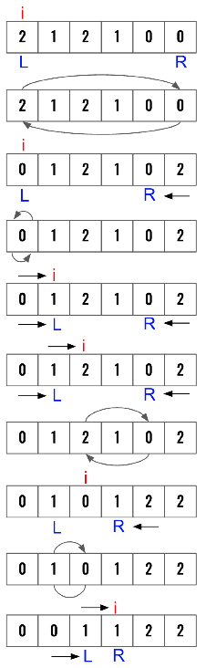
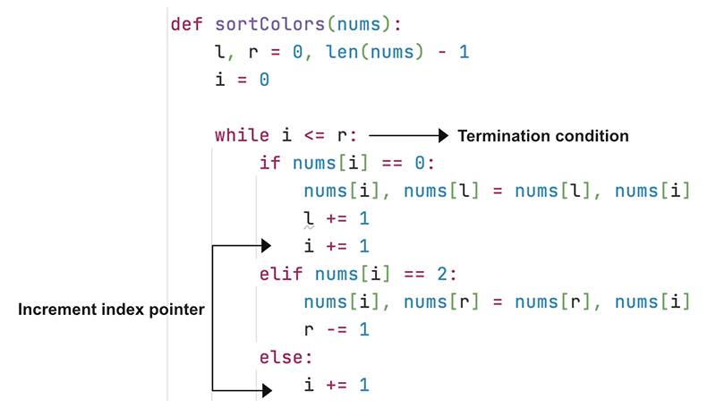

> All diagrams presented herein are original creations, meticulously designed to enhance comprehension and recall. Crafting these aids required considerable effort, and I kindly request attribution if this content is reused elsewhere.
{: .prompt-danger }

> **Difficulty** : Easy
{: .prompt-tip }

> Three Pointers , Partition of Array
{: .prompt-info }


## Problem

Given an array **nums** with **n** objects colored **red**, **white**, or **blue**, sort them in-place so that objects of the same color are adjacent, with the colors in the order red, white, and blue.

We will use the integers **0**, **1**, and **2** to represent the color red, white, and blue, respectively.

- **Input** : `[2,0,2,1,1,0]`
- **Output** :  `[0,0,1,1,2,2]`

## Solution

1. **High Level Idea**: Move the `0`’s to the **left** and `2`’s to the **right**. `1` will be automatically placed in the middle.
2. Use an index pointer **i** to traverse the array.
3. Increment **left** and **i** **pointer** only when **swapping 0s**.
4.	Only decrement **right** pointer (don’t increment `i`) when **swapping 2s**. Left pointer can only point to **1**, however right pointer can point to both **0 or 1**. This is why index pointer **i** can not be moved unless **validated with left** pointer in the next iteration.





## Code

```python
def sort_colors(nums):
    # Initialize left and right pointers
    l, r = 0, len(nums)-1
    # Initialize index pointer
    i = 0

    # Break when both index pointer
    # and right pointer are pointing
    # to the same location
    while i <= r:
        # First swap logic
        if nums[i] == 0:
            # Swap with content from left pointer
            nums[i], nums[l] = nums[l], nums[i]
            # Increament both as left & index pointer
            i += 1
            l += 1
        elif nums[i] == 2:
            # Swap with content from right pointer
            nums[i], nums[r] = nums[r], nums[i]
            # Only decrement right as index might point to 0.
            # In that case need to swap index with left pointer again.
            r -= 1
        else:
            # no need to swap and index ptr
            # is already pointing to 1
            i += 1
    return nums


print(sort_colors([2, 0, 2, 1, 1, 0]))
```

```
[0, 0, 1, 1, 2, 2]
```


