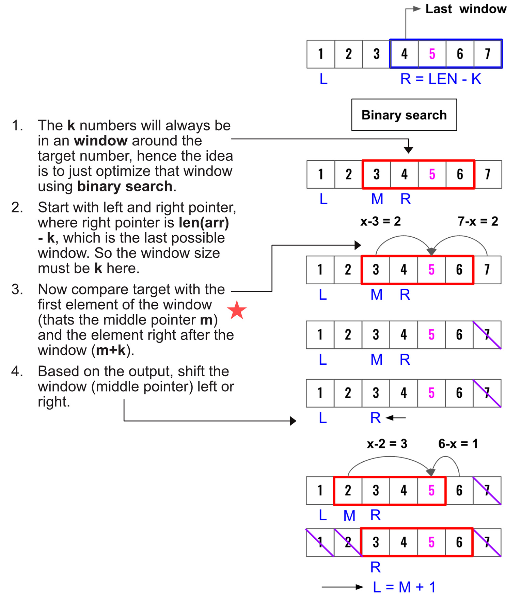

> All diagrams presented herein are original creations, meticulously designed to enhance comprehension and recall. Crafting these aids required considerable effort, and I kindly request attribution if this content is reused elsewhere.
{: .prompt-danger }

> **Difficulty** : Medium
{: .prompt-warning }

> Binary Search , Sliding Window
{: .prompt-info }


## Problem

Given a sorted integer array **arr**, two integers **k** and **x**, return the **k** closest integers to **x** in the array. The result should also be sorted in ascending order. If **distance** of two integers are **same** from **x**, then choose the **smaller** one. **x** may **not** be present in the array arr.

### Example 1:

- **Input** :  `arr = [1,2,3,4,5]`,`k = 4`, `x = 3`    	
- **Output** : `[1,2,3,4]`

### Example 2:

- **Input** : `arr = [1,2,3,4,5]`, `k = 4`, `x = -1`
- **Output :**  `[1,2,3,4]`

## Solution

- The problem can be solved in O(log n+k) by first scanning the array to find the first closest element and then using two pointers to find k closent elements. The complexity arises when the target number **x** is not in **arr**. 
- :fire: One solution is to convert this to a **Sliding Window** & **Binary Search** problem. Since the array is already sorted, we can try to find the **window** in which the `k` elements exists (They will always be in a window). 
- We can start from right [or left] most and use the right [or left] pointer to keep track of the start of the window.

- Lets use this example is the diagram:
  - **Input** : `arr = [1,2,3,4,5,6,7]`, `k = 4`, `x = 5`
  - **Output** : `[3,4,5,6]`



## Code

```python
def find_closest_elements(arr, k, x):
    # Start right ptr from len(arr)-k
    l, r = 0, len(arr)-k

    # l < r and not l <=r 
    # We do not want to run this
    # when l == r as this was already validated 
    while l < r:
        # Find the middle ptr
        mid = (l+r)//2

        if x-arr[mid] > arr[mid+k]-x:
            # if the current middle value is
            # farther away than the value after
            # the window then move the window
            # right -> The intention is to keep 
            # finding closest values
            l = mid+1
        else:
            # if the current middle value is
            # closer or equal than the value after
            # the window then move the window
            # left to the mid ptr
            r = mid  # Not m+1
    return arr[r:r+k]


print(find_closest_elements([1, 2, 3, 4, 5, 6, 7], 4, 5))
```

```
[3, 4, 5, 6]
```


## Runtime Complexity

The runtime will be `O(log n)` as we are simply running a binary search.
