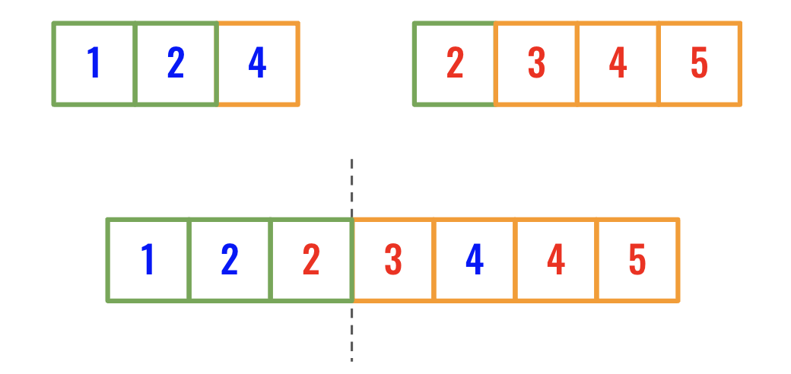
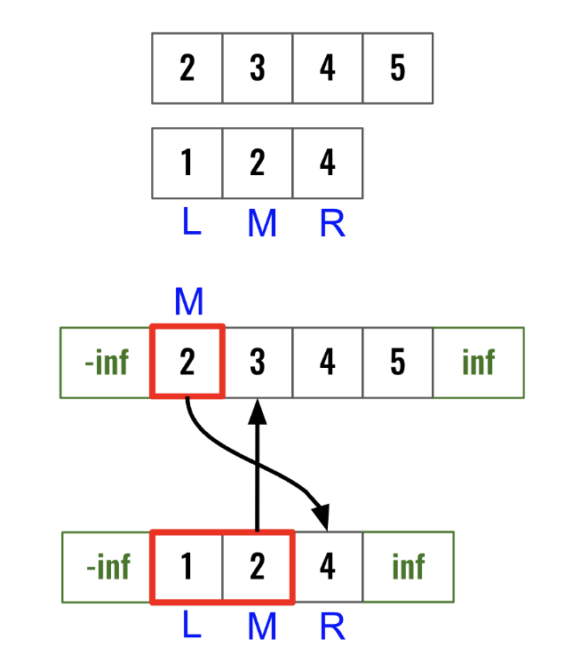
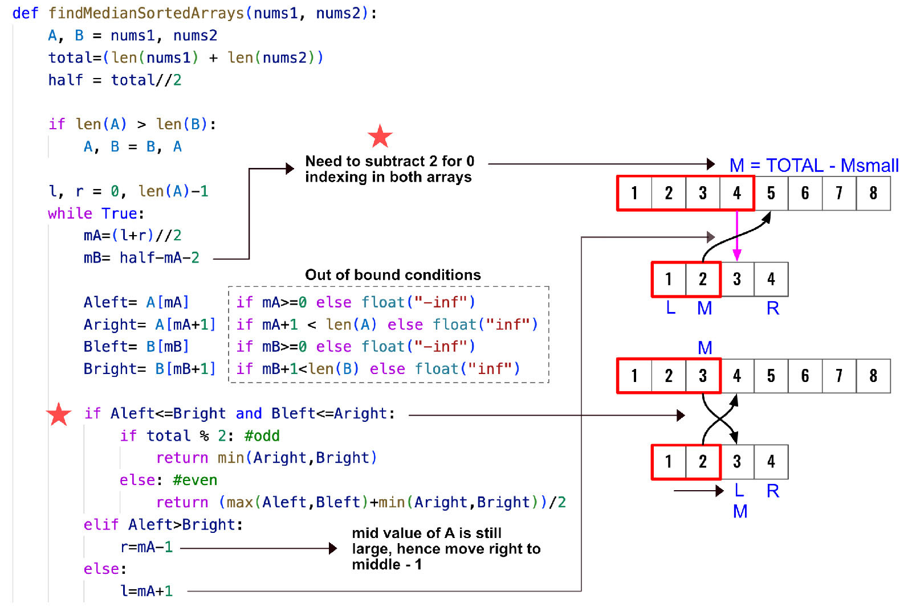
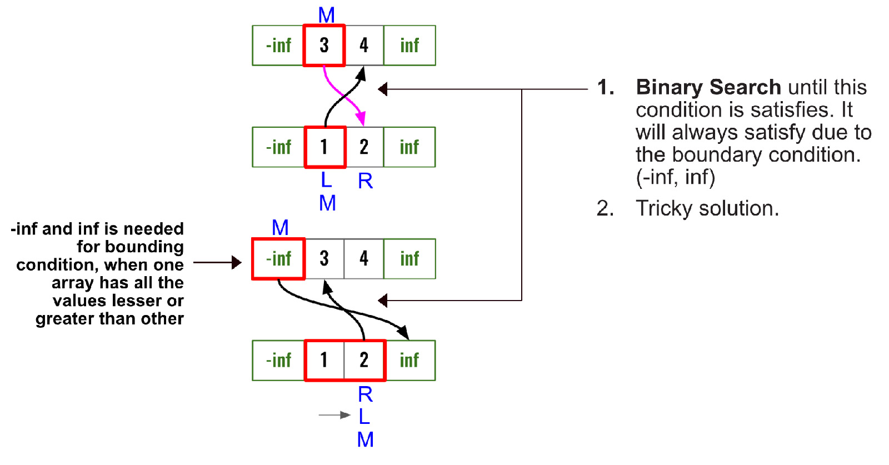

> All diagrams presented herein are original creations, meticulously designed to enhance comprehension and recall. Crafting these aids required considerable effort, and I kindly request attribution if this content is reused elsewhere.
{: .prompt-danger }

> **Difficulty** :  Hard
{: .prompt-danger }

> Binary Search to find left sub array
{: .prompt-info }


## Problem

Given two sorted arrays **nums1** and **nums2** of size **m** and **n** respectively, return the **median** of the two sorted arrays.

### Example 1:

- **Input** :  nums1 = [1,3], nums2 = [2]    	
- **Output** : `2.0`

### Example 2:

- **Input** : nums1 = [1,2], nums2 = [3,4]
- **Output :**  `2.5`

## High Level Idea

- **Brute force solution** : The simplest solution to this problem is to combine all the numbers, sort them & then find the median. Now we all know that there must be a better way to solve it. 
- :high_brightness: The **high level idea** is to keep the arrays as is. Now even if we have a combined sorted array, we just need the first half of it to find the median. Which means, we never have to sort the complete array anyway. We can just try to search the median in the first half of the virtually combined array. (We will find out how to do that next) 

> Now you might be thinking that how in the world one might come up with this idea in an interview. You need to look for clues, in this case the problem statement indicates the individual arrays are already sorted. If this wasn't the case we would have implemented the brute force solution. However the already sorted arrays provides the clue that we parhaps need to use a seaching algorith. Binary Search is very flexible and can be modified to fit the needs. 
{: .prompt-tip }

## Solution

- Let's understand the below problem. We have two arrays. We can find the median if we know the left half of the joined array which is marked with green border. Notice, the numbers with green borders are also always at the left side of the two input arrays.  



- So we can take the smaller input array, start at the middle and using binary seach find out how many of the green boxes will be participating from it. We know the total length, `7` in this case. So if from the smaller input array there are `n` participating green boxes then for the larger input array it will be `7/2-n`
  - Binary Search just to speedup the process, otherwise can go element by element left or right.
- The next question is, how do we know where to stop? Lets call the smaller array as `A` and the larger array as `B`. Then if `A[midA]<= B[BPtr+1] and B[BPtr]<A[midA+1]` then we will know we have found the split index.Here `BPtr = total_len/2 - midA`
- We will use **Binary search** will be run only on the **smaller array** for efficiency.
- Here is the visualization of the problem.



This is another example with code.



### Edge Case

There is an edge case here when one array has all the smaller numbers than another array. For this we can assign the `midA` as either `-inf` or `+inf` 



## Code

```python
def find_median_in_sorted_arrays(nums1, nums2):
    A, B = nums1, nums2
    total_len = len(A)+len(B)
    half=total_len//2
    
    if len(A) > len(B):
        A, B = B, A

    # Binary search in the smaller array
    l, r = 0, len(A)-1
    while True:
        # Start at the mid point
        midA = (l+r)//2
        # -2 as we have two arrays with 0 index
        ptrB = half-midA-2

        # Out of bound conditions
        A_Left = A[midA] if midA >= 0 else float("-inf")
        A_right = A[midA+1] if midA+1 < len(A) else float("inf")
        B_Left = B[ptrB] if ptrB >= 0 else float("-inf")
        B_right = B[ptrB+1] if ptrB+1 < len(B) else float("inf")

        # terminating condition.
        if A_Left < B_right and B_Left < A_right:
            # We have partitioned the arrays using
            # midA and ptrB

            # There are two cases for finding median
            # 1. Even 2. Odd

            if total_len % 2 == 0:  # Even case
                # max of two left partition and 
                # min of two right partition
                return (max(A_Left, B_Left)+min(A_right, B_right))/2
            else:  # odd case
                # min of both the right partition
                return min(A_right, B_right)
        elif A_Left > B_right:  # Move left
            r = midA-1
        else:
            l = midA+1


print(find_median_in_sorted_arrays([2, 3, 4, 5], [1, 2, 4]))
```

```
3
```

## Runtime Complexity

The runtime will be `O(log n)` as we are simply running a binary search.
