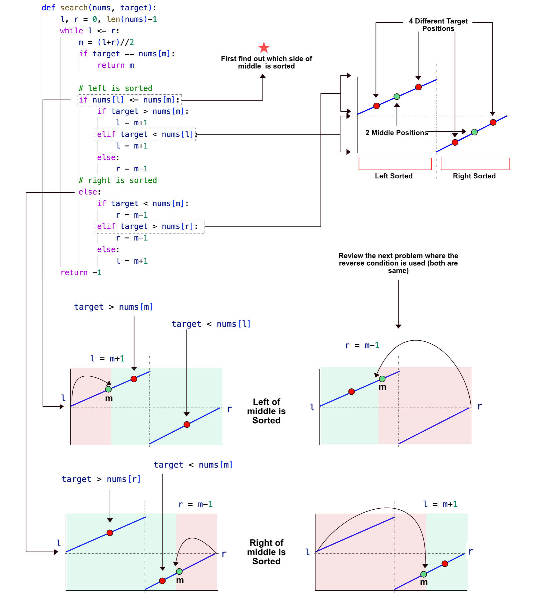

> All diagrams presented herein are original creations, meticulously designed to enhance comprehension and recall. Crafting these aids required considerable effort, and I kindly request attribution if this content is reused elsewhere.
{: .prompt-danger }

> **Difficulty** :  Easy
{: .prompt-tip }

> Binary Search, First find which **side** is sorted
{: .prompt-info }


## Problem

Given the array **nums** after the **possible** **rotation** and an integer **target**, return the index of target if it is in **nums**, or **-1** if it is not in **nums**.

### Example 1:

- **Input** :  nums = `[4,5,6,7,0,1,2]`, target = `0`    	
- **Output** : `4`

## Solution



##  Code

```python
def find_median_in_sorted_arrays(nums1, nums2):
    A, B = nums1, nums2
    total_len = len(A)+len(B)
    half=total_len//2
    
    if len(A) > len(B):
        A, B = B, A

    # Binary search in the smaller array
    l, r = 0, len(A)-1
    while True:
        # Start at the mid point
        midA = (l+r)//2
        # -2 as we have two arrays with 0 index
        ptrB = half-midA-2

        # Out of bound conditions
        A_Left = A[midA] if midA >= 0 else float("-inf")
        A_right = A[midA+1] if midA+1 < len(A) else float("inf")
        B_Left = B[ptrB] if ptrB >= 0 else float("-inf")
        B_right = B[ptrB+1] if ptrB+1 < len(B) else float("inf")

        # terminating condition.
        if A_Left < B_right and B_Left < A_right:
            # We have partitioned the arrays using
            # midA and ptrB

            # There are two cases for finding median
            # 1. Even 2. Odd

            if total_len % 2 == 0:  # Even case
                # max of two left partition and 
                # min of two right partition
                return (max(A_Left, B_Left)+min(A_right, B_right))/2
            else:  # odd case
                # min of both the right partition
                return min(A_right, B_right)
        elif A_Left > B_right:  # Move left
            r = midA-1
        else:
            l = midA+1


print(find_median_in_sorted_arrays([2, 3, 4, 5], [1, 2, 4]))
```

```
3
```

## Runtime Complexity

The runtime will be `O(log n)` as we are simply running a binary search.
