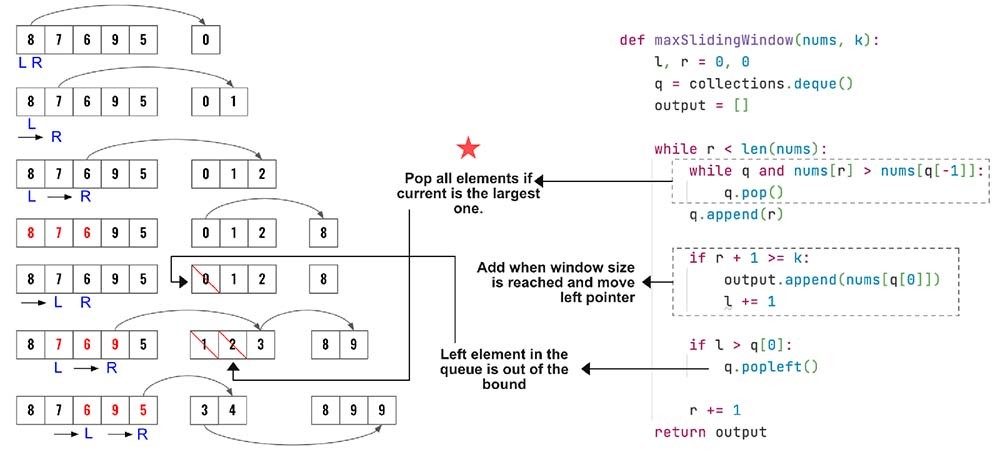

> All diagrams presented herein are original creations, meticulously designed to enhance comprehension and recall. Crafting these aids required considerable effort, and I kindly request attribution if this content is reused elsewhere.
{: .prompt-danger }

> **Difficulty** :  Easy
{: .prompt-tip }

> Use Queue, Two Pointers 
{: .prompt-info }


## Problem

You are given an array of integers `nums`, there is a sliding window of size `k` which is moving from the very left of the array to the very right. You can only see the `k` numbers in the window. Each time the sliding window moves right by one position. Return *the max sliding window*.

**Example 1:**

```
Input: nums = [1,3,-1,-3,5,3,6,7], k = 3
Output: [3,3,5,5,6,7]

Explanation: 
Window position                Max
---------------               -----
[1  3  -1] -3  5  3  6  7       3
 1 [3  -1  -3] 5  3  6  7       3
 1  3 [-1  -3  5] 3  6  7       5
 1  3  -1 [-3  5  3] 6  7       5
 1  3  -1  -3 [5  3  6] 7       6
 1  3  -1  -3  5 [3  6  7]      7
```

**Example 2:**

```
Input: nums = [1], k = 1
Output: [1]
```

## Solution

1.	The idea is to use a **queue** to keep track of largest value. Also keep the smaller values which might become largest after moving the left pointer. So the values in the queue needs to be in decreasing order.

> In Python, a deque, short for "double-ended queue," is a versatile data structure that supports efficient insertion and deletion operations at both ends of the queue. It provides O(1) time complexity for these operations, making it ideal for scenarios requiring fast access to elements at the beginning or end of the queue. 
{: .prompt-tip }

2.	Before inserting the current value in the queue, **remove** all the values which are **smaller than the current value**. The older values are not required as the current larger value.
2.	Store the **index** in the **queue**. **Remove** the **leftmost** element if **index** of that **goes out of bound**.



## Code

```python
import collections
def max_sliding_window(nums,k):
    l, r = 0, 0
    
    # Create an instance of the 
    # queue. Remember python's 
    # deque() is double sided. 
    # So we can easily pop from
    # right or left. 
    queue=collections.deque()
    output=[]
    
    # continue till our right 
    # pointer reaches the end
    # of the array
    while r<len(nums):
        # First make sure there is no 
        # value smaller than the current 
        # one in the queue
        
        # queue[-1] to access the last inserted 
        # element which will also be the smallest
        while queue and nums[r]>nums[queue[-1]]:
            # Remove the element as the current
            # element will serve as the max element
            queue.pop()
            
        # Add the current element
        queue.append(r)
        
        # Check to see if window size is reached
        if (r+1)-l == k: # r+1 as r is 0 indexed
            # Append the oldest value to the output
            output.append(nums[queue[0]])

            # Move the left pointer to shrink the window
            l=l+1

            # Queue clean up
            # If the current left index is 
            # larger than the oldest index 
            # in the queue then remove it 
            # from the queue
            if l>queue[0]:
                # Remove oldest value
                queue.popleft()

        # move right pointer
        r=r+1
    return output        
        
print(max_sliding_window([1,3,-1,-3,5,3,6,7],3))
```

```python
[3, 3, 5, 5, 6, 7]
```

## Runtime Complexity

The runtime will be `O(n)` as we are simply scanning through the array once.
