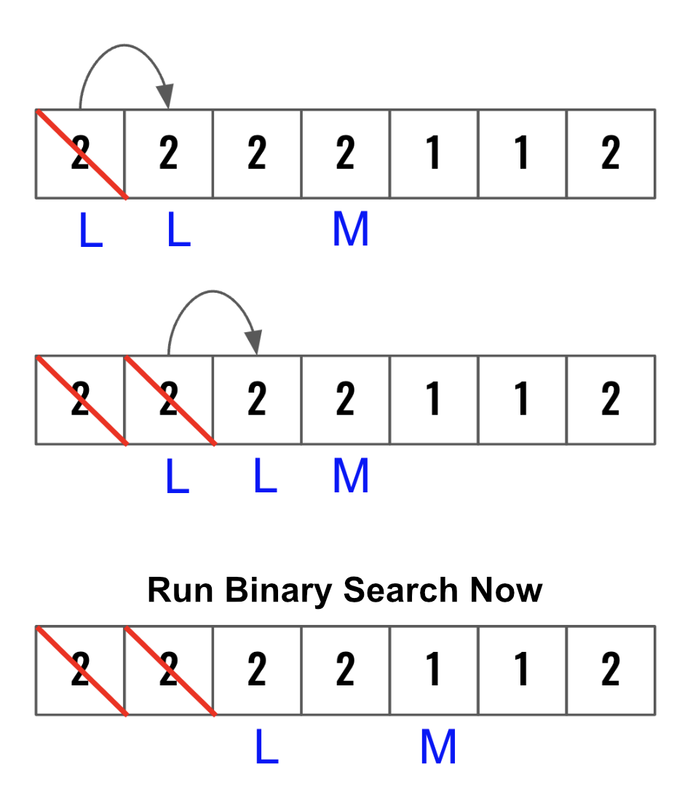
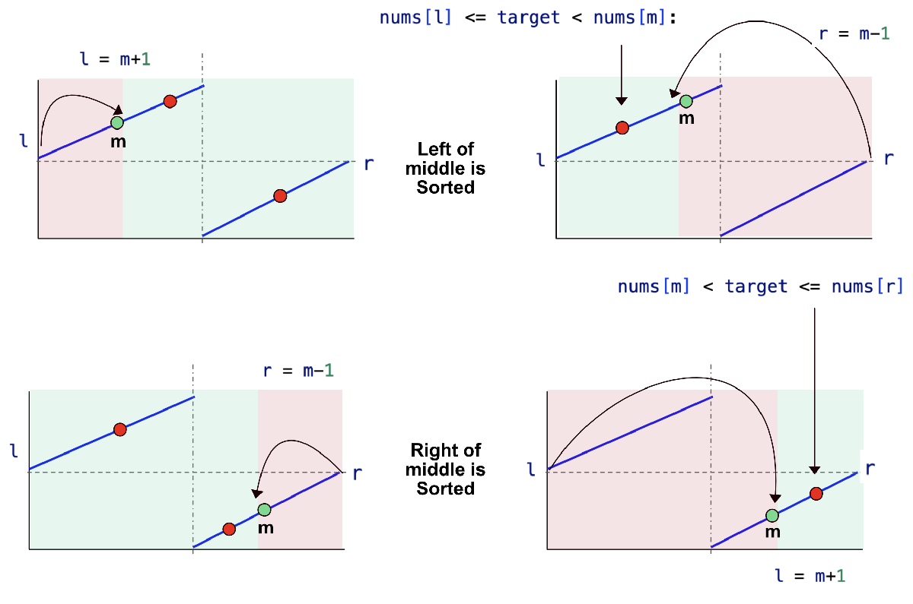
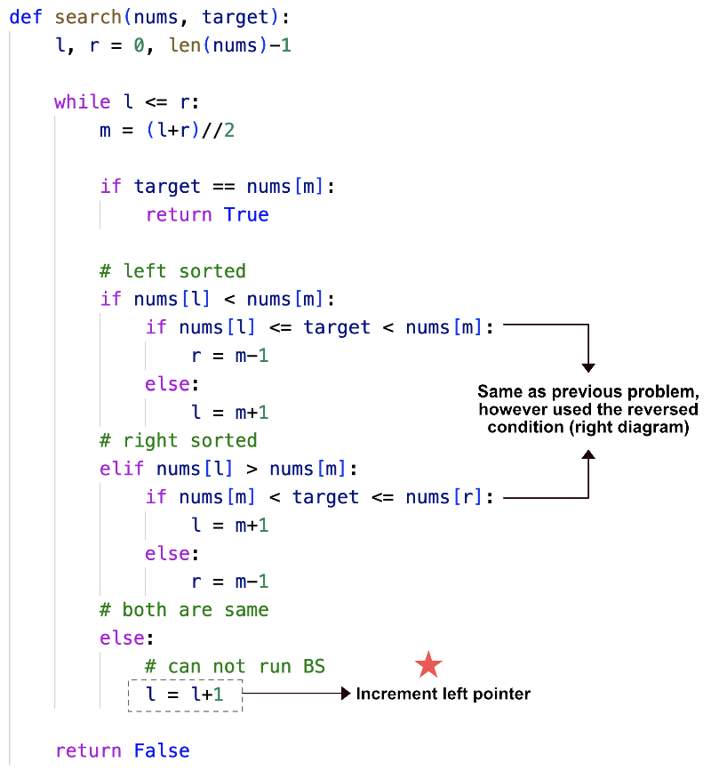

> All diagrams presented herein are original creations, meticulously designed to enhance comprehension and recall. Crafting these aids required considerable effort, and I kindly request attribution if this content is reused elsewhere.
{: .prompt-danger }

> **Difficulty** :  Easy
{: .prompt-tip }

> Binary Search, First find which **side** is sorted, Increase left pointer by **1** if **nums[l] == nums[m]**
{: .prompt-info }


## Problem

There is an integer array **nums** sorted in **non-decreasing order** (not necessarily with distinct values). Given the array **nums** after the **rotation** and an integer **target**, return **true** if **target** is in **nums**, or **false** if it is not in **nums**.

### Example 1:

- **Input** :  nums = `[2,5,6,0,0,1,2]`, target = `0`    	
- **Output** : `True`

## Solution

- Very similar to the previous problem. [Search in Rotated Sorted Array](https://adeveloperdiary.com/algorithm/two-pointers/search-in-rotated-sorted-array/)

- The main complexity is we **can’t run** binary search if  `nums[l] == nums[m]`. This this case just move the **left** pointer to right by **one step**.

  

- We can use the same 3 conditions from previous problem. However here we will use just different variation as both are valid. 
  - Just one major difference is since now `nums[l]` and `nums[r]` can be same, we will use `<=` instead of just using `>` or `<`. 



Its very important to understand the above 4 diagrams.  They shows the logic on how to move `l` and `r` pointers.



##  Code 1

Below is the almost exact code as the previous problem. Just change the `<=` in line `12` to `<` as there could be duplicates. Then incorporate the `elif` condition for right sorted `nums[l] > nums[mid]` in line `31` and finally add the `else` condition.

```python
def rotated_search_with_duplicates(nums, target):
    l, r = 0, len(nums) - 1
    while l <= r:
        mid = (l + r) // 2

        # Return if target is found
        if target == nums[mid]:
            return True

        # If left is smaller than middle then
        # left of the middle is sorted.
        if nums[l] < nums[mid]:
            # there are three loctions where
            # the trget could be present.
            # We need to check for all three

            if target > nums[mid]:
                # 1. Target is right of middle and
                # in the same partition
                # In this case move left to mid +1
                l = mid + 1
            elif target < nums[l]:
                # 2. target is in the right partition
                # In this case move the left to mid+1
                l = mid + 1
            else:
                # 3. Target is left of middle in the same
                # sorted partition
                # In this case move right to mid-1
                r = mid - 1
        elif nums[l] > nums[mid]:
            # The left is not sorted, so right must be sorted
            # Again check for three conditions.
            if target < nums[mid]:
                # 1. Target is in the left of the
                # middle and in same partition
                # In this case move right to mid-1
                r = mid - 1
            elif target > nums[r]:
                # 2. Target is in the other partition
                # In this case move right to mid-1
                r = mid - 1
            else:
                # 3. Target is right of middle in the
                # same sorted partition
                # In this case move left to mid+1
                l = mid + 1
        else:
          	# Just move l to right as binary search can not work
            l = l+1
    return False


print(rotated_search_with_duplicates([2, 5, 6, 0, 0, 1, 2], 0))
```

```
True
```

## Code 2

Here is another version where the reversed conditions are used. There are many ways to code so as long as you have understood the solution coding it might not be very difficult.

```python
def rotated_search_with_duplicates(nums, target):
    l, r = 0, len(nums) - 1
    while l <= r:
        mid = (l + r) // 2

        # Return if target is found
        if target == nums[mid]:
            return True

        # If left is smaller than middle then
        # left of the middle is sorted.
        if nums[l] < nums[mid]:
            # there are two loctions where
            # the trget could be present.
            # We need to check for all two
            
            # If the target falls in between left 
            # and mid pointer, then move right pointer
            if nums[l]<= target < nums[mid]:
                r=mid-1
            else:
                l=mid+1
            
        elif nums[l] > nums[mid]:
            # If the target falls in between mid 
            # and right pointer, then move left pointer
            if nums[mid] < target <=nums[r]:
                l=mid+1
            else:
                r=mid-1
        else:
            l = l+1
    return False

print(rotated_search_with_duplicates([2, 5, 6, 0, 0, 1, 2], 0))
```

## Runtime Complexity

The runtime will be `O(log n)` as we are simply running a binary search.
