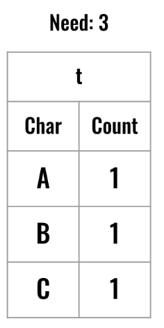

> All diagrams presented herein are original creations, meticulously designed to enhance comprehension and recall. Crafting these aids required considerable effort, and I kindly request attribution if this content is reused elsewhere.
{: .prompt-danger }

> **Difficulty** :  Medium
{: .prompt-warning }

> Two Pointers, Two Maps, Move `right` pointer -> increase `have`, Once `have == need` -> move `left` pointer in loop until `have < need`
{: .prompt-info }


## Problem

Given two strings `s` and `t` of lengths `m` and `n` respectively, return the **minimum window substring** *of* `s` *such that every character in* `t` *(**including duplicates**) is included in the window*. If there is no such substring, return *the empty string* `""`.

**Example 1:**

```
Input: s = "ADOBECODEBANC", t = "ABC"
Output: "BANC"
Explanation: The minimum window substring "BANC" includes 'A', 'B', and 'C' from string t.
```

**Example 2:**

```
Input: s = "a", t = "a"
Output: "a"
Explanation: The entire string s is the minimum window.
```

**Example 3:**

```
Input: s = "a", t = "aa"
Output: ""
Explanation: Both 'a's from t must be included in the window.
Since the largest window of s only has one 'a', return empty string.
```

## Solution

- Once you know the solution writing code is very simple. Here we will use two maps `window_map` & `t_map` and using this we will keep track of the the `left` and `right` pointers of the window. We will also use two additonal parameters `have` & `need`.

- Lets first create map of all the letters we need including their occurances as duplicates are allowed. 

  

  ```python
  # Our input is s = 'ADOBECODEBANC' and t= 'ABC'
  t_map = {}
  for c in t:
    t_map[c]=1+t_map.get(c,0)
  print(t_map)
  ```

  ```
  {'A': 1, 'B': 1, 'C': 1}
  ```

- Next, we will define two parameters to track if we have all the letters in our window including their occurrences. 

  ```python
  have, need = 0, len(t_map)
  ```

- The idea is to create a `left` & `right` pointer, then keep moving the right pointer from initial `0` position and keep adding the corresponding letter to another map named `window_map` . 

  ```python
  l = 0
  window_map = {}
  for r in range(len(s)):
      c = s[r]
      window_map[c] = 1+window_map.get(c, 0)
  ```

- Everytime after letter is added to `window_map`, find out if **for that letter** the requiremts are met using the `t_map`. If yes, then increment `have` by one.

  ```python
      if c in t_map and t_map[c]==window_map[c]:
          have=have+1
  ```

- Now whenever `need==have`, find the length of the window. If the length  We need a while loop here as duplicate might be there.

  ```python
      while need == have:
          if (r+1)-l < min_len :
              min_len=(r+1)-l
              result=[l,r]
  ```

- Once we have the current result, now its time to keep shrinking the window from left until the `need==have` condition breaks. Remove one item from `window_map`, find if we need to reduce `have`. 

> Notice : Here we are using `s[l]` and not `s[r]` (which is `c`). 
{: .prompt-tip }

  ```python
          window[s[l]]-=1        
          if s[l] in t_map and window[s[l]] < t_map[s[l]]:
              have-=1
          
          l+=1
  ```

- Let's visualize this step by step now. After moving `right pointer` to `B `, the `have` value will be `2` (right side)

  

- Then once `r` reaches to `C`, the `have==need` will be `True`. (both will be `3`). Now calculate `min_len` (`5-0 = 5`). Then increment `left pointer` one step which will reduce the `have` count and that will break the while loop.

  

- Now once `r` moves to `A` the `have=need` will again be `True`. The `while` loop will keep running and `l` will be incremented till it reaches to `C`. The `min_len` will again be `10-5 = 5`. `l` will be incremented once more and after that the while loop will break.

  

- Finally, `r` will move to `C` and again `have=need` will again be `True`. We will keep increasing `l` and calculate `min_len` for every iteration. Finally, the `while` loop will break for the last time after `l` crosses `B`. Thats the `min_len` of `12-9 = 3`.

  

## Visualize the code


## Code

```python
def min_window_sub_string(s, t):
    window_map, t_map = {}, {}
    for c in t:
        t_map[c] = 1+t_map.get(c, 0)

    l = 0
    result = [0, 0]
    min_len = float('inf')

    have, need = 0, len(t_map)

    for r in range(len(s)):
        c = s[r]
        window_map[c] = 1+window_map.get(c, 0)

        if c in t_map and t_map[c] == window_map[c]:
            have += 1

        while have == need:
            if min_len > (r+1) - l:
                min_len = (r+1) - l
                result = [l, r]
						
            # pop leftmost element from window
            window_map[s[l]] = window_map[s[l]]-1
							
            # Verify if window still has all char needed  
            if s[l] in t_map and window_map[s[l]] < t_map[s[l]]:
                have -= 1

            l = l+1

    l, r = result
    return s[l:r+1] if min_len != float("inf") else ""

print(min_window_sub_string('ADOBECODEBANC', 'ABC'))  
```

```python
BANC
```

## Runtime Complexity

The runtime will be `O(n)` as we are simply scanning through the array once.
