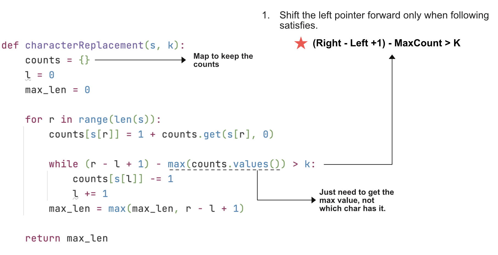

> All diagrams presented herein are original creations, meticulously designed to enhance comprehension and recall. Crafting these aids required considerable effort, and I kindly request attribution if this content is reused elsewhere.
{: .prompt-danger }

> **Difficulty** :  Easy
{: .prompt-tip }

> Map
{: .prompt-info }


## Problem

You are given a string `s` and an integer `k`. You can choose any character of the string and change it to any other uppercase English character. You can perform this operation at most `k` times.

Return *the length of the longest substring containing the same letter you can get after performing the above operations*.

**Example 1:**

```
Input: s = "ABAB", k = 2
Output: 4
Explanation: Replace the two 'A's with two 'B's or vice versa.
```

**Example 2:**

```
Input: s = "AABABBA", k = 1
Output: 4
Explanation: Replace the one 'A' in the middle with 'B' and form "AABBBBA".
The substring "BBBB" has the longest repeating letters, which is 4.
There may exists other ways to achieve this answer too.
```

## Solution

This is very similar problem as the [Minimum Window Substring](https://adeveloperdiary.com/algorithm/sliding-window/minimum-window-substring/). We still need a map to keep track of letters in our window and we need to increment the `left pointer` in a `while` loop etc.

1. Start by defining three variables. 

   ```python
   window_map={}
   l=0	
   max_len=0
   ```

2. Next, loop through the string `s` using right pointer `r` and keep adding the letters to `window_map`. Again very similar to [Minimum Window Substring](https://adeveloperdiary.com/algorithm/sliding-window/minimum-window-substring/) problem.

   ```python
   for r in range(len(s)):
       # Add letter to window_map and increment
       # the occurrences
       window_map[s[r]]=1+window_map.get(s[r],0)
   ```

3. Now, we need the `while` loop to shrink to window, that is, increment the left pointer `l`. Again, this is same as  [Minimum Window Substring](https://adeveloperdiary.com/algorithm/sliding-window/minimum-window-substring/) problem. The only difference is the breaking condition.

4. Let’s skip the `while` loop condition and write the logic inside. Same concept as [Minimum Window Substring](https://adeveloperdiary.com/algorithm/sliding-window/minimum-window-substring/) problem. Remove letters from the `window_map` using `left pointer` and keep incrementing left pointer.

   ```python
   while <some logic> :
       window_map[s[l]] -= 1
       l += 1
   ```

5. Now comes the main difference between the [Minimum Window Substring](https://adeveloperdiary.com/algorithm/sliding-window/minimum-window-substring/) and this problem. In the [Minimum Window Substring](https://adeveloperdiary.com/algorithm/sliding-window/minimum-window-substring/) problem, we can increment `r` even if `have !=need`. So no matter if `have==need` or `not` we can increment `r`. 

6. However in this problem, we wont increment `r` unless we are allowed to, but before that let’s decode that main logic a bit more.

   1. set `l, r = 0`
   2. Increment `r` till `window_len - count_of_max_repeating_char_in_that_window <= k`
      1. else: increment `l` until the above coondition is satisfied again.
   3. Keep track of `max_len`

7. Above is the core algorithm, however our code is now bit different. How we can align both together so that we can understand the pattern ?

   1. set `l, r = 0`
   2. Keep incrementing `r`
   3. Increment `l` till `window_len - count_of_max_repeating_char_in_that_window > k`
   4. Keep track of `max_len`

8. So here we just flipped the condition from `<=k` to `>k` to move the left pointer `l`. The `max_len` calculation in this case however will be outside of the `while` loop.

   ```python
   while ((r+1)-l ) - max(window_map.values()) > k:
       window_map[s[l]] -= 1
       l += 1
   
   max_len = max(max_len, r-l+1)
   ```

## Visualize the Solution



## Final Code

```python
def longest_repeating_char_replacement(self, s: str, k: int) -> int:
    window_map = {}
    l = 0
    max_len = 0

    for r in range(len(s)):
        window_map[s[r]] = 1+window_map.get(s[r], 0)

        while (r-l+1)-max(window_map.values()) > k:
            window_map[s[l]] -= 1
            l += 1
        max_len = max(max_len, r-l+1)

    return max_len
print(longest_repeating_char_replacement('ABAB',2))
```

```python
4
```

## Runtime Complexity

The runtime will be `O(n)` as we are simply scanning through the array once.
