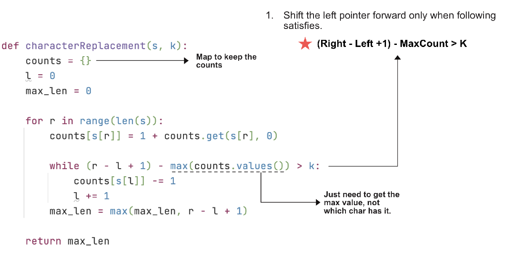

> All diagrams presented herein are original creations, meticulously designed to enhance comprehension and recall. Crafting these aids required considerable effort, and I kindly request attribution if this content is reused elsewhere.
{: .prompt-danger }

> **Difficulty** :  Easy
{: .prompt-tip }

> Map
{: .prompt-info }


## Problem

You are given a string `s` and an integer `k`. You can choose any character of the string and change it to any other uppercase English character. You can perform this operation at most `k` times.

Return *the length of the longest substring containing the same letter you can get after performing the above operations*.

**Example 1:**

```
Input: s = "ABAB", k = 2
Output: 4
Explanation: Replace the two 'A's with two 'B's or vice versa.
```

**Example 2:**

```
Input: s = "AABABBA", k = 1
Output: 4
Explanation: Replace the one 'A' in the middle with 'B' and form "AABBBBA".
The substring "BBBB" has the longest repeating letters, which is 4.
There may exists other ways to achieve this answer too.
```

## Solution



## Code

```python
def characterReplacement(self, s: str, k: int) -> int:
    counts = {}
    l = 0
    max_len = 0

    for r in range(len(s)):
        counts[s[r]] = 1+counts.get(s[r], 0)

        while (r-l+1)-max(counts.values()) > k:
            counts[s[l]] -= 1
            l += 1
        max_len = max(max_len, r-l+1)

    return max_len
print(characterReplacement('ABAB',2))
```

```python
4
```

## Runtime Complexity

The runtime will be `O(n)` as we are simply scanning through the array once.
