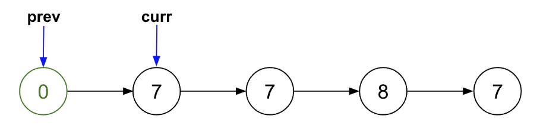
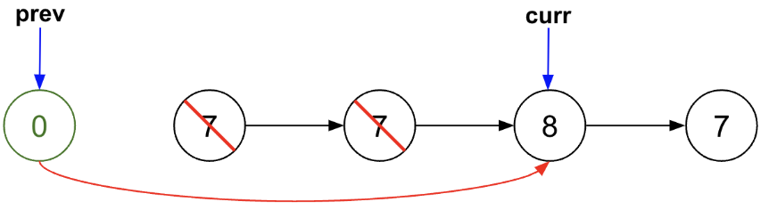
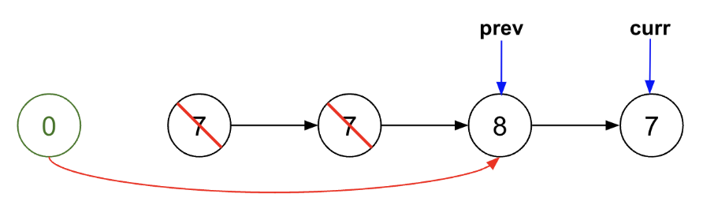
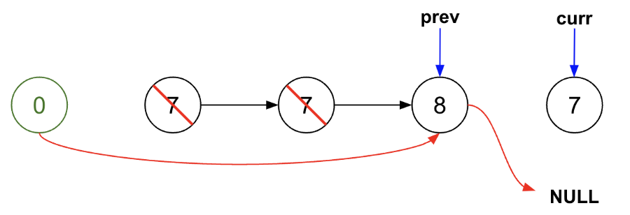

> All diagrams presented herein are original creations, meticulously designed to enhance comprehension and recall. Crafting these aids required considerable effort, and I kindly request attribution if this content is reused elsewhere.
{: .prompt-danger }

> **Difficulty** :  Easy
{: .prompt-tip }

> Two Pointers, use `set()`
{: .prompt-info }

## Problem

Given the `head` of a linked list and an integer `val`, remove all the nodes of the linked list that has `Node.val == val`, and return *the new head*.

**Example 1:**


```
Input: head = [1,2,6,3,4,5,6], val = 6
Output: [1,2,3,4,5]
```

**Example 2:**

```
Input: head = [], val = 1
Output: []
```

**Example 3:**

```
Input: head = [7,7,7,7], val = 7
Output: []
```

## Solution

We need a dummy node here as the very first node could be equal to `val`. The highlevel idea is to start a new head pointer (`prev`) pointing at the `dummy` pointer & whenever `curr!=val`, add the node to the new head. This way the new head will have all the nodes where `curr.val!=val`

```python
dummy = ListNode(0,head)
prev=dummy
curr=head
```



Next, in a loop keep traversing through `curr` pointer. If `curr.val!=val` then add the node to `prev` pointer.

```python
if curr.val != val:
    prev.next=curr
    prev=curr
```



We also need to point `curr` to `curr.next`

```python
curr = curr.next
```



We are almost done, except one modification needed when the last node is equal to `val`, (refer the diagrams) in that case `prev.next` will still point to the last node as previously we have set `prev=curr` and `curr.next=7` which is undesiarable. 

Now for this edge case, we need to explicitly set `prev.next=None`. 

```python
elif curr.next is None:                    
    prev.next=None         
```



## Final Code

Here is the full code.

```python
def remove_elements(head, val):
    dummy=ListNode(0,head)
    curr=dummy.next
    prev=dummy
    while curr:
        if curr.val != val:
            prev.next=curr
            prev=curr
        elif curr.next is None:                    
                prev.next=None         
        curr=curr.next
        
    return dummy.next
```

## Runtime Complexity

The runtime will be `O(n)` as we are simply scanning through the list once.
