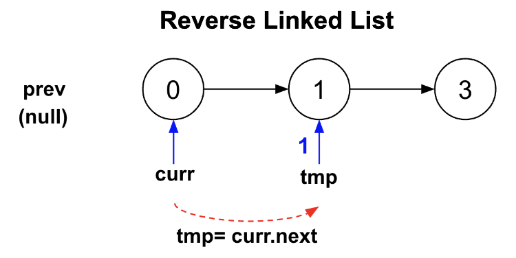
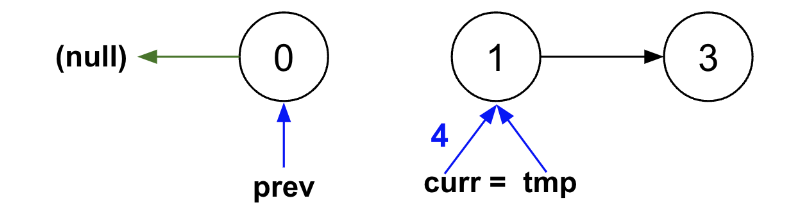
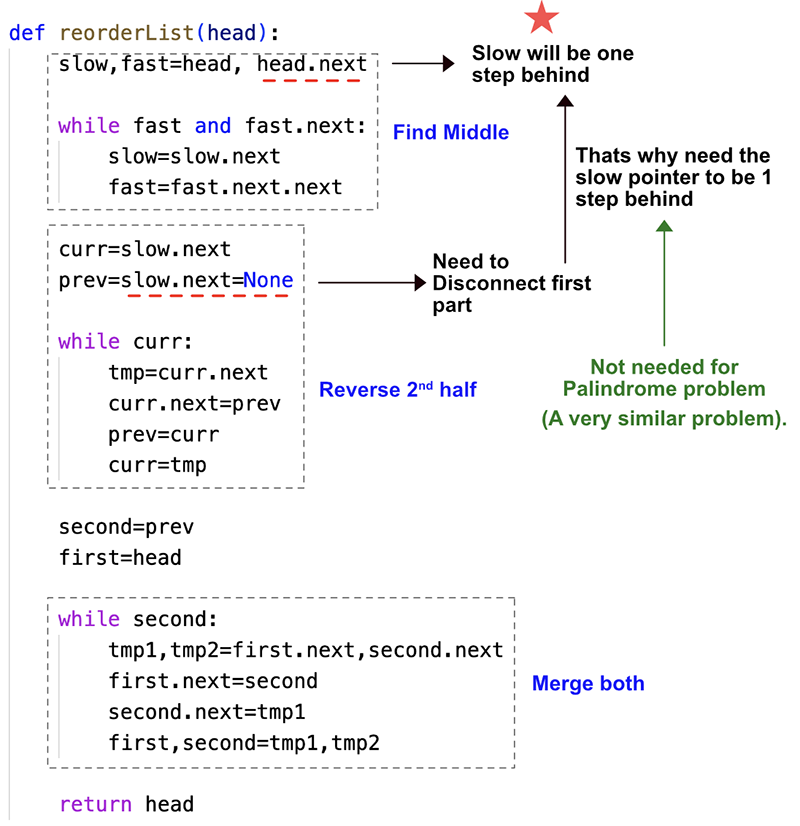

> All diagrams presented herein are original creations, meticulously designed to enhance comprehension and recall. Crafting these aids required considerable effort, and I kindly request attribution if this content is reused elsewhere.
{: .prompt-danger }

> **Difficulty** :  Easy
{: .prompt-tip }

> 1. Find middle, 2. Reverse Linked List, 3. Merge Linked List
{: .prompt-info }

## Problem

You are given the head of a singly linked-list. The list can be represented as:

```
L0 → L1 → … → Ln - 1 → Ln
```

*Reorder the list to be on the following form:*

```
L0 → Ln → L1 → Ln - 1 → L2 → Ln - 2 → …
```

You may not modify the values in the list's nodes. Only nodes themselves may be changed.

**Example 1:**


```
Input: head = [1,2,3,4]
Output: [1,4,2,3]
```

**Example 2:**


```
Input: head = [1,2,3,4,5]
Output: [1,5,2,4,3]
```

## Solution

This can be solved using 3 steps:

1. Find middle node
2. Reverse the 2nd half of the LinkedList.
3. Merge both Linked List

### Find middle node

We can use the classic slow-fast pointer to find the middle of the LinkedList. Only one difference though, we want the slow pointer to point to the last node of the first partition and not the first node of the 2nd partition. (We will find out why in the next section.). In order to implement this way, start the `fast` pointer one step ahead to `head.next`

```python
slow, fast = head, head.next

while fast and fast.next:
    slow = slow.next
    fast = fast.next.next
```

### Reverse the 2nd half

Now before reversing the 2nd partition, we need to disconnect it from the original list. This is the reason we wanted to the slow pointer to point to the last node of the first partition in the previous step :fire:.

The `curr` pointer will be the start of the 2nd partition.

```python
curr = slow.next
```

The `slow.next` need to set to `None` as we want to disconnect the partition.

```python
slow.next = None
```

Need a dummy `prev` pointer to reverse the linked list.

```python
prev = None
```

Now we need to keep moving `curr` pointer foward till the end of the loop.

**Step 1:** Have `tmp` pointer point to `curr.next`. This way we are making sure to point `curr` back to `tmp` before completing one iteration of the loop.

```python
tmp = curr.next
```




**Step 2**: Point `curr.next` to `prev`. This is where we are actually reversing the LinkedList.

```python
curr.next = prev
```


**Step 3:** Now since we have reversed till `curr`, point `prev` to `curr`.

```python
prev = curr
```


**Step 4**: Point `curr` back to 'tmp', so that in the next iteration of the loop the next node can be reversed.

```python
curr = tmp
```



Putting these steps all together.

```python
while curr:
  tmp=curr.next
  curr.next=prev
  prev=curr
  curr=tmp
```

### Merge both Linked List

The `prev` will now be the head of the 2nd LinkedList after reversal.

```python
first = head
second = prev
```

Now traverse through both the LinkedList and merge them.

```python
while second:
    # Keep pointers to the next nodes    
    tmp1,tmp2=first.next,second.next
    # Point first to second
    first.next=second
    # Point second to first.next which is 
    # now tmp1
    second.next = tmp1
    first,second = tmp1, tmp2
```

## Visualize the Solution



## Final Code

```python
def reorder_list(head):
    # 1. Find middle node
    slow, fast = head, head.next

    while fast and fast.next:
        slow = slow.next
        fast = fast.next.next
        
    # 2. Reverse the 2nd half
    curr=slow.next
    slow.next=None    
    prev=None
    
    while curr:
        tmp=curr.next
        curr.next=prev
        prev=curr
        curr=tmp

    #3. Merge the two list
    first = head
    second = prev
    
    while second:
        # Keep pointers to the next nodes    
        tmp1,tmp2=first.next,second.next
        # Point first to second
        first.next=second
        # Point second to first.next which is 
        # now tmp1
        second.next = tmp1
        first,second = tmp1, tmp2
    
    return head
```

## Runtime Complexity

The runtime will be `O(n)` as we are simply scanning through the array three times.
