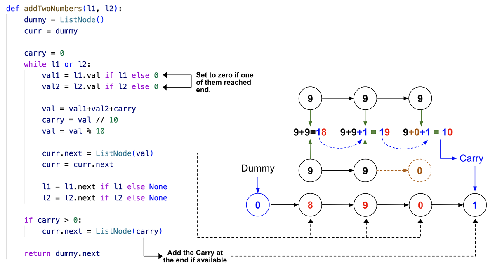

> All diagrams presented herein are original creations, meticulously designed to enhance comprehension and recall. Crafting these aids required considerable effort, and I kindly request attribution if this content is reused elsewhere.
{: .prompt-danger }

> **Difficulty** :  Easy
{: .prompt-tip }

> Consider edge cases.
{: .prompt-info }

## Problem

You are given two **non-empty** linked lists representing two non-negative integers. The digits are stored in **reverse order**, and each of their nodes contains a single digit. Add the two numbers and return the sum as a linked list.

**Example 1:**


```
Input: l1 = [2,4,3], l2 = [5,6,4]
Output: [7,0,8]
Explanation: 342 + 465 = 807.
```

**Example 2:**

```
Input: l1 = [0], l2 = [0]
Output: [0]
```

**Example 3:**

```
Input: l1 = [9,9,9,9,9,9,9], l2 = [9,9,9,9]
Output: [8,9,9,9,0,0,0,1]
```

## Solution

> A picture is worth a thousand words. 
{: .prompt-tip }

So let's start with the below picture first where the code and diagrams are connected together for self-explanation.



We start with a dummy node as we have to start creating a new LinkedList.

```python
dummy = ListNode(0, None)
curr = dummy
```

The `carry` is the most important variable here. Initially set it to `0`

```python
carry = 0
```

Now loop until both of the LinkedList is `None`. 

> Notice we are using `or` and not `and`. So even if one LinkedList is `None`, still the loop will continue.
{: .prompt-info }

```python
while l1 or l2:
```

In case one LinkedList is `None`, we will still assume its value is `0` so that the sum logic can keep continuing. We can certainly write this code such that once once LinkedList is `None`, the loop ends and we have another logic just to keep taking values from the longer list. However doing this way is more clean.

```python
    val1=l1.val if l1 else 0
    val2=l2.val if l2 else 0
```

Calculate the sum and carry.

```python
    val=val1+val2+carry
    carry=val // 10
    val = val % 10
```

Create new `ListNode` and set that as the `next` of `curr`.

```python
    curr.next=ListNode(val)
    curr=curr.next
```

Traverse both the `l1` and `l2` LinkedList.

```python
    l1=l1.next if l1 else None
    l2=l2.next if l2 else None
```

Finally, in case if there is a carry at the end, create a new node. 

```python
if carry>0:
    curr.next=ListNode(carry)
```

## Final Code

Here is the full code.

```python
def add_two_numbers(l1, l2):
    dummy = ListNode()
    curr = dummy

    carry = 0
    while l1 or l2:
        val1 = l1.val if l1 else 0
        val2 = l2.val if l2 else 0

        val = val1+val2+carry
        carry = val // 10
        val = val % 10

        curr.next = ListNode(val)
        curr = curr.next

        l1 = l1.next if l1 else None
        l2 = l2.next if l2 else None

    if carry > 0:
        curr.next = ListNode(carry)

    return dummy.next
```

## Runtime Complexity

The runtime will be `O(n)` as we are simply scanning through the list once.
