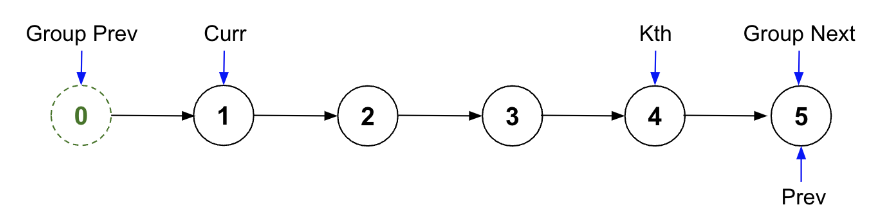
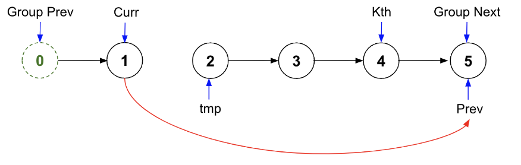
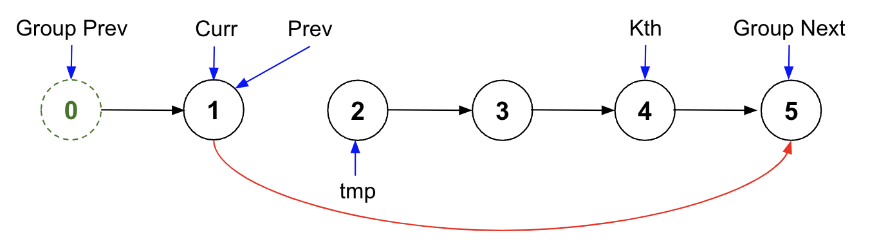
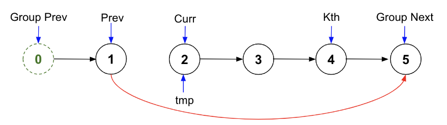
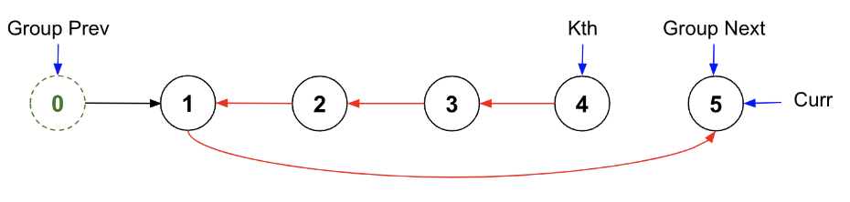
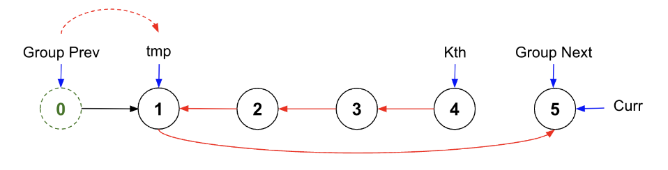
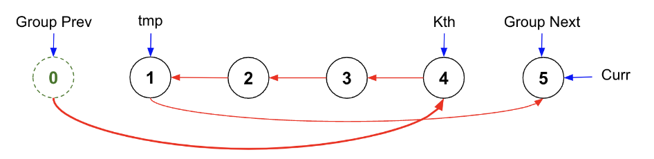
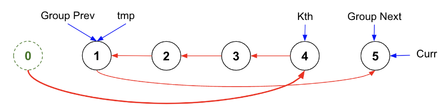

> All diagrams presented herein are original creations, meticulously designed to enhance comprehension and recall. Crafting these aids required considerable effort, and I kindly request attribution if this content is reused elsewhere.
{: .prompt-danger }

> **Difficulty** :  Easy
{: .prompt-tip }

> Similar to [Swap Nodes in Pairs](https://adeveloperdiary.com/algorithm/linked-list/swap-nodes-in-pairs/)
{: .prompt-info }

## Problem

Given the `head` of a linked list, reverse the nodes of the list `k` at a time, and return *the modified list*.`k` is a positive integer and is less than or equal to the length of the linked list. If the number of nodes is not a multiple of `k` then left-out nodes, in the end, should remain as it is.

**Example 1:**


```
Input: head = [1,2,3,4,5], k = 2
Output: [2,1,4,3,5]
```

**Example 2:**


```
Input: head = [1,2,3,4,5], k = 3
Output: [3,2,1,4,5]
```

## Solution

Similar to [Swap Nodes in Pairs](https://adeveloperdiary.com/algorithm/linked-list/swap-nodes-in-pairs/) problem. We will start with the `dummy` node

```python
dummy = NodeList(0, head)
group_prev = dummy
```

**1. Find/Save Pointers**

Just like in the [Swap Nodes in Pairs](https://adeveloperdiary.com/algorithm/linked-list/swap-nodes-in-pairs/) problem, we need to assign `group_next`. So here we need to find the kth node (thats the last node which will be the first node in this partition). 

We will write a fuction to traverse through the nodes and find the kth node. 

```python
def find_kth_node(curr, k):
  while curr and k > 0:
    curr = curr.next
    k -= 1
  return curr
```

Now the first step is to find the kth node. We will always start from `group_prev`  as thats the start of the current partition. We will also have the exit condition here is there is not enough node to create a partition of `k` nodes.

```python
kth = find_kth_node(group_prev, k)
if not kth:
  break
```

Set the `group_next` as the next node of `kth`. This will not be changed as this will be a marker for how long we need to keep reversing the nodes.

```python
group_next= kth.next
```

Start assigning `group_next` to `prev` as well as we want to start from reverse :fire:.

```python
prev = group_next
```

Our `curr` will be `group_prev.next`.

```python
curr = group_prev.next
```

Here is the entire setup looks like. We have not changed anything yet. Just assigned the pointers.



**2. Reverse k Nodes**

Now the task is to reverse starting from `curr` till kth node. Lets start with the `while ` loop. There are two ways of writing this. I find the option 1 is easy to comprehend however option 2 is more generalized. Both worked in Leetcode.

**Option 1:** Use a `counter` as we know for sure that we have `k` nodes.

```python
counter=k
while counter > 0:
  ...
  counter-=1
```

**Option 2:** Loop till `curr` reaches `group_next`. 

> Eventhough `group_next` is currently same as `kth.next`, you can not use `kth.next` in this `while` loop as the node `kth` is pointing to soon be updated to point to a different node (the `kth.next` will be updated). 
{: .prompt-danger }

```python
while curr != group_next:
  ...
```

Save `curr.next` to `tmp` as `tmp` will be reversed in next iteration. Also set `curr.next` to `prev`. This is the actual reversal step.

```
  tmp = curr.next
  curr.next = prev
```



Now we shift `prev` to `curr`

```python
  prev = curr
```



And then point `curr` to `tmp` for the next iteration.

```python
  curr = tmp
```



Once the inner `while` loop is completed, the first partition will be reversed. Next step will be to reassign the previous group.



**3. Reassign Pointers**

We need to update `group_prev`. The new `group_prev` will be `group_prev.next`. However before that, we need a new `group_prev` to be connect with previous group. (`dummy` for the first partition.) This is an important part to understand :fire:. 

> Make sure to understand that this connects the last node from previous group (`group_prev.next`) to the first node (`kth`) of the current group.
{: .prompt-info }

So lets first save current `group_prev.next` which should be the last node in the current group.

```python
tmp = group_prev.next
```



Now, point the `group_prev.next` to the new first node in the current group, which was the last node in the old group before reversal.

```python
group_prev.next = kth
```



Finally, update the `group_prev` to point to the new last node ( i.e first node before reversal).

```python
group_prev = tmp
```



## Final Code

Here is the full code.

```python
def find_kth_node(curr, k):
    while curr and k > 0:
        curr = curr.next
        k -= 1
    return curr

def reverseKGroup(head, k):
    dummy = ListNode(0, head)
    group_prev = dummy

    while True:
        kth = self.find_kth_node(group_prev, k)
        if not kth:
            break

        group_next = kth.next
        prev, curr = group_next, group_prev.next,
        counter = k
        while counter > 0:
            #while curr != group_next:
            tmp = curr.next
            curr.next = prev
            prev = curr
            curr = tmp
            counter -= 1

        tmp = group_prev.next
        group_prev.next = kth
        group_prev = tmp
        
    return dummy.next
```

## Runtime Complexity

The runtime will be `O(n)` as we are simply scanning through the list once.
