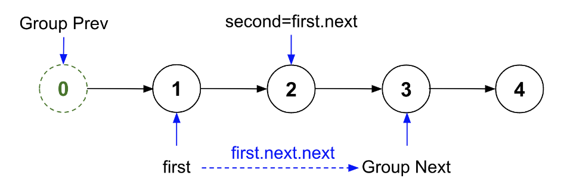
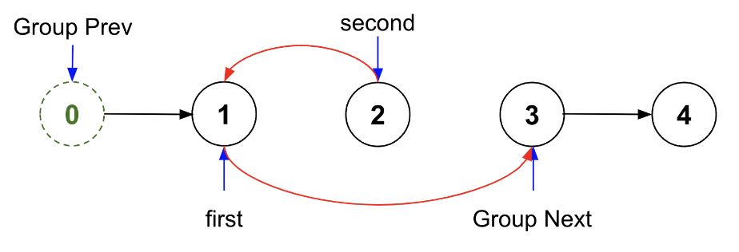
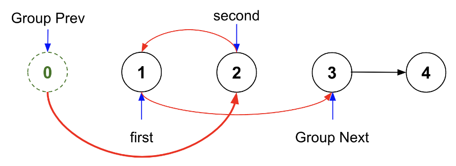
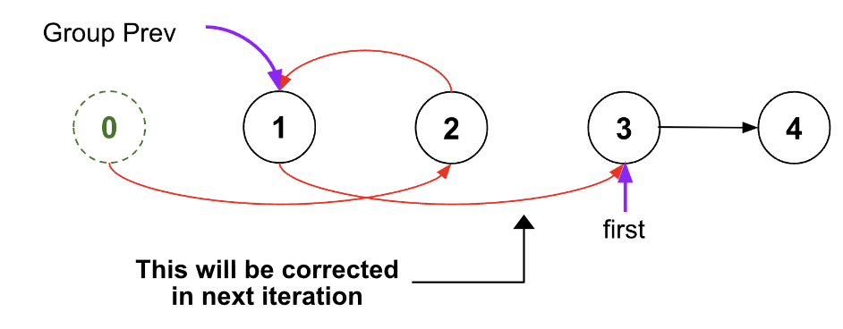

> All diagrams presented herein are original creations, meticulously designed to enhance comprehension and recall. Crafting these aids required considerable effort, and I kindly request attribution if this content is reused elsewhere.
{: .prompt-danger }

> **Difficulty** :  Easy
{: .prompt-tip }

> Consider edge cases.
{: .prompt-info }

## Problem

Given a linked list, swap every two adjacent nodes and return its head. You must solve the problem without modifying the values in the list's nodes (i.e., only nodes themselves may be changed.)

**Example 1:**


```
Input: head = [1,2,3,4]
Output: [2,1,4,3]
```

**Example 2:**

```
Input: head = []
Output: []
```

**Example 3:**

```
Input: head = [1]
Output: [1]
```

## Solution

The problem can be solved in 3 steps

- Save Pointers
- Swap
- Reassign Pointers

Before we get into how to solve each part, we will start with a `dummy` node as the `head` node also needs to be swaped and we need to a fixed reference point. We also use a pointer named `group_prev` and point this to `dummy`.

> We will intorduce two new pointers named `group_prev` and `group_next` just to generalize the problem so that not just two nodes, any number of nodes can be placed in reversed order. `group_prev` and `group_next` will always point to start and end of the nodes which need to be arranged in reverse order.
{: .prompt-tip }

```python
dummy = ListNode(0, head)
group_prev=dummy
```

We will use two pointers `first` and `second` and swap their `next` pointer. To start with lets point `first` to `head`.

```python
first = head
```

Now we need to make sure there are **two nodes available** if there are odd numbers of nodes available then the last one does not get swapped. We could do this a loop and keep swapping two nodes at a time.

```python
while first and first.next:
```

1. **Save Pointers**

We will start the loop by assiging `group_next` and `second` pointers. 

```python
    group_next = first.next.next
    second = first.next
```




2. **Swap**

   Point `second.next` to `first` and then `first.next` to `group_next`. (Red Lines below)

   ```python
       second.next = first
       first.next = group_next
   ```

   

   The last part of the swap is to point `group_prev.next` to `second`.

   ```python
       group_prev.next=second
   ```

   

3. **Reassign Pointers**

   Finally lets reassign `group_prev` to `first` and `first` to `group_next`. 

> Currently node having value `1`  points to node having value `3`, which is wrong and it would be fixed in the next iteration unless `3` is the last node in the LinkedList (Thats not the case here).
{: .prompt-tip }


   ```python
       group_prev = first
       first = group_next
   ```



## Final Code

Here is the full code.

```python
def swapPairs(head):
    dummy = ListNode(0, head)
    group_prev=dummy

    first=head

    while first and first.next:
        # Save pointers
        group_next=first.next.next
        second=first.next

        # swap
        second.next=first
        first.next=group_next
        group_prev.next=second

        # reassign pointers
        group_prev=first
        first=group_next
            
    return dummy.next
```

## Runtime Complexity

The runtime will be `O(n)` as we are simply scanning through the list once.
