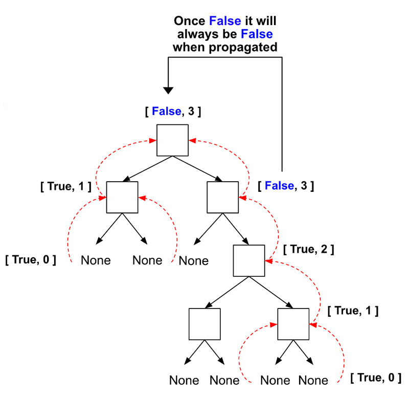
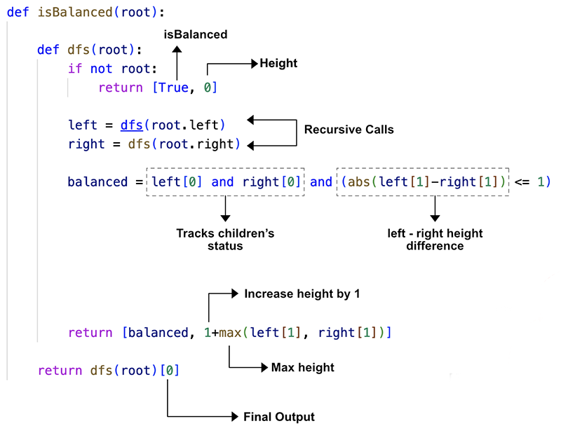

> All diagrams presented herein are original creations, meticulously designed to enhance comprehension and recall. Crafting these aids required considerable effort, and I kindly request attribution if this content is reused elsewhere.
{: .prompt-danger }

> **Difficulty** :  Easy
{: .prompt-tip }

> Start from leaf - PostOrder dfs()
{: .prompt-info }

## Problem

Given a binary tree, determine if it is **height-balanced**.

> A **height-balanced** binary tree is a binary tree in which the depth of the two subtrees of every node never differs by more than one.

**Example 1:**


```
Input: root = [3,9,20,null,null,15,7]
Output: true
```

**Example 2:**


```
Input: root = [1,2,2,3,3,null,null,4,4]
Output: false
```

**Example 3:**

```
Input: root = []
Output: true
```

## Solution

We need to use **Bottom Up** (Post Order) for solving this. Just like any Tree problem we will be using **DFS** approach here. Lets visualize the approach first.



First step is to define the base condition. We will return if the current node is balanced and whats the current height. The `None` nodes are always balanced and height of them are always `0`. So our base condition always returns `[True, 0]`.

```python
if not root:
  return [True,0]
```

Since we will be staring from bottom-up we need to get to the base conditio. So lets run `dfs()` on both the `left` and `right` nodes.

```python
left = dfs(root.left)
right = dfs(root.right)
```

Next, we need to find out if the current `left` and `right` nodes are balanced or not. First check if any of the child node are balanced or not & then compare the height of the current `left` and `right` nodes.

```python
balaned = left[0] and right[0] and abs(left[1]-right[1]) <=1
```

Finally, return the array by calculating the max height. 

```python
return [balaned, 1+max(left[1],right[1])]
```



## Final Code

Here is the full code.

```python
# class TreeNode:
#     def __init__(self, val=0, left=None, right=None):
#         self.val = val
#         self.left = left
#         self.right = right


def isBalanced(root: TreeNode) -> bool:
    def dfs(root):
        if not root:
            return [True, 0]

        left = dfs(root.left)
        right = dfs(root.right)

        balanced = left[0] and right[0] and (abs(left[1]-right[1]) <= 1)

        return [balanced, 1+max(left[1], right[1])]

    return dfs(root)[0]
```

