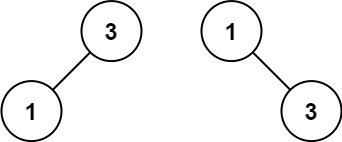

> All diagrams presented herein are original creations, meticulously designed to enhance comprehension and recall. Crafting these aids required considerable effort, and I kindly request attribution if this content is reused elsewhere.
{: .prompt-danger }

> **Difficulty** :  Easy
{: .prompt-tip }

> PreOrder dfs()
{: .prompt-info }

## Problem

Given an integer array `nums` where the elements are sorted in **ascending order**, convert *it to a* **height-balanced** *binary search tree*.


**Example 1:**


```
Input: nums = [-10,-3,0,5,9]
Output: [0,-3,9,-10,null,5]
Explanation: [0,-10,5,null,-3,null,9] is also accepted:
```


**Example 2:**



```
Input: nums = [1,3]
Output: [3,1]
Explanation: [1,null,3] and [3,1] are both height-balanced BSTs.
```

## Solution

## Final Code

Here is the full code.

```python
# class TreeNode:
#     def __init__(self, val=0, left=None, right=None):
#         self.val = val
#         self.left = left
#         self.right = right

```

