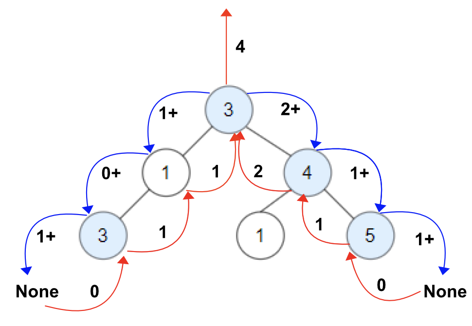

> All diagrams presented herein are original creations, meticulously designed to enhance comprehension and recall. Crafting these aids required considerable effort, and I kindly request attribution if this content is reused elsewhere.
{: .prompt-danger }

> **Difficulty** :  Easy
{: .prompt-tip }

> PreOrder dfs()
{: .prompt-info }

## Problem

Given a binary tree `root`, a node *X* in the tree is named **good** if in the path from root to *X* there are no nodes with a value *greater than* X. Return the number of **good** nodes in the binary tree.

**Example 1:**


```
Input: root = [3,1,4,3,null,1,5]
Output: 4
Explanation: Nodes in blue are good.
Root Node (3) is always a good node.
Node 4 -> (3,4) is the maximum value in the path starting from the root.
Node 5 -> (3,4,5) is the maximum value in the path
Node 3 -> (3,1,3) is the maximum value in the path.
```

**Example 2:**


```
Input: root = [3,3,null,4,2]
Output: 3
Explanation: Node 2 -> (3, 3, 2) is not good, because "3" is higher than it.
```

**Example 3:**

```
Input: root = [1]
Output: 1
Explanation: Root is considered as good.
```

## Solution

Since we need to consider all the nodes between `root` and child nodes, we need to run PreOrder traversal for solving this. We also need to track the `max_val` between any node and its root. The `max_val` is initially set to `root.val`.

```python
def dfs(root, max_val):
```

None of the `None` nodes are Good nodes, hence we can return `0` whenever `dfs()` function is receiving a `None` node.

```python
def dfs(root, max_val):
  if not root:
    return 0
```

Now, we need to set `result` to `1` if the current node value is equal to larger than `max_val`, if not we need to set this to `0`.

```python
  result = 1 if root.val >= max_val else 0
```

Calculate the `max_val` using current node so that this value can be passes down.

```python
  max_val = max(root.val, max_val)
```

We can now traverse the `left` and `right` nodes. We can append the return values from the child nodes to get cumulative total count.

```python
result+= dfs(root.left,max_val)
result+= dfs(root.right,max_val)

return result
```

## Visualization



## Final Code

Here is the full code.

```python
# class TreeNode:
#     def __init__(self, val=0, left=None, right=None):
#         self.val = val
#         self.left = left
#         self.right = right


def goodNodes(root: TreeNode):
    def dfs(root, max_val):
        if not root:
            return 0

        result = 1 if root.val >= max_val else 0

        max_val = max(root.val, max_val)

        result += dfs(root.left, max_val)
        result += dfs(root.right, max_val)

        return result

    return dfs(root, root.val)
```

