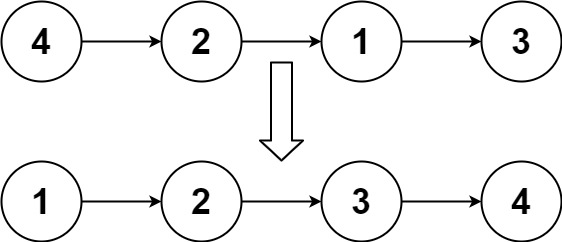

> All diagrams presented herein are original creations, meticulously designed to enhance comprehension and recall. Crafting these aids required considerable effort, and I kindly request attribution if this content is reused elsewhere.
{: .prompt-danger }

> **Difficulty** :  Easy
{: .prompt-tip }

> Merge Sort, Find Middle, Merge Two Sorted List, Recursive
{: .prompt-info }

## Problem

Given the `head` of a linked list, return *the list after sorting it in **ascending order***.

**Example 1:**



```
Input: head = [4,2,1,3]
Output: [1,2,3,4]
```

**Example 2:**


```
Input: head = [-1,5,3,4,0]
Output: [-1,0,3,4,5]
```

## Solution

Implement this using **Merge Sort** recursively. Here are the steps:

Find Middle Node `->` Partition the List `->` Repeate Until Base condition (last node) `->` Merge Nodes

### Base Condition

Lets define the base condition first. As per the basic Merge Sort logic we need to break down the array to individual elements before merging them back. Since here we are working with node the base condition is when a node's `next` pointer is `None`. Only after the base condition is executed, the `merge_left_and_right()` function will be executed for each call stack.

```python
if head.next is None:
  return head
```

> However the above code will fail for edge cases where input node is empty. There are two ways to resolve it, either wrap the recursive function using another function and validate the edge cases before even calling the recursive function, or extend the `if` condition above to check for `head` to be `None` as well. Remember `head==None` will be only for one time input condition only. The full code at the bottom will account for this.
{: .prompt-danger }

### Find Middle (Top-Down)

Use a `slow` and `fast` pointer for implementing `find_middle` function. We want to select the last node of the first partition, hence setting `fast` to one step ahead by using `head.next`. 

```python
def find_middle(head):
  slow, fast = head, head.next
  while fast and fast.next:
    slow=slow.next
    fast=fast.next.next
  return slow
```

Now lets invoke that `find_middle()` function.

```python
last_node_of_first_half = find_middle(head)
```

### Partition List (Top-Down)

Once we have the last node of the first partition, lets split the LinkedList in two parts.

```python
second_head = last_node_of_first_half.next
last_node_of_first_half.next = None
```

We need to break the nodes till we have just one node left. So lets call `sort_list()` recursively for each partition. 

```python
left = sort_list(head)
right = sort_list(second_head)
```

Here is the stack trace. We Initialy have 4 nodes, then split that to 2 nodes for each partition. Finally there are just 4 separate indipendent nodes.

```
==> ListNode{val: 4, next: ListNode{val: 2, next: None}}, ListNode{val: 1, next: ListNode{val: 3, next: None}}
==> ListNode{val: 4, next: None}, ListNode{val: 2, next: None}
==> ListNode{val: 4, next: None}
==> ListNode{val: 2, next: None}
==> ListNode{val: 1, next: None}, ListNode{val: 3, next: None}
==> ListNode{val: 1, next: None}
==> ListNode{val: 3, next: None}
```

We can finally write a function to merge the left and right partitions.

```python
return merge_partition(left,right)
```

### Merge Nodes (Bottom-Up)

Since the start node is undecided, we need to start with a `dummy` node.

```python
dummy = ListNone()
curr = dummy
```

Next, we can loop until one of the list is empty and keep extending `curr` pointer by comparing the values.

```python
while left and right:
  if left.val < right.val:
    curr.next=left
    left=left.next
  else:
    curr.next=right
    right=right.next
  curr=curr.next
```

In case one of the LinkedList was longer than another, we need to connect the remainig with `curr`.

```python
if left:
  curr.next=left
if right:
  curr.next=right

return dummy.next
```

## Final Code

Here is the full code.

```python
# class ListNode:
#     def __init__(self, val=0, next=None):
#         self.val = val
#         self.next = next

def merge_partition(left, right):
    dummy = ListNode()
    curr = dummy

    while left and right:
        if left.val < right.val:
            curr.next = left
            left = left.next
        else:
            curr.next = right
            right = right.next
        curr = curr.next

    if left:
        curr.next = left
    if right:
        curr.next = right

    return dummy.next


def sort_list(head):
    # not head is only when tested with
    # input []
    if not head or not head.next:
        return head

    last_node_of_first_half = find_middle(head)
    second_head = last_node_of_first_half.next
    last_node_of_first_half.next = None

    left = sort_list(head)
    right = sort_list(second_head)

    return merge_partition(left, right)

```

## Runtime Complexity

The runtime will be `O(n)` as we are simply scanning through the list once.
