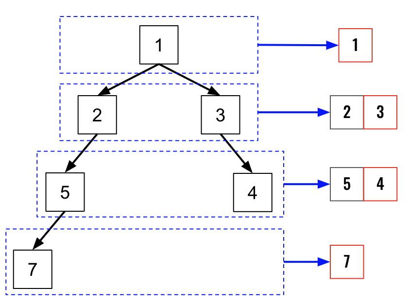

> All diagrams presented herein are original creations, meticulously designed to enhance comprehension and recall. Crafting these aids required considerable effort, and I kindly request attribution if this content is reused elsewhere.
{: .prompt-danger }

> **Difficulty** :  Easy
{: .prompt-tip }

> BFS, deque()
{: .prompt-info }

## Problem

Given the `root` of a binary tree, imagine yourself standing on the **right side** of it, return *the values of the nodes you can see ordered from top to bottom*.

**Example 1:**


```
Input: root = [1,2,3,null,5,null,4]
Output: [1,3,4]
```

**Example 2:**

```
Input: root = [1,null,3]
Output: [1,3]
```

## Solution

This problem can be easily solved if we just look at the visualization.So we can just use `bfs()` here and after traversing each level just take the last entry from the queue, which will always be the right most node as displayed here.




### Instantiate the queue

```python
queue = collections.deque([root])
```

### Define the final result array

```python
result_arr = []
```

### Get the last node from queue

Get the last node using `-1` and append the node value to the `result_arr`

```python
while queue:
  result_arr.append(queue[-1].val)
```

### Traverse the tree

Traverse through each node and keep adding the next level to the queue. Every time the for loop completes, append the last entry to the `result_arr`.

```python
  for _ in range(len(queue)):
    node = queue.popleft()
    
    if node.left:
      queue.append(node.left)
    if node.right:
      queue.append(node.right)
return result_arr
```

## Final Code

Here is the full code.

```python
# class TreeNode:
#     def __init__(self, val=0, left=None, right=None):
#         self.val = val
#         self.left = left
#         self.right = right

def right_side_view(root:TreeNode):
  queue = collections.deque([root])
  result_arr = []
  
  while queue:
    result_arr.append(queue[-1].val)
    
    for _ in range(len(queue)):
      node=queue.popleft()
      
      if node.left:
        queue.append(node.left)
      if node.right:
        queue.append(node.right)
   return result_arr     
  

```

