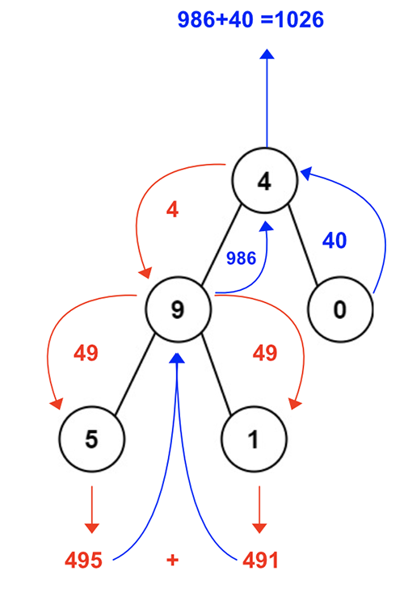
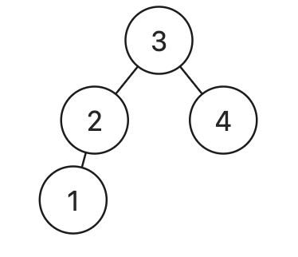
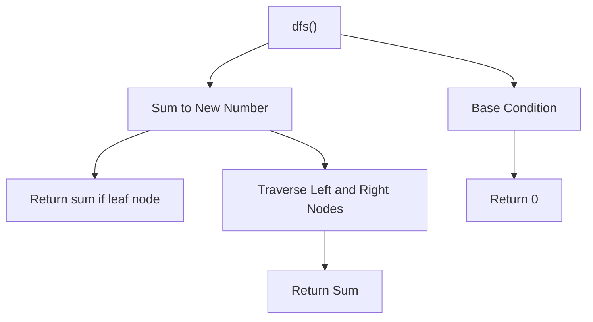

> All diagrams presented herein are original creations, meticulously designed to enhance comprehension and recall. Crafting these aids required considerable effort, and I kindly request attribution if this content is reused elsewhere.
{: .prompt-danger }

> **Difficulty** :  Easy
{: .prompt-tip }

> PreOrder DFS
{: .prompt-info }

## Problem

You are given the `root` of a binary tree containing digits from `0` to `9` only. 	Each root-to-leaf path in the tree represents a number.

- For example, the root-to-leaf path `1 -> 2 -> 3` represents the number `123`.

**Example 1:**


```
Input: root = [1,2,3]
Output: 25
Explanation:
The root-to-leaf path 1->2 represents the number 12.
The root-to-leaf path 1->3 represents the number 13.
Therefore, sum = 12 + 13 = 25.
```

**Example 2:**


```
Input: root = [4,9,0,5,1]
Output: 1026
Explanation:
The root-to-leaf path 4->9->5 represents the number 495.
The root-to-leaf path 4->9->1 represents the number 491.
The root-to-leaf path 4->0 represents the number 40.
Therefore, sum = 495 + 491 + 40 = 1026.
```

## Solution

Let’s start with the visualization of the solution. 



- **Base Condition**: Return `0` for `None` nodes.

  - The base condition is not needed if all the nodes in the tree has a `left` and `right` nodes as in case of that the 2nd base base (explained below) will be returned and `None` node will never occur. Here is an example.

    

  - However if in case there are nodes with only one child (`left` or `right`), we need to validate `if root is None` and `return 0` as base case. Here is an example.

    

- Everytime we find a new root node (either by traversing `left` or `right` child), we need to multiply the previous number by `10` and then add current `root.val`. [e.g `4 -> 40+9`, `49-> 490+5`]

- **2nd Base Case** :  Once we reach a node with no leaf nodes (`left` or `right`), we shall return the `num` value. This is the 2nd base case [Terminating condition].

- At each `node` level we sum the restured value by traversing `left` & `right` child values. [e.g `495 + 491 = 986`, `986 + 40 = 1026`] 

The typical flow of the `dfs()` function looks like this.



### Base Condition

The base condition if there are nodes with only one child (`left` or `right`).

```python
if not root:
  return True
```

### Sum to New Number

Calculare new number.

```python
def dfs(root, num):
  if not root:
    return True
  num = num * 10 + root.val
```

### Return sum if leaf node

Once we reach a node with no leaf nodes (`left` or `right`), we shall return the `num` value. This is the 2nd terminating condition.

```python
  if not root.left and not root.right:
    return num
```

### Traverse

Now traverse through `left` and `right` children. The only logic here to `sum` the returns.

```python
  return dfs(root.left,num)+dfs(root.right,num)
```

Finally we can call the `dfs()` function for the first time by passing the `root` node `0` as initial value of `num`.

```python
return dfs(root,0) 
```

## Final Code

Here is the full code.

```python
# class TreeNode:
#     def __init__(self, val=0, left=None, right=None):
#         self.val = val
#         self.left = left
#         self.right = right

def sum_numbers(root:TreeNode):
  def dfs(root, num):
    if not root:
      return 0
    
    num=num*10+root.val
    if not root.left and not root.right:
      return num
    
    return dfs(root.left,num)+dfs(root.right,num)
  return dfs(root,0)  
```

