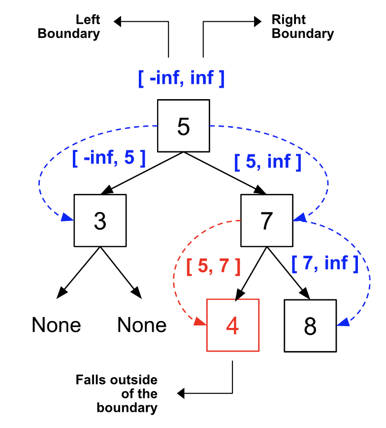

> All diagrams presented herein are original creations, meticulously designed to enhance comprehension and recall. Crafting these aids required considerable effort, and I kindly request attribution if this content is reused elsewhere.
{: .prompt-danger }

> **Difficulty** :  Easy
{: .prompt-tip }

> PreOrder DFS
{: .prompt-info }

## Problem

You are given the `root` of a binary tree containing digits from `0` to `9` only. 	Each root-to-leaf path in the tree represents a number.

- For example, the root-to-leaf path `1 -> 2 -> 3` represents the number `123`.

**Example 1:**


```
Input: root = [1,2,3]
Output: 25
Explanation:
The root-to-leaf path 1->2 represents the number 12.
The root-to-leaf path 1->3 represents the number 13.
Therefore, sum = 12 + 13 = 25.
```

**Example 2:**


```
Input: root = [4,9,0,5,1]
Output: 1026
Explanation:
The root-to-leaf path 4->9->5 represents the number 495.
The root-to-leaf path 4->9->1 represents the number 491.
The root-to-leaf path 4->0 represents the number 40.
Therefore, sum = 495 + 491 + 40 = 1026.
```

## Solution

Let’s start with the visualization of the solution.


### Base Condition

The base condition is all `None` nodes are valid, so need to return `True`. 

```python
if not root:
  return True
```

### Validate Root Node

Now based on the condition of the **valid BST** above,we need the boundaries for each node. As long as the node value is with in the boundary, its valid. For any left subtree, current root node value is the max value and for right substree the current root node value is the min value. So we need to pass this `min_val` and `max_val` to our `dfs()` function.

```python
def dfs(root, min_val, max_val):
  if not root:
    return True
  
  if not (root.val > min_val and root.val < max_val):
    return False
```

### Traverse

Now traverse through `left` and `right` children. The only logic here to set the `max_val` and `min_val` accordingly. In case any one children returns `False` this function call should return `False` as well.

```python
  return dfs(root.left, min_val, root.val) and dfs(root.right, root.val, max_val)
```

Finally we can call the `dfs()` function for the first time by passing the `root` node and `[-inf, +inf]` as the `min_val` and `max_val`

```python
return dfs(root, float('-inf'), float('inf'))
```


## Visualization

Here is the visualization of the problem.




## Final Code

Here is the full code.

```python
# class TreeNode:
#     def __init__(self, val=0, left=None, right=None):
#         self.val = val
#         self.left = left
#         self.right = right

def is_valid_bst(root:TreeNode):
  def dfs(root, min_val, max_val):
    if not root:
      return True
    
    if not (root.val > min_val and root.val < max_val):
      return False
    
    return dfs(root.left, min_val, root.val) and dfs(root.right, root.val, max_val)
    
  return dfs(root, float('-inf'),float('inf'))  
  
  
  

```

