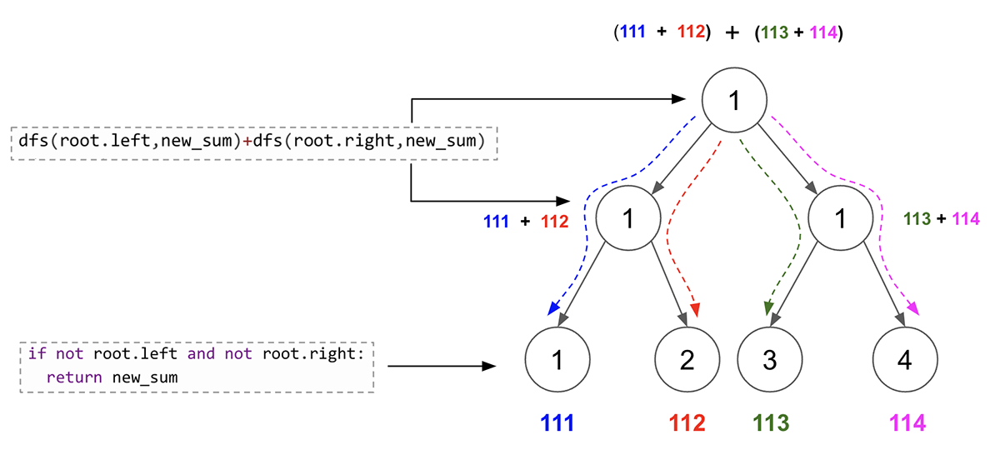

> All diagrams presented herein are original creations, meticulously designed to enhance comprehension and recall. Crafting these aids required considerable effort, and I kindly request attribution if this content is reused elsewhere.
{: .prompt-danger }

> **Difficulty** :  Easy
{: .prompt-tip }

> PreOrder DFS
{: .prompt-info }

## Problem

You are given the `root` of a binary tree containing digits from `0` to `9` only. 	Each root-to-leaf path in the tree represents a number.

- For example, the root-to-leaf path `1 -> 2 -> 3` represents the number `123`.

Return *the total sum of all root-to-leaf numbers*. Test cases are generated so that the answer will fit in a **32-bit** integer. A **leaf** node is a node with no children.

**Example 1:**


```
Input: root = [1,2,3]
Output: 25
Explanation:
The root-to-leaf path 1->2 represents the number 12.
The root-to-leaf path 1->3 represents the number 13.
Therefore, sum = 12 + 13 = 25.
```

**Example 2:**


```
Input: root = [4,9,0,5,1]
Output: 1026
Explanation:
The root-to-leaf path 4->9->5 represents the number 495.
The root-to-leaf path 4->9->1 represents the number 491.
The root-to-leaf path 4->0 represents the number 40.
Therefore, sum = 495 + 491 + 40 = 1026.
```

## Solution

Let’s start with the visualization of the solution. 


- **Base Condition**: Return `0` for `None` nodes.

  - The base condition is not needed if all the nodes in the tree has a `left` and `right` nodes as in case of that the 2nd base (explained below) will be returned and `None` node will never occur. Here is an example.

    

  - However if in case there are nodes with only one child (`left` or `right`), we need to validate `if root is None` and `return 0` as base case. Here is an example.

    

- Everytime we find a new root node (either by traversing `left` or `right` child), we need to multiply the previous number by `10` and then add current `root.val`. [e.g `4 -> 40+9`, `49-> 490+5`]

- **2nd Base Case** :  Once we reach a node with no leaf nodes (`left` or `right`), we shall return the `num` value. This is the 2nd base case [Terminating condition].

- At each `node` level we sum the restured value by traversing `left` & `right` child values. [e.g `495 + 491 = 986`, `986 + 40 = 1026`] 

The typical flow of the `dfs()` function looks like this.


### Base Condition

The base condition if there are nodes with only one child (`left` or `right`). Then that child needs to return just `0` as num.

```python
if not root:
  return 0
```

### Sum to New Number

Calculare new number.

```python
def dfs(root, sum_from_root):
  if not root:
    return 0
  new_sum = sum_from_root * 10 + root.val
```

### Return sum if leaf node

Once we reach a node with no leaf nodes (`left` or `right`), we shall return the `num` value. This is the 2nd terminating condition.

```python
  if not root.left and not root.right:
    return new_sum
```

### :fire: Traverse (Add)

Now traverse through `left` and `right` children. The only logic here to `sum` the returns. The `sum` is bit complicated to understand and thats the only reason the problem is medium in LeetCode. 

Except at the leaf level, at all other levels, the two sum of two nodes will be added. (Please refer the diagram below). So conversely every node except the leaf nodes, combines sum from two leaf nodes. 

So, to achieve `111+112+113+114 = 450`, we calculate `(111+112)=223, (113+114)=227`, then combine `223 + 227 = 450`.



```python
  return dfs(root.left,new_sum)+dfs(root.right,new_sum)
```

Finally we can call the `dfs()` function for the first time by passing the `root` node `0` as initial value of `num`.

```python
return dfs(root,0) 
```

## Final Code

Here is the full code.

```python
# class TreeNode:
#     def __init__(self, val=0, left=None, right=None):
#         self.val = val
#         self.left = left
#         self.right = right

def sum_numbers(root:TreeNode):
  def dfs(root, sum_from_root):
    if not root:
      return 0
    
    new_sum=sum_from_root*10+root.val
    if not root.left and not root.right:
      return new_sum
    
    return dfs(root.left,new_sum)+dfs(root.right,new_sum)
  return dfs(root,0)  
```

