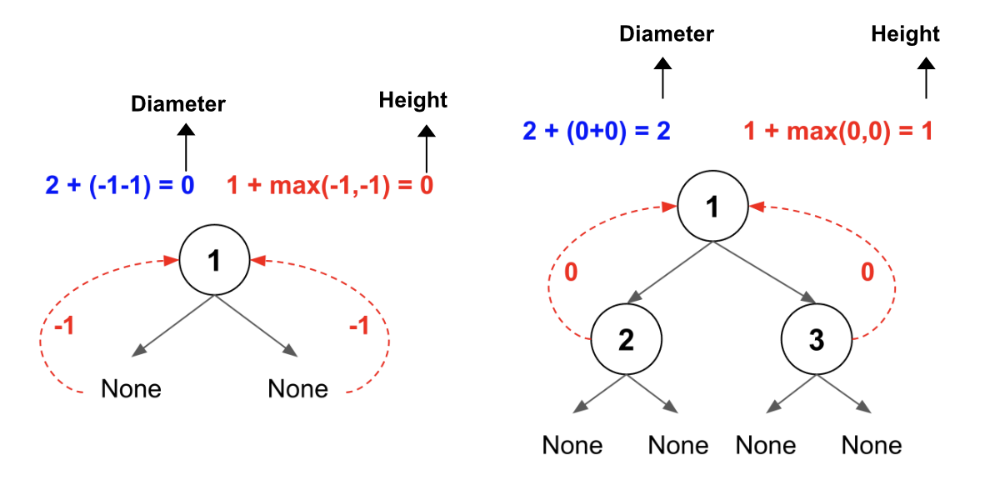

> All diagrams presented herein are original creations, meticulously designed to enhance comprehension and recall. Crafting these aids required considerable effort, and I kindly request attribution if this content is reused elsewhere.
{: .prompt-danger }

> **Difficulty** :  Easy
{: .prompt-tip }

> PostOrder DFS
{: .prompt-info }

## Problem

Given the `root` of a binary tree, return *the length of the **diameter** of the tree*. The **diameter** of a binary tree is the **length** of the longest path between any two nodes in a tree. This path may or may not pass through the `root`. The **length** of a path between two nodes is represented by the number of edges between them.

**Example 1:**


```
Input: root = [1,2,3,4,5]
Output: 3
Explanation: 3 is the length of the path [4,2,1,3] or [5,2,1,3].
```

**Example 2:**

```
Input: root = [1,2]
Output: 1
```

## Solution

- The **diameter** can be calculated by using the **height** of `left` and `right` sub-tree. Hence in every traversal the height of the tree needed to be returned.

- In order the math to work out, notice calculation of the base case scenario. 
  - The `height` of the `None` node is set to `-1`. 
  - The calculation of `diameter` is `2+left_height+right_height`.
  - The calculation of `height` is `1+max(left_height, right_height)`.
- Using **post order traversal** the diameter at every node will be calculated from bottom-up, this way the TC will be `O(n)`

Below are two examples of how both `diameter` and `height` are calculated.



Let's start with a `result` array which will hold diameters from every node of the tree. Then we can find the max and return that.

```python
diameters = []
```

We will be using **PostOrder** DFS (BFS can also be used). Starting with the base case, as we have already discussed, the height of `None` node is `-1` (this is mostly for the math to work for any tree). 

```python
def dfs(root):
  if not root:
    return -1
```

Now calculate the `left` and `right` height of the `root` node. For a node with no leaf node, will have `left_height = -1` and `right_height = -1` returned from base condition (As shown in the diagram above).

```python
  left_height = dfs(root.left)
  right_height = dfs(root.right)
```

Calculate the `diameter`.

```python
  diameter = 2 + left_height + right_height
```

Append the `diameter` to `diameters` array.

```python
  diameters.append(diameter)
```

Now need to calculate the `height` to be returned.

```python
  height = 1 + max( left_height, right_height)
  return height
```

Finally invoke the `dfs()` function and return `max` from the `diameters` array.

```python
dfs(root)
return max(diameters)
```

## Final Code 

Here is the full code.

```python
# class TreeNode:
#     def __init__(self, val=0, left=None, right=None):
#         self.val = val
#         self.left = left
#         self.right = right

def diameter_of_binary_tree(root:TreeNode):
  diameters = []
  
  def dfs(root):
    if not root:
      return -1
    
    left_height = dfs(root.left)
    right_height = dfs(root.right)
    
    diameter = 2 + left_height + right_height
    diameters.append(diameter)
    
    height = 1 + max(left_height,right_height)
    return height

  dfs(root)
  return max(diameters)
     
```
