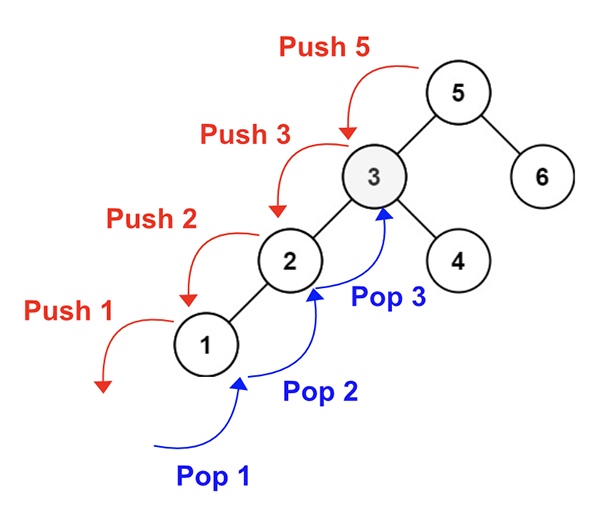

> All diagrams presented herein are original creations, meticulously designed to enhance comprehension and recall. Crafting these aids required considerable effort, and I kindly request attribution if this content is reused elsewhere.
{: .prompt-danger }

> **Difficulty** :  Easy
{: .prompt-tip }

> InOrder Traversal 
{: .prompt-info }

## Problem

Given the `root` of a binary search tree, and an integer `k`, return *the* `kth` *smallest value (**1-indexed**) of all the values of the nodes in the tree*.

**Example 1:**


```
Input: root = [3,1,4,null,2], k = 1
Output: 1
```

**Example 2:**


```
Input: root = [5,3,6,2,4,null,null,1], k = 3
Output: 3
```

## Solution

This is a typical problem of InOrder traversal. We can use either recursion or stack to solve this iteratively. 



### InOrder Traversal using Stack

Here is the base code for InOrder Traversal. I have added code comments for better understanding.

```python
# List in python can be used as stack
stack = []

# while either root or the stack is not None or Empty
while root or stack:
  # Keep traversing the left nodes
  # and push the root node to stack
	while root:    
    stack.append(root)
    root=root.left
    
  # root node is now None
  # but stack may not be empty  
  
  # fetch the last node from stack
  root = stack.pop()
  
  # since the left node was already 
  # visited for this root
  # Now visit right node and
  # again keep traversing left
  # of that right node until None
  
  root = root.right
    
```

### Solve using InOrder Traversal with Stack

Now This problem can be easily solving by decrementing `k` whenever a node is popped from the stack. Once `k==0` return the `val` of the popped `root` node.

```python
...
root = stack.pop()
# decrment k
k-=1

if k == 0 : 
  return root.val

...
```

### InOrder Traversal with Recursion

The recursion code is surprisingly shorter. All we do here is return when reached the `None` else keep traversing the `left` nodes. Once all the left node of the `root` have been traversed, then traverse the `right` node. The logic is exactly same as using stack. 

Here the function call stack is used.

```python
def inorder(root):
  if not root:
    return
  inorder(root.left)
  inorder(root.right)

inorder(root)

```

### Solve using InOrder Traversal with Recursion

Now we can easily modify the above code to solve this problem.

```python
# Create an outer variable to hold the value
smallest = None

def inorder(root):
  # defind k and smallest as nonlocal 
  # so that we can update them inside this
  # function instead of re-initializing them
  # in local scope
  
  nonlocal k
  nonlocal smallest
  
  if not root:
    return
  
  inorder(root.left)
  # Same code as we have in the 
  # iterative solution using stack
  k -= 1
  if k==0:
    smallest = root.val
    
	inorder(root.right)
  
inorder(root)
return smallest
  
```


## Final Code 

### Using InOrder Traversal with Stack

Here is the full code.

```python
# class TreeNode:
#     def __init__(self, val=0, left=None, right=None):
#         self.val = val
#         self.left = left
#         self.right = right

def kth_smallest(root:TreeNode, k):
  stack =[]
  
  while stack or root:
    while root:
      stack.append(root)
      root=root.left
    root = stack.pop()
    k-=1
    if k == 0:
      return root.val    
    root = root.right()
     
```

### Using InOrder Traversal with Recursion

Here is the full code.

```python
def kth_smallest(root, k):
    smallest = None

    def inorder(root):
        nonlocal smallest
        nonlocal k
        
        if not root:
            return
        inorder(root.left)
        k -= 1
        if k == 0:
            smallest = root.val

        inorder(root.right)

    inorder(root)
    return smallest
```

