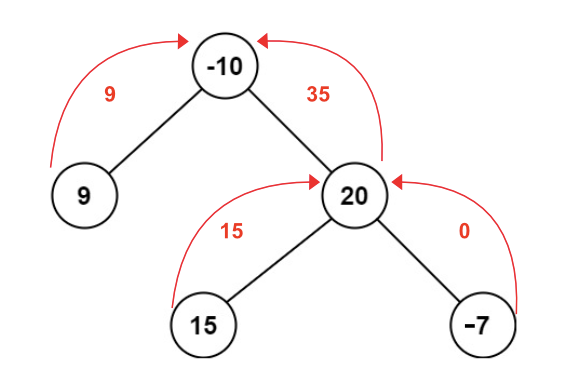

> All diagrams presented herein are original creations, meticulously designed to enhance comprehension and recall. Crafting these aids required considerable effort, and I kindly request attribution if this content is reused elsewhere.
{: .prompt-danger }

> **Difficulty** :  Medium
{: .prompt-warning }

> DFS
{: .prompt-info }

## Problem

A **path** in a binary tree is a sequence of nodes where each pair of adjacent nodes in the sequence has an edge connecting them. A node can only appear in the sequence **at most once**. Note that the path does not need to pass through the root.

The **path sum** of a path is the sum of the node's values in the path. Given the `root` of a binary tree, return *the maximum **path sum** of any **non-empty** path*.

**Example 1:**


```
Input: root = [1,2,3]
Output: 6
Explanation: The optimal path is 2 -> 1 -> 3 with a path sum of 2 + 1 + 3 = 6.
```

**Example 2:**


```
Input: root = [-10,9,20,null,null,15,7]
Output: 42
Explanation: The optimal path is 15 -> 20 -> 7 with a path sum of 15 + 20 + 7 = 42.
```

## Solution

At every node level we need to calculate the max sum for its left and right subtrees. We need to always floor the max value to `0` so that we can ignore negative values.



Let's start with the base case. If the node is `None` the max sum is simply `0.`

```python
if not root:
  return 0
```

Next step will be to calculate the `left` and `right` max sum. 

> Here we are calculating the `max(0,  dfs(root.left))` to **not** accept at negative values.
{: .prompt-tip }

```python
left_max_sum = max(0, dfs(root.left))
right_max_sum = max(0, dfs(root.right))
```

Now calculate the max sum of the current `root` node including root.

```python
max_sum = root.val + left_max_sum + right_max_sum
```

Since we need to just find the max sum for the entire tree, we will keep track of that using an outer variable (`tree_max_sum`). If the current `max_sum` is bigger than that we save it.

> **Note**, we need to set `tree_max_sum = float(-"inf")` at initialization.
{: .prompt-tip }


```python
tree_max_sum = max(tree_max_sum,max_sum)
```

Since the max path sum can not include both `left` and `right` sub-tree, we need to choose which provides the larger sum. 

>  In the actual code we do **not** need to compare against `root.val` as we are already selecting `0` if the sum of the sub-tree is negative.
{: .prompt-warning }

```python
return max(root.val+left_max_sum,root.val+right_max_sum, root.val)
```


## Final Code 

Here is the full code.

```python
# class TreeNode:
#     def __init__(self, val=0, left=None, right=None):
#         self.val = val
#         self.left = left
#         self.right = right

def max_path_sum(root:TreeNode):
  tree_max_sum = float("-inf")
  
  def dfs(root):
    nonlocal tree_max_sum
    if not root:
      return 0
    
    left_max_sum = max(0, dfs(root.left))
    right_max_sum = max(0, dfs(root.right))
    
    tree_max_sum = max(tree_max_sum, root.val + left_max_sum + right_max_sum )
    
    return max(root.val + left_max_sum, root.val + right_max_sum)
  
  dfs(root)
  return tree_max_sum   
```

