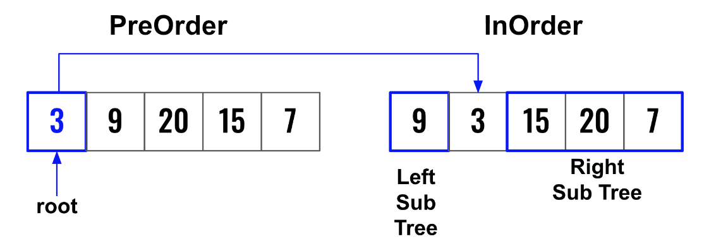
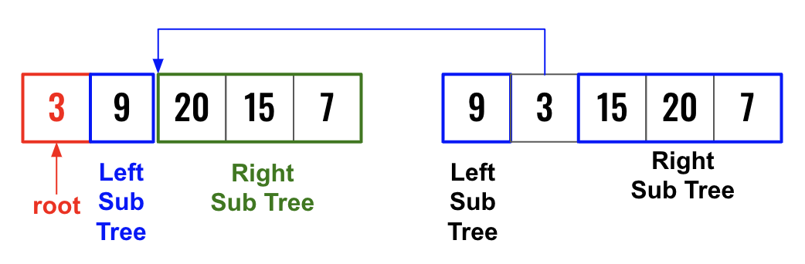
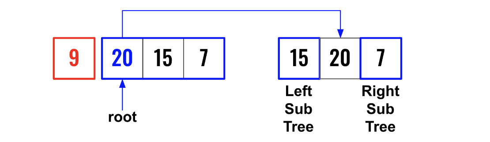

> All diagrams presented herein are original creations, meticulously designed to enhance comprehension and recall. Crafting these aids required considerable effort, and I kindly request attribution if this content is reused elsewhere.
{: .prompt-danger }

> **Difficulty** :  Easy
{: .prompt-tip }

> Recursion
{: .prompt-info }

## Problem

Given two integer arrays `preorder` and `inorder` where `preorder` is the preorder traversal of a binary tree and `inorder` is the inorder traversal of the same tree, construct and return *the binary tree*.

**Example 1:**


```
Input: preorder = [3,9,20,15,7], inorder = [9,3,15,20,7]
Output: [3,9,20,null,null,15,7]
```

**Example 2:**

```
Input: preorder = [-1], inorder = [-1]
Output: [-1]
```

## Solution

- The first element of the **PreOrder** array is always the root node.

- Find the `index` of the `root` in the **InOrder** array. Every value left of the `index` is going to be in the `left` subtree and every value at the right of the `index` will be in the `right` subtree. 

  

- We use the `index` number from the `inorder` array and partition the `preorder` array. `index` is basically the length at which the partition has to be made.

  

- We recursively use this information to keep building the tree.

  

- In summary:

  - **PreOrder** - Root first then left sub tree & right sub tree

  - **InOrder** - Left subtree first, then root & then right sub tree.

- Start by defining the base condition when one of the array is empty, return `None`.

  ```python
  def build_tree(preorder, inorder):
    if not preorder:
      return None
  ```

- Create the `root` node using `preorder[0]`.

  ```python
    root = TreeNode(val = preorder[0])  
  ```

- Now find the `index` of the value in `inorder` array.

  ```python
    index = inorder.index(preorder[0])
  ```

- Partition the `inorder` array to call the `build_tree` function recursively. 

  ```python
    left_subtree_inorder = inorder[:index] # excludes index
    # We need to add +1 as we do not 
    # need the element at index.
    right_subtree_inorder = inorder[index+1:]
  ```

- Partition the `preorder` array using the same `index`.  Start from `index` `1` as the first element in `preorder` was the `root` node. Now we need to take till `index` hence add `1` with `index` (Python does not include the last value during split).

  ```python
    left_subtree_preorder = preorder[1:index+1] # includes index
    right_subtree_preorder = preorder[index+1:] 
  ```

- Finally set the `left` and `right` subtree by recursively calling `build_tree`.

  ```python
    root.left = build_tree(left_subtree_preorder,left_subtree_inorder)
    root.right = build_tree(right_subtree_preorder,right_subtree_inorder)
    
    return root
  ```

  

## Final Code 

Here is the full code.

```python
# class TreeNode:
#     def __init__(self, val=0, left=None, right=None):
#         self.val = val
#         self.left = left
#         self.right = right

def build_tree(preorder, inorder):
  if not preorder:
    return None

  root = TreeNode(val = preorder[0])  
  index = inorder.index(preorder[0])
  
  root.left = build_tree(preorder[1:index+1],inorder[:index])
  root.right = build_tree(preorder[index+1:],inorder[index+1:])
	
  return root
```
