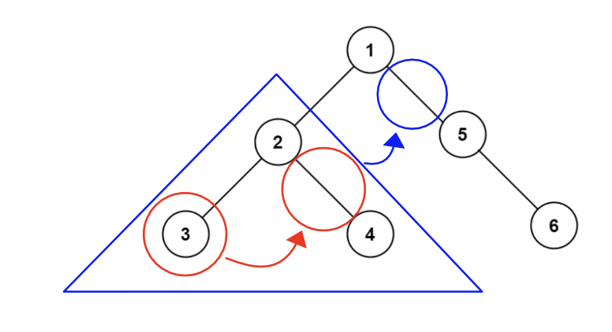

> All diagrams presented herein are original creations, meticulously designed to enhance comprehension and recall. Crafting these aids required considerable effort, and I kindly request attribution if this content is reused elsewhere.
{: .prompt-danger }

> **Difficulty** :  Hard
{: .prompt-danger }

> DFS
{: .prompt-info }

## Problem

Given the `root` of a binary tree, flatten the tree into a "linked list":

- The "linked list" should use the same `TreeNode` class where the `right` child pointer points to the next node in the list and the `left` child pointer is always `null`.
- The "linked list" should be in the same order as a [**pre-order** **traversal**](https://en.wikipedia.org/wiki/Tree_traversal#Pre-order,_NLR) of the binary tree.

**Example 1:**


```
Input: root = [1,2,5,3,4,null,6]
Output: [1,null,2,null,3,null,4,null,5,null,6]
```

## Solution

The solution to this problem is not complicated, the code also is just few lines and simple to understand however you still may need to run this few time to fully grasp the idea.

Here is a diagram to start. We are going to use the `TreeNode` as double linked list and simple set the `left` pointer to `None` to flatten it. As per the diagram, we are going to **insert** the left flatten subtree in between the root and its right sub tree. 



The base case is simple, just return `None` for leaf nodes. Remember is code is inside our `dfs()` function.

```python
if not root:
  return None
```

Now we need to traverse all the way to the left leaf node as the problem statement indicates the ordering should be same as pre-order traversal. 

```python
leftmost_leaf = dfs(root.left)
rightmost_leaf = dfs(root.right)
```

If the `root.left` is not `None` then we need to switch its position in between current `root`'s `right` and the `root` itself.

> The `leftmost_leaf` should already be flatten unless it's a single leaf node.

Point the end of the `leftmost_leaf` to the `right` of the current `root`

```python
if root.left: 
  leftmost_leaf.right = root.right
```

Then, repoint `root`'s `right` to its `left`

> The `root.left` won't be always same as `leftmost_leaf`

```python
  root.right = root.left
```

Finally, set the `root.left` to `None`

```python
  root.left = None
```

The last part is very important. Here we will decide what to return. If the `rightmost_leaf` is not `None` , mean the `root` has a `right` sub-tree. So we want to return the `rightmost_leaf` of it. Lets review the same diagram here, when we are processing the node `2`, we want to return where the right of the node `1` can be connected and thats node `4` which is the `rightmost_leaf` of node `2`.


```python
if rightmost_leaf:
  return rightmost_leaf
```

In case the `rightmost_leaf` is `None`, say we didn't have node `4` in the tree. Then we want to return the `leftmost_leaf`

```python
elif leftmost_leaf:
  return leftmost_leaf
```

For the leaf nodes we are going to return the `root` node itself.

```python
else:
  return root
```


## Final Code 

Here is the full code.

```python
# class TreeNode:
#     def __init__(self, val=0, left=None, right=None):
#         self.val = val
#         self.left = left
#         self.right = right

def flatten(root):
  def dfs(root):
    if not root:
      return None
    
    leftmost_leaf= dfs(root.left)
    rightmost_leaf= dfs(root.right)
    
    if root.left:
      leftmost_leaf.right= root.right
      root.right = root.left
      root.left = None
      
    # Converting all the if else to one line
    return rightmost_leaf or rightmost_leaf or root
  dfs(root)
    
```

